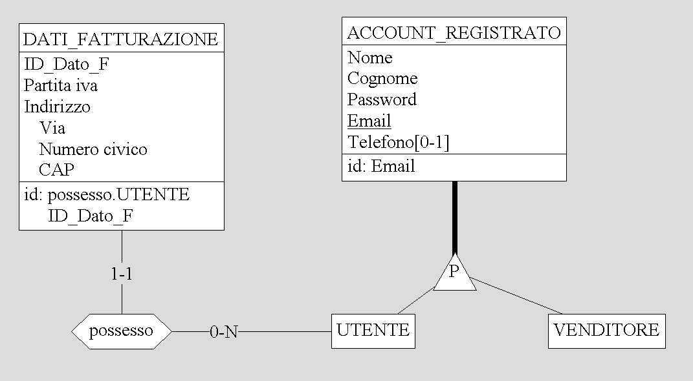
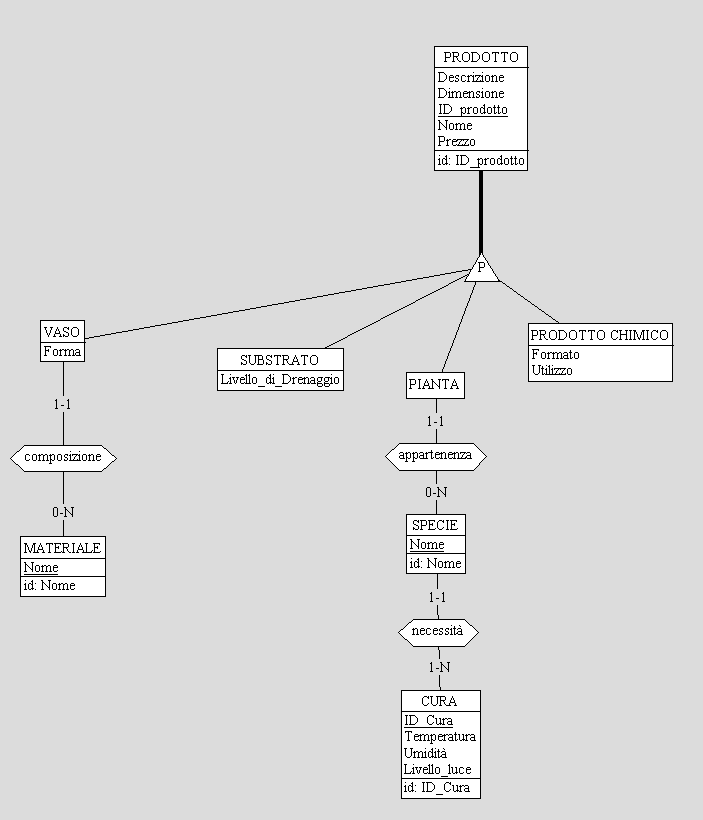
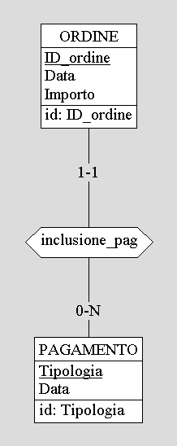
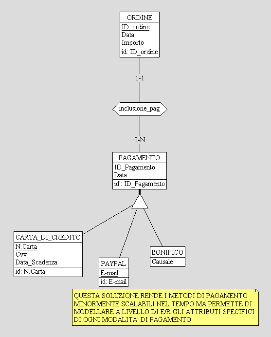
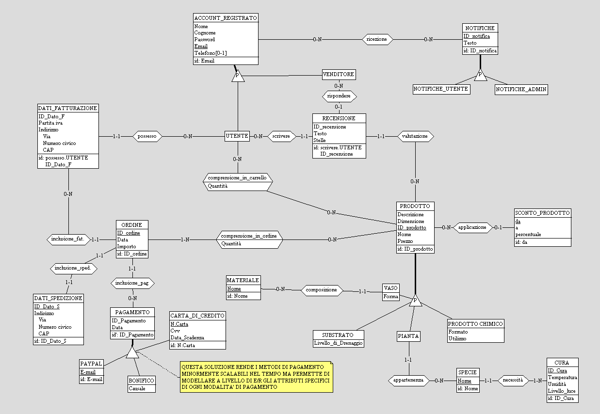

# Relazione Progetto Basi di Dati  
**ANNO ACCADEMICO 2024/2025**  
**Filippo Massari**

- [Relazione Progetto Basi di Dati](#relazione-progetto-basi-di-dati)
  - [Analisi dei Requisiti](#analisi-dei-requisiti)
    - [Intervista](#intervista)
    - [Estrazione dei Concetti Principali](#estrazione-dei-concetti-principali)
    - [Terminologia](#terminologia)
  - [Progettazione Concettuale](#progettazione-concettuale)
    - [Schema Scheletro e Raffinamenti Successivi](#schema-scheletro-e-raffinamenti-successivi)
    - [Schema Finale](#schema-finale)
  - [Progettazione Logica](#progettazione-logica)
    - [Stima del Volume dei Dati](#stima-del-volume-dei-dati)
    - [Funzionalità Principali e Stima della Frequenza](#funzionalità-principali-e-stima-della-frequenza)
    - [Tabella Frequenza Operazioni Principali](#tabella-frequenza-operazioni-principali)
    - [Schemi di Navigazione e Tabelle degli Accessi](#schemi-di-navigazione-e-tabelle-degli-accessi)
    - [Analisi delle Ridondanze](#analisi-delle-ridondanze)
  - [Raffinamento dello Schema](#raffinamento-dello-schema)
    - [Eliminazione delle Gerarchie](#eliminazione-delle-gerarchie)
    - [Eliminazione degli Attributi Composti](#eliminazione-degli-attributi-composti)
    - [Scelta delle Chiavi Primarie](#scelta-delle-chiavi-primarie)
    - [Reificazione delle Relazioni in Entità](#reificazione-delle-relazioni-in-entità)
    - [Traduzione delle Entità e delle Assocaizioni in Relazioni](#traduzione-delle-entità-e-delle-assocaizioni-in-relazioni)
    - [Schema Relazionale Finale](#schema-relazionale-finale)
    - [Costruzione delle Tabelle del DB in SQL](#costruzione-delle-tabelle-del-db-in-sql)
    - [Traduzione delle Operazioni in query SQL](#traduzione-delle-operazioni-in-query-sql)
  - [Progettazione della Web App](#progettazione-della-web-app)

## Analisi dei Requisiti

Si vuole realizzare un sistema informativo per la gestione di un sito e-commerce dedicato alla vendita di piante, vasi, prodotti chimici e substrati. Il database dovrà memorizzare le informazioni relative agli utenti, ai prodotti disponibili, agli ordini effettuati, alle relative spedizioni, pagamenti e alle valutazioni dei clienti. Gli amministratori potranno gestire il catalogo, creare offerte e sconti, visualizzare statistiche e inviare notifiche agli utenti.  
Ogni utente registrato potrà acquistare prodotti, tenere traccia dei propri ordini, ricevere notifiche e valutare i prodotti acquistati.

### Intervista

Un primo testo ottenuto dall’intervista è il seguente:

Si vogliono vendere online piante, vasi, prodotti chimici e substrati. Ogni prodotto viene inserito dall’amministratore, includendo una descrizione, una taglia, una quantità disponibile a magazzino, un prezzo e può essere associato ad uno sconto.  
Le piante possiedono una specie ed una sereie di accortezze da dedicrgli, mentre i vasi hanno anche una forma e sono realizzati in diversi materiali. Gli utenti possono registrarsi sulla piattaforma, navigare il catalogo, aggiungere i prodotti desiderati al carrello (in quantità non superiori alla disponibilità di magazzino) ed effettuare ordini fornendo indirizzo di spedizione, dati di fatturazione e scegliendo tra diverse modalità di pagamento.  
Dopo l’acquisto, l’utente ha la possibilità di valutare i prodotti con stelle e recensioni testuali. Nell’area personale, ogni utente può consultare i propri dati, gli ordini effettuati e riceve notifiche relative allo stato degli ordini. L’amministratore, attraverso un’area riservata, può gestire l’inserimento di nuovi prodotti, la creazione di sconti, la visualizzazione della lista utenti, la gestione delle notifiche e consultare statistiche relative alle vendite.

### Estrazione dei Concetti Principali

A seguito della lettura e comprensione dei requisiti, si riassumono i concetti principali, chiarendo le ambiguità e formalizzando i termini:

Per ogni **prodotto** in vendita (che può essere una pianta, un vaso, un prodotto chimico o un substrato) sono memorizzati nome, descrizione, taglia, prezzo, quantità disponibile e l’eventuale sconto applicabile. Le piante, inoltre, hanno la specie ed una cura specifica; i vasi la forma e il materiale.  
**Gli utenti** si registrano inserendo i propri dati anagrafici e contatti, possono aggiornare i dati anagrafici, di spedizione e fatturazione, visualizzare gli ordini e ricevere notifiche dalla piattaforma.  
Per ogni **ordine** viene registrata la data, l’elenco dei prodotti acquistati con le rispettive quantità, il totale, l’indirizzo di spedizione, i dati di fatturazione e le informazioni relative al metodo di pagamento scelto da un elenco di tipologie disponibili (ad es. carta, PayPal). Un utente può valutare i prodotti ricevuti assegnando un punteggio a stelle e una breve recensione testuale.  
**L’area amministratore** permette l’inserimento e la modifica dei prodotti nel catalogo, la creazione e la gestione degli sconti, la visualizzazione della lista utenti, l’invio di notifiche agli utenti (es. conferma ordine, spedizione avvenuta, promozioni) e la consultazione di statistiche di vendita.

### Terminologia

| Termine           | Breve descrizione                                                      | Eventuali sinonimi               |
|-------------------|-----------------------------------------------------------------------|-----------------------------------|
| Prodotto          | Ogni elemento del catalogo in vendita: pianta, vaso, chimico o substrato | Articolo, Oggetto              |
| Pianta            | Prodotto con attributo specie                                         |                                   |
| Cura              | Serie di specifiche ambientali per la gestione della pianta           |                                   |
| Vaso              | Prodotto con attributi forma e materiale                              |                                   |
| Utente            | Persona registrata al sito che può effettuare ordini e valutare prodotti | Cliente                        |
| Amministratore    | Gestore della piattaforma, inserisce prodotti, crea sconti e invia notifiche | Admin, Venditore           |
| Carrello          | Contenitore temporaneo dei prodotti selezionati da un utente          |                                   |
| Ordine            | Insieme di prodotti acquistati in una certa quantità in una singola transazione |Acquisto                 |
| Valutazione       | Giudizio espresso da un utente su un prodotto (stelle e testo)        | Recensione                        |
| Sconto            | Riduzione applicata a uno o più prodotti                              | Promozione, Offerta               |
| Notifica          | Messaggio informativo all’utente o all’amministratore                 | Messaggio, Avviso                 |
| Pagamento         | Modalità usata dall’utente per l’acquisto                             | Transazione                       |
| Dati di spedizione| Indirizzo dove recapitare l’ordine                                    |                                   |
| Dati di fatturazione | Informazioni fiscali per generare la ricevuta/fattura              |                                   |
| Statistiche       | Informazioni riepilogative su vendite e ordini                        | Analitica, Report                 |

## Progettazione Concettuale

### Schema Scheletro e Raffinamenti Successivi

Le entità di **Admin** e **Utente** sono la generalizzazione di una entità **Account registrato**, identificata tramite l’e-mail, che rappresenta la chiave univoca per ciascun utente registrato nella piattaforma. Questa soluzione consente di gestire entrambi i ruoli mantenendo una struttura coerente e senza ridondanze informative.

  

Dall’analisi del dominio si evince che:
- Un **utente** può effettuare più ordini nel tempo, ma ogni ordine è relativo ad uno specifico momento e contiene una lista di prodotti disponibili in magazzino.
- Ogni **prodotto** (pianta, vaso, chimico, substrato) ha caratteristiche generali (descrizione, dimensione, quantità, prezzo) e può avere attributi specifici in base alla categoria (ad esempio specie per le piante, forma e materiale per i vasi, ecc.).

Per gestire le varianti di prodotto legate a tipo e caratteristiche specifiche (ad esempio, il vaso che ha forma e materiale, la pianta che ha specie e caratteristiche di cura), si introduce una gerarchia che ha come padre l'entità Prodotto. Inizialmete tale gerarchia aveva il seguente E/R:

  

Successivamente sostituito da: 

  

Reificando l'entità **materiale** posso creare una lista di materiali evitando di avere duplicati o errori di battitura nell'inserimento del prodotto che rendono complessa la ricercaed il filtraggio. Per quanto riguarda l'entità pianta ho messo in relazione l'entità **cura** direttamente con l'entità **specie** andando a semplificare l'inserimento di una nuova pianta.

Gli **ordini** sono identificati da un codice univoco e sono associati a un utente e ai dati di **spedizione** e **fatturazione** forniti al momento della conferma. L’ordine serve anche da collegamento con il **pagamento** avvenuto e può essere composto da più prodotti in quantità variabile (gestita da una relazione tra Ordine e Prodotto che contiene anche il campo Quantità). Inizialmente avevo ideato il pagamento come un'entità in relazione con una seconda entità che modellava il **metodo di pagamento**, questa soluzione è stata poi soppiantata da una gerarchia che mi permettesse di associare gli appositi atrubuti agli specifici metodi di pagamento, questo ovviamente va a discapito della scalbilità ma migliarta la precisione, la completezza e l'usabilità delle entità stesse.

 

Ogni **notifica** viene generata come entità a sé e può essere rivolta sia agli utenti (es. conferma ordine, spedizione, promozione) che all’admin (ad esempio segnalazione di esaurimento scorte).

  

Gli **sconti** sono modellati come entità relazionate a uno o più prodotti, e possono essere definiti secondo validità temporale e percentuale di sconto.

Un qualsiasi **account registaro** ha la possibilità di rilascire recensioni che, nel caso degli utenti saranno riferite direttamente ai prodotti, mentre nel caso del venditore saranno risposte alle recensioni ricevute.

  

### Schema Finale

## Progettazione Logica

### Stima del Volume dei Dati

| Concetto                                           | Tipo | Volume Stimato | Note                                                                                             |
|----------------------------------------------------|------|---------------|---------------------------------------------------------------------------------------------------|
| **UTENTE**                                         | E    | 17.000        | Clienti registrati                                                                                |
| **VENDITORE**                                      | E    | 10            | Amministratori o gestori del negozio                                                              |
| **DATI_FATTURAZIONE**                              | E    | 19.000        | Ogni utente può avere più indirizzi di fatturazione                                               |
| **DATI_SPEDIZIONE**                                | E    | 24.000        | Diversi indirizzi di spedizione per utente                                                        |
| **ORDINE**                                         | E    | 30.000        | Totale ordini ricevuti                                                                            |
| **PAGAMENTO**                                      | E    | 30.000        | Uno per ordine                                                                                    |
| **PRODOTTO**                                       | E    | 500           | Totale prodotti                                                                                   |
| **VASO**                                           | E    | 100           | Varianti di vasi                                                                                  |
| **MATERIALE**                                      | E    | 25            | Metalli, plastiche, ceramiche, ecc.                                                               |
| **SUBSTRATO**                                      | E    | 20            | Tipi/gradazioni diverse                                                                           |
| **PIANTA**                                         | E    | 300           | Varietà distinte                                                                                  |
| **SPECIE**                                         | E    | 200           | Specie botaniche distinte                                                                         |
| **CURA**                                           | E    | 40            | Diverse tipologie di cura                                                                         |
| **PRODOTTO_CHIMICO**                               | E    | 30            | Concimi, fitofarmaci, ecc.                                                                        |
| **RECENSIONE**                                     | E    | 25.000        | Recensioni inserite dagli utenti                                                                  |
| **SCONTO_PRODOTTO**                                | E    | 150           | Sconti/promo attivi e storicizzati                                                                |
| **NOTIFICA_UTENTE**                                | E    | 2.000.000     | Notifiche ricevute dagli utenti (cronologia completa)                                             |
| **NOTIFICA_VENDITORE**                             | E    | 10.000        | Notifiche ricevute dai venditori/admin (cronologia completa)                                      |
| **COMPRENSIONE_IN_CARRELLO**                       | E    | 10.000        | Prodotti inseriti in un carrello (prodotti per utente, es. 4 prodotti per carrello x 2.500 utenti attivi)      |
| **COMPRENSIONE_IN_ORDINE**                         | E    | 120.000       | Ogni ordine in media con 4 articoli                                                               |
| **COMPRENSIONE_U.** (utente-compr_in_carrello)    | R | 10.000   | Ogni COMPRENSIONE_IN_CARRELLO è associata con un UTENTE                                           |
| **COMPRENSIONE_P.** (compr_in_carrello-prod)      | R | 10.000   | Ogni COMPRENSIONE_IN_CARRELLO è associata con un PRODOTTO                                         |
| **COMPRENSIONE_O.** (compr_in_ordine-ordine)      | R | 120.000  | Ogni COMPRENSIONE_IN_ORDINE è associata con un ORDINE                                             |
| **COMPRENSIONE_O.P.** (compr_in_ordine-prod)      | R | 120.000  | Ogni COMPRENSIONE_IN_ORDINE è associata con un  PRODOTTO                                          |
| **POSSESSO** (utente-dati_fatturazione)           | R | 19.000   | Ogni INDIRIZZO_FATTURAZIONE è associato a uno UTENTE                                              |
| **INCLUSIONE_FAT** (ordine-dati_fatturazione)     | R | 30.000   | Uno per ogni ORDINE                                                                               |
| **INCLUSIONE_SPED** (ordine-dati_spedizione)      | R | 30.000   | Uno per ogni ORDINE                                                                               |
| **INCLUSIONE_PAG** (ordine-pagamento)             | R | 30.000   | Uno per ogni ORDINE                                                                               |
| **APPARTENENZA_V** (vaso-prodotto)                | R | 100      | Ogni VASO è anche un PRODOTTO                                                                     |
| **APPARTENENZA_S** (substrato-prodotto)           | R | 20       | Ogni SUBSTRATO è anche un PRODOTTO                                                                |
| **APPARTENENZA_P** (pianta-prodotto)              | R | 300      | Ogni PIANTA è anche un PRODOTTO                                                                   |
| **APPARTENENZA_P_C** (prod_chimico-prodotto)      | R | 30       | Ogni PRODOTTO_CHIMICO è anche un PRODOTTO                                                         |
| **COMPOSIZIONE** (vaso-materiale)                 | R | 120      | Ogni VASO può essere prodotto in più MATERIALI                                                    |
| **APPLICAZIONE** (prodotto-sconto)                | R | 400      | SCONTI associati a PRODOTTI, anche storicizzati                                                   |
| **SCRITTURA** (utente-recensione)                 | R | 25.000   | Ogni RECENSIONE associata a uno specifico UTENTE                                                  |
| **VALUTAZIONE** (recensione-prodotto)             | R | 25.000   | Ogni RECENSIONE è riferita ad un PRODOTTO                                                         |
| **RISPOSTA** (venditore-recensione)               | R | 10.000   | RECENSIONI con risposta del VENDITORE                                                             |
| **NECESSITA** (specie-cura)                       | R | 200      | Ogni SPECIE ha una tipologia di CURA associata                                                    |
| **APPARTENENZA** (pianta-specie)                  | R | 300      | Ogni PIANTA appartiene a una SPECIE                                                               |
| **RICEZIONE_U.** (utente-notifica_utente)         | R | 2.000.000| Ogni UTENTE ha circa 100 NOTIFICHE                                                                |
| **INVIO_U.** (notifica_utente-utente)             | R | 2.000.000| Ogni NOTIFICA_UTENTE è inviata ad un UTENTE                                                       |
| **RICEZIONE_V.** (venditore-notifica_venditore)   | R | 10.000   | Ogni VENDITORE ha circa 1000 NOTIFICHE                                                            |
| **INVIO_V.** (notifica_venditore-venditore)       | R | 10.000   | Ogni NOTIFICA_VENDITORE è inviata ad un VENDITORE                                                 |

### Funzionalità Principali e Stima della Frequenza

Segue un elenco delle principali azioni richieste:
1.  Registrarsi al sito (utente)
2.  Visualizzare all'interno dei catalogo specifiche fascie di prodotti sulla base di filtri specifici (utente)
3.  Visualizzare e gestire i propri dati personali (utente)
4.  Aggiungere prodotti al carrello (utente)
5.  Effettuare un ordine scegliendo tra diversi metodi di pagamento e inserendo dati di spedizione e fatturazione (utente)
6.  Valutare i prodotti acquistati con stelle e recensione (utente)
7.  Inviare notifiche personalizzate agli utenti (admin)
8.  Consultare statistiche sulle vendite (admin)
9.  Inserire, aggiornare o rimuovere un prodotto dal catalogo (admin)
10. Applicare o modificare uno sconto su uno o più prodotti (admin)

### Tabella Frequenza Operazioni Principali

| Cod. | Nome Operazione                                                                                       | Frequenza Stimata                                            | Tipo (Interattiva/Batch) |
|------|-------------------------------------------------------------------------------------------------------|--------------------------------------------------------------|--------------------------|
| 01   | Registrarsi al sito (nuovo UTENTE)                                                                    | 10 al giorno (3.600 all’anno ≈ 20% nuovi/ricambio utenti)    | I                        |
| 02   | Visualizzare catalogo con filtri                                                                      | 3.000 al giorno (con ≈ 17.000 utenti attivi)                 | I                        |
| 03   | Gestire/visualizzare dati personali                                                                   | 80 al giorno                                                 | I                        |
| 04   | Aggiungere prodotti al carrello                                                                       | 1.000 al giorno (da stima 5.000 carrelli/17.000 utenti)      | I                        |
| 05   | Effettuare ordine con inserimento spedizione, fatturazione, pagamento                                 | 120 al giorno (da 30.000 ordini annui)                       | I                        |
| 06   | Valutare/prodotti acquistati con stelle e recensione                                                  | 70 al giorno (25.000 recensioni/anno ≈ 2.000 al mese)        | I                        |
| 07   | Inviare notifiche personalizzate agli utenti (admin)                                                  | 5.000 al giorno (media; dati tabella notifiche utente alta)  | B                        |
| 08   | Consultare statistiche vendite (admin)                                                                | 10 al giorno                                                 | I                        |
| 08   | Inserimento/aggiornamento/rimozione prodotto nel catalogo (admin)                                     | 10 al giorno (500 prodotti attivi, aggiornamenti frequenti)  | I                        |
| 10   | Applicare o modificare uno sconto su prodotti (admin)                                                 | 3 al giorno (150 sconti/anno)                                | I                        |

### Schemi di Navigazione e Tabelle degli Accessi

Dopo aver determinato il volume dei dati e la frequenza delle operazioni, si dettagliano gli accessi di alcune operazioni chiave. Nel calcolo degli accessi si stima come doppio il peso degli accessi in scrittura rispetto ai lettura.

**02 VISUALIZZAZIONE CATALOGO FILTRATO**

**Obiettivo:** Visualizzare prodotti in base alla categoria. Assumiamo si ricerchi la categoria piante ovvero quella con più istanze e con più ricerche giornaliere (1000 delle 3000 totali).

**Schema di navigazione:**  
PRODOTTO → appartenenza_p. → PIANTA → appartenenza → SPECIE → necessita → CURA

**Tavola degli accessi:**

| Concetto           | Costrutto | Accessi        | Tipo |
|--------------------|-----------|----------------|------|
| PRODOTTO           | E         | 500            | L    |
| appartenenza_p.    | R         | 300            | L    |
| PIANTA             | E         | 300            | L    |
| appartenenza       | R         | 300            | L    |
| SPECIE             | E         | 300            | L    |
| necessita          | R         | 300            | L    |
| CURA               | E         | 300            | L    |

Totale: 2.300L = 2.300 accessi
Frequenza: 1.000 al giorno  
**Costo totale:** 1.000 x 2.300 = 2.300.000 accessi al giorno

**04 AGGIUNTA PRODOTTO AL CARRELLO**

**Obiettivo:** Un utente aggiunge un prodotto al proprio carrello.

**Schema di navigazione:**  
PRODOTTO → comprensione_p. → COMPRENSIONE_IN_CARRELLO → comprensione_u.

**Tavola degli accessi:**

| Concetto                | Costrutto | Accessi | Tipo |
|-------------------------|-----------|---------|------|
| PRODOTTO                | E         | 500     | L    |
| comprensione_p.         | R         | 1       | S    |
| COMPRENSIONE_IN_CARRELLO| E         | 1       | S    |
| comprensione_u.         | R         | 1       | S    |

Totale: 500L + 3S = 506 accessi 
Frequenza: 1.000 al giorno  
**Costo:** 506 x 1.000 = 506.000 accessi al giorno  

**05 EFFETTUARE UN ORDINE**

**Obiettivo:** Un utente procede all'acquisto del proprio carrello.

**Schema navigazione:** 
ORDINE → inclusione_fat. → DATI_FATTURAZIONE → inclusione_sped. → DATI_SPEDIZIONE → inclusione_pag. → PAGAMENTO
COMPRENSIONE_IN_CARRELLO → comprensione_p. → PRODOTTO → comprensione_o.p. → COMPRENSIONE_IN_ORDINE → comprensione_o. 

| Concetto                 | Costrutto | Accessi | Tipo |
|--------------------------|-----------|---------|------|
| ORDINE                   | E         | 1       | S    |
| inclusione_fat.          | R         | 1       | S    |
| DATI_FATTURAZIONE        | E         | 1       | S    |
| inclusione_sped.         | R         | 1       | S    |
| DATI_SPEDIZIONE          | E         | 1       | S    |
| inclusione_pag.          | R         | 1       | S    |
| PAGAMENTO                | E         | 1       | S    |
| COMPRENSIONE_IN_CARRELLO | E         | 4       | L    |
| comprensione_p.          | R         | 4       | L    |
| PRODOTTO                 | E         | 4       | L    |
| comprensione_o.p.        | R         | 4       | S    |
| COMPRENSIONE_IN_ORDINE   | E         | 4       | S    |
| comprensione_o.          | R         | 4       | S    |

Totale: 19S + 3L = 41 accessi
Frequenza: 120 al giorno  
**Costo:** 41 x 120 = 4.920 accessi al giorno  

**06 VALUTAZIONE PRODOTTO**

**Obiettivo:** Utente recensisce un prodotto dopo averlo acquistato.

**Schema navigazione:**  
UTENTE → ORDINE → COMPRENSIONE_IN_ORDINE → PRODOTTO → RECENSIONE

| Concetto              | Costrutto | Accessi                 | Tipo |
|-----------------------|-----------|-------------------------|------|
| PRODOTTO              | E         | 500                     | L    |
| comprensione_o.p.     | R         | 120.000 / 500 = 240     | L    |
| COMPRENSIONE_IN_ORDINE| E         | 240                     | L    |
| UTENTE                | E         | 17.000                  | L    |
| scrittura             | R         | 1                       | S    |
| RECENSIONE            | E         | 1                       | S    |
| valutazione           | R         | 1                       | S    |
 
Totale: 17.980L + 3S = 17.986 accessi 
Frequenza: 70 al giorno  
**Costo:** 17.986 x 70 = 1.259.020 accessi al giorno  

**08 CONSULTAZIONE STATISTICHE SULLE VENDITE (ADMIN)**

**Obiettivo:** L’amministratore consulta statistiche aggregate su ordini, prodotti e recensioni, ad esempio i dieci prodotti più venduti con il relativo totale di recensioni e valutazione media.

**Schema di navigazione:**  
ORDINE → comprensione_o.p. → PRODOTTO → valutazione → RECENSIONE  

**Tavola degli accessi:**

| Concetto                | Costrutto | Accessi                        | Tipo |
|-------------------------|-----------|--------------------------------|------|
| COMPRENSIONE_IN_ORDINE  | E         | 120.000                        | L    |
| comprensione_o.p.       | R         | 120.000 / 500 = 240            | L    |
| PRODOTTO                | E         | 10                             | L    |
| valutazione             | R         | 25.000 / 500 * 10 = 500        | L    |
| RECENSIONE              | E         | 500                            | L    |

**Totale:** 121.250L = 121.250 accessi
**Frequenza:** 20 al giorno  
**Costo totale:** 121.250 x 20 = 121.250 accessi al giorno

**10 APPLICAZIONE DI UNO SCONTO SU PRODOTTI (ADMIN)**

**Obiettivo:** L’amministratore attiva uno sconto e lo associa a un prodotto.

**Schema di navigazione:**  
SCONTO_PRODOTTO → applicazione → PRODOTTO

**Tavola degli accessi:**

| Concetto         | Costrutto | Accessi     | Tipo |
|------------------|-----------|-------------|------|
| SCONTO_PRODOTTO  | E         | 1           | S    |
| applicazione     | R         | 1           | S    |
| PRODOTTO         | E         | 500         | L    |
  
**Totale:** 500L + 2S = 504 accessi
**Frequenza:** 3 al giorno  
**Costo totale:** 504 x 3 = 1012 accessi al giorno

### Analisi delle Ridondanze

**Attributo Importo nell'Entità ORDINE**

Nel modello proposto, un possibile caso di **ridondanza controllata** riguarda l’attributo **`importo`** all’interno dell’entità **ORDINE**.

**Descrizione della ridondanza**

L’importo totale di un ordine può essere ottenuto come **somma dei (prezzo × quantità)** di ciascun prodotto incluso nell’ordine, più/minus eventuali sconti applicati. Non sarebbe quindi strettamente necessario memorizzare il campo importo nella tabella ORDINE, ma, come spesso accade negli applicativi gestionali, tale informazione viene comunque mantenuta per facilitare l’accesso rapido al dato totale senza dover ricalcolare ogni volta.

**Confronto tra gestione con e senza ridondanza**

- **Senza ridondanza**
  
  Ogni volta che si vuole restituire il totale di un ordine, si dovrà:
  - Accedere a tutte le tuple della relazione **COMPRENSIONE_IN_ORDINE** per quell’ordine;
  - Recuperare il **prezzo** corrente (eventualmente storico) di ciascun prodotto;
  - Applicare eventuali sconti;
  - Sommare il risultato `prezzo × quantità` per ogni prodotto nell’ordine.

  **Tavola degli accessi (per calcolo di un importo ordine):**
  | Concetto                | Costrutto | Accessi                        | Tipo |
  |-------------------------|-----------|--------------------------------|------|
  | comprensione_o.         | R         | 4                              | L    |
  | COMPRENSIONE_IN_ORDINE  | E         | 4                              | L    |
  | comprensione_o.p.       | R         | 4                              | L    |
  | PRODOTTO                | E         | 4                              | L    |
  | applicazione            | R         | 150 / 500 * 4 = 1.2            | L    |
  | SCONTO                  | E         | 1.2                            | L    |

  Totale: ~19L  
  Frequenza: La frequenza di questa operazione può dipendere da molteplici operazioni e viene stimata intorno alle 10.000 volte al giorno, comprendendo le statistiche lato VENDITORE, le consultazioni lato UTENTE dei propri ordini e l'invio di notifiche da parte del sistema.
  **Costo totale:** 19 x 10.000 = 19.000 accessi al giorno.

- **Con ridondanza (importo memorizzato)**

  Il campo importo in ORDINE è aggiornato al momento della creazione dell’ordine e presenta sempre il valore corretto.
  - Per conoscere l’importo: si effettua una sola lettura nella relazione **ORDINE** (campo importo).
  - L’unico costo aggiuntivo è l’aggiornamento puntuale del campo in fase di inserimento/aggiornamento ordine. 
  - L'unica differenza è che al momento della creazione bisognerà calcolare l'importo come descrtto precedentemente (19L).

  **Tavola degli accessi (per calcolo e lettura importo):**
  | Concetto      | Costrutto | Accessi | Tipo |
  |---------------|-----------|---------|------|
  | ORDINE        | E         | 1       | L    |
  
  Totale: 1L  
  Frequenza: 120 volte/giorno  
  **Costo totale:** 1 x 10.000 = 10.000 accessi al giorno.

**Valutazione e scelta**

La ridondanza comporta un lieve aumento di spazio occupato (una colonna in più per ciascun ordine), ma porta a un notevole risparmio in termini di accessi necessari per tutte le operazioni di consultazione (es. visualizzazione storici, stampa ricevute e analisi statistiche). Inoltre, permette di conservare l’importo esatto anche in caso di modifica futura del prezzo dei prodotti o delle regole di sconto, garantendo la tracciabilità dei dati storici. Si decide quindi di mantenere all’interno del modello l’attributo *importo* nella tabella ORDINE. Lo spreco di spazio è minimo rispetto al vantaggio in termini di prestazioni e semplificazione, sia per l’applicazione che per le interrogazioni di analisi.

## Raffinamento dello Schema

### Eliminazione delle Gerarchie

Nello **schema E/R iniziale** compaiono due principali gerarchie da eliminare:  
- la gerarchia sull’entità **ACCOUNT_REGISTRATO** (con le specializzazioni UTENTE e VENDITORE)
- la gerarchia sull’entità **PRODOTTO** (con le specializzazioni PIANTA, VASO, PRODOTTO_CHIMICO, SUBSTRATO).

**Gerarchia ACCOUNT_REGISTRATO (UTENTE, VENDITORE)**

Si è scelto il **collasso verso il basso**:  
- Le entità **UTENTE** e **VENDITORE** vengono mantenute distinte, ognuna con tutti gli attributi comuni a ACCOUNT_REGISTRATO (nome, cognome, email, password, telefono, ecc.).
- Ogni entità specializzata contiene soltanto i dati dei rispettivi ruoli, e l’informazione di “ruolo” può essere utilizzata a livello di software/applicazione anziché nel database centrale.
- Le relazioni a valle (come “possesso” di indirizzi, “scrittura” di recensioni, ricezione/invio di notifiche) fanno riferimento direttamente a UTENTE o VENDITORE.

**Motivazione della scelta:**  
Il collasso verso il basso è particolarmente conveniente in questo scenario in quanto UTENTE e VENDITORE svolgono funzioni molto diverse e pertanto accedono a domini applicativi (e interfacce) separati. La duplicazione di alcuni attributi è ritenuta tollerabile e aumenta la chiarezza durante la gestione dei permessi e delle funzionalità amministrative.

**Gerarchia PRODOTTO (PIANTA, VASO, PRODOTTO_CHIMICO, SUBSTRATO)**

Per questa gerarchia si è scelto di **sostituire la generalizzazione con associazioni 1:1**:

- Tutte le entità della gerarchia vengono **mantenute esplicitamente** nel modello: sia l’entità generale (**PRODOTTO**) che le entità figlie (**PIANTA, VASO, PRODOTTO_CHIMICO, SUBSTRATO**).
- Le entità figlie sono **associate all’entità padre tramite una relazione binaria 1:1** (ad es. “appartenenza_p.” tra PIANTA e PRODOTTO). In questo modo, ogni istanza delle entità figlie è identificata attraverso una chiave esterna che punta a PRODOTTO, evitando duplicazioni di attributi comuni.
- Questa soluzione, detta anche “sostituzione con associazioni”, è applicabile indipendentemente dal fatto che la gerarchia sia totale o parziale.

**Motivazione della scelta:**  
La sostituzione con associazioni porta vantaggi di normalizzazione e di chiarezza:
- Gli attributi comuni (es. nome, descrizione, quantità, prezzo) rimangono **solo** in PRODOTTO evitando ridondanza e valori nulli nelle entità figlie.
- Ogni entità figlia contiene **solo gli attributi specifici** (es. specie per PIANTA, materiale per VASO, livello di drenaggio per SUBSTRATO).
- Grazie alle associazioni binarie, è possibile mantenere separate le tipologie di prodotto, facilitando controlli di integrità, interrogazioni specifiche e futuri ampliamenti della gerarchia.

### Eliminazione degli Attributi Composti

Nello schema di partenza, l’attributo **Indirizzo** era modellato come campo unico.  
Dopo il raffinamento, “Indirizzo” viene **scomposto** nei suoi sotto-attributi: **Via, Numero Civico, CAP, ecc.** sia in DATI_FATTURAZIONE che in DATI_SPEDIZIONE, favorendo ricerche, filtri e validazioni più efficienti.

### Scelta delle Chiavi Primarie

Ogni tabella (UTENTE, VENDITORE, PIANTA, VASO, ecc.) è identificata da una **chiave primaria semplice** (ad esempio, Email per UTENTE e VENDITORE, ID_Prodotto per ciascuna sottotabella di prodotto).

### Reificazione delle Relazioni in Entità

Nel raffinamento dello schema concettuale, alcune relazioni sono state reificate, dando luogo alle entità:

- **NOTIFICA_UTENTE_RICEVUTA**
- **NOTIFICA_VENDITORE_RICEVUTA**
- **COMPRENSIONE_IN_CARRELLO**
- **COMPRENSIONE_IN_ORDINE**

1. Nel caso di **NOTIFICA_UTENTE_RICEVUTA** e **NOTIFICA_VENDITORE_RICEVUTA** si è scelto di reificare la relazione “ricezione” per i seguenti motivi:
   - Ogni ricezione di notifica può richiedere **attributi specifici** (es. data di ricezione, stato di lettura).
   - Un utente può ricevere la stessa notifica in più momenti o in condizioni diverse.
   - Si semplifica il tracciamento dello **storico notifiche** e la gestione della logica applicativa (ad esempio “segna come letto” viene gestita a livello di istanza della ricezione).
   - La reificazione introduce una problematica legata a un vincolo aggiuntivo non presente nel dominio originale né nello schema E/R iniziale. Reificando, diventa necessario un identificativo univoco (ID) per la nuova entità. Se tale ID fosse definito come combinazione della **data di ricezione**, della chiave esterna **email** dell'account ricevente e della chiave esterna **ID_NOTIFICA**, si introdurrebbe un vincolo indesiderato: non sarebbe possibile istanziare più notifiche della stessa tipologia per lo stesso utente nella stessa giornata.
   - Per risolvere questa limitazione, si decide di introdurre un **codice univoco** all'interno della nuova entità. Questo codice, combinato con l'email dell'utente, consente di evitare il problema, garantendo la possibilità di associare più notifiche dello stesso tipo a uno stesso utente nello stesso giorno.

2. La relazione tra UTENTE e PRODOTTO, per rappresentare i prodotti attualmente inseriti nel carrello, è stata reificata in **COMPRENSIONE_IN_CARRELLO**:
   - È necessario **associare alla relazione un attributo fondamentale**: la **quantità** di ciascun prodotto messo nel carrello dal singolo utente.
   - Potenzialmente, anche altri attributi possono emergere in futuro (ad esempio data/ora di inserimento, selezione di opzioni/taglie temporanee).
   - La reificazione supporta la gestione efficace di tutte le operazioni di aggiornamento, cancellazione e visualizzazione dello stato corrente del carrello.

3. Analogamente, la relazione tra ORDINE e PRODOTTO viene reificata in **COMPRENSIONE_IN_ORDINE**:
   - È indispensabile memorizzare il legame tra ordine e prodotto e **informazioni come la quantità ordinata**.
   - La reificazione consente di rappresentare in modo naturale il **dettaglio ordine**.

### Traduzione delle Entità e delle Assocaizioni in Relazioni

- **UTENTI** (<u>Email</u>, Nome, Cognome, Password, Telefono*)
- **DATI_FATTURAZIONE** (<u>Email, IdDatoFatt</u>, PartitaIVA, Indirizzo, CAP)
  - FK: Email → UTENTI
- **DATI_SPEDIZIONE** (<u>IdDatoSped</u>, Indirizzo, CAP)
- **ORDINI** (<u>IdOrdine</u>, IdDatoSped, Data, Importo, Email, IdDatoFatt)
  - UK: IdDatoSped
  - FK: (Email, IdDatoFatt) → DATI_FATTURAZIONE
  - FK: IdDatoSped → DATI_SPEDIZIONE
- **COMPRENSIONE_IN_CARRELLO** (<u>IdProdotto, Email</u>, Quantità)
  - FK: Email → UTENTI
  - FK: IdProdotto → PRODOTTI
- **COMPRENSIONE_IN_ORDINE** (<u>IdProdotto, IdOrdine</u>, Quantità)
  - FK: IdOrdine → ORDINI
  - FK: IdProdotto → PRODOTTI
- **PAGAMENTI** (<u>IdPagamento</u>, Data, Metodo, IdOrdine)
  - FK: IdOrdine → ORDINI
- **PRODOTTI** (<u>IdProdotto</u>, Descrizione, Dimensione, DataSconto*, Nome, Prezzo)
  - FK: DataSconto → SCONTO_PRODOTTO*
- **PIANTE** (<u>IdProdotto</u>, NomeSpecie)
  - FK: IdProdotto → PRODOTTI
  - FK: NomeSpecie → SPECIE
- **SPECIE** (<u>Nome</u>, IdCura)
  - FK: IdCura → CURE
- **CURE** (<u>IdCura</u>, Temperatura, Umidità, LivelloLuce)
- **PRODOTTO_CHIMICO** (<u>IdProdotto</u>, Formato, Utilizzo)
  - FK: IdProdotto → PRODOTTI
- **SUBSTRATI** (<u>IdProdotto</u>, LivelloDrenaggio)
  - FK: IdProdotto → PRODOTTI
- **VASI** (<u>IdProdotto</u>, Forma, NomeMateriale)
  - FK: IdProdotto → PRODOTTI
  - FK: NomeMateriale → MATERIALI
- **MATERIALI** (<u>Nome</u>)
- **NOTIFICHE_UTENTE** (<u>IdNotifica</u>, Testo)
- **NOTIFICHE_VENDITORE** (<u>IdNotifica</u>, Testo)
- **NOTIFICA_UTENTE_RICEVUTA** (<u>Email, IdNotificaRicevuta</u>, Data, Stato, IdNotifica)
  - FK: Email → UTENTI
  - FK: IdNotifica → NOTIFICHE_UTENTE
- **NOTIFICA_VENDITORE_RICEVUTA** (<u>Email, IdNotificaRicevuta</u>, Data, Stato, IdNotifica)
  - FK: Email → VENDITORI
  - FK: IdNotifica → NOTIFICHE_VENDITORE
- **RECENSIONI** (<u>Email, IdRecensione</u>, Testo, Stelle, EmailVenditore*, IdProdotto)
  - FK: Email → UTENTI
  - FK: EmailVenditore → VENDITORI
  - FK: IdProdotto → PRODOTTI
- **SCONTO_PRODOTTO** (<u>DataInizio</u>, DataFine, Percentuale)
- **VENDITORI** (<u>Email</u>, Nome, Cognome, Password, Telefono*)

### Schema Relazionale Finale

### Costruzione delle Tabelle del DB in SQL

### Traduzione delle Operazioni in query SQL

## Progettazione della Web App