<script type="text/javascript" async
  src="https://cdnjs.cloudflare.com/ajax/libs/mathjax/2.7.7/MathJax.js?config=TeX-MML-AM_CHTML">
</script>
<script type="text/javascript" src="http://cdn.mathjax.org/mathjax/latest/MathJax.js?config=TeX-AMS-MML_HTMLorMML"></script>
<script type="text/x-mathjax-config"> MathJax.Hub.Config({ tex2jax: {inlineMath: [['$', '$']]}, messageStyle: "none" });</script>

<div align="center">

# Relazione Progetto Basi di Dati  
**ANNO ACCADEMICO 2024/2025**  
**Filippo Massari**

</div>

<div style="page-break-after: always;"></div>
<div style="page-break-after: always;"></div>

- [Relazione Progetto Basi di Dati](#relazione-progetto-basi-di-dati)
	- [Analisi dei Requisiti](#analisi-dei-requisiti)
		- [Intervista](#intervista)
		- [Estrazione dei Concetti Principali](#estrazione-dei-concetti-principali)
		- [Terminologia](#terminologia)
	- [Progettazione Concettuale](#progettazione-concettuale)
		- [Schema Scheletro e Raffinamenti Successivi](#schema-scheletro-e-raffinamenti-successivi)
		- [Schema Relazionale Finale](#schema-relazionale-finale)
	- [Progettazione Logica](#progettazione-logica)
		- [Stima del Volume dei Dati](#stima-del-volume-dei-dati)
		- [Funzionalità Principali e Stima della Frequenza](#funzionalità-principali-e-stima-della-frequenza)
		- [Tabella Frequenza Operazioni Principali](#tabella-frequenza-operazioni-principali)
		- [Schemi di Navigazione e Tabelle degli Accessi](#schemi-di-navigazione-e-tabelle-degli-accessi)
		- [Analisi delle Ridondanze](#analisi-delle-ridondanze)
	- [Raffinamento dello Schema](#raffinamento-dello-schema)
		- [Eliminazione delle Gerarchie](#eliminazione-delle-gerarchie)
		- [Eliminazione degli Attributi Composti](#eliminazione-degli-attributi-composti)
		- [Scelta delle Chiavi Primarie](#scelta-delle-chiavi-primarie)
		- [Reificazione delle Relazioni in Entità](#reificazione-delle-relazioni-in-entità)
		- [Schema Relazionale Raffinato](#schema-relazionale-raffinato)
		- [Traduzione delle Entità e delle Assocaizioni in Relazioni](#traduzione-delle-entità-e-delle-assocaizioni-in-relazioni)
		- [Schema Logico Finale](#schema-logico-finale)
		- [Costruzione delle Tabelle del DB in SQL](#costruzione-delle-tabelle-del-db-in-sql)
		- [Traduzione delle Operazioni in query SQL](#traduzione-delle-operazioni-in-query-sql)
		- [Descrizione dell'architettura dell'applicazione realizzata](#descrizione-dellarchitettura-dellapplicazione-realizzata)
		- [Infrastruttura e tecnologia utilizzata](#infrastruttura-e-tecnologia-utilizzata)
		- [Gestione modelli ed entità](#gestione-modelli-ed-entità)

<div style="page-break-after: always;"></div>
<div style="page-break-after: always;"></div>

## Analisi dei Requisiti

Si vuole realizzare un sistema informativo per la gestione di un sito e-commerce dedicato alla vendita di piante, vasi, prodotti chimici e substrati. Il database dovrà memorizzare le informazioni relative agli utenti, ai prodotti disponibili, agli ordini effettuati, alle relative spedizioni, pagamenti e alle valutazioni dei clienti. Gli amministratori potranno gestire il catalogo, creare offerte e sconti, visualizzare statistiche e inviare notifiche agli utenti.  
Ogni utente registrato potrà acquistare prodotti, tenere traccia dei propri ordini, ricevere notifiche e valutare i prodotti acquistati.


### Intervista

Un primo testo ottenuto dall’intervista è il seguente:

Si vogliono vendere online piante, vasi, prodotti chimici e substrati. Ogni prodotto viene inserito dall’amministratore, includendo una descrizione, una taglia, una quantità disponibile a magazzino, un prezzo e può essere associato ad uno sconto.  
Le piante possiedono una specie ed una sereie di accortezze da dedicrgli, mentre i vasi hanno anche una forma e sono realizzati in diversi materiali. Gli utenti possono registrarsi sulla piattaforma, navigare il catalogo, aggiungere i prodotti desiderati al carrello (in quantità non superiori alla disponibilità di magazzino) ed effettuare ordini fornendo indirizzo di spedizione, dati di fatturazione e scegliendo tra diverse modalità di pagamento.  
Dopo l’acquisto, l’utente ha la possibilità di valutare i prodotti con stelle e recensioni testuali. Nell’area personale, ogni utente può consultare i propri dati, gli ordini effettuati e riceve notifiche relative allo stato degli ordini. L’amministratore, attraverso un’area riservata, può gestire l’inserimento di nuovi prodotti, la creazione di sconti, la visualizzazione della lista utenti, la gestione delle notifiche e consultare statistiche relative alle vendite.


### Estrazione dei Concetti Principali

A seguito della lettura e comprensione dei requisiti, si riassumono i concetti principali, chiarendo le ambiguità e formalizzando i termini:

Per ogni **prodotto** in vendita (che può essere una pianta, un vaso, un prodotto chimico o un substrato) sono memorizzati nome, descrizione, taglia, prezzo, quantità disponibile e l’eventuale sconto applicabile. Le piante, inoltre, hanno la specie ed una cura specifica; i vasi la forma e il materiale.  
**Gli utenti** si registrano inserendo i propri dati anagrafici e contatti, possono aggiornare i dati anagrafici, di spedizione e fatturazione, visualizzare gli ordini e ricevere notifiche dalla piattaforma.  
Per ogni **ordine** viene registrata la data, l’elenco dei prodotti acquistati con le rispettive quantità, il totale, l’indirizzo di spedizione, i dati di fatturazione e le informazioni relative al metodo di pagamento scelto da un elenco di tipologie disponibili (ad es. carta, PayPal). Un utente può valutare i prodotti ricevuti assegnando un punteggio a stelle e una breve recensione testuale.  
**L’area amministratore** permette l’inserimento e la modifica dei prodotti nel catalogo, la creazione e la gestione degli sconti, la visualizzazione della lista utenti, l’invio di notifiche agli utenti (es. conferma ordine, spedizione avvenuta, promozioni) e la consultazione di statistiche di vendita.


### Terminologia

| Termine           | Breve descrizione                                                      | Eventuali sinonimi               |
|-------------------|-----------------------------------------------------------------------|-----------------------------------|
| Prodotto          | Ogni elemento del catalogo in vendita: pianta, vaso, chimico o substrato | Articolo, Oggetto              |
| Pianta            | Prodotto con attributo specie                                         |                                   |
| Cura              | Serie di specifiche ambientali per la gestione della pianta           |                                   |
| Vaso              | Prodotto con attributi forma e materiale                              |                                   |
| Utente            | Persona registrata al sito che può effettuare ordini e valutare prodotti | Cliente                        |
| Amministratore    | Gestore della piattaforma, inserisce prodotti, crea sconti e invia notifiche | Admin, Venditore           |
| Carrello          | Contenitore temporaneo dei prodotti selezionati da un utente          |                                   |
| Ordine            | Insieme di prodotti acquistati in una certa quantità in una singola transazione |Acquisto                 |
| Valutazione       | Giudizio espresso da un utente su un prodotto (stelle e testo)        | Recensione                        |
| Sconto            | Riduzione applicata a uno o più prodotti                              | Promozione, Offerta               |
| Notifica          | Messaggio informativo all’utente o all’amministratore                 | Messaggio, Avviso                 |
| Pagamento         | Modalità usata dall’utente per l’acquisto                             | Transazione                       |
| Dati di spedizione| Indirizzo dove recapitare l’ordine                                    |                                   |
| Dati di fatturazione | Informazioni fiscali per generare la ricevuta/fattura              |                                   |
| Statistiche       | Informazioni riepilogative su vendite e ordini                        | Analitica, Report                 |

<div style="page-break-after: always;"></div>

## Progettazione Concettuale

### Schema Scheletro e Raffinamenti Successivi

Le entità di **Admin** e **Utente** sono la generalizzazione di una entità **Account registrato**, identificata tramite l’e-mail, che rappresenta la chiave univoca per ciascun utente registrato nella piattaforma. Questa soluzione consente di gestire entrambi i ruoli mantenendo una struttura coerente e senza ridondanze informative.

<p align="center">
  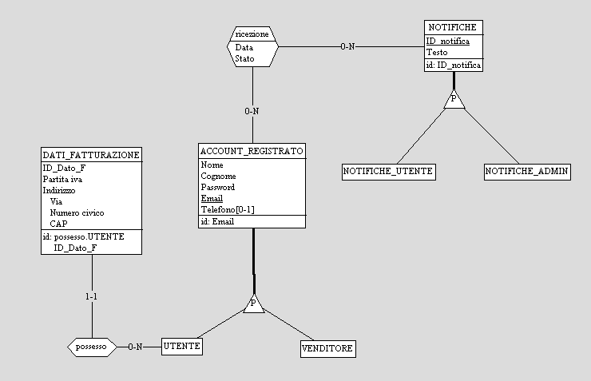
</p>

Dall’analisi del dominio si evince che:
- Un **utente** può effettuare più ordini nel tempo, ma ogni ordine è relativo ad uno specifico momento e contiene una lista di prodotti disponibili in magazzino.
- Ogni **prodotto** (pianta, vaso, chimico, substrato) ha caratteristiche generali (descrizione, dimensione, quantità, prezzo) e può avere attributi specifici in base alla categoria (ad esempio specie per le piante, forma e materiale per i vasi, ecc.).

Per gestire le varianti di prodotto legate a tipo e caratteristiche specifiche (ad esempio, il vaso che ha forma e materiale, la pianta che ha specie e caratteristiche di cura), si introduce una gerarchia che ha come padre l'entità Prodotto. Inizialmete tale gerarchia aveva il seguente E/R:

<p align="center">
  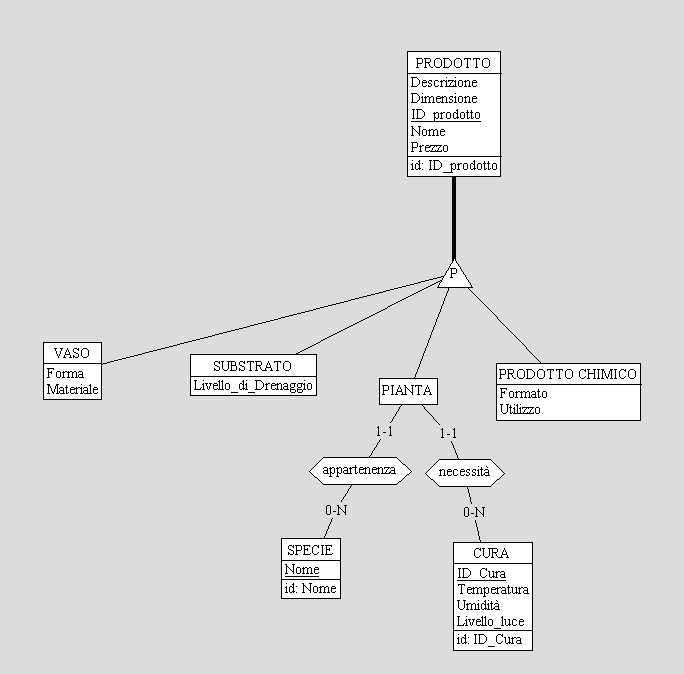
</p>

Successivamente sostituito da: 

<p align="center">
  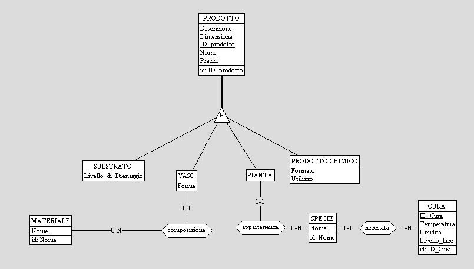
</p>

Reificando l'entità **materiale** posso creare una lista di materiali evitando di avere duplicati o errori di battitura nell'inserimento del prodotto che rendono complessa la ricerca ed il filtraggio. Per quanto riguarda l'entità pianta ho messo in relazione l'entità **cura** direttamente con l'entità **specie** andando a semplificare l'inserimento di una nuova pianta.

Gli **ordini** sono identificati da un codice univoco e sono associati a un utente e ai dati di **spedizione** e **fatturazione** forniti al momento della conferma. L’ordine serve anche da collegamento con il **pagamento** avvenuto e può essere composto da più prodotti in quantità variabile (gestita da una relazione tra Ordine e Prodotto che contiene anche il campo Quantità). Inizialmente avevo ideato il pagamento come un'entità in relazione con una seconda entità che modellava il **metodo di pagamento**, questa soluzione è stata poi soppiantata da una gerarchia che mi permettesse di associare gli appositi atrubuti agli specifici metodi di pagamento, questo ovviamente va a discapito della scalbilità ma migliarta la precisione, la completezza e l'usabilità delle entità stesse.

<p align="center">
	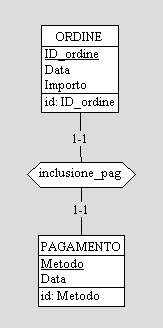
	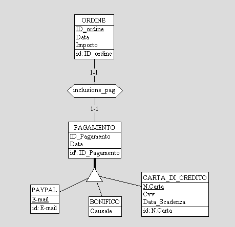
</p>

Ogni **notifica** viene generata come entità a sé e può essere rivolta sia agli utenti (es. conferma ordine, spedizione, promozione) che all’admin (ad esempio segnalazione di esaurimento scorte). Nella priama versione dello schema la relazione recezione non prevedeva atributi, successivamente è stata aggiunta la data e lo stato, ovvero un calore booleano che rappresenta l'avvenuta lettura della notifica. 


<p align="center" style="display: flex; justify-content: center; gap: 24px;">
	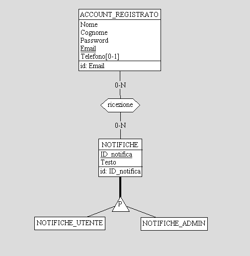
	
</p>

Gli **sconti** sono modellati come entità relazionate a uno o più prodotti, e possono essere definiti secondo validità temporale e percentuale di sconto.

Un qualsiasi **account registaro** ha la possibilità di rilascire recensioni che, nel caso degli utenti saranno riferite direttamente ai prodotti, mentre nel caso del venditore saranno risposte alle recensioni ricevute.

<p align="center">
  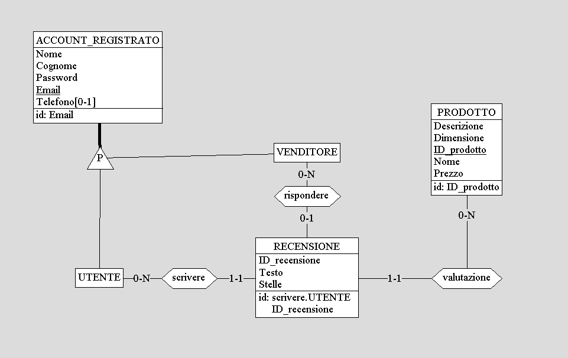
</p>

### Schema Relazionale Finale

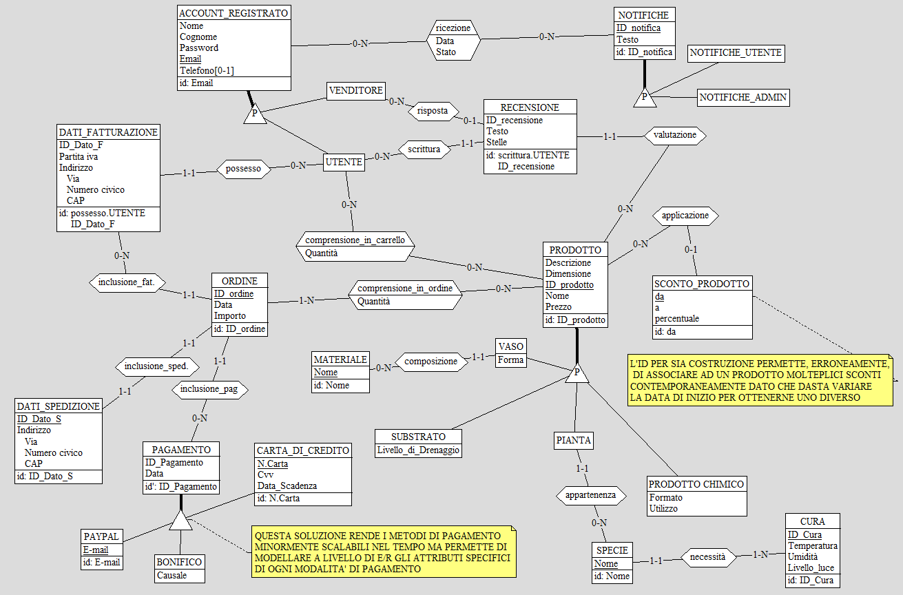

<div style="page-break-after: always;"></div>

## Progettazione Logica

### Stima del Volume dei Dati

| Concetto                                           | Tipo | Volume Stimato | Note                                                                                             |
|----------------------------------------------------|------|---------------|---------------------------------------------------------------------------------------------------|
| **UTENTE**                                         | E    | 17.000        | Clienti registrati                                                                                |
| **VENDITORE**                                      | E    | 10            | Amministratori o gestori del negozio                                                              |
| **DATI_FATTURAZIONE**                              | E    | 19.000        | Ogni utente può avere più indirizzi di fatturazione                                               |
| **DATI_SPEDIZIONE**                                | E    | 24.000        | Diversi indirizzi di spedizione per utente                                                        |
| **ORDINE**                                         | E    | 30.000        | Totale ordini ricevuti                                                                            |
| **PAGAMENTO**                                      | E    | 30.000        | Uno per ordine                                                                                    |
| **PRODOTTO**                                       | E    | 500           | Totale prodotti                                                                                   |
| **VASO**                                           | E    | 100           | Varianti di vasi                                                                                  |
| **MATERIALE**                                      | E    | 25            | Metalli, plastiche, ceramiche, ecc.                                                               |
| **SUBSTRATO**                                      | E    | 20            | Tipi/gradazioni diverse                                                                           |
| **PIANTA**                                         | E    | 300           | Varietà distinte                                                                                  |
| **SPECIE**                                         | E    | 200           | Specie botaniche distinte                                                                         |
| **CURA**                                           | E    | 40            | Diverse tipologie di cura                                                                         |
| **PRODOTTO_CHIMICO**                               | E    | 30            | Concimi, fitofarmaci, ecc.                                                                        |
| **RECENSIONE**                                     | E    | 25.000        | Recensioni inserite dagli utenti                                                                  |
| **SCONTO_PRODOTTO**                                | E    | 150           | Sconti/promo attivi e storicizzati                                                                |
| **NOTIFICA_UTENTE**                                | E    | 2.000.000     | Notifiche ricevute dagli utenti (cronologia completa)                                             |
| **NOTIFICA_VENDITORE**                             | E    | 10.000        | Notifiche ricevute dai venditori/admin (cronologia completa)                                      |
| **COMPRENSIONE_IN_CARRELLO**                       | E    | 10.000        | Prodotti inseriti in un carrello (prodotti per utente, es. 4 prodotti per carrello x 2.500 utenti attivi)      |
| **COMPRENSIONE_IN_ORDINE**                         | E    | 120.000       | Ogni ordine in media con 4 articoli                                                               |
| **COMPRENSIONE_U.** (utente-compr_in_carrello)    | R | 10.000   | Ogni COMPRENSIONE_IN_CARRELLO è associata con un UTENTE                                           |
| **COMPRENSIONE_P.** (compr_in_carrello-prod)      | R | 10.000   | Ogni COMPRENSIONE_IN_CARRELLO è associata con un PRODOTTO                                         |
| **COMPRENSIONE_O.** (compr_in_ordine-ordine)      | R | 120.000  | Ogni COMPRENSIONE_IN_ORDINE è associata con un ORDINE                                             |
| **COMPRENSIONE_O.P.** (compr_in_ordine-prod)      | R | 120.000  | Ogni COMPRENSIONE_IN_ORDINE è associata con un  PRODOTTO                                          |
| **POSSESSO** (utente-dati_fatturazione)           | R | 19.000   | Ogni INDIRIZZO_FATTURAZIONE è associato a uno UTENTE                                              |
| **INCLUSIONE_FAT** (ordine-dati_fatturazione)     | R | 30.000   | Uno per ogni ORDINE                                                                               |
| **INCLUSIONE_SPED** (ordine-dati_spedizione)      | R | 30.000   | Uno per ogni ORDINE                                                                               |
| **INCLUSIONE_PAG** (ordine-pagamento)             | R | 30.000   | Uno per ogni ORDINE                                                                               |
| **APPARTENENZA_V** (vaso-prodotto)                | R | 100      | Ogni VASO è anche un PRODOTTO                                                                     |
| **APPARTENENZA_S** (substrato-prodotto)           | R | 20       | Ogni SUBSTRATO è anche un PRODOTTO                                                                |
| **APPARTENENZA_P** (pianta-prodotto)              | R | 300      | Ogni PIANTA è anche un PRODOTTO                                                                   |
| **APPARTENENZA_P_C** (prod_chimico-prodotto)      | R | 30       | Ogni PRODOTTO_CHIMICO è anche un PRODOTTO                                                         |
| **COMPOSIZIONE** (vaso-materiale)                 | R | 120      | Ogni VASO può essere prodotto in più MATERIALI                                                    |
| **APPLICAZIONE** (prodotto-sconto)                | R | 400      | SCONTI associati a PRODOTTI, anche storicizzati                                                   |
| **SCRITTURA** (utente-recensione)                 | R | 25.000   | Ogni RECENSIONE associata a uno specifico UTENTE                                                  |
| **VALUTAZIONE** (recensione-prodotto)             | R | 25.000   | Ogni RECENSIONE è riferita ad un PRODOTTO                                                         |
| **RISPOSTA** (venditore-recensione)               | R | 10.000   | RECENSIONI con risposta del VENDITORE                                                             |
| **NECESSITA** (specie-cura)                       | R | 200      | Ogni SPECIE ha una tipologia di CURA associata                                                    |
| **APPARTENENZA** (pianta-specie)                  | R | 300      | Ogni PIANTA appartiene a una SPECIE                                                               |
| **RICEZIONE_U.** (utente-notifica_utente)         | R | 2.000.000| Ogni UTENTE ha circa 100 NOTIFICHE                                                                |
| **INVIO_U.** (notifica_utente-utente)             | R | 2.000.000| Ogni NOTIFICA_UTENTE è inviata ad un UTENTE                                                       |
| **RICEZIONE_V.** (venditore-notifica_venditore)   | R | 10.000   | Ogni VENDITORE ha circa 1000 NOTIFICHE                                                            |
| **INVIO_V.** (notifica_venditore-venditore)       | R | 10.000   | Ogni NOTIFICA_VENDITORE è inviata ad un VENDITORE                                                 |

### Funzionalità Principali e Stima della Frequenza

Segue un elenco delle principali azioni richieste:
1.  Registrarsi al sito (utente)
2.  Visualizzare all'interno dei catalogo specifiche fascie di prodotti sulla base di filtri specifici (utente)
3.  Visualizzare e gestire i propri dati personali (utente)
4.  Aggiungere prodotti al carrello (utente)
5.  Effettuare un ordine scegliendo tra diversi metodi di pagamento e inserendo dati di spedizione e fatturazione (utente)
6.  Valutare i prodotti acquistati con stelle e recensione (utente)
7.  Inviare notifiche personalizzate agli utenti (admin)
8.  Consultare statistiche sulle vendite (admin)
9.  Inserire, aggiornare o rimuovere un prodotto dal catalogo (admin)
10. Applicare uno sconto su uno o più prodotti (admin)

### Tabella Frequenza Operazioni Principali

| Cod. | Nome Operazione                                                        | Frequenza Stimata   | Tipo (Interattiva/Batch) |
|------|------------------------------------------------------------------------|---------------------|--------------------------|
| 01   | Registrarsi al sito (nuovo UTENTE)                                     | 10 al giorno        | I                        |
| 02   | Visualizzare catalogo con filtri                                       | 3.000 al giorno     | I                        |
| 03   | Gestire/Visualizzare dati personali                                    | 80 al giorno        | I                        |
| 04   | Aggiungere prodotti al carrello                                        | 1.000 al giorno     | I                        |
| 05   | Effettuare ordine con inserimento spedizione, fatturazione, pagamento  | 120 al giorno       | I                        |
| 06   | Valutare prodotti acquistati con stelle e recensione                   | 70 al giorno        | I                        |
| 07   | Inviare notifiche personalizzate agli utenti (admin)                   | 5.000 al giorno     | B                        |
| 08   | Consultare statistiche vendite (admin)                                 | 10 al giorno        | I                        |
| 09   | Inserimento/aggiornamento/rimozione prodotto nel catalogo (admin)      | 10 al giorno        | I                        |
| 10   | Applicare o modificare uno sconto su prodotti (admin)                  | 3 al giorno         | I                        |


### Schemi di Navigazione e Tabelle degli Accessi

Dopo aver determinato il volume dei dati e la frequenza delle operazioni, si dettagliano gli accessi di alcune operazioni chiave. Nel calcolo degli accessi si stima come doppio il peso degli accessi in scrittura rispetto ai lettura.

**02 VISUALIZZAZIONE CATALOGO FILTRATO**

**Obiettivo:** Visualizzare prodotti in base alla categoria. Assumiamo si ricerchi la categoria piante ovvero quella con più istanze e con più ricerche giornaliere (1000 delle 3000 totali).

**Schema di navigazione:**  
PRODOTTO → appartenenza_p. → PIANTA → appartenenza → SPECIE → necessita → CURA

**Tavola degli accessi:**

| Concetto           | Costrutto | Accessi        | Tipo |
|--------------------|-----------|----------------|------|
| PRODOTTO           | E         | 500            | L    |
| appartenenza_p.    | R         | 300            | L    |
| PIANTA             | E         | 300            | L    |
| appartenenza       | R         | 300            | L    |
| SPECIE             | E         | 300            | L    |
| necessita          | R         | 300            | L    |
| CURA               | E         | 300            | L    |


Totale: 2.300L = 2.300 accessi
Frequenza: 1.000 al giorno  
**Costo totale:** 1.000 x 2.300 = 2.300.000 accessi al giorno

**04 AGGIUNTA PRODOTTO AL CARRELLO**

**Obiettivo:** Un utente aggiunge un prodotto al proprio carrello.

**Schema di navigazione:**  
PRODOTTO → comprensione_p. → COMPRENSIONE_IN_CARRELLO → comprensione_u.

**Tavola degli accessi:**

| Concetto                | Costrutto | Accessi | Tipo |
|-------------------------|-----------|---------|------|
| PRODOTTO                | E         | 1       | L    |
| comprensione_p.         | R         | 1       | S    |
| COMPRENSIONE_IN_CARRELLO| E         | 1       | S    |
| comprensione_u.         | R         | 1       | S    |

Totale: 1L + 3S = 7 accessi 
Frequenza: 1.000 al giorno  
**Costo:** 7 x 1.000 = 7.000 accessi al giorno  

**05 EFFETTUARE UN ORDINE**

**Obiettivo:** Un utente procede all'acquisto del proprio carrello.

**Schema navigazione:** 
ORDINE → inclusione_fat. → DATI_FATTURAZIONE → inclusione_sped. → DATI_SPEDIZIONE → inclusione_pag. → PAGAMENTO
COMPRENSIONE_IN_CARRELLO → comprensione_p. → PRODOTTO → comprensione_o.p. → COMPRENSIONE_IN_ORDINE → comprensione_o. 


| Concetto                 | Costrutto | Accessi | Tipo |
|--------------------------|-----------|---------|------|
| ORDINE                   | E         | 1       | S    |
| inclusione_fat.          | R         | 1       | S    |
| DATI_FATTURAZIONE        | E         | 1       | S    |
| inclusione_sped.         | R         | 1       | S    |
| DATI_SPEDIZIONE          | E         | 1       | S    |
| inclusione_pag.          | R         | 1       | S    |
| PAGAMENTO                | E         | 1       | S    |
| COMPRENSIONE_IN_CARRELLO | E         | 4       | L    |
| comprensione_p.          | R         | 4       | L    |
| PRODOTTO                 | E         | 4       | L    |
| comprensione_o.p.        | R         | 4       | S    |
| COMPRENSIONE_IN_ORDINE   | E         | 4       | S    |
| comprensione_o.          | R         | 4       | S    |

Totale: 19S + 3L = 41 accessi
Frequenza: 120 al giorno  
**Costo:** 41 x 120 = 4.920 accessi al giorno  

**06 VALUTAZIONE PRODOTTO**

**Obiettivo:** Utente recensisce un prodotto dopo averlo acquistato.

**Schema navigazione:**  
PRODOTTO → comprensione_o.p. → COMPRENSIONE_IN_ORDINE → comprensione_o. → ORDINE → UTENTE → scrittura → RECENSIONE → valutazione 

| Concetto              | Costrutto | Accessi                 | Tipo |
|-----------------------|-----------|-------------------------|------|
| PRODOTTO              | E         | 1                       | L    |
| comprensione_o.p.     | R         | 120.000 / 500 = 240     | L    |
| COMPRENSIONE_IN_ORDINE| E         | 240                     | L    |
| comprensione_o.       | R         | 240                     | L    |
| ORDINE                | E         | 240                     | L    |
| UTENTE                | E         | 1                       | L    |
| scrittura             | R         | 1                       | S    |
| RECENSIONE            | E         | 1                       | S    |
| valutazione           | R         | 1                       | S    |
 
Totale: 962L + 3S = 968 accessi 
Frequenza: 70 al giorno  
**Costo:** 968 x 70 = 67.760 accessi al giorno  

**08 CONSULTAZIONE STATISTICHE SULLE VENDITE (ADMIN)**

**Obiettivo:** L’amministratore consulta statistiche aggregate su ordini, prodotti e recensioni, ad esempio i dieci prodotti più venduti con il relativo totale di recensioni e valutazione media.

**Schema di navigazione:**  
COMPRENSIONE_IN_ORDINE → comprensione_o.p. → PRODOTTO → valutazione → RECENSIONE   

**Tavola degli accessi:**

| Concetto                | Costrutto | Accessi                        | Tipo |
|-------------------------|-----------|--------------------------------|------|
| COMPRENSIONE_IN_ORDINE  | E         | 120.000                        | L    |
| comprensione_o.p.       | R         | 120.000 / 500 = 240            | L    |
| PRODOTTO                | E         | 10                             | L    |
| valutazione             | R         | 25.000 / 500 * 10 = 500        | L    |
| RECENSIONE              | E         | 500                            | L    |

**Totale:** 121.250L = 121.250 accessi
**Frequenza:** 20 al giorno  
**Costo totale:** 121.250 x 20 = 121.250 accessi al giorno

**10 APPLICAZIONE DI UNO SCONTO SU PRODOTTI (ADMIN)**

**Obiettivo:** L’amministratore attiva uno sconto e lo associa a un prodotto.

**Schema di navigazione:**  
SCONTO_PRODOTTO → applicazione

**Tavola degli accessi:**

| Concetto         | Costrutto | Accessi     | Tipo |
|------------------|-----------|-------------|------|
| SCONTO_PRODOTTO  | E         | 1           | S    |
| applicazione     | R         | 1           | S    |
  
**Totale:** 2S = 4 accessi
**Frequenza:** 3 al giorno  
**Costo totale:** 4 x 3 = 12 accessi al giorno

### Analisi delle Ridondanze

**Attributo Importo nell'Entità ORDINE**

Nel modello proposto, un possibile caso di **ridondanza controllata** riguarda l’attributo **`importo`** all’interno dell’entità **ORDINE**.

**Descrizione della ridondanza**

L’importo totale di un ordine può essere ottenuto come **somma dei (prezzo × quantità)** di ciascun prodotto incluso nell’ordine, più/minus eventuali sconti applicati. Non sarebbe quindi strettamente necessario memorizzare il campo importo nella tabella ORDINE, ma, come spesso accade negli applicativi gestionali, tale informazione viene comunque mantenuta per facilitare l’accesso rapido al dato totale senza dover ricalcolare ogni volta.

**Confronto tra gestione con e senza ridondanza**

- **Senza ridondanza**
  
  Ogni volta che si vuole restituire il totale di un ordine, si dovrà:
  - Accedere a tutte le tuple della relazione **COMPRENSIONE_IN_ORDINE** per quell’ordine;
  - Recuperare il **prezzo** corrente (eventualmente storico) di ciascun prodotto;
  - Applicare eventuali sconti;
  - Sommare il risultato `prezzo × quantità` per ogni prodotto nell’ordine.

  **Tavola degli accessi (per calcolo di un importo ordine):**
  | Concetto                | Costrutto | Accessi                        | Tipo |
  |-------------------------|-----------|--------------------------------|------|
  | comprensione_o.         | R         | 4                              | L    |
  | COMPRENSIONE_IN_ORDINE  | E         | 4                              | L    |
  | comprensione_o.p.       | R         | 4                              | L    |
  | PRODOTTO                | E         | 4                              | L    |
  | applicazione            | R         | 150 / 500 * 4 = 1.2            | L    |
  | SCONTO                  | E         | 1.2                            | L    |

  Totale: ~19L  
  Frequenza: La frequenza di questa operazione può dipendere da molteplici operazioni e viene stimata intorno alle 10.000 volte al giorno, comprendendo le statistiche lato VENDITORE, le consultazioni lato UTENTE dei propri ordini e l'invio di notifiche da parte del sistema.
  **Costo totale:** 19 x 10.000 = 19.000 accessi al giorno.

- **Con ridondanza (importo memorizzato)**

  Il campo importo in ORDINE è aggiornato al momento della creazione dell’ordine e presenta sempre il valore corretto.
  - Per conoscere l’importo: si effettua una sola lettura nella relazione **ORDINE** (campo importo).
  - L’unico costo aggiuntivo è l’aggiornamento puntuale del campo in fase di inserimento/aggiornamento ordine. 
  - L'unica differenza è che al momento della creazione bisognerà calcolare l'importo come descrtto precedentemente (19L).

  **Tavola degli accessi (per calcolo e lettura importo):**
  | Concetto      | Costrutto | Accessi | Tipo |
  |---------------|-----------|---------|------|
  | ORDINE        | E         | 1       | L    |
  
  Totale: 1L  
  Frequenza: 120 volte/giorno  
  **Costo totale:** 1 x 10.000 = 10.000 accessi al giorno.

**Valutazione e scelta**

La ridondanza comporta un lieve aumento di spazio occupato (una colonna in più per ciascun ordine), ma porta a un notevole risparmio in termini di accessi necessari per tutte le operazioni di consultazione (es. visualizzazione storici, stampa ricevute e analisi statistiche). Inoltre, permette di conservare l’importo esatto anche in caso di modifica futura del prezzo dei prodotti o delle regole di sconto, garantendo la tracciabilità dei dati storici. Si decide quindi di mantenere all’interno del modello l’attributo *importo* nella tabella ORDINE. Lo spreco di spazio è minimo rispetto al vantaggio in termini di prestazioni e semplificazione, sia per l’applicazione che per le interrogazioni di analisi.

<div style="page-break-after: always;"></div>

## Raffinamento dello Schema

### Eliminazione delle Gerarchie

Nello **schema E/R iniziale** compaiono tre principali gerarchie da eliminare:  
- la gerarchia sull’entità **ACCOUNT_REGISTRATO** (con le specializzazioni UTENTE e VENDITORE)
- la gerarchia sull’entità **PRODOTTO** (con le specializzazioni PIANTA, VASO, PRODOTTO_CHIMICO, SUBSTRATO).
- la gerarchia sull'entità **PAGAMENTO** (con specializzazione PAYPAL, BONIFICO e CARTA_DI_CREDITO)

**Gerarchia ACCOUNT_REGISTRATO (UTENTE, VENDITORE)**

Si è scelto il **collasso verso il basso**:  
- Le entità **UTENTE** e **VENDITORE** vengono mantenute distinte, ognuna con tutti gli attributi comuni a ACCOUNT_REGISTRATO (nome, cognome, email, password, telefono, ecc.).
- Ogni entità specializzata contiene soltanto i dati dei rispettivi ruoli, e l’informazione di “ruolo” può essere utilizzata a livello di software/applicazione anziché nel database centrale.
- Le relazioni a valle (come “possesso” di indirizzi, “scrittura” di recensioni, ricezione/invio di notifiche) fanno riferimento direttamente a UTENTE o VENDITORE.

**Motivazione della scelta:**  
Il collasso verso il basso è particolarmente conveniente in questo scenario in quanto UTENTE e VENDITORE svolgono funzioni molto diverse e pertanto accedono a domini applicativi (e interfacce) separati. La duplicazione di alcuni attributi è ritenuta tollerabile e aumenta la chiarezza durante la gestione dei permessi e delle funzionalità amministrative.

**Gerarchia PRODOTTO (PIANTA, VASO, PRODOTTO_CHIMICO, SUBSTRATO)**

Per questa gerarchia si è scelto di **sostituire la generalizzazione con associazioni 1:1**:

- Tutte le entità della gerarchia vengono **mantenute esplicitamente** nel modello: sia l’entità generale (**PRODOTTO**) che le entità figlie (**PIANTA, VASO, PRODOTTO_CHIMICO, SUBSTRATO**).
- Le entità figlie sono **associate all’entità padre tramite una relazione binaria 1:1** (ad es. “appartenenza_p.” tra PIANTA e PRODOTTO). In questo modo, ogni istanza delle entità figlie è identificata attraverso una chiave esterna che punta a PRODOTTO, evitando duplicazioni di attributi comuni.

**Motivazione della scelta:**  
La sostituzione con associazioni porta vantaggi di normalizzazione e di chiarezza:
- Gli attributi comuni (es. nome, descrizione, quantità, prezzo) rimangono **solo** in PRODOTTO evitando ridondanza e valori nulli nelle entità figlie.
- Ogni entità figlia contiene **solo gli attributi specifici** (es. specie per PIANTA, materiale per VASO, livello di drenaggio per SUBSTRATO).
- Grazie alle associazioni binarie, è possibile mantenere separate le tipologie di prodotto, facilitando controlli di integrità e interrogazioni specifiche.

**Gerarchia PAGAMENTO (PAYPAL, BONIFICO e CARTA_DI_CREDITO)**

Si è scelto il **collasso verso l'alto**:
- Così facendo le specializzazioni sapriscono e si aggiungono due attributi all'entità **PAGAMENTO** ovvero Metodo e Dati che letti in combinazione permetteranno di soppiantare la presenza della gerarechia originale.
- Nello specifico l'atributo Metodo permetterà di salvare la tipologia di pagamento ricevuta metre in dati si andrà a salvare in formato testuale i dati specifici per quel pagamneto.

**Motivazione della scelta:**
Il collasso verso l'alto permette di modellare tutti i vincoli del dominio senza rinunciare ad alcuna funzionalità, anzi aumentando la facilià con cui si aggiungono metodi di pagamneto a discapito di una gestione capillare dei dati delle specifiche tipologie di pagamento.

### Eliminazione degli Attributi Composti

Nello schema di partenza, l’attributo **Indirizzo** era modellato come campo unico.  
Dopo il raffinamento, “Indirizzo” viene **scomposto** nei suoi sotto-attributi: **Via, Numero Civico, CAP, ecc.** sia in DATI_FATTURAZIONE che in DATI_SPEDIZIONE, favorendo ricerche, filtri e validazioni più efficienti.

### Scelta delle Chiavi Primarie

Ogni tabella (UTENTE, VENDITORE, PIANTA, VASO, ecc.) è identificata da una **chiave primaria semplice** (ad esempio, Email per UTENTE e VENDITORE, ID_Prodotto per ciascuna sottotabella di prodotto).

### Reificazione delle Relazioni in Entità

Nel raffinamento dello schema concettuale, alcune relazioni sono state reificate, dando luogo alle entità:

- **NOTIFICA_UTENTE_RICEVUTA**
- **NOTIFICA_VENDITORE_RICEVUTA**
- **COMPRENSIONE_IN_CARRELLO**
- **COMPRENSIONE_IN_ORDINE**

1. Nel caso di **NOTIFICA_UTENTE_RICEVUTA** e **NOTIFICA_VENDITORE_RICEVUTA** si è scelto di reificare la relazione “ricezione” per i seguenti motivi:
   - Ogni ricezione di notifica può richiedere **attributi specifici** (es. data di ricezione, stato di lettura).
   - Un utente può ricevere la stessa notifica in più momenti o in condizioni diverse.
   - Si semplifica il tracciamento dello **storico notifiche** e la gestione della logica applicativa (ad esempio “segna come letto” viene gestita a livello di istanza della ricezione).
   - La reificazione introduce una problematica legata a un vincolo aggiuntivo non presente nel dominio originale né nello schema E/R iniziale. Reificando, diventa necessario un identificativo univoco (ID) per la nuova entità. Se tale ID fosse definito come combinazione della **data di ricezione**, della chiave esterna **email** dell'account ricevente e della chiave esterna **ID_NOTIFICA**, si introdurrebbe un vincolo indesiderato: non sarebbe possibile istanziare più notifiche della stessa tipologia per lo stesso utente nella stessa giornata. Per risolvere questa limitazione, si decide di introdurre un **codice univoco** all'interno della nuova entità. Questo codice, combinato con l'email dell'utente, consente di evitare il problema, garantendo la possibilità di associare più notifiche dello stesso tipo a uno stesso utente nello stesso giorno.
  
2. La relazione tra UTENTE e PRODOTTO, per rappresentare i prodotti attualmente inseriti nel carrello, è stata reificata in **COMPRENSIONE_IN_CARRELLO**:
   - È necessario **associare alla relazione un attributo fondamentale**: la **quantità** di ciascun prodotto messo nel carrello dal singolo utente.
   - Potenzialmente, anche altri attributi possono emergere in futuro (ad esempio data/ora di inserimento, selezione di opzioni aggiuntive).
   - La reificazione supporta la gestione efficace di tutte le operazioni di aggiornamento, cancellazione e visualizzazione dello stato corrente del carrello.

3. Analogamente, la relazione tra ORDINE e PRODOTTO viene reificata in **COMPRENSIONE_IN_ORDINE**:
   - È indispensabile memorizzare il legame tra ordine e prodotto e **informazioni come la quantità ordinata**.
   - La reificazione consente di rappresentare in modo naturale il **dettaglio ordine**.

### Schema Relazionale Raffinato

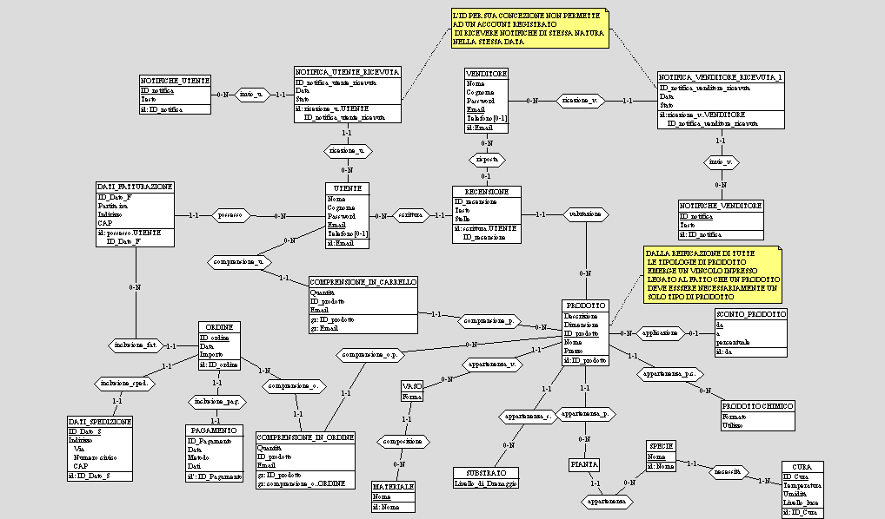

### Traduzione delle Entità e delle Assocaizioni in Relazioni

- **UTENTI** (<u>Email</u>, Nome, Cognome, Password, Telefono*)
- **DATI_FATTURAZIONE** (<u>Email:UTENTI, IdDatoFatt</u>, PartitaIVA, Indirizzo, CAP)
- **DATI_SPEDIZIONE** (<u>IdDatoSped</u>, Indirizzo, CAP)
- **PAGAMENTI** (<u>IdPagamento</u>, Data, Metodo, Dati)
- **ORDINI** (<u>IdOrdine</u>, IdDatoSped:DATI_SPEDIZIONE, Data, Importo, (Email, IdDatoFatt):DATI_FATTURAZIONE, IdPagamento:PAGAMENTI)
- **PRODOTTI** (<u>IdProdotto</u>, Descrizione, Dimensione, DataSconto*:SCONTO_PRODOTTO, Nome, Prezzo)
- **COMPRENSIONE_IN_CARRELLO** (<u>IdProdotto:PRODOTTI, Email:UTENTI</u>, Quantità)
- **COMPRENSIONE_IN_ORDINE** (<u>IdProdotto:ORDINI, IdOrdine</u>, Quantità:PRODOTTI)
- **PIANTE** (<u>IdProdotto:PRODOTTI</u>, NomeSpecie:SPECIE)
- **SPECIE** (<u>Nome</u>, IdCura:CURE)
- **CURE** (<u>IdCura</u>, Temperatura, Umidità, LivelloLuce)
- **PRODOTTO_CHIMICO** (<u>IdProdotto:PRODOTTI</u>, Formato, Utilizzo) 
- **SUBSTRATI** (<u>IdProdotto:PRODOTTI</u>, LivelloDrenaggio)
- **VASI** (<u>IdProdotto:PRODOTTI</u>, Forma, NomeMateriale:MATERIALI)
- **MATERIALI** (<u>Nome</u>)
- **NOTIFICHE_UTENTE** (<u>IdNotifica</u>, Testo)
- **NOTIFICHE_VENDITORE** (<u>IdNotifica</u>, Testo)
- **NOTIFICA_UTENTE_RICEVUTA** (<u>Email:UTENTI, IdNotificaRicevuta</u>, Data, Stato, IdNotifica:NOTIFICHE_UTENTE)
- **NOTIFICA_VENDITORE_RICEVUTA** (<u>Email:VENDITORI, IdNotificaRicevuta</u>, Data, Stato, IdNotifica:NOTIFICHE_VENDITORE) 
- **RECENSIONI** (<u>Email:UTENTI, IdRecensione</u>, Testo, Stelle, EmailVenditore*:VENDITORI, IdProdotto: PRODOTTI)
- **SCONTO_PRODOTTO** (<u>DataInizio</u>, DataFine, Percentuale)
- **VENDITORI** (<u>Email</u>, Nome, Cognome, Password, Telefono*)

### Schema Logico Finale

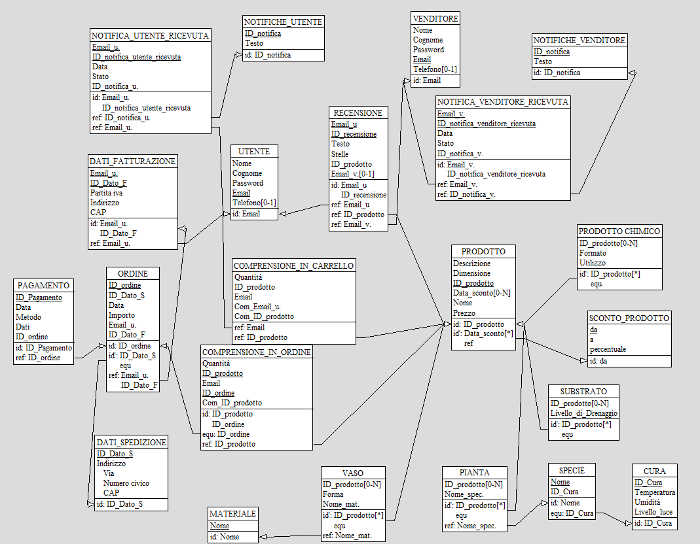

### Costruzione delle Tabelle del DB in SQL

drop database if exists ER_logico_per_DB;
create database ER_logico_per_DB;
use ER_logico_per_DB;

create table COMPRENSIONE_IN_CARRELLO (
	Quantita int not null,
	ID_prodotto varchar(16) not null,
	Email char(32) not null,
	primary key (Email, ID_prodotto)
);

create table COMPRENSIONE_IN_ORDINE (
	Quantita int not null,
	ID_prodotto varchar(16) not null,
	ID_ordine varchar(16) not null,
	primary key (ID_ordine, ID_prodotto)
);

create table CURA (
	ID_Cura varchar(8) not null,
	TemperaturaMin decimal(4,1) not null,
	TemperaturaMax decimal(4,1) not null,
	UmiditaMin decimal(5,2) not null,
	UmiditaMax decimal(5,2) not null,
	Livello_luce varchar(32) not null,
	primary key (ID_Cura)
);

create table DATI_FATTURAZIONE (
	Email_utente char(32) not null,
	ID_Dato_F varchar(8) not null,
	PartitaIVA char(16) not null,
	Indirizzo varchar(128) not null,
	CAP char(5) not null,
	primary key (Email_utente, ID_Dato_F)
);

create table DATI_SPEDIZIONE (
	ID_Dato_S varchar(8) not null,
	Indirizzo varchar(128) not null,
	NumeroCivico varchar(8),
	CAP char(5) not null,
	primary key (ID_Dato_S)
);

create table MATERIALE (
	Nome varchar(64) not null,
	primary key (Nome)
);

create table NOTIFICA_UTENTE_RICEVUTA (
	Email_utente char(32) not null,
	ID_notifica int not null,
	Data date not null,
	Stato varchar(32) not null,
	primary key (Email_utente, ID_notifica, Data)
);

create table NOTIFICA_VENDITORE_RICEVUTA (
	Email_venditore char(32) not null,
	ID_notifica int not null,
	Data date not null,
	Stato varchar(32) not null,
	primary key (Email_venditore, ID_notifica, Data)
);

create table NOTIFICHE_UTENTE (
	ID_notifica int not null auto_increment,
	Testo varchar(512) not null,
	primary key (ID_notifica)
);

create table NOTIFICHE_VENDITORE (
	ID_notifica int not null auto_increment,
	Testo varchar(512) not null,
	primary key (ID_notifica)
);

create table PAGAMENTO (
	ID_Pagamento varchar(16) not null,
	Data date not null,
	Metodo varchar(32) not null,
	Dati varchar(256) not null,
	ID_ordine varchar(16) not null,
	primary key (ID_Pagamento)
);

create table ORDINE (
	ID_ordine varchar(16) not null,
	ID_Dato_S varchar(16) not null,
	ID_Pagamento varchar(8) not null,
	Data date not null,
	Importo decimal(8,2) not null,
	Email_utente char(32) not null,
	ID_Dato_F varchar(8) not null,
	primary key (ID_ordine),
    unique (ID_Dato_S),
	unique (ID_Pagamento)
);

create table PRODOTTO (
	ID_prodotto varchar(16) not null,
	Descrizione varchar(512) not null,
	Dimensione varchar(16) not null,
	Data_sconto date,
	Nome varchar(32) not null,
	Prezzo decimal(8,2) not null,
	Tipo_prodotto varchar(20) not null,
	primary key (ID_prodotto)
);

create table PIANTA (
	ID_prodotto varchar(16) not null,
	Nome_specie varchar(32) not null,
	primary key (ID_prodotto)
);

create table PRODOTTO_CHIMICO (
	ID_prodotto varchar(16) not null,
	Formato varchar(32) not null,
	Utilizzo varchar(512) not null,
	primary key (ID_prodotto)
);

create table RECENSIONE (
	Email_utente char(32) not null,
	ID_recensione int not null auto_increment,
	Testo varchar(512) not null,
	Stelle int not null check (Stelle between 1 and 5),
	ID_prodotto varchar(16) not null,
	Email_venditore char(32),
	primary key (ID_recensione),
    unique (Email_utente, ID_prodotto)
);

create table SCONTO_PRODOTTO (
	DataInizio date not null,
	DataFine date not null,
	Percentuale decimal(5,2) not null,
	primary key (DataInizio)
);

create table SPECIE (
	Nome varchar(32) not null,
	ID_Cura varchar(8) not null,
	primary key (Nome)
);

create table SUBSTRATO (
	ID_prodotto varchar(16) not null,
	Livello_di_Drenaggio int not null,
	primary key (ID_prodotto)
);

create table UTENTE (
	Nome varchar(32) not null,
	Cognome varchar(32) not null,
	Password varchar(64) not null,
	Email char(32) not null,
	Telefono char(10),
	primary key (Email)
);

create table VASO (
	ID_prodotto varchar(16) not null,
	Forma varchar(64) not null,
	Nome_materiale varchar(64) not null,
	primary key (ID_prodotto)
);

create table VENDITORE (
	Nome varchar(32) not null,
	Cognome varchar(32) not null,
	Password varchar(64) not null,
	Email char(32) not null,
	Telefono char(10),
	primary key (Email)
);

alter table COMPRENSIONE_IN_CARRELLO add constraint FK_carrello_utente
	foreign key (Email)
	references UTENTE(Email);

alter table COMPRENSIONE_IN_CARRELLO add constraint FK_carrello_prodotto
	foreign key (ID_prodotto)
	references PRODOTTO(ID_prodotto);

alter table COMPRENSIONE_IN_ORDINE add constraint FK_ordine
	foreign key (ID_ordine)
	references ORDINE(ID_ordine);

alter table COMPRENSIONE_IN_ORDINE add constraint FK_ordine_prodotto
	foreign key (ID_prodotto)
	references PRODOTTO(ID_prodotto);

alter table DATI_FATTURAZIONE add constraint FK_fatturazione_utente
	foreign key (Email_utente)
	references UTENTE(Email);

alter table NOTIFICA_UTENTE_RICEVUTA add constraint FK_notifica_utente
	foreign key (Email_utente)
	references UTENTE(Email);

alter table NOTIFICA_UTENTE_RICEVUTA add constraint FK_notifica_id_utente
	foreign key (ID_notifica)
	references NOTIFICHE_UTENTE(ID_notifica);

alter table NOTIFICA_VENDITORE_RICEVUTA add constraint FK_notifica_venditore
	foreign key (Email_venditore)
	references VENDITORE(Email);

alter table NOTIFICA_VENDITORE_RICEVUTA add constraint FK_notifica_id_venditore
	foreign key (ID_notifica)
	references NOTIFICHE_VENDITORE(ID_notifica);

alter table ORDINE add constraint FK_ordine_fatturazione
	foreign key (Email_utente, ID_Dato_F)
	references DATI_FATTURAZIONE(Email_utente, ID_Dato_F);

alter table ORDINE add constraint FK_ordine_spedizione
	foreign key (ID_Dato_S)
	references DATI_SPEDIZIONE(ID_Dato_S);

alter table PAGAMENTO add constraint FK_pag_ordine
	foreign key (ID_ordine)
	references ORDINE(ID_ordine);

alter table PIANTA add constraint FK_pianta_prodotto
	foreign key (ID_prodotto)
	references PRODOTTO(ID_prodotto);

alter table PIANTA add constraint FK_pianta_specie
	foreign key (Nome_specie)
	references SPECIE(Nome);

alter table PRODOTTO_CHIMICO add constraint FK_chimico_prodotto
	foreign key (ID_prodotto)
	references PRODOTTO(ID_prodotto);

alter table RECENSIONE add constraint FK_recensione_utente
	foreign key (Email_utente)
	references UTENTE(Email);

alter table RECENSIONE add constraint FK_recensione_prodotto
	foreign key (ID_prodotto)
	references PRODOTTO(ID_prodotto);

alter table RECENSIONE add constraint FK_recensione_venditore
	foreign key (Email_venditore)
	references VENDITORE(Email);

alter table SPECIE add constraint FK_specie_cura
	foreign key (ID_Cura)
	references CURA(ID_Cura);

alter table SUBSTRATO add constraint FK_substrato_prodotto
	foreign key (ID_prodotto)
	references PRODOTTO(ID_prodotto);

alter table VASO add constraint FK_vaso_prodotto
	foreign key (ID_prodotto)
	references PRODOTTO(ID_prodotto);

alter table VASO add constraint FK_vaso_materiale
	foreign key (Nome_materiale)
	references MATERIALE(Nome);

### Traduzione delle Operazioni in query SQL

**01. Registrarsi al sito (utente)**

```sql
INSERT INTO UTENTE (Nome, Cognome, Password, Email, Telefono)
VALUES (?,?,?,?,?);
```

**02. Visualizzare all'interno del catalogo specifiche fasce di prodotti sulla base di filtri specifici (utente)**

**Esempio: solo piante tra 20€ e 100€, nome contiene 'ficus', dimensione 'L'**

```sql
SELECT P.ID_prodotto, P.Nome, P.Prezzo, P.Descrizione, P.Dimensione
FROM PRODOTTO P
JOIN PIANTA PT ON PT.ID_prodotto = P.ID_prodotto
WHERE P.Prezzo BETWEEN 20.0 AND 100.0
  AND P.Nome LIKE '%ficus%'
  AND P.Dimensione = 'L';
```

**03. Visualizzare e gestire i propri dati personali (utente)**

**Visualizza:**
```sql
SELECT *
FROM UTENTE
WHERE Email = ?;
```

**Modifica (es. cambio telefono):**
```sql
UPDATE UTENTE
SET Telefono = ?
WHERE Email = ?;
```

**04. Aggiungere prodotti al carrello (utente)**

Se il prodotto esiste già nel carrello: **fai un UPDATE**, altrimenti **INSERT**.

```sql
-- Se non esiste ancora:
INSERT INTO COMPRENSIONE_IN_CARRELLO (Quantita, ID_prodotto, Email)
VALUES (?, ?, ?);

-- Se esiste già:
UPDATE COMPRENSIONE_IN_CARRELLO
SET Quantita = Quantita + 1
WHERE ID_prodotto = ? AND Email = ?;
```

**05. Effettuare un ordine scegliendo metodo di pagamento e inserendo dati spedizione e fatturazione (utente)**

**Ipotizziamo di conoscere già gli ID dei dati spedizione/fatturazione dell’utente. Inserisci l’ordine:**
```sql
INSERT INTO ORDINE (ID_ordine, ID_Dato_S, Data, Importo, Email_utente, ID_Dato_F)
VALUES (?, ?, CURRENT_DATE, ?, ?, ?);
```

Per ogni prodotto del carrello:
```sql
INSERT INTO COMPRENSIONE_IN_ORDINE (Quantita, ID_prodotto, ID_ordine)
SELECT Quantita, ID_prodotto, GetLastIdOrder()
FROM COMPRENSIONE_IN_CARRELLO
WHERE Email = ?;
```

Svuota il carrello:
```sql
DELETE FROM COMPRENSIONE_IN_CARRELLO WHERE Email = ?;
```

Pagamento:
```sql
INSERT INTO PAGAMENTO (ID_Pagamento, Data, Metodo, Dati, ID_ordine)
VALUES (?, CURRENT_DATE, ?, ?, ?);
```

**06. Valutare i prodotti acquistati con stelle e recensione (utente)**

```sql
INSERT INTO RECENSIONE (Email_utente, Testo, Stelle, ID_prodotto, Email_venditore)
VALUES (?, ?, ?, ?, ?);
```
*non è stato inserito l'id perchè è auto increment*

**07. Inviare notifiche personalizzate agli utenti (admin)**

```sql
-- Crea la notifica generale
INSERT INTO NOTIFICHE_UTENTE (Testo)
VALUES (?);

-- Supponendo che l’amministratore conosca il nuovo ID della notifica appena inserita:
INSERT INTO NOTIFICA_UTENTE_RICEVUTA (Email_utente, ID_notifica, Data, Stato)
VALUES (?, GetLastIdNotification(), CURRENT_DATE, ?);
```

Se vuoi inviare la stessa notifica a più utenti:
```sql
INSERT INTO NOTIFICA_UTENTE_RICEVUTA (Email_utente, ID_notifica, Data, Stato)
SELECT Email, LAST_INSERT_ID(), CURRENT_DATE, 'NonLetta'
FROM UTENTE
WHERE <condizione sui destinatari>;
```

**08. Consultare statistiche sulle vendite (admin)**

**Totale vendite e fatturato per prodotto:**
```sql
SELECT P.ID_prodotto, P.Nome, COUNT(CO.ID_prodotto) AS Num_vendite, SUM(CO.Quantita) AS Quantita_totale, SUM(O.Importo) AS Totale_incassato
FROM COMPRENSIONE_IN_ORDINE CO
JOIN PRODOTTO P ON P.ID_prodotto = CO.ID_prodotto
JOIN ORDINE O ON O.ID_ordine = CO.ID_ordine
GROUP BY P.ID_prodotto, P.Nome
ORDER BY Totale_incassato DESC;
```

**09. Inserire, aggiornare o rimuovere un prodotto dal catalogo (admin)**

**Inserimento:**
```sql
INSERT INTO PRODOTTO (ID_prodotto, Descrizione, Dimensione, Data_sconto, Nome, Prezzo, Tipo_prodotto)
VALUES (?, ?, ?, NULL, ?, ?, ?);
```
E nella tabella specializzazione:
```sql
INSERT INTO PIANTA (ID_prodotto, Nome_specie)
VALUES (GetLastIdProduct(), ?);
```

**Aggiornamento:**
```sql
UPDATE PRODOTTO
SET Prezzo = ?
WHERE ID_prodotto = ?;
```

**Rimozione:**
```sql
DELETE FROM PIANTA WHERE ID_prodotto = ?;
DELETE FROM PRODOTTO WHERE ID_prodotto = ?;
```

**10. Applicare uno sconto su uno o più prodotti (admin)**

**Crea lo sconto:**
```sql
INSERT INTO SCONTO_PRODOTTO (DataInizio, DataFine, Percentuale)
VALUES (?, ?, ?);
```

**Associa lo sconto ai prodotti interessati:**
```sql
UPDATE PRODOTTO
SET Data_sconto = ?
WHERE ID_prodotto IN (?, ?, ?);
```

<div style="page-break-after: always;"></div>

F## Progettazione dell’applicazione

### Descrizione dell'architettura dell'applicazione realizzata

Si è sviluppata un’applicazione web per la gestione e la vendita online di piante e accessori, con doppia interfaccia utente (cliente e amministratore), completamente realizzata utilizzando **PHP** (per la logica server-side e l’interazione col database), **JavaScript** (per funzionalità dinamiche lato client e AJAX), **HTML** e **CSS** (per la struttura e lo stile delle pagine). Tutta l’applicazione è containerizzata tramite **Docker** per garantire portabilità e semplicità di deploy.


### Infrastruttura e tecnologia utilizzata

- **Server Web**: Apache, containerizzato in Docker e configurato per servire file PHP.
- **Backend**: PHP, organizzato secondo uno stile modulare, suddiviso in script che offrono interfacce alla web app. Per ciascuna entità e operazione del modello dati si vanno poi a fare chiamate backend alle API che restituranno json conteneti i dati richiesti.
- **Frontend**: pagine HTML/CSS per la struttura e lo stile, con l’uso di JavaScript per interazione asincrona (AJAX) e dinamicità delle interfacce.
- **Database**: MySQL, in un container dedicato.
- **Gestione ambiente**: Docker Compose per orchestrare i container di Apache/PHP e MySQL.

### Gestione modelli ed entità

Per ogni tabella del database è stato realizzato in PHP uno script dedicato che si occupa delle operazioni di **inserimento, aggiornamento, eliminazione e visualizzazione** delle informazioni. Ogni area funzionale del sito richiama questi script tramite azioni su form HTML o richieste AJAX.

**Flusso di autenticazione e ruoli**

All’avvio dell’applicazione viene proposta una **schermata di login**. L’autenticazione distingue tra utente cliente e amministratore:

- **Cliente**: accede tramite email e password registrate. Al login, una sessione PHP mantiene l’identità e il ruolo durante la navigazione.
- **Amministratore**: inserisce una password di amministrazione preconfigurata o un indirizzo email di amministratore per accedere all’area di gestione. Le operazioni di amministrazione sono protette e accessibili solo a sessioni con ruolo admin.

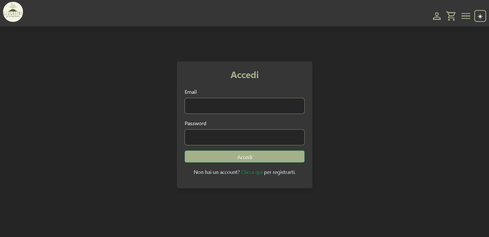

**Funzionalità per l’Amministratore**

Tramite l’interfaccia admin, l’amministratore può:
- Visualizzare e modificare alcune tabella del database (prodotti, ordini, notifichee).
- Inserire, aggiornare e cancellare prodotti dal catalogo.
- Applicare sconti e promozioni su uno o più prodotti.
- Visualizzare statistiche aggregate (ordini, fatturato, prodotti più venduti, recensioni).
- Inviare notifiche e messaggi mirati agli utenti.
- Gestire e monitorare lo stato degli ordini dei clienti.

Tutte queste operazioni sono esposte tramite apposite pagine web, che fanno uso di form HTML e tabelle dinamiche; le azioni inviano richieste ai file PHP dedicati, che effettuano l’operazione e restituiscono il risultato (anche via AJAX quando necessario per evitare reload dell’intera pagina).

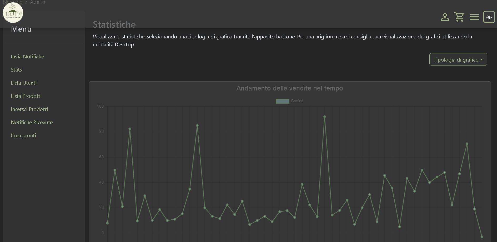

**Funzionalità per l’Utente Cliente**

Il cliente registrato può:
- Consultare e filtrare il catalogo.
- Gestire il proprio profilo, incluse informazioni di fatturazione e spedizione.
- Creare, aggiornare e svuotare il proprio carrello.
- Effettuare ordini scegliendo modalità di pagamento e inserendo/spuntando i dati di spedizione e fatturazione.
- Consultare lo storico acquisti.
- Lasciare recensioni e valutazioni sui prodotti acquistati.
- Ricevere notifiche sulla sua area riservata (ad esempio promozioni, aggiornamenti di stato ordini, ecc.).

I dati vengono gestiti in sicurezza grazie alle sessioni PHP e ai controlli sulle operazioni. L’interfaccia cliente è pensata per essere semplice, chiara e responsiva.


**Sicurezza e gestione dati sensibili**

- La gestione delle password utente avviene tramite hashing lato server.
- Le principali operazioni sono protette tramite token di sessione PHP.
- L’accesso alle operazioni di amministrazione è vincolato dal controllo del ruolo in sessione.

**Automazione e sviluppo**

Il deployment dell’intera piattaforma avviene tramite Docker Compose: con un solo comando vengono avviati 
- Il container `php-apache` (che serve l’intera logica applicativa e la parte frontend)  
- Il container MySQL (per i dati) e, se necessario, altri servizi (es. mailer per notifiche).