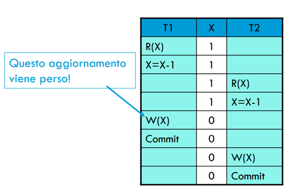
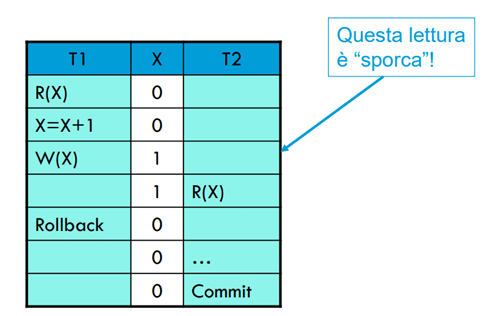
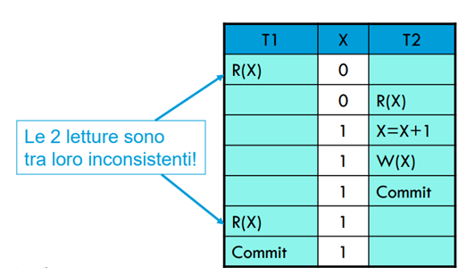

## Argomenti Teorici Basi di Dati

### Dipendenza Funzionale (FD)

**Definizione:** Una dipendenza funzionale $A \to B$ significa che per ogni coppia di tuple in una relazione, se i valori dell'attributo o dell'insieme di attributi A sono uguali, allora anche i valori dell'attributo o dell'insieme di attributi B devono essere uguali. In pratica, A *identifica univocamente* B.

**Importanza:**
*   È il concetto fondamentale su cui si basa la *normalizzazione* dei database.
*   Permette di comprendere le relazioni logiche tra gli attributi all'interno di una singola tabella.
*   È la base per identificare le chiavi candidate.

**Approfondimento:**
*   **Determinante e Determinato:** A è il *determinante*, B è il *determinato*.
*   **Chiave Candidata:** Un attributo o un insieme di attributi è una chiave candidata se determina funzionalmente *tutti* gli altri attributi della relazione e non è ridondante (è minimale).

### Forme Normali (1NF, 2NF, 3NF)

L'obiettivo delle forme normali è ridurre la ridondanza dei dati e prevenire le anomalie (di inserimento, aggiornamento, cancellazione) che possono verificarsi quando i dati non sono ben strutturati.

#### 1NF (Prima Forma Normale)

**Definizione:** Una relazione è in 1NF se tutti i domini degli attributi sono *atomici* (cioè, contengono valori indivisibili) e non ci sono *gruppi ripetuti* all'interno di una singola tupla.

**Importanza:**
*   È il requisito *minimo* per considerare una struttura come una "relazione" nel modello relazionale.
*   Permette di interrogare i dati usando SQL in modo efficiente.

**Come renderla 1NF:**
*   Trasformare la struttura creando relazioni separate per gli attributi non atomici o per i gruppi ripetuti, assicurando che ogni valore sia una singola unità indivisibile.

#### 2NF (Seconda Forma Normale)

**Definizione:** Una relazione è in 2NF se è in 1NF e ogni attributo *non primo* (che non fa parte di *nessuna* chiave candidata) dipende *completamente* da ogni chiave candidata. Ovvero, non esistono dipendenze funzionali parziali di attributi non primi da una chiave.

**Importanza:**
*   Elimina la ridondanza derivante dal fatto che un attributo dipende solo da una *parte* di una chiave composita.
*   Previene anomalie quando si aggiorna, inserisce o cancella dati che riguardano solo una parte della chiave.

**Anomalie in 2NF non rispettata:**
*   **Inserimento:** Impossibilità di inserire informazioni su un'entità identificata da una parte della chiave, senza fornire l'intera chiave.
*   **Aggiornamento:** Necessità di aggiornare lo stesso dato in più posizioni, con rischio di inconsistenza se non tutte le occorrenze vengono modificate.
*   **Cancellazione:** Perdita di informazioni su un'entità se l'ultima tupla che la contiene viene cancellata, anche se l'informazione riguardava solo una parte della chiave.

**Come renderla 2NF:**
*   Decomporre la tabella separando gli attributi che dipendono parzialmente da una chiave in una nuova relazione, utilizzando quella parte della chiave come chiave primaria della nuova relazione.

#### 3NF (Terza Forma Normale)

**Definizione:** Una relazione è in 3NF se è in 2NF e non ci sono dipendenze transitive di attributi non primi da nessuna chiave candidata. Ovvero, un attributo non primo non dipende da un altro attributo non primo che, a sua volta, dipende dalla chiave.

**Importanza:**
*   Elimina la ridondanza che si verifica quando un attributo non chiave dipende da un altro attributo non chiave.
*   Previene un altro tipo di anomalie di aggiornamento, inserimento e cancellazione.

**Anomalie in 3NF non rispettata:**
*   **Inserimento:** Impossibilità di inserire informazioni su un'entità che dipende transitivamente, finché non viene fornita una tupla completa che include l'attributo intermedio.
*   **Aggiornamento:** Necessità di aggiornare lo stesso dato in più posizioni, con rischio di inconsistenza se non tutte le occorrenze vengono modificate.
*   **Cancellazione:** Perdita di informazioni su un'entità se l'ultima tupla che la contiene viene cancellata, anche se l'informazione riguardava solo l'attributo transitivamente dipendente.

**Come renderla 3NF:**
*   Decomporre la tabella spostando gli attributi che dipendono transitivamente da una chiave in una nuova relazione, utilizzando l'attributo intermedio (da cui dipendono) come chiave primaria della nuova relazione.

**Nota su BCNF (Boyce-Codd Normal Form):** È una forma normale più restrittiva della 3NF. Una relazione è in BCNF se per ogni dipendenza funzionale $X \to Y$, $X$ è una superchiave. Questo significa che non ci sono dipendenze funzionali tra attributi non primi, né tra un attributo non primo e una chiave, né tra attributi che fanno parte di chiavi diverse. La BCNF risolve alcuni casi limite che la 3NF non copre, ma a volte può sacrificare la proprietà di "preservazione delle dipendenze". La 3NF è generalmente considerata un buon compromesso tra normalizzazione e praticità.

### Decomposizione

Quando normalizziamo una relazione, la dividiamo in relazioni più piccole. È cruciale che questa divisione sia fatta correttamente.

#### Decomposizione Senza Perdita (Lossless Decomposition)

**Definizione:** Uno schema $R(X)$ si decompone senza perdita negli schemi $R_1(X_1)$ e $R_2(X_2)$ se, per ogni istanza (stato legale) $r$ di $R$, il *natural join* delle proiezioni di $r$ su $X_1$ e $X_2$ è uguale a $r$ stessa. In altre parole, non perdiamo informazioni né introduciamo informazioni spurie (tuple che non erano nell'originale) quando ricombiniamo i dati.

**Importanza:**
*   Se una decomposizione non è senza perdita, si perdono informazioni sui dati o si introducono informazioni errate, rendendo la normalizzazione inutile o dannosa.
*   È un requisito fondamentale per qualsiasi processo di normalizzazione significativo.

**Come si Verifica (per una decomposizione binaria in $R_1$ e $R_2$):**
Una decomposizione $R(X)$ in $R_1(X_1)$ e $R_2(X_2)$ è senza perdita se e solo se:
1.  $X_1 \cup X_2 = X$ (Gli attributi originali sono tutti coperti).
2.  L'intersezione degli attributi $X_1 \cap X_2$ è una superchiave per $R_1$ (ovvero, $X_1 \cap X_2 \to X_1$ è una dipendenza funzionale)
    **OPPURE**
3.  L'intersezione degli attributi $X_1 \cap X_2$ è una superchiave per $R_2$ (ovvero, $X_1 \cap X_2 \to X_2$ è una dipendenza funzionale).

#### Decomposizione che Preserva le Dipendenze Funzionali

**Definizione:** Una decomposizione preserva le dipendenze funzionali se tutte le dipendenze funzionali originali possono essere verificate (cioè, dedotte) controllando le sole relazioni decomposte, senza la necessità di ricomporle (tramite join).

**Importanza:**
*   Garantisce l'integrità dei dati: le regole originali possono essere imposte localmente su ogni sottotabella, senza dover fare costosi join ogni volta che si vuole controllare un vincolo.
*   Facilita la validazione e il mantenimento delle proprietà del database.

**Relazione con Forme Normali:**
*   Non tutte le decomposizioni senza perdita preservano le dipendenze.
*   **La 3NF garantisce sempre una decomposizione che è sia senza perdita che preserva le dipendenze funzionali.** Questo è il motivo per cui la 3NF è spesso l'obiettivo di normalizzazione nella pratica.
*   **La BCNF garantisce sempre una decomposizione senza perdita, ma non sempre preserva le dipendenze funzionali.** Ci possono essere casi in cui, per raggiungere BCNF, si è costretti a scomporre una relazione in modo tale che alcune dipendenze funzionali originali non possano essere verificate localmente (richiedendo un join delle sottotabelle).

### Indici (B-tree e B+-tree)

Gli indici sono strutture dati usate per migliorare la velocità delle operazioni di recupero dati su una tabella, riducendo il numero di accessi al disco.

#### B-tree (Balanced Tree)

**Definizione:** Un B-tree è una struttura dati ad albero auto-bilanciata, multi-via, progettata per operare efficientemente su dispositivi di archiviazione a blocchi (come i dischi rigidi).

**Importanza:**
*   Minimizza il numero di operazioni di I/O (letture/scritture su disco) necessarie per trovare, inserire o cancellare un record. Ogni nodo di un B-tree è tipicamente grande quanto un blocco di disco.
*   Adatto per database e file system dove i dati sono su disco.
*   Garantisce tempi di ricerca, inserimento e cancellazione logaritmici.

**Regole Chiave:**
*   Tutte le foglie hanno la stessa altezza (l'albero è bilanciato).
*   Ogni nodo (eccetto la radice) ha un numero minimo e massimo di chiavi e figli, determinato dall'ordine dell'albero. Se un nodo ha `k` chiavi, avrà `k+1` puntatori ai figli.
*   La radice ha almeno 2 figli (a meno che non sia anche una foglia).

**Struttura:**
*   **Nodi interni:** Contengono chiavi e puntatori ai nodi figli, le chiavi possono già essere i valori di nostra ricerca oppure possono essere sfruttate per la ricerca binaria.
*   **Nodi foglia:** Contengono le chiavi e i puntatori ai record di dati (o i record di dati stessi).

#### B+-tree (B-plus tree)

**Definizione:** Un B+-tree è una variazione del B-tree, ottimizzata per l'archiviazione secondaria (dischi). La distinzione principale è che *tutti i dati sono memorizzati solo nei nodi foglia* che sono inoltre linkati tra loro ciò migliora decisamente le ricerche squenziali rispetto ai B-tree, mentre i nodi interni fungono esclusivamente da indice.

**Importanza (Vantaggi rispetto al B-tree):**
1.  **Migliori Performance per Range Query:** Poiché tutte le chiavi con i dati associati si trovano nelle foglie e queste sono collegate tra loro, è possibile eseguire facilmente scansioni per intervallo scorrendo orizzontalmente i nodi foglia una volta trovato il punto di inizio, senza dover risalire e scendere l'albero.
2.  **Maggiore Fattore di Diramazione (Fan-out):** I nodi interni contengono solo chiavi e puntatori, non i dati reali. Questo significa che più chiavi possono stare in un singolo blocco di disco (nodo interno), aumentando il fattore di diramazione. Un fattore di diramazione più alto porta a un albero più "basso" (meno livelli), riducendo il numero di accessi al disco necessari per una ricerca.
3.  **Separazione di Funzioni:**
    *   **Nodi interni:** Utilizzati esclusivamente per la navigazione (agiscono come una "mappa").
    *   **Nodi foglia:** Contengono tutte le chiavi (inclusi duplicati se necessario per l'indicizzazione) e i puntatori ai record di dati reali (o i record stessi se è un indice primario/clusterizzato).

**Regole (simili al B-tree, ma con distinzioni chiave):**
*   Tutte le foglie sono alla stessa altezza.
*   La radice ha almeno 2 figli (se non è una foglia).
*   Ogni nodo interno ha un numero di figli compreso tra un minimo e un massimo, come nel B-tree.
*   **Differenza fondamentale:** I nodi interni *non* contengono puntatori ai dati. Solo i nodi foglia lo fanno, e ogni chiave presente in un nodo interno deve essere presente anche in un nodo foglia.

### Anomalie di Concorrenza (Concurrency Bugs)

Quando più transazioni vengono eseguite contemporaneamente (in concorrenza), possono sorgere problemi di consistenza dei dati se non vengono applicati meccanismi di controllo della concorrenza. Queste anomalie rappresentano scenari in cui l'esecuzione concorrente non è equivalente a un'esecuzione seriale (cioè, una transazione dopo l'altra), violando la proprietà di isolamento (Isolation) delle transazioni (ACID). Di seguito le principali anomalie.

#### Lost Update (Aggiornamento Perduto)

**Definizione:** Si verifica quando due transazioni leggono lo stesso dato, lo modificano in modo indipendente e poi tentano di scriverlo. L'aggiornamento di una delle due transazioni viene sovrascritto dall'altra, risultando in una perdita permanente dell'aggiornamento iniziale.

**Importanza:** Porta a una perdita di dati e a una violazione dell'integrità del database, poiché le modifiche di una transazione non vengono riflesse nello stato finale, nonostante siano state eseguite correttamente dal punto di vista della singola transazione.

**Come si Verifica:**
1.  Una Transazione A legge il valore corrente di un dato X.
2.  Una Transazione B legge lo stesso valore corrente di X (prima che Transazione A abbia scritto la sua modifica).
3.  Transazione A calcola un nuovo valore per X e lo scrive su disco (commit).
4.  Transazione B calcola un nuovo valore per X e lo scrive su disco (commit), sovrascrivendo la modifica di Transazione A.
5.  Risultato: L'aggiornamento di Transazione A è permanentemente perso.

#### Dirty Read (Lettura Sporca / Uncommitted Dependency)

**Definizione:** Si verifica quando una transazione (Transazione B) legge un dato che è stato modificato da un'altra transazione (Transazione A) ma che non è ancora stato commitato da Transazione A. Se Transazione A in seguito esegue un rollback (annullando la sua modifica), Transazione B si ritrova ad aver basato le sue operazioni su un dato "sporco" o non valido.

**Importanza:** Causa risultati inconsistenti e potenzialmente errati per la transazione che ha effettuato la lettura sporca, poiché opera su dati che non sono mai stati resi permanenti o che sono stati successivamente annullati. Questo può portare a violazioni dell'integrità e a errori logici gravi nelle applicazioni.

**Come si Verifica:**
1.  Una Transazione A modifica un dato X e lo scrive (ma non lo committa ancora).
2.  Una Transazione B legge il valore modificato di X scritto da Transazione A.
3.  Transazione A esegue un rollback della sua operazione, annullando la modifica a X.
4.  Risultato: Transazione B ha operato su un valore di X che non è mai stato valido nello stato finale e consistente del database.

#### Unrepeatable Read (Lettura Irripetibile / Inconsistent Analysis)

**Definizione:** Si verifica quando una transazione (Transazione A) legge lo stesso dato due o più volte e ottiene valori diversi, perché nel frattempo un'altra transazione (Transazione B) ha modificato e commitato quel dato tra una lettura e l'altra di Transazione A.

**Importanza:** Porta a una visione inconsistente dei dati all'interno della stessa transazione, rendendo difficile per la transazione prendere decisioni corrette o eseguire calcoli basati su uno stato stabile del database. Può compromettere la logica applicativa che si aspetta che i dati rimangano costanti durante la sua esecuzione.

**Come si Verifica:**
1.  Una Transazione A legge un dato X.
2.  Successivamente, una Transazione B legge lo stesso dato X, lo modifica e lo committa.
3.  Transazione A tenta di leggere nuovamente lo stesso dato X.
4.  Risultato: Transazione A legge un valore diverso di X rispetto alla sua prima lettura, pur essendo all'interno della stessa transazione.

**Nota sui meccanismi di prevenzione:**
Queste anomalie vengono prevenute nei sistemi di gestione di database (DBMS) attraverso meccanismi di **Controllo della Concorrenza (Concurrency Control)**. I più comuni includono:
*   **Locking (Blocchi):** Le transazioni acquisiscono blocchi sui dati che intendono leggere o modificare, impedendo ad altre transazioni di accedere a quel dato in modo incompatibile fino al rilascio del blocco.
*   **Timestamping (Marcatura Temporale):** Ogni transazione e ogni dato hanno un timestamp. Le operazioni vengono validate in base ai timestamp per garantire la serializzabilità.
*   **Multiversion Concurrency Control (MVCC):** Mantiene più versioni di un dato, permettendo alle transazioni di leggere una versione "consistente" senza bloccarsi a vicenda, migliorando la concorrenza.

Il livello di **Isolamento della Transazione** configurato nel DBMS determina quali di queste anomalie sono permesse o prevenute, con "Serializable" che previene tutte le anomalie garantendo la completa serializzabilità.