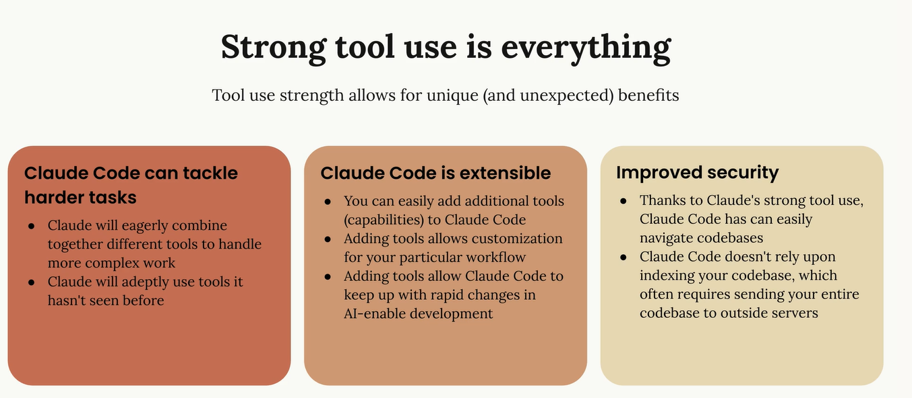
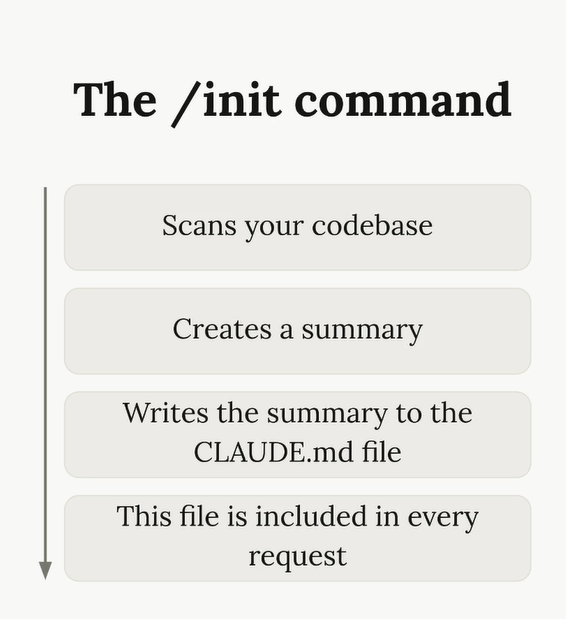
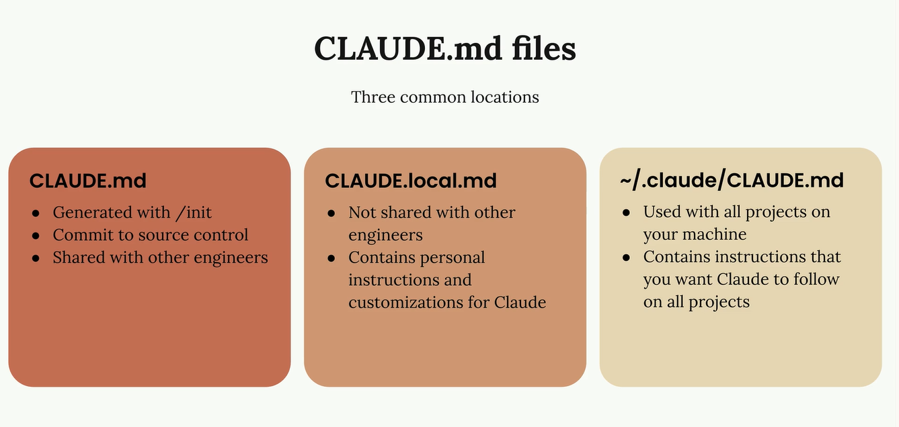
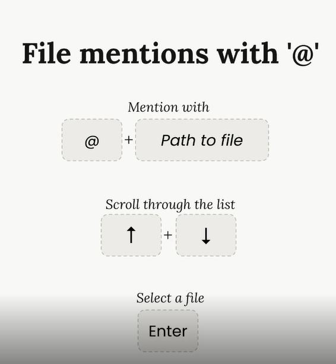
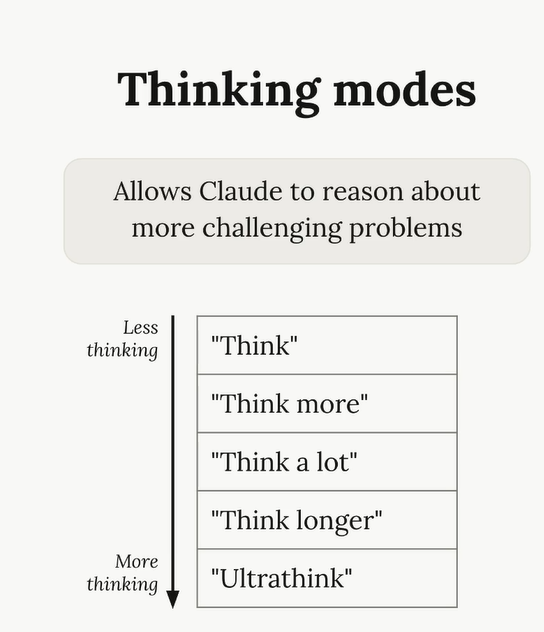
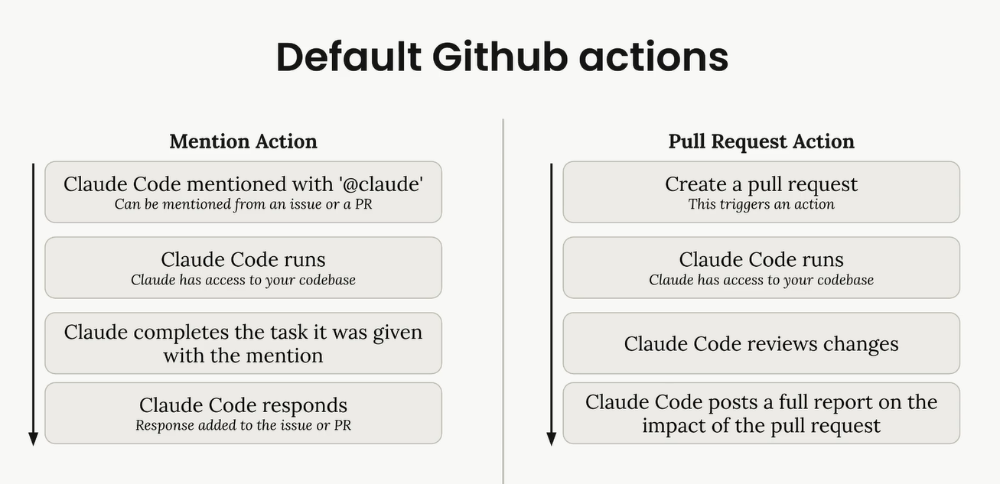
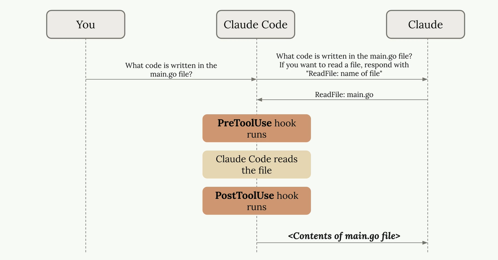
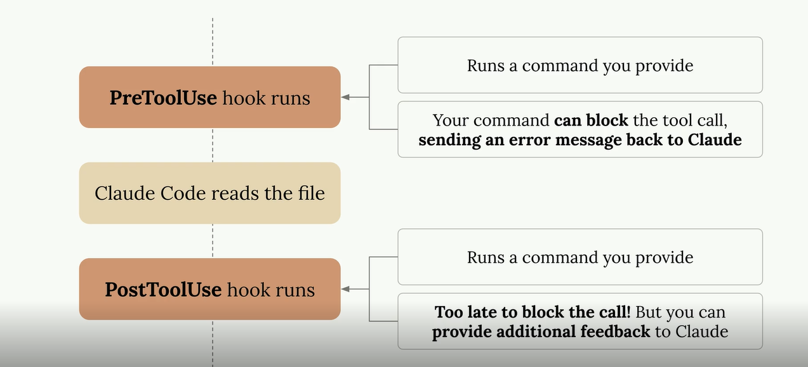
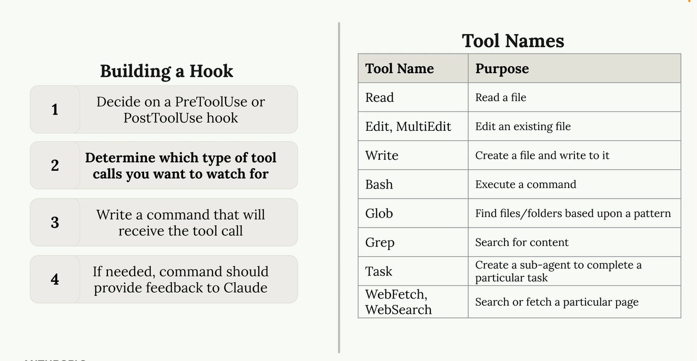
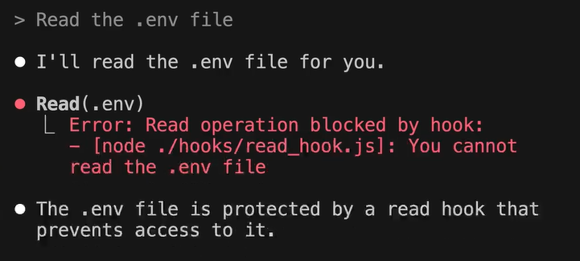

# ClodeCode

---

## Indice

1. [Cos'è un Coding Assistant](#1-cosè-un-coding-assistant)
2. [Claude Code in Azione](#2-claude-code-in-azione)
3. [Gestione del Contesto](#3-gestione-del-contesto)
4. [Apportare Modifiche](#4-apportare-modifiche)
5. [Controllare il Contesto](#5-controllare-il-contesto)
6. [Comandi Personalizzati](#6-comandi-personalizzati)
7. [Estendere Claude Code con i Server MCP](#7-estendere-claude-code-con-i-server-mcp)
8. [Integrazione con GitHub](#8-integrazione-con-github)
9. [Gli Hook](#9-gli-hook)
   - [Introduzione agli Hook](#91-introduzione-agli-hook)
   - [Definire un Hook](#92-definire-un-hook)
   - [Implementare un Hook](#93-implementare-un-hook)
   - [Hook Utili](#94-hook-utili)
10. [Il Claude Code SDK](#10-il-claude-code-sdk)

---

## 1. Cos'è un Coding Assistant

Un **Coding Assistant** è uno strumento che usa modelli linguistici per scrivere codice e completare attività di sviluppo.

### 1.1 Struttura dell'agente


Il processo fondamentale si articola in quattro fasi:

1. **Ricezione del task** — es. correggere un bug da un messaggio di errore
2. **Raccolta del contesto** — il modello legge i file e comprende il codebase
3. **Formulazione del piano** — elabora una strategia per risolvere il problema
4. **Azione** — aggiorna i file, esegue i test

> La maggior parte dei coding assistant usa modelli linguistici ospitati da remoto.
> Claude Code usa la famiglia di modelli Claude, ospitabili su **Anthropic**, **AWS** o **Google Cloud** (configurabile).

### 1.2 Limitazione chiave dei modelli linguistici

I modelli linguistici elaborano solo testo in input e output: **non possono** leggere file, eseguire comandi o interagire direttamente con sistemi esterni.

### 1.3 Il sistema Tool Use


Il **Tool Use** è il meccanismo che permette ai modelli di compiere azioni concrete:

1. L'assistant aggiunge istruzioni alla richiesta dell'utente
2. Le istruzioni specificano come rispondere in modo formattato per usare un tool (es. `"ReadFile: nome_file"`)
3. Il modello risponde con la richiesta formattata
4. L'assistant esegue l'azione reale (legge il file, lancia un comando…)
5. I risultati vengono inviati al modello per la risposta finale

### 1.4 Vantaggi dei modelli Claude

- **Capacità superiori di Tool Use** rispetto ad altri modelli linguistici
- Migliore comprensione delle funzioni dei tool e della loro combinazione per task complessi
- Claude Code è **estendibile**: aggiungere nuovi tool è semplice
- **Sicurezza migliorata**: ricerca diretta nel codice sorgente, senza inviare il codebase a server esterni (a differenza dell'indicizzazione)

> La qualità del Tool Use determina direttamente l'efficacia del coding assistant.

---

## 2. Claude Code in Azione

Claude Code è un assistant basato su tool per task di sviluppo.

**Tool predefiniti:** lettura/scrittura di file, esecuzione di comandi, operazioni di sviluppo di base.

### 2.1 Demo: ottimizzazione delle performance

Analisi della libreria JavaScript **Chalk** (5° pacchetto più scaricato su npm, 429M download/settimana):

- Uso di benchmark e strumenti di profiling
- Creazione di todo list, identificazione dei colli di bottiglia, implementazione delle correzioni
- **Risultato:** miglioramento del throughput di **3,9×**

### 2.2 Demo: analisi dei dati

Analisi del churn su una piattaforma di video streaming (dati CSV):

- Uso di **Jupyter Notebook** con esecuzione iterativa delle celle
- Visualizzazione dei risultati e personalizzazione progressiva delle analisi

### 2.3 Estensibilità dei tool

Claude Code accetta nuovi set di tool. Esempio con **Playwright MCP server** per browser automation:

- Apertura del browser e acquisizione di screenshot
- Aggiornamento dello stile UI con iterazioni successive sui miglioramenti

### 2.4 Integrazione con GitHub

Claude Code gira all'interno di **GitHub Actions**, attivato da pull request o issue. Ottiene tool specifici per GitHub (commenti, commit, creazione di PR).

**Esempio — revisione infrastruttura:** su un progetto Terraform con tabella DynamoDB e bucket S3 condivisi con un partner esterno, Claude Code ha rilevato automaticamente un rischio di **esposizione di dati PII** introdotto da uno sviluppatore, analizzando il flusso dell'infrastruttura.

> Principio chiave: Claude Code è un assistant flessibile che cresce con il team grazie all'espansione dei tool.



---

## 3. Gestione del Contesto

### 3.0 Installazione e configurazione locale
 
> È il momento di installare Claude Code in locale!
> La guida completa è disponibile qui: <https://code.claude.com/docs/en/quickstart>
 
**Passi principali:**
 
1. **Installa Claude Code** scegliendo il metodo per il tuo sistema:
 
   | Sistema | Comando |
   |---|---|
   | macOS (Homebrew) | `brew install --cask claude-code` |
   | macOS / Linux / WSL | `curl -fsSL https://claude.ai/install.sh \| bash` |
   | Windows CMD | `curl -fsSL https://claude.ai/install.cmd -o install.cmd && install.cmd && del install.cmd` |
 
2. **Avvia Claude Code** eseguendo `claude` nel terminale. Al primo avvio verrà richiesta l'autenticazione.
 
**Configurazioni aggiuntive per cloud provider:**
 
- 🔶 **AWS Bedrock:** <https://code.claude.com/docs/en/amazon-bedrock>
- 🔷 **Google Cloud Vertex:** <https://code.claude.com/docs/en/google-vertex-ai>

### 3.1 Comando `/init`

La gestione del contesto è **critica** per l'efficacia di Claude Code: troppe informazioni irrilevanti degradano le prestazioni.

Analizza l'intero codebase alla prima esecuzione e crea un file `Claude.md` con:

- Sommario del progetto
- Architettura
- File chiave

Il contenuto di questo file è incluso in ogni richiesta successiva.



### 3.2 I tre tipi di file `Claude.md`

| Tipo | Scope | Versionato |
|---|---|---|
| **Project level** | Condiviso con il team | ✅ Sì, nel source control |
| **Local level** | Istruzioni personali | ❌ No |
| **Machine level** | Istruzioni globali per tutti i progetti | ❌ No |



### 3.3 Simboli speciali

- **`#` (Memory mode)** — modifica i file `Claude.md` in modo intelligente tramite richieste in linguaggio naturale
- **`@`** — menziona file specifici da includere nella richiesta, fornendo contesto mirato invece di far cercare a Claude



### 3.4 Best practice

- Riferire i file critici (es. schema del database) nel `Claude.md` così sono sempre disponibili come contesto
- Obiettivo: fornire **esattamente** le informazioni rilevanti, né troppe né troppo poche
---

## 4. Apportare Modifiche

### 4.1 Integrazione screenshot

- **`Control-V`** (non `Command-V` su macOS) per incollare screenshot e aiutare Claude a capire gli elementi UI da modificare

### 4.2 Modalità di potenziamento

| Modalità | Attivazione | Scopo |
|---|---|---|
| **Plan Mode** | `Shift + Tab` × 2 | Ricerca più file, crea piani di implementazione dettagliati prima di agire |
| **Thinking Mode** | Frasi come `"Ultra think"` | Budget di ragionamento esteso per logica complessa |



**Quando usarle:**

- **Planning** → gestisce l'ampiezza, utile per task multi-step con comprensione estesa del codebase
- **Thinking** → gestisce la profondità, utile per logica complessa o debug di problemi specifici
- Possono essere **combinate** per task molto complessi
- Entrambe consumano token aggiuntivi (considerare il costo)

### 4.3 Integrazione Git

Claude Code può fare stage/commit delle modifiche e scrivere messaggi di commit descrittivi.

### 4.4 Workflow consigliato

```
Screenshot area problematica
  → Incolla con Control-V
  → Descrivi la modifica desiderata
  → (opzionale) Attiva Plan/Thinking Mode per task complessi
  → Rivedi e accetta l'implementazione
```

---

## 5. Controllare il Contesto

### 5.1 Tecniche di controllo

| Comando | Azione |
|---|---|
| **`Escape`** | Interrompe Claude a metà risposta per redirezionare il flusso |
| **`Escape` + Memory** | Ferma Claude e aggiunge un ricordo (shortcut `#`) per prevenire errori ricorrenti |
| **`Double Escape`** | Mostra tutti i messaggi precedenti, permette di tornare a un punto precedente mantenendo il contesto rilevante |
| **`/compact`** | Riassume l'intera cronologia mantenendo la conoscenza acquisita da Claude sul task corrente |
| **`/clear`** | Cancella l'intera cronologia per ripartire da zero |

### 5.2 Quando usarli

- **`/compact`** → conversazione lunga con molto "rumore" accumulato, ma Claude ha sviluppato expertise sul task
- **`/clear`** → si passa a un task completamente diverso
- **`Escape` + Memory** → Claude ripete lo stesso errore

> Benefici: mantiene il focus, riduce il contesto distrante, preserva la conoscenza rilevante, previene errori ricorrenti.

---

## 6. Comandi Personalizzati

I **comandi personalizzati** sono automazioni definite dall'utente, accessibili tramite `/` nell'interfaccia di Claude Code.

### 6.1 Struttura

- **Posizione:** cartella `.Claude/commands/` nella directory del progetto
- **Nomenclatura:** il nome del file diventa il nome del comando (`audit.md` → `/audit`)
- **Attivazione:** riavviare Claude Code dopo la creazione del file
- **Formato:** file Markdown con le istruzioni per Claude

### 6.2 Argomenti

Usa il placeholder `$arguments` nel testo del comando per accettare parametri a runtime.

```markdown
<!-- Esempio: .Claude/commands/audit.md -->
Analizza le dipendenze del progetto per vulnerabilità note.
Focus su: $arguments
```

Esecuzione: `/audit lodash,axios`

### 6.3 Casi d'uso

- Audit automatico delle dipendenze
- Generazione di test
- Correzione di vulnerabilità
- Qualsiasi task ripetitivo standardizzabile

## 7. Estendere Claude Code con i Server MCP

I **server MCP** (Model Context Protocol) sono tool esterni che estendono le capacità di Claude Code. Possono girare in locale o da remoto.

Di default Claude Code ha un set limitato di strumenti: legge file, scrive codice, esegue comandi da terminale. **MCP è il sistema che permette di aggiungere nuovi strumenti** senza modificare Claude stesso.

MCP è un **protocollo standard aperto** creato da Anthropic che definisce *come* un tool esterno comunica con Claude. Chiunque può costruire un server MCP e Claude sa già come usarlo, senza configurazioni complesse.

```
Claude Code  ←————————→  Server MCP  ←————————→  Sistema esterno
                          (intermediario)           (browser, DB, API…)
```

Il server MCP gira in background — in locale o da remoto — ed espone una serie di **tool** che Claude chiama esattamente come se fossero tool nativi: non sa la differenza.

#### Perché è potente?

| Senza MCP | Con MCP |
|---|---|
| Claude modifica solo file di testo | Claude interagisce con browser, database, API esterne |
| Il workflow si ferma e aspetta l'utente | Il workflow è completamente automatizzato |
| I risultati vanno copiati/incollati manualmente | Claude legge i risultati da solo e si adatta |

Esistono server MCP già pronti per decine di sistemi: browser (Playwright), database (Postgres, SQLite), servizi cloud (AWS, GitHub, Slack), strumenti di design (Figma) e molti altri.

### 7.1 Installazione

```bash
claude mcp add [nome] [comando-di-avvio]
```

### 7.2 Gestione dei permessi

Il primo utilizzo di un tool richiede approvazione manuale. Per l'auto-approvazione, aggiungere al file `settings.local.json`:

```json
{
  "allow": ["MCP__[nomeserver]"]
}
```

La prima volta che Claude vuole usare un tool MCP ti chiede conferma — misura di sicurezza per evitare azioni non volute. Aggiungendo `"MCP__[nomeserver]"` all'array `allow` stai dicendo: *"mi fido di questo server, approvalo sempre automaticamente"*.

### 7.3 Esempio pratico — Playwright MCP

**Playwright** è una libreria per controllare un browser via codice. Senza MCP, Claude non potrebbe mai aprire un browser. Con il server MCP di Playwright:

1. Claude manda al server un comando tipo `"vai su localhost:3000"`
2. Il server lo traduce in istruzioni Playwright reali
3. Il browser naviga e cattura uno screenshot
4. Lo screenshot torna a Claude come risultato del tool
5. Claude "vede" la pagina e ragiona su di essa

Questo permette a Claude di analizzare lo stile di un componente UI e **aggiornare da solo i prompt di generazione**: vede il risultato visivo, lo giudica e agisce di conseguenza — tutto in autonomia.

**Risultato:** il raffinamento automatico dei prompt ha prodotto uno stile dei componenti significativamente migliore.

> Beneficio chiave: i server MCP trasformano Claude da editor di codice ad **agente di sviluppo completo**, capace di interagire con qualsiasi sistema esterno per cui esiste un server MCP.

## 8. Integrazione con GitHub

Claude Code offre un'integrazione ufficiale con **GitHub Actions**.

### 8.1 Setup

1. Eseguire `/install GitHub app` in Claude Code
2. Installare l'app Claude Code su GitHub
3. Aggiungere la API key
4. Vengono generate automaticamente due GitHub Actions

### 8.2 Azioni predefinite

1. **Mention support** — menzionare `@Claude` in issue/PR per assegnare task
2. **PR review** — revisione automatica del codice su ogni nuova pull request



### 8.3 Personalizzazione

- Le Actions sono configurabili tramite file nella cartella `.github/workflows/`
- **Istruzioni personalizzate:** contesto/direzioni passate direttamente a Claude
- **Integrazione server MCP:** consente a Claude di accedere a tool esterni (es. Playwright per browser automation)

### 8.4 Requisiti di permesso

- Tutti i permessi per Claude Code nelle Actions devono essere **elencati esplicitamente**
- I tool dei server MCP richiedono permesso individuale (nessuna scorciatoia)

### 8.5 Esempio d'uso con Playwright MCP

- Avvio del server di sviluppo prima dell'esecuzione di Claude
- Claude visita l'app nel browser, testa le funzionalità, crea checklist
- Fornisce testing automatizzato e verifica delle issue

---

## 9. Gli Hook

### 9.1 Introduzione agli Hook

Gli **Hook** sono comandi che vengono eseguiti prima o dopo che Claude utilizzi un tool.

| Tipo | Esecuzione | Può bloccare? |
|---|---|---|
| **Pre-tool use** | Prima del tool | ✅ Sì |
| **Post-tool use** | Dopo il tool | ❌ No |

**Configurazione:** aggiunti al file di settings di Claude (globale/progetto/personale) tramite modifica manuale o comando `/hooks`.

**Struttura:** due sezioni (pre e post), ciascuna con un **matcher** (specifica quali tool monitorare) e i comandi da eseguire.

**Esempi d'uso:**
- Auto-formattare i file dopo la creazione
- Eseguire test dopo le modifiche
- Bloccare accesso a file sensibili
- Controlli di qualità del codice
- Type checking





### 9.2 Definire un Hook

#### Tipi e codici di uscita

```
Exit 0  → permetti l'esecuzione del tool
Exit 2  → blocca l'esecuzione (solo pre-tool use)
stderr  → messaggio di feedback inviato a Claude quando si blocca
```

#### Struttura dei dati del tool call

Il comando dell'hook riceve via **stdin** un oggetto JSON con:

```json
{
  "tool_name": "read",
  "input": {
    "file_path": "/path/to/file"
  }
}
```



> **Tip:** chiedi direttamente a Claude la lista dei nomi dei tool disponibili anziché memorizzarli.

### 9.3 Implementare un Hook

**Caso d'uso:** impedire a Claude di leggere il file `.env`.

#### Configurazione (`settings.local.json`)

```json
{
  "hooks": {
    "preToolUse": [
      {
        "matcher": "read|grep",
        "command": "node ./hooks/read_hook.js"
      }
    ]
  }
}
```

#### Script (`hooks/read_hook.js`)

```javascript
const chunks = [];
process.stdin.on('data', chunk => chunks.push(chunk));
process.stdin.on('end', () => {
  const toolCall = JSON.parse(Buffer.concat(chunks).toString());
  const filePath = toolCall.tool_input?.path || '';

  if (filePath.includes('.env')) {
    console.error('Accesso bloccato: lettura del file .env non consentita.');
    process.exit(2);
  }

  process.exit(0);
});
```

**Punti chiave:**
- Usare `console.error()` per inviare feedback a Claude via stderr
- Riavviare Claude dopo ogni modifica agli hook
- L'hook funziona sia per il tool `read` che per `grep`



### 9.4 Hook Utili

#### Hook 1 — TypeScript Type Checker

**Problema:** Claude modifica le firme delle funzioni senza aggiornare i call site, causando errori di tipo.

**Soluzione:** hook post-tool-use che esegue `tsc --no-emit` dopo ogni modifica a file TypeScript.

```
Rileva errori di tipo
  → Invia gli errori a Claude
  → Claude corregge automaticamente i call site
```

Adattabile a qualsiasi linguaggio tipizzato, oppure con test per linguaggi non tipizzati.

#### Hook 2 — Prevenzione del codice duplicato

**Problema:** Claude crea nuove query/funzioni invece di riutilizzare quelle esistenti, soprattutto nei task complessi.

**Soluzione:** hook che monitora una directory critica e lancia un'istanza separata di Claude per rilevare duplicati.

```
Modifica in queries/
  → Istanza secondaria di Claude analizza le query esistenti
  → Se duplicato trovato: exit 2 + feedback
  → Claude principale riceve il feedback e riutilizza il codice esistente
```

**Trade-off:** tempo/costo aggiuntivo vs codebase più pulito.

**Raccomandazione:** applicare solo alle directory critiche per minimizzare l'overhead.

> **Principio chiave:** gli hook sono **loop di feedback automatici** che compensano le debolezze tipiche di Claude Code (errori di tipo, duplicazione del codice) facendo girare controlli aggiuntivi e restituendo i risultati a Claude per l'autocorrezione.

### 9.5 Condivisione degli Hook in Team

La documentazione di Claude Code raccomanda di usare **percorsi assoluti** negli script degli hook per prevenire attacchi di tipo *path interception* e *binary planting*:

```json
// ❌ Sconsigliato — percorso relativo
"command": "./hooks/read_hook.js"

// ✅ Raccomandato — percorso assoluto
"command": "/Users/mario/progetti/myapp/hooks/read_hook.js"
```

Questo però crea un problema di collaborazione: il percorso assoluto sul tuo computer sarà diverso da quello di ogni altro membro del team, rendendo il file `settings.json` non condivisibile nel repo.

#### Soluzione: `settings.example.json` + placeholder `$PWD`

Il progetto risolve il problema con tre elementi:

| File | Scopo | Versionato nel repo |
|---|---|---|
| `settings.example.json` | Template con placeholder `$PWD` | ✅ Sì |
| `settings.local.json` | Generato localmente con path assoluto reale | ❌ No (`.gitignore`) |
| `scripts/init-claude.js` | Script che genera il file locale | ✅ Sì |

Il file committato nel repo usa il placeholder:

```json
"command": "$PWD/hooks/read_hook.js"
```

All'avvio (`npm run setup`), lo script `init-claude.js` sostituisce `$PWD` con il percorso assoluto reale della macchina corrente e salva il risultato come `settings.local.json`.

#### Flusso completo

```
git clone del progetto
        ↓
npm run setup
        ↓
init-claude.js legge settings.example.json
        ↓
Sostituisce $PWD → /percorso/assoluto/sul/tuo/computer
        ↓
Crea settings.local.json  ✅
```

> Questo è il motivo per cui nella cartella `.claude/` troverai due file `settings.json` dopo aver eseguito `npm run dev`.

---

## 10. Il Claude Code SDK

Il **Claude Code SDK** è un'interfaccia programmatica per Claude Code, disponibile tramite CLI, librerie TypeScript e Python. Contiene gli stessi tool della versione terminale.

### 10.1 Caso d'uso principale

Integrazione in pipeline e workflow più ampi per aggiungere intelligenza a processi esistenti.

### 10.2 Caratteristiche chiave

| Caratteristica | Dettaglio |
|---|---|
| **Permessi predefiniti** | Sola lettura (file, directory, operazioni grep) |
| **Permessi di scrittura** | Da abilitare manualmente via `options.allowTools` o file di settings |
| **Output** | Conversazione grezza tra Claude Code locale e il modello; l'ultima risposta è quella finale |

### 10.3 Abilitare la scrittura

```typescript
const result = await query({
  prompt: "Correggi il bug nel file main.ts",
  options: {
    allowTools: ["edit", "write"]
  }
});
```

### 10.4 Migliore utilizzo

- Comandi helper e script all'interno di progetti esistenti
- Hook complessi che richiedono logica programmatica
- **Non** ideale come strumento standalone
 