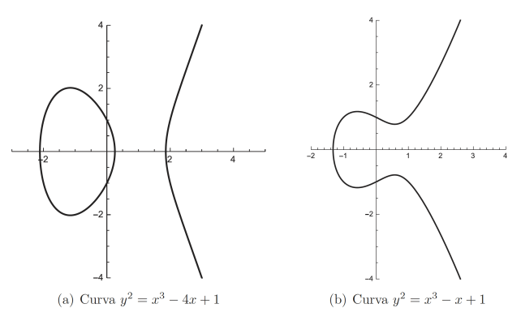
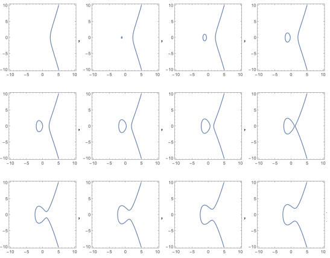
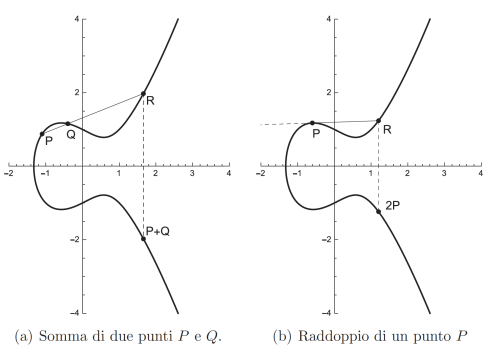

# Crittografia

- [Crittografia](#crittografia)
  - [Introduzione alla Crittografia](#introduzione-alla-crittografia)
    - [Dilemma Etico](#dilemma-etico)
    - [Crittologia](#crittologia)
    - [Cifratura e Decifratura](#cifratura-e-decifratura)
    - [Ruolo del Crittoanalista](#ruolo-del-crittoanalista)
    - [Tipologie di Cifrari](#tipologie-di-cifrari)
      - [Cifrari per Uso Ristretto](#cifrari-per-uso-ristretto)
      - [Cifrari per Uso Generale](#cifrari-per-uso-generale)
      - [Cifrari a Chiave Segreta o Simmetrici](#cifrari-a-chiave-segreta-o-simmetrici)
      - [Spazio delle Chiavi e Attacchi Esaustivi](#spazio-delle-chiavi-e-attacchi-esaustivi)
    - [La Chiave Pubblica](#la-chiave-pubblica)
      - [Funzionamento della Chiave Pubblica](#funzionamento-della-chiave-pubblica)
    - [Funzioni One-Way con Trap-Door](#funzioni-one-way-con-trap-door)
      - [Esempio di Funzione One-Way](#esempio-di-funzione-one-way)
    - [Applicazioni della Crittografia](#applicazioni-della-crittografia)
  - [Complessità computazionale](#complessità-computazionale)
    - [Tabella delle cifre di alcune funzioni](#tabella-delle-cifre-di-alcune-funzioni)
    - [Facile vs Difficile](#facile-vs-difficile)
  - [Cifrari e sicurezza](#cifrari-e-sicurezza)
    - [Modello Matematico della Crittografia](#modello-matematico-della-crittografia)
  - [Cifrario Perfetto (Shannon)](#cifrario-perfetto-shannon)
    - [Dimostrazione del numero minimo di chiavi in un cifrario perfetto](#dimostrazione-del-numero-minimo-di-chiavi-in-un-cifrario-perfetto)
    - [One-Time Pad](#one-time-pad)
      - [Funzionamento:](#funzionamento)
      - [Esempio](#esempio)
      - [Dimostrazione della Perfezione del One-Time Pad](#dimostrazione-della-perfezione-del-one-time-pad)
      - [Minimalità dell’insieme delle chiavi](#minimalità-dellinsieme-delle-chiavi)
      - [Limiti del One-Time Pad](#limiti-del-one-time-pad)
  - [Bit Casuali e Sequenze di Bit](#bit-casuali-e-sequenze-di-bit)
    - [Definizioni di Casualità](#definizioni-di-casualità)
      - [Concetti Storici e Teorici](#concetti-storici-e-teorici)
      - [Casualità in Crittografia](#casualità-in-crittografia)
    - [Generatori di Numeri Pseudo-Casuali](#generatori-di-numeri-pseudo-casuali)
    - [Generatori Deterministici](#generatori-deterministici)
      - [Generatore Lineare](#generatore-lineare)
      - [Generatore Polinomiale](#generatore-polinomiale)
      - [Generatori Basati su Funzioni One-Way](#generatori-basati-su-funzioni-one-way)
      - [Predicati Hard-Core](#predicati-hard-core)
      - [Generatore Blum, Blum e Shub (BBS)](#generatore-blum-blum-e-shub-bbs)
    - [Sicurezza e Prestazioni](#sicurezza-e-prestazioni)
  - [Generatori Basati su Crittografia Simmetrica](#generatori-basati-su-crittografia-simmetrica)
    - [Descrizione](#descrizione)
    - [Procedura del Generatore](#procedura-del-generatore)
  - [Confusione e Diffusione](#confusione-e-diffusione)
  - [DES: Un Esempio di Cifrario Simmetrico](#des-un-esempio-di-cifrario-simmetrico)
    - [Origini e Sviluppo](#origini-e-sviluppo)
    - [Struttura](#struttura)
    - [Le S-box del DES](#le-s-box-del-des)
      - [Linearità e Non Linearità](#linearità-e-non-linearità)
    - [Attacchi al DES](#attacchi-al-des)
  - [Protocolli a Chiave Pubblica](#protocolli-a-chiave-pubblica)
    - [Le Chiavi nei Cifrari](#le-chiavi-nei-cifrari)
      - [Cifrari Simmetrici vs Asimmetrici](#cifrari-simmetrici-vs-asimmetrici)
      - [Asimmetria](#asimmetria)
    - [Proprietà dei Cifrari a Chiave Pubblica](#proprietà-dei-cifrari-a-chiave-pubblica)
    - [Funzioni One-Way e Trap-Door](#funzioni-one-way-e-trap-door)
      - [Funzione di Eulero](#funzione-di-eulero)
      - [Funzioni One-Way con Trap-Door in Matematica](#funzioni-one-way-con-trap-door-in-matematica)
    - [Vantaggi dei Protocolli a Chiave Pubblica](#vantaggi-dei-protocolli-a-chiave-pubblica)
    - [Difetti dei Protocolli a Chiave Pubblica](#difetti-dei-protocolli-a-chiave-pubblica)
    - [Cifrario Proposto da Merkle](#cifrario-proposto-da-merkle)
  - [Cifrario RSA](#cifrario-rsa)
    - [Creazione delle Chiavi](#creazione-delle-chiavi)
    - [Messaggio, Codifica e Decodifica](#messaggio-codifica-e-decodifica)
    - [Correttezza](#correttezza)
    - [Generazione di un Primo Grande](#generazione-di-un-primo-grande)
      - [Test di Primalità](#test-di-primalità)
    - [Come Generare $e$ e $d$](#come-generare-e-e-d)
    - [Operazioni di Codifica e Decodifica](#operazioni-di-codifica-e-decodifica)
    - [Algoritmi di Euclide](#algoritmi-di-euclide)
      - [Algoritmo di Euclide per il Massimo Comune Divisore (MCD)](#algoritmo-di-euclide-per-il-massimo-comune-divisore-mcd)
      - [Algoritmo di Euclide Esteso](#algoritmo-di-euclide-esteso)
    - [Cifrari Ibridi](#cifrari-ibridi)
  - [Diffie-Hellman](#diffie-hellman)
    - [Generazione di una Chiave Segreta Condivisa](#generazione-di-una-chiave-segreta-condivisa)
    - [Sicurezza del Protocollo](#sicurezza-del-protocollo)
    - [Logaritmo Discreto](#logaritmo-discreto)
    - [Attacco Man-in-the-Middle](#attacco-man-in-the-middle)
  - [Taher ElGamal](#taher-elgamal)
    - [Campo Finito](#campo-finito)
      - [Esempio di Campo Finito](#esempio-di-campo-finito)
    - [Generatore di un Campo Finito](#generatore-di-un-campo-finito)
      - [Esempio di Generatore](#esempio-di-generatore)
    - [Campo da Gioco](#campo-da-gioco)
    - [Generazione delle Chiavi](#generazione-delle-chiavi)
    - [Codifica](#codifica)
    - [Decodifica](#decodifica)
    - [Correttezza](#correttezza-1)
    - [Sicurezza](#sicurezza)
  - [Curve Ellittiche](#curve-ellittiche)
    - [Campo](#campo)
    - [Curva Ellittica](#curva-ellittica)
    - [Intersezione tra Curve Ellittiche e Rette](#intersezione-tra-curve-ellittiche-e-rette)
    - [Addizione su Curve Ellittiche](#addizione-su-curve-ellittiche)
    - [Curve Ellittiche su un Campo Finito](#curve-ellittiche-su-un-campo-finito)
      - [Curve Ellittiche su $\\mathbb{Z}\_p$](#curve-ellittiche-su-mathbbz_p)
    - [Curve Ellittiche Binarie](#curve-ellittiche-binarie)
    - [Logaritmo Discreto su Curve Ellittiche](#logaritmo-discreto-su-curve-ellittiche)
    - [Scambio di Chiavi su Curve Ellittiche](#scambio-di-chiavi-su-curve-ellittiche)
    - [Sicurezza del Protocollo](#sicurezza-del-protocollo-1)
    - [Scambio di Messaggi su Curve Ellittiche](#scambio-di-messaggi-su-curve-ellittiche)
    - [Algoritmo di Koblitz](#algoritmo-di-koblitz)
    - [Sicurezza e Lunghezza delle Chiavi](#sicurezza-e-lunghezza-delle-chiavi)

## Introduzione alla Crittografia
- **Definizione**: La crittografia è l'arte della "scrittura nascosta", utilizzata per proteggere le comunicazioni.
- **Contesto**: Esistono due gruppi opposti: chi desidera comunicare in privato e chi cerca di intercettare queste comunicazioni, sia per curiosità, investigazione legittima, o scopi malevoli.

### Dilemma Etico
- **Buoni vs Cattivi**: La distinzione tra chi è "buono" e chi è "cattivo" è complessa e dipende dal contesto. Chi cifra le comunicazioni può essere visto come buono, ma anche chi cerca di intercettarle può avere motivazioni legittime.

### Crittologia
- **Definizione**: La crittologia comprende sia la crittografia (cifratura) che la crittoanalisi (decifratura).
- **Obiettivo**: Proteggere la comunicazione tra un mittente (Mitt) e un destinatario (Dest) su un canale insicuro.

### Cifratura e Decifratura
- **Processo**: 
  - Cifratura: Trasformazione di un messaggio in chiaro (m) in un crittogramma (c) tramite una funzione C.
  - Decifratura: Recupero del messaggio originale (m) dal crittogramma (c) tramite una funzione D.
- **Relazione**: D(C(m)) = m; C e D sono funzioni inverse.
- Si deduce che C debba essere iniettiva.

### Ruolo del Crittoanalista
- **Obiettivi**: Il crittoanalista può cercare di scoprire, alterare o disturbare la comunicazione.
- **Tipi di Attacchi**:
  - **Cipher Text Attack**: Analisi di crittogrammi noti.
  - **Known Plain-Text Attack**: Conoscenza di coppie di messaggi in chiaro e crittogrammi.
  - **Chosen Plain-Text Attack**: Scelta di messaggi in chiaro da cifrare.
  - **Man in-the-middle Attack**: Intercettazione e modifica dei messaggi tra due utenti.

### Tipologie di Cifrari
La crittografia si divide in diverse categorie a seconda dell'uso e della segretezza delle funzioni di cifratura e decifratura. Le principali tipologie di cifrari sono:

#### Cifrari per Uso Ristretto
Questi cifrari sono utilizzati in contesti sensibili, come le comunicazioni diplomatiche o militari. In questo caso, sia le funzioni di cifratura (C) che di decifratura (D) sono mantenute segrete in ogni loro aspetto. Questo approccio garantisce un alto livello di sicurezza, poiché solo le parti autorizzate conoscono i metodi utilizzati per proteggere le informazioni.

#### Cifrari per Uso Generale
A differenza dei cifrari per uso ristretto, in quelli per uso generale le funzioni di cifratura e decifratura sono pubblicamente note. In questo scenario, viene utilizzata una chiave segreta (k) diversa per ogni coppia di utenti. La chiave è inserita come parametro nelle funzioni C e D. Anche se un intruso conosce le funzioni e ha accesso a un crittogramma (c) carpito su un canale insicuro, non può estrarre informazioni utili sul messaggio originale (m) senza conoscere la chiave segreta.

#### Cifrari a Chiave Segreta o Simmetrici
Nei cifrari a chiave segreta, la cifratura e la decifratura avvengono tramite le funzioni:
- C(m; k) per la cifratura
- D(c; k) per la decifratura

È necessario un canale sicuro per lo scambio della chiave. Mantenere segreta la chiave è più semplice rispetto a mantenere segreto l'intero processo di cifratura e decifratura. Tutti gli utenti possono utilizzare le funzioni pubbliche C e D, a condizione di scegliere chiavi diverse. Se un crittoanalista riesce a ottenere una chiave, è sufficiente generarne una nuova per mantenere la sicurezza delle comunicazioni.

#### Spazio delle Chiavi e Attacchi Esaustivi
Lo spazio delle chiavi (KEY) deve essere ampio per garantire la sicurezza. Se il crittoanalista conosce o può indovinare lo spazio delle chiavi, può tentare un attacco esaustivo, verificando ogni possibile chiave k per decifrare il messaggio.

### La Chiave Pubblica
Nel 1976, la crittografia ha subito una svolta significativa con l'introduzione della crittografia a chiave pubblica da parte di Diffie e Hellman, e indipendentemente da Merkle. Questo sistema elimina la necessità di condividere una chiave segreta tra mittente e destinatario.

#### Funzionamento della Chiave Pubblica
Nella crittografia a chiave segreta, due utenti utilizzano la stessa chiave (k) per cifrare e decifrare i messaggi. Al contrario, nella crittografia a chiave pubblica, si utilizzano due chiavi diverse: 
- k[pub] per la cifratura (pubblica e nota a tutti)
- k[prv] per la decifratura (privata e nota solo al destinatario)

Le funzioni C e D sono di pubblico dominio e identiche per tutti gli utenti. Questo rende la cifratura accessibile a chiunque, mentre la decifratura è riservata a chi possiede la chiave privata. I sistemi a chiave pubblica sono definiti asimmetrici, mentre quelli a chiave segreta sono simmetrici.

### Funzioni One-Way con Trap-Door
In un sistema a chiave pubblica, la funzione di cifratura C deve avere una proprietà nota come "one-way con trap-door". Questo significa che calcolare C per cifrare un messaggio deve essere facile, mentre calcolare D per decifrare deve essere difficile, a meno che non si conosca un meccanismo segreto (trap-door) che semplifichi il calcolo.

#### Esempio di Funzione One-Way
Un esempio classico è il prodotto di due numeri primi p e q. Calcolare il loro prodotto n è semplice, ma fattorizzare n per ottenere p e q è difficile, a meno che non si conosca uno dei due numeri.

### Applicazioni della Crittografia
La segretezza delle comunicazioni è fondamentale, ma non è l'unica caratteristica richiesta ai sistemi crittografici moderni. Tre requisiti importanti nelle applicazioni su rete sono:

1. **Identificazione**: Permette al sistema di verificare l'identità di chi richiede accesso ai suoi servizi.
2. **Autenticazione**: Consente al destinatario di accertare che un messaggio sia stato effettivamente inviato dal mittente e che non sia stato modificato durante la trasmissione.
3. **Firma Digitale**: Garantisce che il mittente non possa negare la paternità di un messaggio inviato, permettendo al destinatario di dimostrare a terzi che il messaggio è stato effettivamente inviato.

## Complessità computazionale

### Tabella delle cifre di alcune funzioni
| n        | log2(n) | n  | n^2  | n^5  | 2^n       | n!          |
|----------|---------|----|------|------|-----------|-------------|
| 1        | 1       | 1  | 1    | 1    | 1         | 1           |
| 100,000  | 2       | 6  | 11   | 26   |  30 103   | 500 001     |
| 500,000  | 2       | 6  | 12   | 29   |  150 515  | 2 849486    |
| 1,000,000| 2       | 7  | 13   | 31   | 301 030   | 6 000 001   |

- Prima colonna valore dell'input altre colonne numero di cifre per rappresentare l'output.

| n    | log2(n) | n   | n^2       | n^5          | 2^n       |
|------|---------|-----|-----------|--------------|-----------|
| 10   | 3       | 10  | 100       | 100,000      | 1,024     |
| 100  | 6       | 100 | 10,000    | 10^10        | x         |
| 1000 | 9       | 1000| 1,000,000 | 10^15        | y         |

Dove:
- x = 1.2676506002282294 × 10^30
- y = 1.0715086071862673 × 10^300

- Prima colonna lunghezza dell'input altre colonne passi per arrivare all'output.

Secondo alcune stime, il Sole si spegnerà tra 4 miliardi di anni, ovvero tra 1.26 × 10^23 microsecondi.

- **Fattorizzazione di numeri**
  - **Input**: $n = p_1^{k_1} \cdot \ldots \cdot p_m^{k_m}$
  - **Output**: $p_1, k_1, \ldots, p_m, k_m$
  - Numero di cifre di n in base b: $\log_b(n)$
  - Miglior algoritmo noto: **$T(n) = e^{\left( \frac{64}{9} \right)^{1/3} \cdot (\ln(n) \cdot \ln(\ln(n)))^{2/3}}$**
  - Se n ha 3000 cifre binarie, **$T(n) \approx 9.31 \times 10^{50}$**, un tempo inaccettabile con la tecnologia attuale.

- **Elevamento a potenza e Logaritmo**
  - **Elevamento a potenza**: dati $b$ e $c$, calcolare $a = b^c$.
  - **Logaritmo**: dati $a$ e $b$, calcolare $c$ tale che $a = b^c$.
  - Nei numeri reali, il logaritmo è facile da calcolare.
  - Sia $p$ un numero primo.
  - $Z_p = \{1, \ldots, p-1\}$ è il gruppo degli interi modulo $p$ con moltiplicazione.
  - Dati $a, b, c \in Z_p$:
    - $a = b^c \mod p$ (facile)
    - Dato $a$ e $b$, trovare $c$ è difficile.
  
  **Esempio:**
  - $p = 17$
  - $Z_{17} = \{1, \ldots, 16\}$
  - $13 = 3^4 \mod 17$ (facile)
  - Dato $13$ e $3$, trovare $4$ è difficile (logaritmo discreto).

### Facile vs Difficile
- **Facile**: problemi risolvibili in tempo polinomiale.
- **Difficile**: problemi che richiedono tempo esponenziale e per cui non si conoscono algoritmi polinomiali.
- **Impossibile**: problemi senza soluzione algoritmica.

Alcune equazioni, come le **equazioni diofantee**, non hanno algoritmi risolutivi.
Esempio:
$$3x^2 - 7y^2 - z^3 = 18$$
$$7y^2 + 8z^2 = 0$$
Non esiste un algoritmo generale per risolvere queste equazioni per numeri interi.

## Cifrari e sicurezza

Esistono cifrari che offrono sicurezza assoluta, ma il loro costo è proibitivo, limitandone l'uso a comunicazioni estremamente riservate detti **cifrari inviolabili**. Mentre i **cifrari pratici** sono cifrari non perfetti, ma sufficientemente sicuri ed efficienti, vengono impiegati nelle comunicazioni quotidiane.

### Modello Matematico della Crittografia
La comunicazione tra Mitt (mittente) e Dest (destinatario) è modellata come un processo stocastico:
- $M$ è una variabile aleatoria che rappresenta il messaggio inviato.
- $C$ è la variabile aleatoria che rappresenta il crittogramma trasmesso.
- $Pr(M = m)$ indica la probabilità che venga inviato il messaggio $m$.
- $Pr(M = m | C = c)$ rappresenta la probabilità a posteriori che $m$ sia stato inviato dato il crittogramma $c$.
- **Scenario peggiore**: Il crittoanalista che ha intercettato c è in possesso di tutta l’informazione possibile sul sistema tranne la chiave
segreta. In particolare egli conosce la distribuzione di probabilità con cui Mitt genera i messaggi, il cifrario utilizzato e lo spazio Key delle chiavi.

## Cifrario Perfetto (Shannon)
Un cifrario è perfetto se: $$Pr(M = m | C = c) = Pr(M = m)$$. Questo implica che osservare $C$ non fornisce alcuna informazione su $M$. Ne risulta che il numero di chiavi $N_k$ deve essere almeno pari al numero di messaggi $N_m$: Se $N_m > N_k$, esiste almeno un messaggio $m$ che non può essere ottenuto, violando la perfezione del cifrario.

### Dimostrazione del numero minimo di chiavi in un cifrario perfetto  

Consideriamo un sistema crittografico in cui:  
- **Nm** è il numero totale di messaggi possibili, ovvero quelli per cui la probabilità di essere inviati non è nulla: $Pr(M = m) > 0$.  
- **Nk** è il numero totale di chiavi disponibili nel sistema.  

- **Assunzione per assurdo**
Supponiamo, per assurdo, che il numero di messaggi sia maggiore del numero di chiavi:  
$$
Nm > Nk
$$  
Questo significa che abbiamo più messaggi possibili di quanti siano gli elementi nello spazio delle chiavi segrete.  

- **Analisi della decifrabilità**
Quando un crittogramma $c$ viene intercettato, sappiamo che esso può essere stato generato cifrando diversi messaggi con le diverse chiavi. Se abbiamo **Nk** chiavi, allora il numero massimo di messaggi che possiamo ottenere decifrando $c$ con tutte le chiavi possibili è al massimo **Nk**.  

Tuttavia, poiché abbiamo assunto che **Nm > Nk**, questo significa che esistono più messaggi possibili di quanti ne possiamo effettivamente ottenere dalla decifratura di qualsiasi crittogramma.  

- **Contraddizione** 
Dato che **Nk** è minore di **Nm**, esisterà almeno un messaggio $m$ tale che **non** può essere ottenuto a partire da un dato crittogramma $c$. In termini matematici, significa che la probabilità condizionata di $m$ dato $c$ è nulla:  
$$
Pr(M = m | C = c) = 0
$$  
Ma, per definizione di un **cifrario perfetto**, la probabilità condizionata $Pr(M = m | C = c)$ deve essere esattamente uguale alla probabilità a priori $Pr(M = m)$, ovvero la conoscenza del crittogramma **non** deve alterare la probabilità di ogni messaggio.  

Dal momento che abbiamo trovato un caso in cui questa proprietà non vale, abbiamo raggiunto una contraddizione.  

- **Conclusione** 
Poiché l’assunzione $Nm > Nk$ porta a una contraddizione con la definizione di cifrario perfetto, ne segue che per avere un cifrario perfetto dobbiamo avere almeno altrettante chiavi quanti sono i messaggi possibili:  
$$
Nk \geq Nm
$$  
Questo risultato dimostra che, in un cifrario perfetto, lo spazio delle chiavi deve essere **almeno grande quanto** lo spazio dei messaggi, rendendo il suo utilizzo pratico estremamente oneroso in termini di gestione delle chiavi.

### One-Time Pad
Un cifrario perfetto ideato da Mauborgne e Vernam nel 1917, usato in comunicazioni segrete.

#### Funzionamento:
- **Generazione della chiave**: una sequenza casuale $k$ lunga almeno quanto il messaggio.
- **Cifratura**: $c_i = m_i \oplus k_i$ per ogni bit $i$.
- **Decifratura**: $m_i = c_i \oplus k_i$, poiché $k_i \oplus k_i = 0$.

#### Esempio
| msg  | 0 | 1 | 1 | 0 | 0 | 1 |
|------|---|---|---|---|---|---|
| key  | 1 | 1 | 0 | 1 | 0 | 1 |
| c    | 1 | 0 | 1 | 1 | 0 | 0 |
| key  | 1 | 1 | 0 | 1 | 0 | 1 |
| msg  | 0 | 1 | 1 | 0 | 0 | 1 |

#### Dimostrazione della Perfezione del One-Time Pad

- **Assunzioni**  
Per semplificare l’analisi, assumiamo che:  
- Tutti i messaggi abbiano la stessa lunghezza $n$ bit.  
- Tutte le possibili sequenze di $n$ bit siano messaggi validi.  

Il **One-Time Pad** è un sistema crittografico che utilizza una chiave generata in modo completamente casuale, lunga quanto il messaggio, e usata una sola volta. Dimostreremo che è un **cifrario perfetto**, ovvero soddisfa la proprietà:  

$$
Pr(M = m \mid C = c) = Pr(M = m)
$$  

che implica che la conoscenza del crittogramma **non fornisce alcuna informazione** sul messaggio originale.  

- **Espansione della probabilità condizionata**  
Utilizziamo la definizione di probabilità condizionata per riscrivere l’uguaglianza da dimostrare:  

$$
Pr(M = m \mid C = c) = \frac{Pr(M = m, C = c)}{Pr(C = c)}
$$  

dove $Pr(M = m, C = c)$ è la probabilità che il messaggio sia $m$ e il crittogramma sia $c$, mentre $Pr(C = c)$ è la probabilità che il crittogramma assuma il valore $c$.  

- **Probabilità congiunta $Pr(M = m, C = c)$**
L’evento $\{ M = m, C = c \}$ descrive la situazione in cui l’utente mittente ha scelto il messaggio $m$ e lo ha cifrato ottenendo $c$.  

Nel One-Time Pad, la cifratura è definita come:  
$$
C = M \oplus K
$$  
dove $K$ è una chiave segreta, generata in modo completamente casuale e lunga $n$ bit.  

Poiché il **XOR** ha la proprietà di essere una funzione **biunivoca**, ogni chiave diversa genera un crittogramma diverso per lo stesso messaggio. Dato che la chiave viene scelta in modo uniforme tra $2^n$ possibili valori, ogni chiave ha probabilità:  
$$
Pr(K = k) = \frac{1}{2^n}
$$  

Fissato un messaggio $m$, la probabilità di ottenere un determinato crittogramma $c$ è quindi anch’essa:  
$$
Pr(C = c) = \frac{1}{2^n}
$$  

e questa probabilità è **costante e indipendente da** $m$.  

- **Indipendenza tra $M$ e $C$**
  
Dal momento che ogni crittogramma è generato con probabilità costante indipendentemente dal messaggio, gli eventi $M = m$ e $C = c$ sono **statisticamente indipendenti**, quindi:  

$$
Pr(M = m, C = c) = Pr(M = m) \cdot Pr(C = c)
$$  

Sostituendo nella formula iniziale:  

$$
Pr(M = m \mid C = c) = \frac{Pr(M = m) \cdot Pr(C = c)}{Pr(C = c)}
$$  

semplificando $Pr(C = c)$, otteniamo:  

$$
Pr(M = m \mid C = c) = Pr(M = m)
$$  

che dimostra che il One-Time Pad è un **cifrario perfetto**, poiché il crittogramma non fornisce alcuna informazione sul messaggio originale.  

#### Minimalità dell’insieme delle chiavi

Affinché un cifrario sia perfetto, abbiamo visto nella dimostrazione precedente che il numero di chiavi deve essere **almeno pari al numero di messaggi possibili**.  

Nel caso del One-Time Pad:  
- Il numero di messaggi possibili di $n$ bit è $2^n$.  
- Il numero di chiavi possibili è anch’esso $2^n$.  

Poiché il numero di chiavi non può essere inferiore al numero di messaggi per mantenere la perfetta segretezza, e nel One-Time Pad è **esattamente** pari al numero di messaggi, possiamo concludere che il One-Time Pad utilizza il **numero minimo di chiavi necessario** per garantire la perfezione crittografica.

#### Limiti del One-Time Pad
- **Sicurezza massima**, ma **gestione complessa**.
- Le chiavi devono essere lunghe quanto il messaggio.
- Una chiave può essere usata **una sola volta** per mantenere la sicurezza.

## Bit Casuali e Sequenze di Bit

Un bit casuale è una cifra binaria che può assumere il valore 0 o 1 con probabilità equiprobabile, ossia:
  $$Pr(bit = 0) = Pr(bit = 1) = \frac{1}{2}.$$
Il concetto sembra semplice, ma la sfida sta nel generare intere sequenze in cui ogni bit sia casuale e, soprattutto, indipendente dagli altri.

Si considerino, ad esempio, le sequenze:  
  • 1111111111  
  • 1010011010  
Anche se entrambe hanno la stessa probabilità di verificarsi (se i bit sono indipendenti, la probabilità di ottenere una specifica sequenza di 10 bit è $\frac{1}{2^{10}}$), la percezione di casualità può variare.  
Un'altra sequenza, ad esempio:  
$$
s = 1100100100001111110110101010001000\ldots
$$  
potrebbe essere riconosciuta come casuale se si osserva che corrisponde alle prime cifre binarie di una costante nota.  
La sfida è definire in modo univoco cosa significhi che una sequenza sia "casuale".

### Definizioni di Casualità

#### Concetti Storici e Teorici
- **Laplace (1819):**  
  Nei lanci consecutivi di una moneta, anche se ogni singolo lancio è equiprobabile, sequenze regolari (come cento volte "testa") sono considerate eventi straordinari poiché tra tutte le possibili combinazioni le sequenze irregolari sono molto più numerose.

- **Kolmogorov:**  
  Una sequenza binaria $h$ si definisce casuale se non esiste alcun algoritmo $A$ in grado di generarla la cui rappresentazione binaria sia più corta della sequenza stessa. In altre parole, il modo più "economico" per definire una sequenza casuale è proprio assegnare la sequenza, il che implica che le sequenze prodotte da una procedura fissa non possono essere casuali in senso Kolmogorov se sono di lunghezza superiore alla descrizione della procedura stessa.

#### Casualità in Crittografia
In crittografia, “casuale” equivale a "non facilmente prevedibile". Per questo motivo non esistono generatori di bit perfettamente casuali; in pratica si ricorre a generatori di bit pseudo‐casuali, i quali devono superare specifici test statistici per essere ritenuti adeguati.

### Generatori di Numeri Pseudo-Casuali

Un generatore di numeri pseudo-casuali (PRNG) è un algoritmo deterministico che, partendo da un valore iniziale (il seme), produce una sequenza di bit che appare casuale. Esso avendo numero di stati possibili finito arriverà prima o poi a ripetersi, la qualità di questi algoritmi è proprio quella di ripetersi dopo tantissimo ovvero ci mettono molto ad **andare in ciclo**.  
- Stesso seme → Stessa sequenza.
- Lo scopo è infatti "amplificare" la casualità: un seme di lunghezza $m$ viene espanso in una sequenza di lunghezza $n$ con $n \gg m$.  
  Tuttavia, il numero di possibili sequenze è al massimo $2^m$, molto inferiore al numero totale di sequenze possibili di lunghezza $n$, cioè $2^n$.

Per valutare se una sequenza ha proprietà di casualità, vengono utilizzati vari test:
- **Test di frequenza:** Verifica che 0 e 1 compaiano, in media, lo stesso numero di volte.
- **Poker Test:** Controlla l’equidistribuzione di sottosequenze di lunghezza prefissata.
- **Test di autocorrelazione:** Valuta se esistono correlazioni a distanze prefissate.
- **Run Test:** Esamina la distribuzione delle lunghezze delle sottosequenze omogenee (run) e verifica se seguono una distribuzione esponenziale negativa.
- **Test del prossimo Bit:** Un generatore pseudo-casuale è considerato crittograficamente sicuro e supera dunque il **Test del Prossimo Bit** se non esiste un algoritmo polinomiale in grado di predire il bit successivo conoscendo la sequenza dei bit precedenti con probabilità maggiore di $\frac{1}{2}$. Superando il test del prossimo bit sei crittograficamente sicuro e superi automaticamentea cje i precedenti.

### Generatori Deterministici

#### Generatore Lineare
Uno dei PRNG più semplici si basa sulla formula:
  $$x_i = (a \, x_{i-1} + b) \mod m.$$  
Per ottenere un periodo lungo (idealmente pari a $m$) i parametri devono essere scelti con cura infatti avendo un mod m i valori possibili andranno al massimo da 0 a m-1 per poin ripetersi ed entrare in ciclo se sbaglio i parametri di partenza richio di gererare anche fino a solo un elemento per poi entrare in ciclo andando dunque a generrare un solo numero all'infinito.
- Esempio:
  - $gcd(b, m) = 1$
  - $(a-1)$ deve essere divisibile per ogni fattore primo di $m$
  - Se $m$ è multiplo di 4, $(a-1)$ deve essere un multiplo di 4.  
  - *Esempio:* $a = 14$, $b = 7$, $m = 13$.

#### Generatore Polinomiale
In generale, si può considerare una relazione che impiega termini polinomiali:
  $$x_i = (a_1 x_{i-1}^t + a_2 x_{i-2}^t + \ldots + a_t x_{i-t}^t + a_{t+1}) \mod m.$$  
Nel caso binario, si calcola un valore $r$ e il bit generato viene assegnato in base alla parità della prima cifra decimale di $r$.

**Difetto comune:**  
Anche se efficienti, questi generatori permettono, in molti casi, di ricostruire i parametri (e dunque prevedere la sequenza) osservando un numero sufficiente di bit di output, compromettendo l'imprevedibilità.

#### Generatori Basati su Funzioni One-Way

Una funzione $f(x)$ si definisce one-way se:
- È computazionalmente facile calcolare $y = f(x)$.
- È estremamente difficile, in termini computazionali, invertire la funzione (trovare $x$ conoscendo $y$), a meno di avere un'informazione segreta (il "trap-door").

Si consideri la sequenza:
  $$S = \{ x, f(x), f(f(x)), \ldots \}.$$  
Calcolando iterativamente la funzione $f$ e comunicando i bit derivati da un predicato hard-core in ordine inverso, è possibile costruire una sequenza pseudo‑casuale che soddisfi il test del “prossimo bit”.

#### Predicati Hard-Core

Un predicato (ovvero una funzione che restituisce o 0 o 1) $b(x)$ è chiamato hard-core rispetto a una funzione one-way $f(x)$ se:
- È facile calcolarlo conoscendo $x$.
- È computazionalmente difficile, conoscendo solo $f(x)$, predirne il valore con probabilità superiore a $\frac{1}{2}$.

*Esempio:*

Consideriamo la funzione:  
  $$f(x) = x^2 \mod n,$$  
dove $n$ non è primo. Per $x = 10$, si calcola agevolmente $y = f(10)$.  
Il predicato $b(x)$ potrebbe essere “$x$ è dispari”.  
- Conoscendo $x$ risulta immediato determinare $b(x)$.
- Conoscendo solo $y$, risalire a $b(x)$ risulta computazionalmente difficile.

#### Generatore Blum, Blum e Shub (BBS)

Il generatore BBS sfrutta funzioni quadratica one-way ed è costruito come segue:  
- Si scelgono due numeri primi grandi $p$ e $q$ tali che:  
  $$p \mod 4 = 3 \quad \text{e} \quad q \mod 4 = 3.$$
- Si calcola $n = p \cdot q$.
- Si seleziona un seme $x_0$ tale che $x_0 = y^2 \mod n$ per qualche $y$.

La successione è definita da:
  $$x_i = (x_{i-1})^2 \mod n.$$

$$
b_i = \begin{cases}
1, & \text{se } x_{m-i} \text{ è dispari} \\
0, & \text{altrimenti}
\end{cases}
$$

Per ogni iterazione si estrae un bit $b_i$ basandosi, per esempio, sulla parità di $x_i$.  
I bit vengono poi comunicati in ordine inverso rispetto al calcolo.

### Sicurezza e Prestazioni
- **Sicurezza:**  
  Grazie all’utilizzo di una funzione one-way e di un predicato hard-core, il generatore BBS supera il test del "prossimo bit", garantendo elevata sicurezza.
- **Prestazioni:**  
  Il calcolo di ogni bit richiede operazioni modulari complesse (elevamenti al quadrato), rendendo BBS relativamente lento in applicazioni pratiche.

## Generatori Basati su Crittografia Simmetrica

### Descrizione
Un approccio alternativo sfrutta gli algoritmi di cifratura simmetrica (ad es. una versione del DES) per generare numeri pseudo-casuali.  
Il procedimento è il seguente:
- Viene utilizzata una chiave segreta $k$.
- Si parte da un seme $s$ di $r$ bit (ad esempio, $r = 64$ per il DES).
- Si generano parole binarie applicando ripetutamente la funzione di cifratura $C(m; k)$ a combinazioni del seme, dati correnti (ad esempio, prelevati dalla data/ora) ed output del cifrario stesso.

### Procedura del Generatore
Il generatore può essere così schematizzato:

1. Si preleva un valore $d$ di $r$ bit (ad es. utilizzando la data e l’ora attuale).
2. Si calcola $y = C(d; k)$.
3. Si pone $z = s$ (il seme iniziale).
4. Per $i = 1$ a $m$:
  - $x_i = C(y \, \oplus \, z; k)$.
  - Si aggiorna $z = C(y \, \oplus \, x_i; k)$.
5. Il valore $x_i$ viene comunicato come output pseudo‐casuale.

- **Vantaggi**
  - Elevata velocità di esecuzione.  
  - Le proprietà di imprevedibilità sono garantite dalla robustezza dei cifrari simmetrici.  
  Sono standardizzati e approvati (ad esempio, dal Federal Information Processing Standard, FIPS).

- **Svantaggi**
  - Al contrario delle funzioni one-way la loro sicurezza non si basa su teoremi che li rendono problemi più che polinomiali.

## Confusione e Diffusione

Claude Shannon, nel suo lavoro "La teoria della comunicazione nei sistemi crittografici" (1949), identificò due proprietà fondamentali che ogni algoritmo di cifratura sicuro deve possedere: **Confusione** e **Diffusione**.
Questi criteri sono alla base dei cifrari a chiave segreta o simmetrici, e sono pienamente soddisfatti nel DES.

- **Confusione**
  - **Definizione:** La confusione ha come obiettivo quello di rendere difficile la relazione tra il testo cifrato e la chiave. Ogni bit del testo cifrato deve dipendere da "tutta" la chiave.  
  - **Effetto:** Modificare un solo bit della chiave porta a cambiamenti significativi (idealmente in molti o in tutti i bit) del testo cifrato.  
  - **Implementazione:** Nei sistemi come il DES, la confusione è ottenuta tramite l'uso di **substitution blocks** (blocchi di sostituzione).

- **Diffusione**
  - **Definizione:** La diffusione serve a nascondere ogni eventuale relazione sistematica tra il testo in chiaro e il testo cifrato.  
  - **Effetto:** Una piccola modifica (ad esempio, un singolo bit) nel testo in chiaro deve comportare cambiamenti in circa la metà dei bit del testo cifrato e viceversa.  
  - **Implementazione:** Questa proprietà è realizzata tramite **permutation blocks** (blocchi di permutazione).

## DES: Un Esempio di Cifrario Simmetrico

Il DES è il classico esempio di cifrario simmetrico che sfrutta i principi di confusione e diffusione.  
- **Origine:** Introdotto dalla IBM nel 1977, il DES è stato per oltre vent’anni lo standard delle comunicazioni commerciali riservate (anche se non classificate).  
- **Funzionamento:** Nel DES la sicurezza si ottiene mediante una serie di permutazioni, espansioni, sostituzioni (mediante S-box) e compressioni. In particolare:
  - La **diffusione** si ottiene distribuendo i bit del messaggio attraverso permutazioni ed espansioni.
  - La **confusione** si raggiunge combinando e comprimendo i bit del messaggio e della chiave, processo nel quale le S-box giocano un ruolo cruciale.

### Origini e Sviluppo

- **Inizio 1972:** Il National Bureau of Standards (NBS, oggi NIST) avvia un programma volto a proteggere le comunicazioni non classificate, come quelle commerciali o private.  
- **1973:** L'NBS pubblica un bando in cui si richiede che:
  - La sicurezza dell'algoritmo derivi dalla segretezza della chiave e non dal metodo di cifratura/decifratura.
  - L'algoritmo debba essere implementabile in hardware in modo efficiente.
- **Proposta della IBM:** Nessuna proposta significativa venne presentata fino a quando l'IBM propose il DES, derivato da un software noto come "Lucifer".  
- **Intervento NSA:** La National Security Agency (NSA) certificò il DES, suggerendo alcune modifiche:  
  - Riduzione della lunghezza della chiave da 128 a 56 bit.
  - Modifica delle funzioni contenute nelle S-box.  
  Le modifiche furono accettate solo dopo severi test e, sebbene controverso, il DES venne reso pubblico nel 1977 come standard ufficiale.
- **Certificazione e rinnovamento:** Il DES era soggetto a certificazione periodica; nel 1987 si cominciò a dubitare della sicurezza del sistema a causa delle nuove tecniche crittoanalitiche e dell'aumento della potenza di calcolo.
- **Proposte successive:** L'NSA propose nuovi algoritmi (non resi pubblici) ma, a causa di problematiche di compatibilità con sistemi già basati sul DES, il cifrario fu rinnovato più volte.
- **3DES:** Nel 1999 fu dichiarato accettabile solo per usi limitati, portando allo sviluppo della versione estesa nota come 3DES.
- **AES:** Nel 2001, il NIST scelse l'Advanced Encryption Standard (AES) come successore del DES.

### Struttura

- **Blocco di Dati:** Il messaggio viene suddiviso in blocchi da 64 bit.
- **Round di Cifratura:** Il DES avvia 16 fasi (round) successive in cui si eseguono operazioni di permutazione, espansione e funzioni combinatorie.
- **Chiave Segreta:**  
  - La chiave è composta da 64 bit, di cui 56 sono scelti arbitrariamente ed 8 bit sono utilizzati per il controllo di parità.
  - Da questa chiave vengono derivate 16 sottochiavi, una per ogni fase.

- **Procedura di Cifratura**
  1. **Divisione del blocco:** Il blocco da cifrare viene diviso in due metà: una sinistra (S) e una destra (D).
  2. **Fasi di trasformazione:** In ogni round si eseguono operazioni nel seguente schema:
     - Un processo di permutazione e espansione, seguito dall'applicazione di una funzione non lineare (realizzata principalmente tramite le S-box).
     - Lo scambio dei ruoli tra le due metà (operazione in cui D diventa la nuova S, e il risultato della funzione combinata con la vecchia S diventa la nuova D).
  3. **Decifrazione:** Per decifrare il messaggio, il processo viene eseguito in senso inverso, utilizzando le sottochiavi in ordine inverso.

- **Operazioni Fondamentali**
  - **Permutazione PI e PF:** La permutazione PI riorganizza i bit dell'input; ad esempio, il bit 58 dell'input viene spostato in posizione 1 dell'output, è statica e la permutazione PF è l'inversa di PI.
  - **Trasposizione T:** Utilizzata per scartare i bit di parità dalla chiave originale, producendo una chiave di 56 bit. Presupponendo che il controllo di parità sia avvenuto.
  - **Shift Ciclici:** Ogni sottochiave subisce shift ciclici a sinistra secondo una regola predeterminata (per i round 1, 2, 9, 16 si esegue uno shift; negli altri round si eseguono due posizioni). In questa fase trovimo le **S-box** (S) che introducono la conponente non lineare.
  
  

  - **Permutazione con Selezione CT:** La combinazione delle funzioni SC[i] e CT garantisce che in ogni fase venga estratto dalla sottochiave un diverso sottoinsieme di bit per la cifratura. Si calcola che nella cifratura ogni bit della chiave originale k partecipi in media a 14 fasi.
  - **Espansione e Permutazione EP:** Espande una parte di 32 bit a 48 bit duplicando alcuni bit (ad esempio, il bit 32 dell'input viene copiato alle posizioni 1 e 47 dell'output).
  

### Le S-box del DES

Le S-box rappresentano il "cuore" non lineare del cifrario e sono fondamentali per realizzare la confusione.  
- **Funzionamento:**  
  - L'input alla S-box è un blocco di 6 bit, diviso in due gruppi: i bit esterni (primo e sesto) definiscono una riga, mentre i bit centrali (secondo, terzo, quarto e quinto) definiscono una colonna.
  - L'output è un numero compreso tra 0 e 15, rappresentato su 4 bit, che rappresenta una compressione da 6 a 4 bit.
- **Complessità:** Ci sono 8 S-box (S1, S2, ..., S8) che, complessivamente, trasformano 48 bit in 32 bit.
- **Sicurezza:** La progettazione delle S-box, realizzata dalla IBM e poi modificata dalla NSA, è cruciale per impedire previsioni sugli output, contribuendo in modo determinante alla sicurezza del DES.

#### Linearità e Non Linearità

- **Operazioni lineari:** Molte operazioni (permutazioni, espansioni, compressioni) sono lineari rispetto all'operazione XOR.
- **Non linearità delle S-box:** Le S-box, invece, sono funzioni non lineari, ed è proprio questa caratteristica che impedisce attacchi crittoanalitici semplici e aiuta a garantire la sicurezza del cifrario.

### Attacchi al DES

- **Spazio delle chiavi:** La chiave del DES contiene effettivamente 56 bit, il che implica che in linea teorica si dovrebbero testare $2^{56}$ chiavi.  
- **Riduzione pratica:** Alcune osservazioni sulla struttura del cifrario permettono di ridurre leggermente lo spazio delle chiavi da esplorare. Ad esempio, esiste una relazione fra il messaggio cifrato e la sua complementazione:  
  se $C(m, k) = c$ allora vale anche $C(m, k') = c'$, dove $k'$ è legata a $k$ tramite la complementazione bit a bit.
- **Confuzione e diffusione:** Il DES a lato pratico introduce ottime prestazioni di confusione e diffusione arrivando molto vicino alla variazione di 1/2 dei bit ideale per la cifratura.

## Protocolli a Chiave Pubblica  

Nel 1976 Diffie e Hellman, e indipendentemente Merkle, introdussero un nuovo concetto che avrebbe rivoluzionato il modo di concepire le comunicazioni segrete: i cifrari a chiave pubblica. Questo approccio ha cambiato radicalmente la gestione della segretezza delle comunicazioni, eliminando la necessità che mittente e destinatario condividano in anticipo la stessa chiave segreta.

### Le Chiavi nei Cifrari

#### Cifrari Simmetrici vs Asimmetrici

- **Cifrari Simmetrici:**  
  Nei cifrari simmetrici la chiave di cifratura è uguale a quella di decifrazione (o comunque ciascuna può essere facilmente derivata dall’altra) ed è nota solamente ai due partner che la condividono.
  
- **Cifrari Asimmetrici:**  
  Nei cifrari a chiave pubblica (o asimmetrici) le chiavi di cifratura e di decifrazione sono completamente diverse.  
  - Il destinatario sceglie una coppia di chiavi, composta da:
    - **$k[pub]$:** La chiave di cifratura, resa pubblica e nota a tutti.
    - **$k[prv]$:** La chiave di decifrazione, mantenuta segreta e conosciuta solo dal destinatario.
    
  Ogni utente del sistema genera così una propria coppia di chiavi. Il messaggio $m$ viene cifrato da chiunque usando la chiave pubblica del destinatario:
  $c = C(m; \, k[pub])$ e il destinatario decifra il messaggio con la sua chiave privata: $m = D(c; \, k[prv])$

#### Asimmetria

Il termine "asimmetrico" evidenzia come i ruoli di mittente e destinatario siano distinti: mentre nel cifrario simmetrico entrambi condividono la stessa informazione segreta (la chiave), nel sistema asimmetrico ogni partecipante possiede una coppia di chiavi con funzioni differenti. In particolare, la proprietà fondamentale che deve essere soddisfatta è: $D(C(m; \, k[pub]); \, k[prv]) = m$
Ciò garantisce che il destinatario possa sempre decifrare il messaggio cifrato con la sua chiave privata.

### Proprietà dei Cifrari a Chiave Pubblica

Le funzioni di cifratura $C$ e decifratura $D$ e la relazione tra le chiavi $k[pub]$ e $k[prv]$ devono garantire:

- **Facilità di Cifratura:**  
  Dato un messaggio $m$ e la chiave pubblica $k[pub]$, è semplice calcolare il crittogramma $c = C(m; k[pub])$.

- **Facilità di Decifratura:**  
  Il destinatario, possedendo $k[prv]$, calcola efficientemente $m = D(c; k[prv])$.

- **Difficoltà per il Criptoanalista:**  
  Pur conoscendo $c$, la chiave pubblica $k[pub]$ e le funzioni $C$ e $D$, è computazionalmente difficile risalire al messaggio $m$ senza la chiave privata $k[prv]$.

I termini "facile" e "difficile" vanno intesi in senso computazionale, ovvero si riferiscono all’efficienza degli algoritmi impiegati (polinomiale vs. esponenziale).

### Funzioni One-Way e Trap-Door

Per garantire la sicurezza, la funzione di cifratura $C$ deve essere una funzione **one-way**:
- **One-way:**  
  È facile calcolare $C(m; k[pub])$, ma è difficile invertire la funzione (cioè, trovare $m$ conoscendo solo $c$).

- **Trap-Door:**  
  Tuttavia, deve esistere un meccanismo segreto (la "trap-door") che renda l’inversione facile per chi conosce l’informazione segreta, ossia la chiave privata $k[prv]$.  
  La chiave pubblica $k[pub]$ non fornisce alcuna informazione su questo meccanismo.

**Richiami di Algebra Moduliare**

La sicurezza di molti protocolli a chiave pubblica si basa su problemi matematici complessi, spesso legati all’algebra modulare.

**Insiemi e Operazioni Modulo n**

- Sia $n$ un intero positivo.  
  L’insieme:
  $Z_n = \{0,\, 1,\, 2,\, \dots,\, n-1\}$
  rappresenta tutti gli interi non negativi minori di $n$.

- L’insieme dei numeri relativamente primi a $n$, indicato come:
  $Z_n^* = \{ x \in Z_n \mid \gcd(x, n) = 1 \}$
  ad esempio:
  - $Z_6^* = \{1, 5\}$
  - $Z_9^* = \{1, 2, 4, 5, 7, 8\}$
  - $Z_{11}^* = \{1, 2, 3, \dots, 10\}$

**Proprietà delle Operazioni modulo n**

Alcune formule utili sono:
- Somma:  
  $$
  (a + b) \mod n = ((a \mod n) + (b \mod n)) \mod n
  $$
- Prodotto:  
  $$
  (a \cdot b) \mod n = ((a \mod n)\cdot(b \mod n)) \mod n
  $$
- Potenza:  
  $$
  a^r \mod n = ((a \mod n)^r) \mod n
  $$

#### Funzione di Eulero

La funzione di Eulero $\varphi(n)$ conta il numero di interi in $Z_n^*$.

- Per un numero primo $p$:  
  $$\varphi(p) = p - 1$$

- Se $n = p \cdot q$ con $p$ e $q$ primi, allora:  
  $$\varphi(n) = (p - 1)(q - 1)$$

La funzione $\varphi(n)$ è fondamentale nei protocolli a chiave pubblica e per dimostrare teoremi come quello di Eulero e il piccolo teorema di Fermat.

**Teorema di Eulero (uno dei tanti):**  
Sia $n > 1$ e sia $a$ coprimo con $n$, allora:  
$$a^{\varphi(n)} \equiv 1 \pmod{n}$$

**Piccolo teorema di Fermat:**  
Sia $p$ un numero primo e $a$ tale che $0 < a < p$, allora:  
$$a^{p-1} \equiv 1 \pmod{p}$$

#### Funzioni One-Way con Trap-Door in Matematica

Molti protocolli a chiave pubblica basano la loro sicurezza su problemi matematici ritenuti difficili da risolvere senza informazioni aggiuntive.
  
- **Fattorizzazione:**  
  Calcolare $n = p \cdot q$ dato $p$ e $q$ è facile; tuttavia, risalire ai fattori primi $p$ e $q$ conoscendo solo $n$ è difficile.
  
- **Calcolo della Radice in Modulo:** Calcolare l’espressione $y = x^z \mod s$, con $x$, $z$ e $s$ interi, è computazionalmente efficiente se si procede mediante successive esponenziazioni ridotte modulo $s$. Tuttavia, se $s$ non è primo e non si conosce la sua fattorizzazione, invertire questa funzione – cioè calcolare $x$ a partire da $y$, conoscendo $z$ e $s$ – risulta un problema di complessità esponenziale, simile in difficoltà al problema della fattorizzazione Se invece $x$ è coprimo con $s$ e si dispone di un intero $v$ tale che $z \cdot v \equiv 1 \pmod{\varphi(s)}$, allora possiamo procedere come segue:  
  - Calcolando  
    $$
    y^v \mod s,
    $$  
    otteniamo  
    $$
    y^v \mod s = x^{zv} \mod s.
    $$  
  - Poiché, per il teorema di Eulero,  
    $$
    x^{\varphi(s)} \equiv 1 \pmod{s},
    $$  
    possiamo scrivere  
    $$
    x^{zv} \equiv x^{1+k\,\varphi(s)} \equiv x \cdot \left(x^{\varphi(s)}\right)^k \equiv x \pmod{s},
    $$  
    dove $k$ è un opportuno intero.

  In questo modo, calcolando $y^v \mod s$ in tempo polinomiale, è possibile ricostruire il valore di $x$. In altre parole, in questa situazione, il valore $v$ funge da chiave segreta per invertire la funzione. v funge da trapdoor perché ci permette di "aggiustare" l'esponente in modo da raggiungere un multiplo dell'ordine dell'elemento (secondo il teorema di Eulero) che restituisce lo stesso resto modulo s. In altre parole, conoscendo v possiamo calcolare un'esponente modificato tale che, elevando x a questa potenza, il risultato sia congruente a x modulo s. Grazie a questa proprietà, risalire all'incognita diventa estremamente semplice, a differenza dell'inversione della funzione one-way senza la trapdoor, che richiede un notevole sforzo computazionale.

- **Logaritmo Discreto:**  
  Calcolare l’esponente $z$ dato $y = x^z \mod s$ è comunemente considerato un problema difficile, ed è alla base della sicurezza di molti protocolli a chiave pubblica.

Tali problemi non ammettono algoritmi polinomiali noti e la loro difficoltà viene sfruttata per garantire la sicurezza delle comunicazioni.

### Vantaggi dei Protocolli a Chiave Pubblica

Se gli utenti di un sistema sono n, il numero complessivo di chiavi (pubbliche e private) è 2n, anziché [n(n - 1)]/2. Inoltre, non è richiesto alcuno scambio segreto di chiavi tra gli utenti, poiché la chiave pubblica viene resa disponibile a tutti.

### Difetti dei Protocolli a Chiave Pubblica

**Attacchi Chosen Plain-Text:** Il sistema è vulnerabile ad attacchi in cui un crittoanalista sceglie uno o più messaggi in chiaro, ad esempio m₁, m₂, ..., mₕ, e li cifra usando la funzione pubblica C e la chiave pubblica k[pub] di un destinatario (Dest). Ciò produce crittogrammi c₁, c₂, ..., cₕ. Successivamente, spiando il canale di comunicazione, il crittoanalista può confrontare ogni messaggio cifrato c in transito con i crittogrammi precedentemente ottenuti. Se c coincide con uno dei crittogrammi di mᵢ, il messaggio è automaticamente decifrato; se c non coincide con nessuno, il crittoanalista acquisisce comunque l’informazione che il messaggio in c è diverso da quelli scelti.

**Prestazioni:** I sistemi a chiave pubblica sono significativamente più lenti rispetto ai cifrari simmetrici, con stime che indicano una differenza di due o tre ordini di grandezza. Sebbene la crescente potenza dei calcolatori possa mitigare il problema, il rallentamento rimane rilevante in contesti dove la velocità di comunicazione sicura è fondamentale.

### Cifrario Proposto da Merkle

Il primo cifra asimmetrico proposto da Merkle basava la difficoltà di inversione della funzione C sulla risoluzione del problema dello zaino. Sebbene tale problema sia NP-Hard, il cifrario fu violato con metodi alternativi, sottolineando la necessità di trattare il problema della sicurezza con estrema cautela. Successivi cifrari basati su questo problema sono invece rimasti inviolati.

## Cifrario RSA

Il secondo cifrario asimmetrico, proposto da Rivest, Shamir e Adleman (1978) e noto come RSA, fonda la sua sicurezza sulla difficoltà di fattorizzare grandi numeri interi. Sebbene la fattorizzazione non sia dimostrabilmente NP-Hard (e quindi, in teoria, potrebbe essere "più semplice" rispetto al problema dello zaino), RSA risulta sostanzialmente inviolabile se usato con chiavi sufficientemente lunghe ed è il cifrario asimmetrico di più largo impiego.

### Creazione delle Chiavi

Come destinatario, un utente (Dest) esegue i seguenti passaggi:
1. Sceglie due numeri primi molto grandi, p e q.
2. Calcola:
   - n = p · q
   - φ(n) = (p - 1)(q - 1)
3. Sceglie un intero e (encription), minore di φ(n) e tale che gcd(e, φ(n)) = 1 (ovvero co-primo).
4. Calcola l’intero d, che è l’inverso moltiplicativo di e modulo φ(n).
5. Rende pubblica la chiave k[pub] = (e, n) e mantiene segreta la chiave k[prv] = d.

### Messaggio, Codifica e Decodifica

- **Codifica:**  
  Ogni messaggio viene convertito in una sequenza binaria e interpretato come un numero intero m, con m < n (eventualmente dividendo il messaggio in blocchi). La codifica avviene con la formula:
  
  c = mᵉ mod n
  
- **Decodifica:**  
  Il destinatario usa il proprio d per decifrare il messaggio:
  
  m = cᵈ mod n

**Esempio**

Supponiamo che:
- p = 5, q = 11  
  Quindi, n = 55 e φ(n) = 40.
- Scegliamo e = 7, che è coprimo con 40.
- Calcoliamo d = 23, poiché 23 · 7 ≡ 1 mod 40.

Le chiavi risultano:
- k[pub] = (7, 55)
- k[prv] = 23

La codifica del messaggio è data da: c = m⁷ mod 55  
La decodifica dal crittogramma è: m = c²³ mod 55

### Correttezza

Nel cifrario RSA, per qualsiasi intero $m$ tale che $m < n$, dove $n = p \cdot q$, la proprietà fondamentale che garantisce la correttezza del sistema è:

$$
\left(m^e \mod n\right)^d \mod n = m
$$

Qui, $n$, $e$, e $d$ sono i parametri del cifrario RSA, con $e$ ed $d$ rispettivamente la chiave pubblica e quella privata. La dimostrazione di questa proprietà si basa sul teorema di Eulero e considera due casi distinti:

**Caso 1: Né $p$ né $q$ dividono $m$.**  
In questo scenario, poiché $m$ non è divisibile né per $p$ né per $q$, abbiamo che il massimo comune divisore $\gcd(m, n) = 1$. Secondo il teorema di Eulero, ciò implica che:

$$
m^{\varphi(n)} \equiv 1 \pmod{n}
$$

dove $\varphi(n) = (p-1)(q-1)$. Poiché $d$ è scelto come l'inverso moltiplicativo di $e$ modulo $\varphi(n)$, esiste un intero $r$ tale che:

$$
e \cdot d = 1 + r\varphi(n)
$$

Quindi, elevando $m$ alla potenza $ed$, otteniamo:

$$
m^{ed} = m^{1 + r\varphi(n)} = m \cdot \left(m^{\varphi(n)}\right)^r \equiv m \cdot 1^r \equiv m \pmod{n}
$$

**Caso 2: Uno tra $p$ o $q$ divide $m$, ma non entrambi.**  
Supponiamo, ad esempio, che $p$ divida $m$ mentre $q$ no. In questo caso, poiché $p$ divide $m$, abbiamo:

$$
m \equiv 0 \pmod{p}
$$

Quindi, qualsiasi potenza di $m$ sarà congrua a 0 modulo $p$. Pertanto:

$$
m^{ed} \equiv 0 \equiv m \pmod{p}
$$

Per quanto riguarda il modulo $q$, poiché $q$ non divide $m$, possiamo applicare il teorema di Eulero come nel Caso 1, ottenendo:

$$
m^{\varphi(n)} \equiv 1 \pmod{q}
$$

e quindi:

$$
m^{ed} \equiv m^{1 + r\varphi(n)} \equiv m \pmod{q}
$$

Dato che $m^{ed}$ è congruente a $m$ sia modulo $p$ che modulo $q$, e poiché $n = p \cdot q$, per il Teorema Cinese del Resto si conclude che:

$$
m^{ed} \equiv m \pmod{n}
$$

Infine, è importante notare che non è possibile che sia $p$ che $q$ dividano $m$ contemporaneamente, poiché ciò implicherebbe che $m$ è divisibile per $n$, il che contraddice l'ipotesi che $m < n$.

Questa dimostrazione, che considera entrambi i casi, mostra come il prodotto degli esponenti $e$ e $d$ annulli l'effetto della cifratura e consenta al destinatario di recuperare il messaggio originale, garantendo la correttezza del cifrario RSA.

### Generazione di un Primo Grande

**Distribuzione dei Numeri Primi:**  
La probabilità che un numero casuale $n$ sia primo è approssimativamente $\frac{1}{\log(n)}$.

**Idea di Base:**  
Si genera un numero $n$ a caso e lo si testa per verificare se è primo; se risultasse primo, il processo termina, altrimenti si ripete.

#### Test di Primalità

Fino a qualche tempo fa, non esistevano algoritmi efficienti, ma attualmente esistono algoritmi in tempo polinomiale (anche se poco efficienti nella pratica) basati, ad esempio, sul seguente principio: se $n$ è primo, allora per ogni intero $a$ tale che $0 < a < n$, vale che  
$a^{n-1} \equiv 1 \pmod{n}$.  
Si utilizza anche un test di primalità probabilistico che consiste in:
1. Generare un intero $a$ casuale tra 1 e $n-1$.
2. Calcolare $x = a^{n-1} \mod n$.
3. Se $x = 1$, dichiarare $n$ primo; altrimenti, $n$ è composto.
4. Ripetere il test $k$ volte per ridurre la probabilità di errore.

Dato che la problablità che estraendo $a$ casuale tra 1 e $n-1$ ed avendo $x = 1$ nonostante $n$ non sia primo è $\frac{1}{10^{13}}$ avendo $k$ iterazioni avremo un falso positivo ogni $(10^{13})^k$, sui calcolatori l'utilizzo di $10^{13}$ come denominatore darebbe già uno 0 ma elevando alla $k$ si eleva esponenzialmente.

### Come Generare $e$ e $d$

**Scelta di $e$:** Il numero $e$ viene scelto casualmente in modo che sia coprimo con $\varphi(n)$ (verificato mediante l'algoritmo di Euclide).

**Calcolo di $d$:** Utilizzando l'algoritmo di Euclide Esteso, si trova l'inverso moltiplicativo di $e$ modulo $\varphi(n)$.

### Operazioni di Codifica e Decodifica

Le operazioni RSA richiedono il calcolo di potenze modulari, ossia il calcolo di espressioni del tipo: $a^b \mod c$, dove $a$, $b$ e $c$ sono numeri molto grandi.  
L'approccio diretto (moltiplicare $a$ per se stesso $b$ volte) è inaccettabile, quindi si utilizza l'espansione binaria dell'esponente e la tecnica di esponenziazione rapida, che riduce il numero di operazioni a una quantità lineare rispetto alla lunghezza binaria dell'esponente.

### Algoritmi di Euclide

#### Algoritmo di Euclide per il Massimo Comune Divisore (MCD)

L'algoritmo di Euclide per calcolare il MCD di $a$ e $b$ è definito ricorsivamente:
1. Se $b$ è 0, il MCD è $a$.
2. Altrimenti, il MCD è $\text{Euclide-gcd}(b, a \mod b)$.

Questo algoritmo ha un costo di $O(\log b)$.

#### Algoritmo di Euclide Esteso

L'algoritmo di Euclide Esteso, oltre a calcolare il MCD, fornisce anche i coefficienti dell'identità di Bézout, utili per trovare l'inverso moltiplicativo. In maniera riassuntiva:
1. Se $b$ è 0, si restituisce $(a, 1, 0)$.
2. Altrimenti, si calcola ricorsivamente $\text{Euclide-esteso}(b, a \mod b)$ e si aggiorna la soluzione.

Questo algoritmo ha anch'esso un costo di $O(\log b)$.

### Cifrari Ibridi

I cifrari asimmetrici sono, in generale, lenti, mentre i cifrari simmetrici richiedono che gli utenti possiedano una chiave segreta condivisa.  
Per questo motivo, nelle applicazioni pratiche si utilizzano sistemi ibridi in cui:
- La crittografia asimmetrica viene impiegata per lo scambio sicuro della chiave segreta.
- La crittografia simmetrica, più veloce, viene utilizzata per cifrare effettivamente i dati.

Questo approccio consente di sfruttare i vantaggi di entrambi i sistemi, garantendo comunicazioni sicure ed efficienti.

## Diffie-Hellman

Un gruppo è una struttura algebrica costituita da un insieme non vuoto e un'operazione binaria interna (come la somma o il prodotto) che soddisfa gli assiomi di associatività, esistenza dell'elemento neutro e esistenza dell'inverso per ogni elemento. Se l'operazione è anche commutativa, il gruppo è detto Abeliano. Un esempio di gruppo abeliano è $(\mathbb{Z}_n, +)$, dove l'operazione è la somma modulo $n$.

- **Proprietà di un Gruppo $(G, \cdot)$:**
  - **Associatività:** Per ogni $a, b, c \in G$, $(a \cdot b) \cdot c = a \cdot (b \cdot c)$.
  - **Elemento Neutro:** Esiste un elemento $e \in G$ tale che per ogni $a \in G$, $a \cdot e = e \cdot a = a$.
  - **Inverso:** Per ogni $a \in G$, esiste un elemento $a^{-1} \in G$ tale che $a \cdot a^{-1} = a^{-1} \cdot a = e$.

- **Proprietà di un Gruppo Abeliano $(G, \cdot)$:**
  - **Commutatività:** Per ogni $a, b \in G$, $a \cdot b = b \cdot a$.

Consideriamo $(\mathbb{Z}_n, +)$ con l'operazione di somma modulo $n$. Questo è un gruppo abeliano. L'elemento 1 è un generatore del gruppo perché ogni elemento $x$ può essere scritto come una somma di 1, rendendo $(\mathbb{Z}_n, +)$ un gruppo ciclico.

In un gruppo moltiplicativo $G$, un generatore $g \in G$ è un elemento tale che ogni elemento del gruppo può essere espresso come una potenza di $g$.

$\mathbb{Z}_p^*$ è il gruppo moltiplicativo degli interi modulo $ p $ che sono coprimi con $ p $ (quindi lo zero è escluso). Questo gruppo è definito come:

$$
\mathbb{Z}_p^* = \{1, 2, \ldots, p - 1\}
$$

Per ogni valore primo $ p $, esiste sempre un elemento $ g \in \mathbb{Z}_p^* $ tale che $ g $ è un generatore moltiplicativo di $\mathbb{Z}_p^*$.

Prendendo un numero $p$ di 1000 e più cifre non potremmo contenere in relatico gruppo in nessun calcolatore, conoscendo un generatore potremmo scorrere i numeri in esso contenuti con un criterio ciclico che garantisce data la grandezza del gruppo che non sia gestibile in memorie terze.

### Generazione di una Chiave Segreta Condivisa

Alice e Bob vogliono generare una chiave segreta condivisa senza scambiarsi direttamente la chiave. Utilizzano il protocollo Diffie-Hellman per cooperare nella generazione della chiave.

1. Alice sceglie un numero primo $p$, un generatore $g$ del gruppo moltiplicativo $\mathbb{Z}_p^*$, e un intero $a > 0$.
2. Alice calcola $A = g^a \mod p$ e invia a Bob i valori $(g, p, A)$, per estrarre $a$ da $A$ dovremmo fare il logaritmo discreto su un gruppo eneorme quimdi mettiamo in cassaforte $a$. 
3. Bob sceglie un intero $b$ e calcola $B = g^b \mod p$.
4. Bob invia $B$ ad Alice.
5. Bob calcola la chiave segreta $K = A^b \mod p$.
6. Alice calcola la chiave segreta $K = B^a \mod p$.

Entrambi ottengono la stessa chiave segreta $K$ grazie alla proprietà commutativa delle potenze:

$$
K = (g^b)^a \mod p = (g^a)^b \mod p
$$

Eve ha solo $g^a$ e $g^b$ e facendo $g^a*g^b$ è diveso sia a $(g^b)^a$ e $(g^a)^b$ dato che $a$ e $b$ somo protetti dal logaritmo discreto siamo tutelati ampiamente.

### Sicurezza del Protocollo

Alla fine del protocollo, Alice e Bob condividono la stessa chiave di sessione, che può essere utilizzata per cifrare le comunicazioni successive. Un crittoanalista passivo, che intercetta i valori $p, g, A, B$, deve risolvere il problema del logaritmo discreto per calcolare la chiave di sessione, un problema computazionalmente difficile per valori di $p$ molto grandi.

### Logaritmo Discreto

Il problema del logaritmo discreto consiste nel trovare $a$ tale che $A = g^a \mod p$. Questo problema è noto per essere difficile da risolvere, il che garantisce la sicurezza del protocollo Diffie-Hellman.

### Attacco Man-in-the-Middle

Nonostante la sicurezza contro crittoanalisti passivi, il protocollo è vulnerabile a un attacco man-in-the-middle. Un crittoanalista attivo, chiamato Eve, può intercettare e modificare le comunicazioni tra Alice e Bob. Eve sceglie un intero $z$, calcola $Z = g^z \mod p$, e si interpone tra Alice e Bob, sostituendo i messaggi con i propri. Alice e Bob finiscono per calcolare chiavi diverse, $K_A = Z^a \mod p$ e $K_B = Z^b \mod p$, e comunicano con Eve, che può decifrare e modificare i messaggi.

## Taher ElGamal

ElGamal è un sistema di cifratura a chiave pubblica proposto dal ricercatore egiziano-americano Taher ElGamal nel 1985. Questo schema si basa sulla difficoltà del calcolo del logaritmo discreto, un problema matematico che rende sicuro il protocollo. In termini semplici, dato $x$, $y$, e $n$, il problema consiste nel trovare $z$ tale che:

$$
y = x^z \mod n
$$

### Campo Finito

Un campo finito è una struttura algebrica $(F, +, \cdot)$ che soddisfa le seguenti proprietà:

1. **Insieme Non Vuoto:** $F$ è un insieme non vuoto.
2. **Operazioni:** Le operazioni di addizione ($+$) e moltiplicazione ($\cdot$) sono definite su $F$.
3. **Proprietà delle Operazioni:**
   - **Associatività e Commutatività dell’Addizione:** Per ogni $a, b, c \in F$, $a + (b + c) = (a + b) + c$ e $a + b = b + a$.
   - **Elemento Neutro e Opposto dell’Addizione:** Esiste un elemento neutro $0$ tale che $a + 0 = a$ e per ogni $a$ esiste un opposto $-a$ tale che $a + (-a) = 0$.
   - **Associatività e Commutatività della Moltiplicazione:** Per ogni $a, b, c \in F$, $a \cdot (b \cdot c) = (a \cdot b) \cdot c$ e $a \cdot b = b \cdot a$.
   - **Elemento Neutro e Inverso della Moltiplicazione:** Esiste un elemento neutro $1$ tale che $a \cdot 1 = a$ e per ogni $a \neq 0$ esiste un inverso $a^{-1}$ tale che $a \cdot a^{-1} = 1$.
   - **Distributività:** Per ogni $a, b, c \in F$, $a \cdot (b + c) = (a \cdot b) + (a \cdot c)$.

4. **Ordine del Campo:** Il campo ha un numero finito di elementi, denotato come $|F|$, che corrisponde al suo ordine.

#### Esempio di Campo Finito

Un esempio di campo finito è il campo $\mathbb{F}_p$, dove $p$ è un numero primo. Ad esempio, se $p = 5$, allora il campo finito $\mathbb{F}_5$ consiste nei numeri $\{0, 1, 2, 3, 4\}$ con le operazioni di addizione e moltiplicazione eseguite modulo 5. Questo campo finito è denotato come $\mathbb{F}_5$ e rappresenta un esempio semplice ma significativo di un campo finito.

### Generatore di un Campo Finito

Un elemento $g$ di un campo finito $F$ è detto generatore se ogni elemento non nullo di $F$ può essere espresso come potenza di $g$. Formalmente, $g$ è un generatore se:

$$
F \setminus \{0\} = \{g^0, g^1, g^2, \ldots, g^{|F|-2}\}
$$

Ad esempio, in $\mathbb{F}_p$, gli elementi $2, \ldots, p-1$ possono essere generatori.

#### Esempio di Generatore

Consideriamo $\mathbb{F}_7$. L’elemento 3 è un generatore perché:

- $3^0 = 1$
- $3^1 = 3$
- $3^2 = 2$
- $3^3 = 6$
- $3^4 = 4$
- $3^5 = 5$

### Campo da Gioco

Sia $F$ un campo finito con $q$ elementi e sia $g \in F$ un generatore di $F$.

### Generazione delle Chiavi

Alice e Bob generano ciascuno una coppia di chiavi:

- **Alice:**
  - Chiave privata: $\text{PrvA}$ (numero scelto a caso nell’insieme $\{1, \ldots, q-1\}$)
  - Chiave pubblica: $\text{PubA} = g^{\text{PrvA}} \mod q$

- **Bob:**
  - Chiave privata: $\text{PrvB}$ (numero scelto a caso nell’insieme $\{1, \ldots, q-1\}$)
  - Chiave pubblica: $\text{PubB} = g^{\text{PrvB}} \mod q$

### Codifica

Alice codifica e invia un messaggio $m < q$ a Bob:

1. Alice genera un numero casuale $k \in \{1, \ldots, q-1\}$.
2. Calcola:
   - $K_A = \text{PubB}^k \mod q$
   - $C_1 = g^k \mod q$
   - $C_2 = K_A \cdot m \mod q$
3. Invia a Bob la coppia $(C_1, C_2)$.

### Decodifica

Bob decodifica il messaggio ricevuto:

1. Riceve $(C_1, C_2)$.
2. Calcola:
   - $K_B = C_1^{\text{PrvB}} \mod q$
   - $m = C_2 \cdot K_B^{-1} \mod q$

### Correttezza

Dimostriamo che $K_A = K_B$:

- $K_A = \text{PubB}^k \mod q = (g^{\text{PrvB}} \mod q)^k \mod q = g^{k \cdot \text{PrvB}} \mod q$
- $K_B = C_1^{\text{PrvB}} \mod q = (g^k \mod q)^{\text{PrvB}} \mod q = g^{k \cdot \text{PrvB}} \mod q$

Poiché $K_A = K_B$, si ha:

$$
C_2 \cdot K_B^{-1} \mod q = (K_A \cdot m \mod q) \cdot K_B^{-1} \mod q = m \mod q
$$

### Sicurezza

Un intruso conosce $q$, $g$, e $\text{PubB} = g^{\text{PrvB}} \mod q$, e vede passare sul canale:

- $C_1 = g^k \mod q$
- $C_2 = \text{PubB}^k \cdot m \mod q$

Per calcolare $m$ o, ancora meglio, $\text{PrvB}$, l'intruso dovrebbe risolvere il problema del logaritmo discreto, che è computazionalmente difficile.

## Curve Ellittiche

### Campo

Un campo $K$ è un insieme non vuoto dotato di due operazioni, addizione e moltiplicazione, che soddisfano le seguenti proprietà:

1. **Associatività e Commutatività:** Le operazioni di addizione e moltiplicazione sono associative e commutative.
2. **Elemento Neutro:** Esiste un elemento neutro per l'addizione (0) e uno per la moltiplicazione (1).
3. **Inverso:** Ogni elemento ha un inverso per l'addizione, e ogni elemento diverso da zero ha un inverso per la moltiplicazione.
4. **Distributività:** La moltiplicazione è distributiva rispetto all'addizione: per ogni $a, b, c \in K$, si ha $a \cdot (b + c) = (a \cdot b) + (a \cdot c)$.

Un campo $(K, +, \cdot)$ è tale che:

- $(K, +)$ è un gruppo abeliano con elemento neutro 0.
- $(K \setminus \{0\}, \cdot)$ è un gruppo abeliano con elemento neutro 1.

Esempi di campi includono:

- $(\mathbb{Q}, +, \cdot)$: il campo dei numeri razionali.
- $(\mathbb{R}, +, \cdot)$: il campo dei numeri reali.
- $(\mathbb{C}, +, \cdot)$: il campo dei numeri complessi.
- $(\mathbb{Z}_p, +, \cdot)$: il campo dei numeri interi modulo un numero primo $p$.

$(\mathbb{Z}, +, \cdot)$ non è un campo perché gli unici elementi invertibili per la moltiplicazione sono 1 e -1.

La **caratteristica di un campo** è il più piccolo numero naturale $k$ tale che sommando $k$ volte l'elemento neutro moltiplicativo (1) si ottiene l'elemento neutro additivo (0). Se tale $k$ non esiste, la caratteristica è 0.

- La caratteristica di $(\mathbb{Q}, +, \cdot)$ è 0.
- La caratteristica di $(\mathbb{Z}_p, +, \cdot)$ è $p$, poiché $p \cdot 1 = 0$.

### Curva Ellittica

Una curva ellittica $E$ su un campo $K$ è definita come l'insieme dei punti $(x, y) \in K^2$ che soddisfano l'equazione:

$$y^2 + axy + by = x^3 + cx^2 + dx + e$$

dove $a, b, c, d, e \in K$.

**Forma Normale di Weierstrass:** se la caratteristica del campo $K$ è diversa da 2 e 3, l'equazione di una curva ellittica può essere ridotta alla forma normale di Weierstrass:

$$y^2 = x^3 + ax + b$$

**Somma su Curve Ellittiche**

Le curve ellittiche sono utilizzabili in crittografia perché l'insieme dei loro punti può essere dotato della struttura di un gruppo abeliano additivo. Questo significa che esiste una legge di composizione interna che associa a ogni coppia di punti sulla curva un terzo punto, anch'esso sulla curva. Risulta importante ricordarsi che lavorando in $\mathbb{Z}_p$ le possinili coppie $(x, y) \in K^2$ saranno $(p-1)^2$ con unsa frazione di esse che si troverà sulla curva. La somma su curve ellittiche è associativa, commutativa, ammette un elemento neutro (il punto all'infinito $O$), e ogni punto ha un inverso.

**Curve Ellittiche sui Reali**

Consideriamo una curva ellittica definita sul campo dei numeri reali $\mathbb{R}$. La curva è rappresentabile nel piano cartesiano e include il punto all'infinito $O$ sull'asse delle ordinate. L'insieme dei punti è dato da:

$$E(a, b) = \{(x, y) \in \mathbb{R}^2 : y^2 = x^3 + ax + b\}$$

$$y^2 = x^3 - 4x + e \quad \text{con} \quad e = -4, -3, \ldots, 6, 7$$

**Punto all’Infinito:** il punto all'infinito $O$ è il punto in cui rette parallele si incontrano all'infinito crescendo lungo $y$. Per $x \to \infty$, l'equazione della curva tende a $y^2 = x^3$, indicando che la curva contiene il punto $O$. Sia che si vado a numeri alti che a numeri bassi il punto è unico si crea dunque in proiezione un anello.

Le curve ellittiche sui reali possono assumere due forme distinte: una con due componenti, che si verifica quando il polinomio in $x$ ha tre radici reali, e una con una sola componente, che si presenta quando il polinomio ha una sola radice reale. In entrambi i casi, le curve mostrano una simmetria orizzontale rispetto all'asse $x$.

Inoltre, assumiamo che $4a^3 + 27b^2 \neq 0$. Questa condizione garantisce che il polinomio cubico $x^3 + ax + b$ non abbia radici multiple, assicurando così che la curva sia priva di punti singolari come cuspidi o nodi, dove la tangente non sarebbe definita in modo univoco, ovvero il puntp in cui la componente ad anello incotra la parabola e crea un punto di conginzione non derivabile.

### Intersezione tra Curve Ellittiche e Rette

Ogni retta interseca una curva ellittica in al massimo tre punti. Questo avviene perché l'intersezione di una curva di terzo grado con una retta (di primo grado) porta a un'equazione di terzo grado in $x$, che ha fino a tre soluzioni.

**Soluzioni Reali e Complesse:** Possiamo avere una soluzione reale e due complesse coniugate, oppure tre soluzioni reali, passando dai complessi ai reali si penrdono fino a 2 radici sempre a coppie perche sono cippie di complessi cogniugati. Se una retta interseca la curva in due punti $P$ e $Q$, essa interseca anche in un terzo punto $R$. Se la retta è verticale, interseca la curva nei punti $P$, $Q$ (dove $Q = P$), e nel punto all'infinito $O$.

Queste proprietà rendono le curve ellittiche particolarmente adatte per applicazioni crittografiche, grazie alla loro struttura algebrica e alla complessità computazionale associata al calcolo dei logaritmi discreti su di esse.

### Addizione su Curve Ellittiche

L'operazione di addizione su una curva ellittica si basa su alcune proprietà fondamentali. Dati tre punti $P$, $Q$, e $R$ su una curva ellittica $E(a, b)$, se questi punti sono allineati su una retta, allora la loro somma è definita come il punto all'infinito:

$$P + Q + R = O$$

Da questa definizione, possiamo derivare la regola per sommare due punti $P$ e $Q$.

Nell'esempio (b) P ha mooteplicità algebrica 2 dunque è come se ci fossero 2 punti P sovrapposti da qui nell'esempio otteniamo 2P. Nel punto di intersezione unico con molteplicità $O$ ed in tutti gli altri punti con congiunzione paralleala alla tangente di questo punto vale la stessa cosa dove l'inverso di $O$ è sempre $O$.

**Regola di Addizione**

1. **Retta tra P e Q:**  
   Se $P$ e $Q$ sono distinti, si considera la retta che passa per $P$ e $Q$. Se $P = Q$, si considera la tangente alla curva in $P$.

2. **Intersezione con la Curva:**  
   Si determina il punto di intersezione $R$ tra la curva e la retta (o la tangente) considerata.

3. **Somma di P e Q:**  
   La somma di $P$ e $Q$ è definita come il punto simmetrico a $R$ rispetto all'asse delle ascisse:

   $$P + Q = R'$$

   dove $R'$ è il riflesso di $R$.

**Calcolo dell'Addizione**

- **P e Q distinti ($P \neq Q$):**  
  Se $P = (x_P, y_P)$ e $Q = (x_Q, y_Q)$, allora:

 $$\lambda = \frac{y_Q - y_P}{x_Q - x_P}$$

 $$x_S = \lambda^2 - x_P - x_Q$$

 $$y_S = y_P + \lambda(x_S - x_P)$$

  Il punto somma è $S = (x_S, -y_S)$.

- **P = Q:**  
  Se $P = (x_P, y_P)$, allora:

 $$\lambda = \frac{3x_P^2 + a}{2y_P}$$

 $$x_S = \lambda^2 - 2x_P$$

 $$y_S = y_P + \lambda(x_S - x_P)$$

  Se $y_P = 0$, la tangente è verticale e $2P = O$.

**Proprietà dell'Addizione**

- **Chiusura:**  
  Per ogni $P, Q \in E(a, b)$, il punto $P + Q$ appartiene a $E(a, b)$.

- **Elemento Neutro:**  
  Per ogni $P \in E(a, b)$, si ha $P + O = O + P = P$.

- **Associatività:**  
  Per ogni $P, Q, R \in E(a, b)$, si ha $P + (Q + R) = (P + Q) + R$.

- **Commutatività:**  
  Per ogni $P, Q \in E(a, b)$, si ha $P + Q = Q + P$.

### Curve Ellittiche su un Campo Finito

Le curve ellittiche definite su campi finiti sono di particolare interesse per la crittografia. Gli algoritmi crittografici richiedono un'aritmetica veloce e precisa, che non può essere garantita dalle curve ellittiche sui numeri reali a causa degli errori di arrotondamento. L'aritmetica modulare, invece, rende alcuni problemi computazionalmente difficili, il che è vantaggioso per la sicurezza.

#### Curve Ellittiche su $\mathbb{Z}_p$

Utilizziamo l'insieme $\mathbb{Z}_p$ degli interi modulo un numero primo $p$. In questo campo, tutte le operazioni sono eseguite in algebra modulare, coinvolgendo interi compresi tra 0 e $p - 1$. La caratteristica del campo è $p$, e consideriamo solo campi con $p > 3$ per poter ridurre l'equazione generale di una curva ellittica alla forma normale di Weierstrass. Le curve ellittiche con variabili e coefficienti ristretti agli elementi del campo $\mathbb{Z}_p$ sono chiamate curve ellittiche prime.

**Curve Ellittiche Prime:** presi $a, b \in \mathbb{Z}_p$, la curva ellittica prima $E_p(a, b)$ è definita come l'insieme dei punti che soddisfano l'equazione:

$$y^2 \equiv x^3 + ax + b \pmod{p}$$

insieme al punto all'infinito (elemento neutro).

$$E_p(a, b) = \{(x, y) \in \mathbb{Z}_p^2 : y^2 \equiv x^3 + ax + b \pmod{p}\} \cup \{O\}$$

**Proprietà delle Curve Ellittiche su $\mathbb{Z}_p$**

Se il polinomio $x^3 + ax + b \mod p$ non ha radici multiple, ovvero se $4a^3 + 27b^2 \not\equiv 0 \pmod{p}$, i punti della curva $E_p(a, b)$ formano un gruppo abeliano finito rispetto all'operazione di addizione.

**Esempi di Curve Ellittiche su $\mathbb{Z}_p$**

Eseguendo i calcoli per i punti $P = (17, 41)$ e $Q = (27, 48)$, si ottengono i punti $P + Q = (59, 10)$ e $2P = (48, 14)$. Controlliamo che $(59, 10)$ appartenga alla curva:

$$y^2 \equiv 10^2 \equiv 33 \pmod{67}$$

$$x^3 - x + 1 \equiv 59^3 - 59 + 1 \equiv \ldots \pmod{67}$$

**Ordine delle Curve Ellittiche su $\mathbb{Z}_p$**

Un parametro importante per la sicurezza delle applicazioni crittografiche basate sulle curve ellittiche è l'ordine di una curva, ovvero il suo numero di punti. Una curva $E_p(a, b)$ può avere al massimo $2p + 1$ punti: il punto all'infinito e le $p$ coppie di punti $(x, y)$ e $(x, -y)$ che soddisfano l'equazione $y^2 = x^3 + ax + b$ in modulo, al variare di $x$ in $\mathbb{Z}_p$.

### Curve Ellittiche Binarie

Oltre alle curve prime, la crittografia su curve ellittiche utilizza anche le curve ellittiche binarie. Queste curve hanno coefficienti e variabili che assumono valori nel campo $GF(2^m)$, costituito da $2^m$ elementi, che possono essere pensati come tutti gli interi binari di $m$ cifre, su cui si opera mediante l'aritmetica polinomiale modulare.

### Logaritmo Discreto su Curve Ellittiche

Per definire un sistema crittografico a chiave pubblica utilizzando le curve ellittiche, è fondamentale individuare una funzione one-way con trap-door che garantisca la sicurezza del sistema. Mentre RSA e il protocollo di Diffie-Hellman per lo scambio delle chiavi si basano rispettivamente sul problema della fattorizzazione e sul problema del logaritmo discreto nell’algebra modulare, le curve ellittiche offrono un'alternativa sicura.
Nelle curve ellittiche, si può definire una funzione one-way con trap-door analoga al logaritmo discreto nell’algebra modulare. L'operazione di addizione di punti su una curva ellittica in un campo finito presenta analogie con l'operazione di prodotto modulare.

- **Moltiplicazione Scalare:**  
  Fissato un intero positivo $k$, la moltiplicazione scalare di un punto $P$ su una curva ellittica consiste nel sommare $P$ con se stesso $k$ volte, analogamente all'elevamento alla potenza $k$ di un intero in modulo. Entrambe le operazioni possono essere eseguite in tempo polinomiale.

- **Problema del Logaritmo Discreto:**  
  L'operazione inversa della moltiplicazione scalare su una curva ellittica è il problema del logaritmo discreto: dati due punti $P$ e $Q$, trovare il più piccolo intero $k$ tale che $Q = kP$. Questo problema è analogo al logaritmo discreto su insiemi finiti e risulta computazionalmente difficile, poiché tutti gli algoritmi noti per risolverlo hanno complessità esponenziale.

**Sicurezza del Logaritmo Discreto**

Il problema del logaritmo discreto per le curve ellittiche è computazionalmente difficile, rendendo la funzione one-way con trap-door sicura per la crittografia. Calcolare $Q = kP$ dati $P$ e $k$ è trattabile, ma calcolare $k$ dati $P$ e $Q = kP$ è praticamente intrattabile, fornendo una base solida per la sicurezza della crittografia su curve ellittiche.

### Scambio di Chiavi su Curve Ellittiche

- **Accordo Iniziale:**  
  Alice e Bob si accordano pubblicamente su un campo finito e su una curva ellittica definita su questo campo. Scelgono un punto $B$ di ordine $n$ molto grande, dove l'ordine $n$ è il più piccolo intero positivo tale che $nB = O$.

- **Generazione delle Chiavi:**
  - **Alice:** Sceglie un intero positivo casuale $n_A < n$ come chiave privata e genera una chiave pubblica $P_A = n_A B$, che invia a Bob.
  - **Bob:** Sceglie un intero positivo casuale $n_B < n$ come chiave privata e genera una chiave pubblica $P_B = n_B B$, che invia ad Alice.

- **Calcolo della Chiave Condivisa:**
  - **Alice:** Riceve $P_B$ e calcola $n_A P_B = n_A n_B B = S$ usando la sua chiave privata $n_A$.
  - **Bob:** Riceve $P_A$ e calcola $n_B P_A = n_B n_A B = S$ usando la sua chiave privata $n_B$.

A questo punto, Alice e Bob condividono lo stesso punto $S$, che può essere trasformato in una chiave segreta $k$ per la cifratura simmetrica convenzionale, ad esempio ponendo $k = x_S \mod 2^{256}$, dove $x_S$ è l'ascissa di $S$.

### Sicurezza del Protocollo

Un crittoanalista che intercetta i messaggi $P_A$ e $P_B$ scambiati in chiaro e conosce i parametri della curva ellittica e il punto $B$ non è in grado di violare lo schema, poiché dovrebbe risolvere il problema del logaritmo discreto per le curve ellittiche, che è intrattabile con le dimensioni dei valori coinvolti. Tuttavia, il protocollo è vulnerabile agli attacchi attivi di tipo man-in-the-middle, simili a quelli del protocollo Diffie-Hellman sui campi finiti.

### Scambio di Messaggi su Curve Ellittiche

Per cifrare un messaggio $m$ codificato come numero intero utilizzando le curve ellittiche, è necessario trasformare $m$ in un punto di una curva ellittica, che sarà poi trasformato in un nuovo punto da usare come testo cifrato. Sebbene non esista un algoritmo deterministico polinomiale per questa trasformazione, esistono algoritmi randomizzati molto efficienti con una probabilità arbitrariamente bassa di fallire.

### Algoritmo di Koblitz

L'algoritmo di Koblitz è utilizzato per trasformare un numero intero positivo $m < p$ in un punto di una curva ellittica prima $E_p(a, b)$. Usando $m$ come ascissa, la probabilità di trovare un punto della curva è pari alla probabilità che $m^3 + am + b \mod p$ sia un residuo quadratico, che è circa $\frac{1}{2}$.

- **Procedura:**
  1. Fissare un intero positivo $h$ tale che $(m + 1)h < p$.
  2. Considerare gli interi $x = mh + i$, variando $i$ da 0 a $h - 1$.
  3. Per ciascun $x$, provare a estrarre la radice quadrata $y$ di $x^3 + ax + b \mod p$.
  4. Se la radice esiste, restituire il punto $P_m = (x, y)$.
  5. Iterare fino a trovare una radice o fino a che $i$ raggiunge $h$.

### Sicurezza e Lunghezza delle Chiavi

La sicurezza della crittografia su curve ellittiche è strettamente legata alla difficoltà di calcolare il logaritmo discreto di un punto. Non esiste attualmente alcun algoritmo efficiente per risolvere questo problema. La lunghezza delle chiavi è un parametro cruciale: ad esempio, forzare un sistema basato su curve ellittiche a 228 bit richiederebbe un'energia sufficiente a far bollire tutta l'acqua sulla Terra, a dimostrazione della robustezza di questo approccio crittografico.