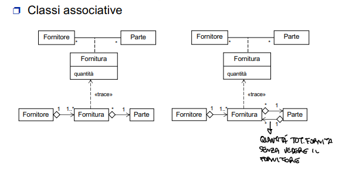
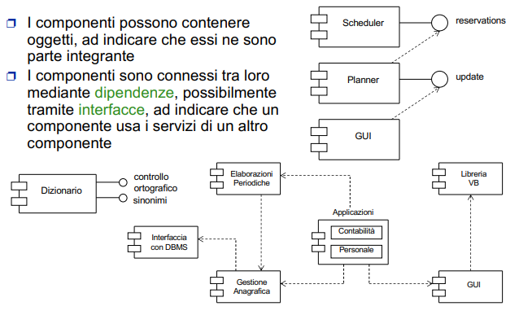

# APPUNTI DI INGEGNERIA DEL SOFTWARE

## Ciclo di Vita dei Sistemi Informatici

Il ciclo di vita di un sistema informatico comprende l’insieme delle attività svolte dal momento della sua ideazione fino alla sua dismissione. Le fasi principali sono: 
1. **Definizione strategica**
2. **Pianificazione**
3. **Controllo di qualità**
4. **Analisi dei requisiti**
5. **Progettazione** (architetturale ed esecutiva)
6. **Realizzazione e collaudo in fabbrica**
7. **Certificazione**
8. **Installazione**
9. **Collaudo del sistema installato**
10. **Esercizio**
11. **Diagnosi e manutenzione**
12. **Evoluzione**
13. **Messa fuori servizio**

### Fasi del Ciclo di Vita

1. **Definizione Strategica**
La fase in cui vengono prese decisioni sulle aree aziendali da automatizzare, stabilendo l'obiettivo principale dell'intervento.

2. **Pianificazione**
Consiste nel definire obiettivi, identificare fabbisogni e condurre uno studio di fattibilità. Questo fornisce una prima stima di costi, benefici e tempi di attuazione.

3. **Controllo di Qualità**
Prevede la creazione di un piano per garantire il rispetto delle specifiche del progetto e verificare che il sistema rispetti le attese.

4. **Analisi dei Requisiti**
Questa fase mira a identificare e formalizzare i requisiti dell’organizzazione, modellandoli attraverso tecniche specifiche per produrre un documento di specifica dei requisiti. Tale documento diventa la base per le successive fasi di progettazione e realizzazione.

5. **Progettazione**
La progettazione si suddivide in due fasi principali:
- **Progettazione del sistema**: Si traduce l’analisi dei requisiti in una soluzione architetturale generale, producendo specifiche indipendenti dagli strumenti di implementazione.
- **Progettazione esecutiva**: Descrive in dettaglio struttura e comportamento dei componenti per consentire la realizzazione di un prodotto funzionante.

6. **Realizzazione e Collaudo in Fabbrica**
Il sistema viene implementato sulla piattaforma scelta e testato internamente attraverso l'α-test, utilizzando i casi prova definiti nella fase di analisi.

7. **Certificazione**
Verifica che il software sia stato sviluppato seguendo i criteri previsti dalle specifiche tecniche, garantendo la conformità a tutta la documentazione di progetto.

8. **Installazione**
Include l’installazione e configurazione del sistema, oltre al recupero dei dati pregressi.

9. **Collaudo del Sistema Installato**
Prevede il **β-test**, dove gli utenti testano il sistema installato. Gli errori rilevati possono essere di tipo:
- **Bloccanti**: Impediscono il collaudo.
- **Non bloccanti**: Non impediscono il collaudo ma richiedono correzioni.
- **Operativi e funzionali**: Malfunzionamenti nelle funzionalità richieste.

10. **Esercizio**
Il sistema viene messo in produzione, spesso in parallelo con il sistema preesistente, per poi sostituirlo completamente.

11. **Diagnosi e Manutenzione**
Durante l'esercizio, eventuali errori vengono segnalati e corretti:
- **Manutenzione correttiva**: Risoluzione di errori.
- **Manutenzione adattativa**: Modifiche per adattarsi a cambiamenti nel dominio applicativo.
- **Manutenzione evolutiva**: Introduzione di nuove funzionalità.

12. **Evoluzione**
Consiste nell’aggiornamento del sistema per incorporare nuove funzionalità o migliorarne le prestazioni.

13. **Messa Fuori Servizio**
La fase finale, in cui il sistema viene dismesso, concludendo il ciclo di vita.

### Analisi dei Requisiti

L’obiettivo dell’analisi dei requisiti è comprendere i bisogni del cliente e dell’organizzazione, formalizzandoli in un documento di specifica che guida le successive fasi di progettazione e sviluppo. Si analizzano:
- Sottosistemi aziendali
- Risorse
- Processi
- Flussi informativi

- **Specifica dei Requisiti**
  Un documento che rappresenta un accordo tra produttore e consumatore. Deve essere:
  - **Chiara**: Descrivere in modo univoco operazioni e soggetti coinvolti.
  - **Non ambigua**: Evitare interpretazioni multiple.
  - **Consistente**: Priva di contraddizioni interne.

Più un errore è rilevato tardi nel ciclo di sviluppo, maggiore sarà il costo per correggerlo.

### Metodi di Analisi
- **Analisi Orientata agli Oggetti**
Focalizza sull’identificazione degli oggetti e le loro interrelazioni. Gli oggetti mantengono proprietà stabili nel tempo, anche se il loro utilizzo può variare.

- **Analisi Orientata alle Funzioni**
Rappresenta il sistema come un insieme di flussi informativi e processi, costruendo una gerarchia funzionale.

- **Analisi Orientata agli Stati**
Modella il sistema in termini di stati operativi e transizioni di stato.

- **Uso Integrato**
Le moderne metodologie combinano approcci orientati a oggetti, funzioni e stati, adattandoli al tipo di applicazione.

### Progettazione
La progettazione collega l’analisi dei requisiti alla realizzazione del software. Dividendo il sistema in sottosistemi, si riduce la complessità e si facilita lo sviluppo parallelo. Deve bilanciare:
- **Astrazione**: Per confrontare il progetto con le specifiche.
- **Dettaglio**: Per agevolare la codifica.

Le scelte progettuali devono essere flessibili, permettendo modifiche senza compromettere l’intero sistema.

- **Obiettivi della Progettazione**
  Produrre software di alta qualità:
  - **Affidabile**: Funzionamento corretto e continuo.
  - **Modificabile**: Facilità di aggiornamento.
  - **Comprensibile**: Semplice da analizzare e mantenere.
  - **Riutilizzabile**: Parti del software applicabili in altri contesti.

Questi obiettivi riducono tempi e costi, migliorando la qualità complessiva.

## Il Paradigma a Oggetti

- **Concetti Fondamentali**
  Il paradigma a oggetti si basa su alcuni concetti chiave:
  - **Oggetto**: Entità che rappresenta un elemento del dominio applicativo, dotato di identità, stato e comportamento.
  - **Astrazione**: Processo che permette di focalizzarsi sugli aspetti essenziali di un oggetto, ignorando i dettagli irrilevanti.
  - **Classe**: Modello o schema che definisce un insieme di oggetti con caratteristiche comuni.
  - **Incapsulamento**: Meccanismo che protegge lo stato interno di un oggetto, esponendo solo un'interfaccia controllata.
  - **Ereditarietà**: Capacità di una classe di derivare caratteristiche da un'altra classe.
  - **Polimorfismo**: Capacità di oggetti di classi diverse di rispondere a metodi con lo stesso nome in modo appropriato.
  - **Delegazione**: Processo in cui un oggetto delega alcune funzionalità ad altri oggetti.

Un **oggetto** è un'unità fondamentale del paradigma, rappresentando un'entità del mondo reale o concettuale. Ogni oggetto è caratterizzato da:
- **Identità (OID)**: Identificativo unico e immutabile assegnato all'oggetto.
- **Stato**: Valori degli attributi in un dato momento.
- **Comportamento**: Insieme di operazioni che l'oggetto può eseguire.

Un oggetto può contenere riferimenti ad altri oggetti, consentendo la creazione di entità complesse.

Le **operazioni** rappresentano le funzionalità offerte da un oggetto. La **signature** di un'operazione specifica:
  - Nome dell'operazione
  - Parametri accettati
  - Valore restituito

L'insieme delle signature costituisce l'**interfaccia** dell'oggetto, che descrive le richieste che possono essere inviate.

Un **tipo di dati astratto** è una descrizione generale che definisce:
- La struttura dei dati.
- Le operazioni disponibili.

Un tipo può essere un **sottotipo** di un supertipo se eredita e amplia la sua interfaccia.

La **classe** è una realizzazione di un tipo di dati astratto, fornendo implementazioni per i metodi associati. Gli oggetti sono istanze di una classe e condividono:
- Attributi: Definiscono lo stato dell'oggetto.
- Metodi: Possono restituire informazioni (metodi accessori) o modificare lo stato (metodi trasformatori).

L’**incapsulamento** protegge lo stato interno di un oggetto, limitando l'accesso diretto agli attributi. I dati sono manipolabili solo tramite l'interfaccia pubblica. Questo approccio:
- Riduce il rischio di errori.
- Rende più agevole la manutenzione e il debugging.
- Permette di modificare l'implementazione senza influire sull'interfaccia pubblica.

L’**ereditarietà** consente la definizione di una classe basata su un’altra. Le relazioni tra classi possono essere:
- **Specializzazione/Generalizzazione**: Una sottoclasse eredita attributi e metodi dalla superclasse, aggiungendo o modificando caratteristiche.
- **Ereditarietà multipla**: Una sottoclasse può derivare da più superclassi, con strategie per risolvere eventuali conflitti.

Il **polimorfismo** permette a oggetti di classi diverse di rispondere in modi specifici a metodi con lo stesso nome. Si distinguono:
- **Overload**: Definizione di più metodi con lo stesso nome ma signature diversa.
- **Override**: Ridefinizione di un metodo ereditato in una sottoclasse.

Il **late binding** o **istanziamento dinamico** consente di scegliere l'implementazione del metodo solo a runtime.

La **delegazione** avviene quando un oggetto affida parte delle sue funzionalità a un altro oggetto. Questo meccanismo è fondamentale per implementare associazioni tra classi e promuove la modularità.

### Benefici del Paradigma a Oggetti

- **Modellazione**: La decomposizione è orientata agli oggetti, che rispecchiano le entità del dominio.
- **Manutenibilità**: Cambiamenti locali non influenzano l'intero sistema.
- **Riusabilità**: Le classi possono essere riutilizzate in altri progetti.
- **Produttività**: Permette lo sviluppo iterativo e rapido di prototipi.
- **Stabilità**: I sistemi orientati agli oggetti si adattano meglio alle evoluzioni nel tempo rispetto a quelli procedurali.

- **Dall’approccio Funzionale all’Approccio a Oggetti**

  L’approccio funzionale tradizionale è limitato da:
  - Mancanza di estendibilità e riusabilità.
  - Elevati costi di manutenzione.
  - Mancata iterazione nella progettazione.

  L’approccio a oggetti supera queste limitazioni con:
  - Decomposizione orientata alla modellazione.
  - Iterazione del processo di sviluppo (modello a fontana).
  - Riusabilità ed estendibilità grazie all’ereditarietà.

- **Processo di Sviluppo a Oggetti**

  1. **Analisi Object-Oriented**:
     - Determinazione della funzionalità del sistema.
     - Identificazione delle classi.
     - Distribuzione delle responsabilità.

  2. **Design Object-Oriented**:
     - Progettazione di metodi e attributi.
     - Ottimizzazione delle associazioni tra classi.
  
## Unified Modeling Language (UML)

UML è uno standard aperto per la modellazione dei sistemi software, nato dalla collaborazione tra Grady Booch, Ivar Jacobson e Jim Rumbaugh (noti come i "tres amigos"). Adottato come standard dall’OMG (Object Management Group) dal 1997, UML è sostenuto da esperti e aziende leader nel settore informatico, come IBM, Microsoft e Rational Software. Questo linguaggio consente di generare automaticamente scheletri di codice e strutture dati da modelli UML, supportando così lo sviluppo software in modo efficiente.

- **Caratteristiche di UML**
  - **Linguaggio, non metodo**: UML definisce una notazione standard per descrivere i sistemi software senza imporre una sequenza di processi o metodologie specifiche.
  - **Standard aperto**: Non è proprietario e la sua evoluzione è gestita dall'OMG.
  - **Notazione integrata**: Basata su un metamodello che unifica gli oggetti e i concetti utilizzati nei sistemi software.
  - **Versatilità**: Può essere utilizzato con diverse metodologie di sviluppo.

- **Fasi Supportate da UML**
  - **Analisi dei requisiti**: Utilizzando casi d’uso.
  - **Analisi e progettazione object-oriented**: Per definire il modello logico del sistema.
  - **Modellazione dei componenti**: Per rappresentare moduli di sistema e le loro interazioni.
  - **Modellazione della struttura e configurazione**: Per descrivere l’architettura hardware e software.

Ogni entità può essere rappresentata in più diagrammi che costituiscono viste diverse del modello.

- **Diagramma vs. Modello**
In UML, un modello rappresenta l'insieme delle informazioni di un sistema, mentre un diagramma è una visualizzazione di elementi specifici del modello. Un elemento può apparire in più diagrammi, ma la sua definizione è unica all'interno del modello.

- **Struttura di UML**
  - **Costituenti fondamentali**:
    - **Entità**: Classe, interfaccia, nodo, componente.
    - **Relazioni**: Dipendenze, associazioni, composizioni, generalizzazioni.
    - **Diagrammi**: Rappresentazioni grafiche di aspetti statici e dinamici del sistema.
  - **Meccanismi comuni**: Specifiche, ornamenti, distinzioni comuni, estendibilità.
  - **Architettura**: Fornisce una vista complessiva del sistema, suddivisa in aspetti statici e dinamici.

- **Entità**:


- **Relazioni**:


- **Tipi di Diagrammi UML**
  1. **Statici**:
     - **Diagramma delle classi**: Mostra la struttura dati e le relazioni tra le classi.
     - **Diagramma degli oggetti**: Illustra gli oggetti e le loro relazioni.
     - **Diagramma dei package**: Rappresenta i package e le loro dipendenze.
     - **Diagramma dei componenti**: Descrive i moduli software e la loro interazione.
     - **Diagramma di deployment**: Mostra la distribuzione fisica del sistema.
     - **Diagramma delle strutture composite**: Rappresenta la struttura interna dei classificatori.

  2. **Dinamici**:
     - **Diagramma dei casi d’uso**: Illustra le interazioni tra attori e sistema attraverso un elenco dei casi d'uso.
     - **Diagramma degli stati**: Usa automi di Harel per descrivere gli stati degli oggetti.
     - **Diagramma di attività**: Mostra sequenze di eventi-azioni-transizioni di stato.
     - **Diagrammi di interazione**: Mostra le iterazioni tra gli oggetti durante vari scenari di funzionamento
       - Sequenza
       - Comunicazione
       - Sintesi delle interazioni
       - Tempi.
  


Le **specifiche** descrivono la semantica di un elemento o caso d’uso in modo testuale e comprensibile, costituendo uno strumento fondamentale per la comunicazione tra tutte le parti coinvolte nello sviluppo del sistema. Un esempio classico di specifica è il caso d’uso "APRI CONTO CORRENTE BANCARIO", che include uno scenario base e relative varianti:

- **Scenario base**: Il cliente si presenta in banca, fornisce i dati, l’addetto crea il conto e comunica il numero al cliente.
- **Varianti**: Ad esempio, il cliente può non accettare o il conto può avere più intestatari, richiedendo ulteriori verifiche.

Gli **ornamenti** migliorano la comprensione degli elementi di modellazione, evidenziandone aspetti particolari. Possono includere:

- **Annotazioni**: Informazioni aggiuntive, come l’autore o lo stato di sviluppo `{autore = Smith, stato = analisi}`.
- **Proprietà**: Valori associati agli elementi, espressi come stringhe.
- **Vincoli**: Regole che devono essere sempre vere, ad esempio `{disjoint, complete}`.

- **Distinzioni comuni**
  UML separa concetti fondamentali, come:
  - **Classificatore/istanza**: Il classificatore è un’entità astratta, mentre l’istanza è la sua rappresentazione concreta.


  - **Interfaccia/implementazione**: L’interfaccia definisce "cosa fa" un oggetto, mentre l’implementazione specifica "come lo fa".


- **Meccanismi di Estendibilità**
UML supporta estensioni attraverso:
  - **Stereotipi**: Permettono di creare variazioni di elementi esistenti con scopi diversi. Possono essere predefiniti o definiti dall’utente.
    - Esempio: `«attore» Utente`.
  - **Proprietà**: Valori etichettati associati agli elementi, come `{abstract}`.
  - **Vincoli**: Regole che definiscono condizioni o relazioni tra elementi.
  - **Profili**: Insiemi di stereotipi, proprietà e vincoli per personalizzare UML.

- **Architettura**
  UML offre viste diverse per descrivere il sistema:
  1. **Vista dei casi d’uso**: Illustra le funzionalità percepite dagli utenti, costituendo la base per le altre viste.
  2. **Vista logica**: Descrive il dominio del problema con classi e oggetti.
  3. **Vista dei processi**: Modella i thread e i processi come classi attive.
  4. **Vista di implementazione**: Definisce moduli software e loro dipendenze.
  5. **Vista di deployment**: Mostra la distribuzione fisica del sistema su hardware.


### Diagrammi dei Casi d’Uso

Questi diagrammi rappresentano i ruoli di utilizzo del sistema da parte di attori (utenti, sistemi esterni, ecc.). I casi d’uso descrivono interazioni e risultati osservabili utili agli attori. Non specificano la logica interna del sistema, ma sono espressi in forma testuale per essere comprensibili anche ai non esperti.

Esempi di attori: clienti, dipendenti, applicazioni esterne. Ogni caso d’uso è attivato da un attore e produce un risultato utile per esso.

- **Relazioni nei Diagrammi dei Casi d’Uso**

  Le relazioni tra casi d’uso e attori includono:
  - **Include**: Un caso d’uso dipende da un altro per essere completo.
  - **Extend**: Un caso d’uso aggiunge funzionalità opzionali a un altro.
  - **Generalizzazioni**: Sia tra attori che tra casi d’uso, indicano specializzazioni.


- **Scenari**

Ogni esecuzione di un caso d’uso è uno **scenario**, che può essere di successo o fallimento. Lo scenario base rappresenta il flusso più semplice e positivo. Varianti arricchiscono lo scenario con alternative che portano a successo o fallimento.

Esempio:
**Caso d’uso**: "APRI CONTO CORRENTE BANCARIO".
- **Scenario base**: Creazione conto con dati forniti dal cliente.
- **Variante**: Il cliente non è censito; l’addetto registra i dati e completa la procedura.

- **Specifiche del Caso d’Uso**

UML non prescrive uno standard rigido per documentare un caso d’uso. Tuttavia, una specifica tipica include:
- **Nome**: Identifica il caso d’uso.
- **Attori**: Coinvolti primari e secondari.
- **Precondizioni**: Condizioni che devono essere vere prima dell’esecuzione.
- **Sequenza principale**: Passi che definiscono il caso d’uso.
- **Postcondizioni**: Risultati attesi alla fine.
- **Alternative**: Percorsi diversi dal flusso principale.

Esempio:
- **Nome**: "Apri conto corrente".
- **Attore primario**: Cliente.
- **Sequenza principale**: Raccolta dati, verifica, apertura conto.

- **Realizzazione dei Casi d’Uso**

  La realizzazione dei casi d’uso può essere modellata con:
  1. **Diagrammi delle classi**: Mostrano classi o oggetti coinvolti.
  2. **Diagrammi di interazione**: Evidenziano i messaggi scambiati tra oggetti durante la collaborazione per realizzare il caso d’uso.
   


### Diagrammi delle Classi
I diagrammi delle classi rappresentano il nucleo fondamentale del linguaggio UML, descrivendo la **struttura statica** di un sistema in termini di classi e delle loro relazioni reciproche.  
Ogni classe rappresenta un gruppo di oggetti che condividono proprietà, comportamento e relazioni.  

- **Attributo**: È un valore che caratterizza un oggetto di una classe.  
- **Operazioni**: Sono trasformazioni applicabili agli oggetti di una classe.  
- **Stereotipi**: Specificano il ruolo di una classe nel modello.  
- **Notazione**:  
  Gli attributi e le operazioni sono descritti con la seguente sintassi:
  - Attributi: `visibilità nome molteplicità : tipo = valoreDefault`
  - Operazioni: `visibilità nome(parametro,...): tipoRestituito`


- **Notazione degli Elementi di Classe**
  - **Visibilità**:
    - Pubblica: `+`
    - Privata: `-`
    - Protetta: `#`
    - Package: `~`
  - **Molteplicità**: Specifica il numero di elementi associati.
    - Esattamente uno: `1`
    - Facoltativo: `0..1`
    - Più elementi: `1..*`
    - Intervallo: `x..y`
  - **Ambito**:
    - **Istanza**: Ogni oggetto ha una copia dell'attributo.
    - **Classe**: L'attributo è condiviso tra tutti gli oggetti della classe.

- **Relazioni tra Classi**
  Le relazioni sono fondamentali per modellare l'interazione tra classi:
  - **Generalizzazione**: Rappresenta una relazione di ereditarietà.
  - **Associazione**: Connessione tra classi. Può essere bidirezionale o monodirezionale.
  - **Aggregazione**: Relazione "parte-di" in cui le parti possono esistere indipendentemente dal tutto.
  - **Composizione**: Caso speciale di aggregazione in cui le parti esistono solo in relazione al tutto.
  - **Dipendenza**: Una classe dipende dai servizi forniti da un'altra.
  


- **Associazioni**

Le associazioni sono connessioni tra classi, e includono:
1. **Molteplicità**: Specifica il numero di oggetti partecipanti alla relazione.
   - Esempi:
     - Una persona può avere una sola casa (`1..1`).
     - Un'azienda può avere molti dipendenti (`1..*`).
2. **Ruoli e Navigabilità**: Indicano il nome del ruolo e se una relazione è navigabile in uno o entrambi i sensi.


3. **Associazioni Qualificate**: Specificano un attributo che riduce un'associazione molti-a-molti a una uno-a-uno.


4. **Associazioni n-arie**: Includono più di due classi in una relazione.


- **Generalizzazione**
  - **Ereditarietà**: Le sottoclassi ereditano attributi e metodi dalle superclassi.
  - **Vincoli**:
    - `disjoint`: Un'istanza può appartenere a una sola sottoclasse.
    - `overlapping`: Un'istanza può appartenere a più sottoclassi.
    - `complete`: La superclasse è completamente rappresentata dalle sue sottoclassi.
    - `incomplete`: Non tutte le istanze della superclasse appartengono alle sottoclassi.

### Elementi Derivati
Un elemento derivato è calcolabile da altri elementi ma viene esplicitamente rappresentato nel modello per chiarezza.  


- **Aggregazione**:
  - Relazione "parte-di" in cui il tutto e le parti possono esistere indipendentemente.
  - Esempio: `Squadra -> Giocatori`.
- **Composizione**:
  - Le parti esistono solo in relazione al tutto.
  - Esempio: `Finestra -> Pannelli`.

- **Classi Astratte**
  - Non possono essere istanziate direttamente.
  - Servono come radici per gerarchie di specializzazione.
  - Esprimono concetti generici e condivisi.

- **Interfacce**
  - Definiscono un insieme di operazioni pubbliche senza dettagli di implementazione.
  - Utilizzano la "notazione a lecca-lecca" o una rappresentazione simile alle classi con lo stereotipo `«interface»`.


- **Dipendenze**


- **Identificazione di Classi e Associazioni**
  1. **Classi**:
     - Devono essere coese e ben definite.
     - Evitare classi "onnipotenti" o ridondanti.
     - Riflettere concetti del dominio applicativo.
     - Non rappresentare soluzioni implementative.
     - Una classe è associata a un piccolo e ben definito insieme di responsabilità (normalmente tra 3 e 5).
     - Nessuna classe può essere isolata.
     - Se una proprietà esiste indipendentemente, o compare più volte all’interno del diagramma dovrebbe essere espressa come classe. Ne è un esempio il proprietario di un auto che sarà una classe persona e non un campo di auto.
  2. **Associazioni**:
     - Devono rappresentare proprietà strutturali, non eventi transitori.
     - Preferire associazioni binarie a quelle n-arie complesse.
     - Specificare ruoli e vincoli quando appropriato.
     - Evidenziare le associazioni derivate, che cioè possono essere espresse in termini di altre associazioni.

- **Raffinamenti del Modello**
Il modello può essere raffinato iterativamente per includere dettagli aggiuntivi o correggere asimmetrie.


### Identificare le Classi di Progettazione

Le **classi di progettazione** definiscono con precisione come ciascuna classe realizzerà le proprie responsabilità, rappresentando un passaggio chiave nel processo di sviluppo.

#### Caratteristiche delle Classi di Progettazione
- **Completezza**: Ogni classe deve fornire tutti i servizi necessari ai propri clienti, coprendo ogni aspetto delle responsabilità assegnate.
- **Sufficienza**: I metodi della classe devono essere strettamente finalizzati al raggiungimento dello scopo della classe, evitando funzionalità ridondanti o superflue.
- **Essenzialità**: È fondamentale non introdurre più di un metodo per eseguire la stessa operazione, semplificando l'interfaccia e riducendo ambiguità.
- **Coesione massima**: La classe deve modellare un unico concetto astratto, evitando di sovraccaricarsi con responsabilità multiple o non correlate.
- **Interdipendenza minima**: Ogni classe deve essere associata al numero minimo necessario di altre classi per svolgere le proprie funzioni, riducendo il grado di accoppiamento e migliorando la modularità.

- **Identificare le Associazioni di Progettazione**

Derivano dalle associazioni identificate durante l'analisi e sono adattate per essere implementabili.

1. **Trasformazione dalle Associazioni di Analisi**:  
   Le associazioni bidirezionali o le classi associative spesso non possono essere implementate direttamente. La progettazione deve trasformarle in costrutti più pratici, adattandole alle esigenze dell'applicazione.
   
2. **Elementi Fondamentali da Specificare**:  
   - **Nome dell’Associazione**: Deve descrivere chiaramente lo scopo della relazione tra le classi.
   - **Verso di Navigabilità**: Indica la direzione in cui una classe può accedere all'altra, determinando se l’associazione è unidirezionale o bidirezionale.
   - **Molteplicità**: Deve essere esplicitata per entrambi gli estremi, specificando il numero minimo e massimo di oggetti partecipanti.
   - **Ruolo della Destinazione**: Assegna un nome significativo al ruolo della classe associata, rendendo chiaro il contesto della relazione.

### Obiettivi delle Associazioni di Progettazione
- **Navigabilità Ottimizzata**: Minimizzare i percorsi necessari per accedere ai dati, migliorando le prestazioni e la leggibilità.
- **Semplificazione**: Evitare complessità inutili come associazioni bidirezionali se non strettamente necessarie.
- **Implementabilità**: Assicurarsi che ogni associazione progettata possa essere direttamente tradotta in codice.




### Diagrammi degli Oggetti

I **diagrammi degli oggetti** rappresentano istanze specifiche di classi e costituiscono una particolare applicazione dei diagrammi delle classi.

- **Oggetto come Istanza di una Classe**: Ogni oggetto rappresentato in un diagramma è una particolare istanza di una classe, con valori specifici associati ai suoi attributi e comportamenti definiti dai metodi della classe.

- Un **oggetto composto** è un oggetto di alto livello che contiene al suo interno altri oggetti.

- **Utilizzi dei Diagrammi degli Oggetti**:
  - **Esempi di Strutture Dati**: Il principale scopo di un diagramma degli oggetti è mostrare esempi specifici di strutture dati.
  - **Visualizzazione Dinamica**: Offre una vista concreta di come le classi interagiscono e come gli oggetti si collegano tra loro in un determinato momento dell’esecuzione.

### Diagrammi dei Package

I **diagrammi dei package** rappresentano la suddivisione del modello in gruppi logici chiamati package, evidenziando le dipendenze tra di essi.

- **Tipi di Dipendenze tra Package**:
  - **`«use»`** (default): Quando un elemento del package cliente utilizza in qualche modo un elemento del package fornitore.
  - **`«import»`**: Gli elementi pubblici dello spazio dei nomi del package fornitore vengono aggiunti come elementi pubblici al package cliente.
  - **`«access»`**: Gli elementi privati dello spazio dei nomi del package fornitore vengono aggiunti come elementi privati al package cliente.
  - **`«trace»`**: Rappresenta l’evoluzione di un elemento in un altro elemento più dettagliato.

- **Generalizzazioni tra Package**:
Si verifica quando un package specifico si conforma all’interfaccia definita dal package generale.

- **Individuare i Package d’Analisi**
  I package d’analisi raggruppano elementi del modello con forti correlazioni semantiche:
  - **Fonti Principali**:
    - **Diagramma delle Classi**: Classi appartenenti a gerarchie di composizione o specializzazione possono essere raggruppate.
    - **Diagramma dei Casi d’Uso**: Processi aziendali o attori che condividono funzionalità possono indicare un package.
  - **Raffinamenti**:
    - Ridistribuire classi tra package.
    - Aggiungere o eliminare package per minimizzare le interdipendenze.
    - Evitare dipendenze circolari.

- **Dimensioni Ottimali dei Package**:
  - Ogni package dovrebbe contenere idealmente tra 4 e 10 classi.

### Diagrammi di Interazione

I **diagrammi di interazione** rappresentano la struttura e la dinamica dell'interazione tra oggetti durante uno specifico scenario, evidenziando il flusso di messaggi scambiati tra loro.

- **Tipi di Diagrammi di Interazione**:
  - **Diagramma di Sequenza**: Enfatizza la sequenza temporale degli scambi di messaggi tra le linee di vita.
  - **Diagramma di Comunicazione**: Focalizza le relazioni strutturali tra gli oggetti coinvolti nell'interazione.
  - **Diagramma di Sintesi dell’Interazione**: Illustra come comportamenti complessi vengono composti da interazioni più semplici.
  - **Diagramma di Temporizzazione**: Sottolinea gli aspetti temporali e real-time dell’interazione.

- **Terminologia Chiave**
  - **Interazione**: Un’unità di comportamento di un classificatore che comprende un insieme di messaggi scambiati tra linee di vita con l'obiettivo di ottenere un risultato.
  - **Linea di Vita**: Rappresenta la partecipazione di un’istanza di un classificatore all’interazione, spesso disegnata con una riga verticale tratteggiata.
  - **Messaggio**: Una comunicazione istantanea tra due linee di vita che trasporta informazioni per avviare un’attività.

- **Tipologie di Messaggi**
  - **Messaggi di Chiamata**: Un’operazione viene invocata su una linea di vita.
    - **Sincrono**: Il mittente attende il completamento dell’operazione.
    - **Asincrono**: Il mittente continua l’esecuzione senza attendere.
  - **Messaggi di Creazione**: Crea un’istanza del classificatore destinatario.
  - **Messaggi di Distruzione**: Distrugge un’istanza destinataria.
  - **Invio di Segnali**: Trasferisce segnali informativi.


### Diagrammi di Sequenza
- **Caratteristiche Principali**:
  - Mostrano l’ordine temporale dei messaggi scambiati tra linee di vita.
  - Le due dimensioni principali:
    - **Verticale**: Rappresenta il tempo (dal passato verso il futuro).
    - **Orizzontale**: Rappresenta le linee di vita coinvolte nell’interazione.
  - **Attivazioni**: Periodi in cui una linea di vita esegue un’azione, rappresentando il controllo e la durata.
- **Componenti Avanzati**:
  - **Nodi Decisionali**: Indicazioni su percorsi alternativi basati su condizioni.
  - **Iterazioni**: Ripetizioni di messaggi o azioni.
  - **Annidamenti**: Esecuzioni di operazioni subordinate.

- **Utilizzo dei Diagrammi di Interazione**
  
I diagrammi di interazione sono utili per descrivere il flusso operativo, il coordinamento tra componenti, e per analizzare scenari complessi che richiedono un’ampia visione delle dipendenze temporali e strutturali tra gli oggetti.


### Diagrammi di Stato

I **diagrammi di stato** rappresentano l’evoluzione temporale delle istanze di un classificatore (classe, caso d’uso, sottosistema) in risposta alle interazioni con altri oggetti.

- **Caratteristiche Principali**:
  - **Evoluzione Temporale**: Descrivono il comportamento dinamico di un’istanza nel tempo.
  - **Associazione con Classi**: Ogni classe può avere un diagramma di stato associato per rappresentare i suoi cambiamenti.

- **Notazione UML**:
  - UML utilizza la notazione di **Harel**, che consente di esprimere:
    - **Sottostati**: Stati annidati all'interno di stati più generali.
    - **Stati Composti**: Stati complessi che raggruppano più sottostati.
    - **Parallelismo**: Stati che possono essere attivi contemporaneamente.
    - **Stati Storici**: Memorizzazione dello stato precedente per una ripresa coerente.
    - **Gestione Eventi**: Risposta a eventi esterni o interni.
    - **Operazioni**: Azioni eseguite durante la transizione tra stati.
    - **Creazione e Distruzione di Oggetti**: Tracciamento dell'inizio e fine del ciclo di vita.
    - **Marcamenti Temporali**: Temporizzazioni legate a stati o transizioni.i

Lo **stato** di un oggetto in un determinato istante è una rappresentazione astratta dell’insieme dei valori dei suoi attributi e dei collegamenti.

- **Configurazioni di Stato**:
  - Le diverse configurazioni di valori e collegamenti vengono raggruppate in stati, in base al loro impatto sul comportamento generale dell’oggetto.

- **Transizioni di Stato**:
  - Gli **eventi** causano il passaggio da uno stato all’altro.
  - Un oggetto rimane in uno stato per un periodo di tempo finito (intervallo tra due eventi consecutivi).

- **Azioni e Attività**:
  - **Azioni**:
    - Operazioni **istantanee**, **atomiche** e **non interrompibili**.
    - Tipicamente associate a transizioni che vengono attivate da eventi.
  - **Attività**:
    - Operazioni che richiedono un certo intervallo di tempo per essere completate.

Una **transizione** rappresenta il passaggio di un oggetto da uno stato a un altro ed è associata a uno o più eventi. Può includere opzionalmente condizioni e azioni.

- **Eventi**: Avvengono in un preciso istante di tempo e si assume che abbiano durata nulla. Possono essere raggruppati in **classi di eventi**, descritte da attributi.
- **Condizioni**: Espressioni **booleane** che devono risultare vere affinché la transizione possa avvenire.
- **Azioni**: Operazioni **istantanee**, **atomiche**, e **non interrompibili**, eseguite al momento della transizione.


- **Transizioni senza Evento**: Una transizione priva di evento indica che il passaggio di stato avviene al termine dell'attività nello stato di partenza.


I **tipi di eventi** rappresentano diverse situazioni che possono innescare una transizione tra stati in un diagramma degli stati.

- **Evento di variazione**:
  - Si verifica quando una condizione diventa **vera**.
  - Notazione: un’espressione **booleana**.  
    *Esempio*: `bilancio < 0`.
  - Comportamento: considerato come una condizione monitorata continuamente, anche se il controllo avviene solo al variare dei parametri coinvolti.

- **Evento di segnale**:
  - Avviene quando un oggetto riceve un **oggetto segnale** da un altro oggetto.

- **Evento di chiamata**:
  - È l’invocazione di una specifica operazione nell’istanza del classificatore del contesto.
  - Notazione: **signature** dell’operazione.  
    *Esempio*: `operazione(parametro)`.
  - Può includere una sequenza di azioni separate da **";"**.

- **Evento temporale**:
  - Avviene allo scadere di un **periodo di tempo**.
    - **Notazioni**:
      - `when(data=01/01/2008)`: specifica una data esatta per la transizione.
      - `after(10 seconds)`: specifica il tempo che deve trascorrere dallo stato attuale.
      - È possibile aggiungere il riferimento al momento iniziale con la sintassi `since...`.

### Stati Compositi

Gli **stati compositi** rappresentano stati che contengono altri stati annidati, organizzati in uno o più automi.

- **Ereditarietà**: Gli stati annidati ereditano tutte le transizioni definite dallo stato contenitore.


In un **stato composito ortogonale**, ogni sotto-automa può avere il proprio pseudo-stato finale, applicabile solo a quel sottosistema.


Gli automi possono comunicare tra loro in modo **asincrono** utilizzando variabili condivise.


### Diagrammi di Attività

I **diagrammi di attività** sono utilizzati per modellare processi e workflow rappresentando attività come un insieme di nodi connessi da archi.

- **Caratteristiche principali**:
  - **Rappresentazione del processo**: Ogni diagramma descrive un'attività composta da nodi e archi.
  - **Nuova semantica**: In UML 2, la semantica è basata sulle reti di Petri, distinguendosi dai diagrammi degli stati.
  - **Contesto di utilizzo**: Un’attività può essere associata a:
    - Caso d’uso.
    - Operazione.
    - Classe.
    - Interfaccia.
    - Componente.
    - Collaborazione.
  - **Modellazione business e workflow**: Efficace anche per processi aziendali e flussi di lavoro.


- **Attività**
  - **Modello a rete**: Le attività sono rappresentate come reti di nodi connessi da archi.
  - **Tipi di nodi**:
    - **Nodi azione**: Rappresentano compiti atomici all’interno dell’attività.
    - **Nodi controllo**: Gestiscono il flusso all’interno dell’attività.
    - **Nodi oggetto**: Indicano gli oggetti utilizzati o generati nell’attività.
  - **Tipi di archi**:
    - **Flussi di controllo**: Rappresentano il flusso del controllo attraverso l’attività.
    - **Flussi di oggetti**: Rappresentano il flusso degli oggetti utilizzati o creati durante l’attività.

- **Nodi Azione**
  - **Nodo azione di chiamata**:
    - Chiama un comportamento.
    - Chiama un’attività.
    - Chiama un’operazione.
  - **Nodo azione di accettazione evento temporale**:
    - Produce un evento ogni volta che una condizione temporale diventa vera.
    - Si attiva solo quando viene attivato l’arco associato.

- **Nodi Controllo**


- **Nodi Oggetto**
  - **Rappresentazione degli oggetti**:
    - Indicano la disponibilità di istanze di una classe in punti specifici dell’attività.
  - **Flussi di oggetti**:
    - Gli archi rappresentano il flusso di oggetti creati o consumati dai nodi azione.
  - **Stato dell’oggetto**:
    - È possibile rappresentare esplicitamente lo stato degli oggetti nei nodi.


- **Corsie (Swimlanes)**
  - **Partizionamento dell’attività**:
    - Le corsie suddividono l’attività in insiemi di azioni correlate.
  - **Corrispondenza delle corsie**:
    - Possono rappresentare:
      - Casi d’uso.
      - Classi.
      - Componenti.
      - Unità organizzative.
      - Ruoli.
  - **Descrizione semantica**:
    - Ogni insieme di corsie è descritto da una specifica dimensione semantica.


### Diagramma dei Componenti

I **diagrammi dei componenti** rappresentano i componenti di un sistema software e le loro interdipendenze, evidenziando la modularità e la struttura del sistema.


- **Definizione di Componente**:
  - Un componente è una **parte modulare** del sistema che incapsula i propri contenuti, comportandosi come una **scatola nera** (black box).
  - I componenti possono possedere:
    - **Attributi**: proprietà che descrivono lo stato o le caratteristiche del componente.
    - **Operazioni**: comportamenti o funzionalità offerte dal componente.
  - Possono partecipare a relazioni come **associazioni** e **generalizzazioni**.



- **Relazioni tra Componenti**:
  - I componenti sono connessi tra loro mediante **dipendenze**.
  - Possono interagire attraverso **interfacce**, che specificano i servizi offerti o richiesti.

- **Utilità**:
  - Rappresentano una vista logica e fisica del sistema.
  - Facilitano la comprensione delle dipendenze tra le parti del sistema, evidenziando le possibilità di riuso e modularità.


### Diagramma di Deployment

I **diagrammi di deployment** rappresentano la disposizione fisica del software su risorse hardware, mostrando come le componenti software vengono distribuite e interagiscono attraverso l’hardware.

- **Caratteristiche Principali**:
  - Specificano l’**hardware** su cui il software verrà eseguito.
  - Mostrano come il **software è dislocato** sull’hardware.
  - Possono essere rappresentati in due modalità:
    - **Descrittore**: include nodi, relazioni tra nodi e manufatti, rappresentando i tipi di architetture.
    - **Istanza**: descrive istanze specifiche di nodi, relazioni e manufatti per modellare un deployment su un particolare sito.

- Un **nodo** rappresenta una risorsa computazionale su cui possono essere eseguiti i manufatti.
- **Tipi di nodi**:
  - **«device»**: rappresenta una periferica fisica, come un PC o un server fisico.
  - **«executionEnvironment»**: rappresenta un ambiente software di esecuzione, come un web server o una JVM.
- **Relazioni tra nodi**:
  - Un’associazione tra nodi rappresenta un **canale di comunicazione** tra di essi.
  - I nodi possono essere **annidati** per indicare una relazione gerarchica.
- È possibile utilizzare stereotipi o icone aggiuntive per migliorare la leggibilità del diagramma.

- Un **manufatto** rappresenta un’entità concreta del mondo reale associata al software.
- Esempi di manufatti:
  - File sorgenti.
  - File eseguibili.
  - Script.
  - Tabelle di database.
  - Documenti.
  - Modelli UML.
- I manufatti vengono **dislocati sui nodi**, specificando dove risiedono e come vengono utilizzati.


- **Utilità del Diagramma di Deployment**
  - Fornisce una vista chiara sull’**infrastruttura fisica** del sistema.
  - Evidenzia le relazioni tra **hardware e software**, agevolando il deployment e l’integrazione del sistema.

### Benefici, Complessità e Adattabilità di UML

**Benefici di UML**  
UML ha superato le difficoltà derivanti dalla presenza di molteplici metodi di analisi e disegno, fornendo uno standard unico e condiviso. Questo consente:  
- Uniformità nei concetti e nelle notazioni utilizzate.  
- Interoperabilità tra strumenti di sviluppo.  
- Indipendenza da produttori, tecnologie e metodi specifici.  

UML risponde alle esigenze di sviluppo di sistemi complessi con ambienti visuali, concentrandosi sul processo e sugli approcci adottati. Inoltre, il suo **metamodello comune** facilita la comunicazione tra strumenti e ambienti di progettazione.

**Complessità di UML**  
- Il **metamodello complesso** è progettato per rappresentare qualsiasi tipo di sistema software a diversi livelli di astrazione.  
- Il numero di diagrammi è elevato e spesso le rappresentazioni possono variare.  
- UML non prescrive una sequenza fissa nell’utilizzo dei diagrammi, lasciando ampia libertà ai progettisti.  

**Personalizzazioni**  
UML è flessibile e adattabile:  
- Si adatta a contesti eterogenei, da chi lavora individualmente a grandi team aziendali.  
- Permette di rispondere a esigenze di formalizzazione e documentazione differenti.  
- È versatile per progetti di varie dimensioni e complessità.  

Tuttavia, **non ha senso utilizzare UML sempre nello stesso modo**: occorre selezionare i diagrammi e le tecniche in base alle esigenze specifiche del progetto. 

UML è uno **standard potente e articolato** che può rappresentare qualunque sistema software a diversi livelli di astrazione. Tuttavia, la sua **complessità** richiede che venga adattato in base alle esigenze dei progettisti e del contesto specifico, utilizzando solo ciò che è necessario per il progetto.

## Ingegneria del Software

L’ingegneria del software è la disciplina che si occupa della **realizzazione di sistemi software** complessi, la cui **dimensione** e **complessità** richiedono l'intervento di team di sviluppo dedicati. Questo settore è emerso per affrontare la crescente complessità dei sistemi software, passando da semplici programmi individuali a **sistemi collaborativi** e commerciali, come OS 360 di IBM negli anni '50, fino a moderni standard di qualità come **ISO-9000**. L’ingegneria del software è definita come un approccio **sistematico** alla **progettazione**, **manutenzione** e **ritiro** di sistemi software. La disciplina mira a produrre software in modo **sistematico** e **strutturato**, rispettando tempi e costi stabiliti. Si fonda su un **corpus di teorie, metodi e strumenti** sia tecnologici che organizzativi per garantire la **qualità** del software prodotto.

### Qualità del Software

Le qualità del software si suddividono in:
- **Qualità interne**: aspetti legati allo **sviluppo** del software, invisibili agli utenti.
- **Qualità esterne**: aspetti legati alle **funzionalità** del prodotto, visibili agli utenti.

Entrambe le qualità sono **interdipendenti**: un software non può avere alta qualità esterna senza adeguate qualità interne.

- Caratteristiche principali della Qualità del Software
  1. **Correttezza**: rispetta le specifiche di progetto.
  2. **Affidabilità**: l’utente può contare sul software.
  3. **Robustezza**: capacità di reagire in modo ragionevole anche a input non previsti.
  4. **Efficienza**: utilizzo ottimale delle risorse di calcolo.
  5. **Facilità d'uso**: interfaccia intuitiva per l’utente.
  6. **Verificabilità**: facilità di valutare la correttezza e le prestazioni.
  7. **Riusabilità**: utilizzo del software per creare nuovi sistemi.
  8. **Portabilità**: capacità di funzionare su piattaforme diverse.

### Software Design e Principi di Progettazione

- Software Design: Il **software design** è il processo che trasforma le specifiche utente in un **insieme di specifiche** per i programmatori, producendo un’**architettura** chiara del software.

- Principi di Progettazione:
  1. **Formalità**: uso di **metodologie standardizzate** per ridurre errori.
  2. **Anticipazione dei cambiamenti**: progetta per i requisiti attuali e futuri.
  3. **Separazione degli argomenti**: suddivide problemi complessi in elementi più semplici.
  4. **Modularità**: scomposizione in moduli funzionali autonomi, che facilita manutenzione e riuso.
  5. **Astrazione**: identificazione degli aspetti fondamentali di un problema, ignorando i dettagli.

### Misurazione e Stima dei Costi

Nel ciclo di vita del software, la **misurazione** permette di prevedere tempi di consegna, **costi** e qualità del prodotto. Sebbene le caratteristiche del software rendano ambigue alcune misure, la disciplina ha proposto **metodi e metriche** per agevolare la valutazione.

I costi del software includono:
- **Risorse di sviluppo** (personale tecnico, supporto, materiali).
- **Metriche dimensionali** (numero di istruzioni o linee di codice) e **funzionali** (es. Function Points).

### Il Metodo dei Function Points
I **Function Points** (FP) rappresentano una metrica per valutare la **dimensione funzionale** del software. Introdotto negli anni '70, il metodo consente di quantificare le funzionalità offerte all’utente, indipendentemente dall’ambiente tecnologico.

-  **Conteggio e Tipi di Function Points
Il conteggio dei Function Points prevede l’identificazione di:
- **Funzioni di tipo dati**: file interni logici ed esterni di interfaccia.
- **Funzioni di tipo transazione**: input, output, e interrogazioni.

-  **Calcolo del Numero di Function Points Non Pesato
Per calcolare il numero di Function Points non pesato, è necessario seguire questi passaggi:
1. **Identificare le funzionalità**: Determinare tutte le funzionalità del sistema, suddividendole in funzioni di tipo dati e funzioni di tipo transazione.
2. **Assegnare un peso a ciascuna funzionalità**: Ogni funzionalità viene classificata in base alla sua complessità (bassa, media, alta) e viene assegnato un peso corrispondente.
3. **Calcolare il totale dei Function Points non pesato**: Moltiplicare il numero di ciascun tipo di funzionalità per il peso assegnato e sommare i risultati.

- **Definizione dell'Ambito del Conteggio**: L’ambito del conteggio definisce le funzionalità che devono essere considerate in un conteggio.
- **Progetti di Sviluppo e Preservazione dei Vecchi Dati**
  - **Progetti di Sviluppo**: Includono tutte le nuove funzionalità che devono essere sviluppate.
  - **Preservazione dei Vecchi Dati**: Includono le attività necessarie per garantire che i dati esistenti siano mantenuti e accessibili.
- **Manutenzione Evolutiva**: Riguarda le modifiche e gli aggiornamenti che migliorano o estendono le funzionalità esistenti di un'applicazione.
- **Applicazione Esistente**: Si riferisce a un'applicazione già in uso che potrebbe richiedere aggiornamenti, correzioni di bug o miglioramenti.

### Funzioni di Tipo Dati
- **File Interno Logico (ILF)**: È un insieme di dati o informazioni di controllo logicamente collegati, riconoscibili dall’utente e mantenuti all’interno dell’applicazione.
- **File Esterno di Interfaccia (EIF)**: Insieme di dati o informazioni di controllo riconoscibili dall’utente, referenziati dall'applicazione ma mantenuti all'interno di un'altra applicazione.

### Funzioni di Tipo Transazione
- **Input Esterno (EI)**: Processo elementare che elabora dati provenienti dall’esterno del confine dell’applicazione.
- **Output Esterno (EO)**: Processo che invia dati fuori dal confine, utilizzando logiche di processo complesse per presentare informazioni.
- **Interrogazione Esterna (EQ)**: Processo che recupera dati da un ILF o EIF senza calcoli complessi e senza creare dati derivati.

### Fattore di Aggiustamento
- **Scopo**: Adatta il totale dei Function Points per rappresentare funzionalità generali del sistema non coperte dalle funzioni dati e transazionali.
- **Calcolo**: Si basa sul Total Degree of Influence (TDI) calcolati su una serie di fattori, con il fattore di aggiustamento che varia tra 0.65 e 1.35.

### Numero Ciclomatico

Il numero ciclomatico è una metrica del software proposta da McCabe nel 1976, che misura la complessità del flusso di controllo di un programma.

### Calcolo del Numero Ciclomatico
Il numero ciclomatico di un grafo fortemente connesso si calcola come:
\[ v(G) = e - n + 2 \]
dove:
- \( e \) è il numero degli archi
- \( n \) è il numero dei nodi

### Teorema di Mills
Secondo il teorema di Mills:
\[ v(G) = d + 1 \]
dove:
- \( d \) è il numero di punti di decisione del programma

### Programmi con Procedure Interne
Se il programma ha procedure interne, il numero ciclomatico totale è la somma dei numeri ciclomatici dei singoli grafi indipendenti:
\[ v(G) = e - n + 2p \]
dove:
- \( p \) è il numero di grafi indipendenti

### Importanza del Numero Ciclomatico
Il numero ciclomatico cattura la complessità del flusso di controllo e sperimentalmente si correla con il numero di errori riscontrati. Si raccomanda che la complessità ciclomatica di un modulo non superi il valore 10.

### Stima della Dimensione del Software
Basata sul numero di linee di codice o Function Points (FP), utilizzando tabelle di conversione per linguaggi specifici.

### Determinazione della Classe del Software
Le categorie (Organic, Semi-detached, Embedded) differenziano le formule di costo in base alla complessità e dimensione.

### Applicazione degli Stimatori di Costo
Considera proprietà del prodotto, caratteristiche hardware, esperienza del team e specifiche del progetto.

## Produzione del Software

### Processo di Produzione
Consiste nelle fasi per costruire, consegnare e modificare un prodotto. Viene gestito tramite modelli di processo come quelli:
- A cascata
- Incrementali
- Evolutivi
- Agili

### Modelli Prescrittivi
- **Caratteristiche**: Definiscono attività, azioni e prodotti per ingegnerizzare software di alta qualità, creando stabilità e controllo.
- **Attività Comuni**: Comunicazione (raccolta dei requisiti), pianificazione, modellazione, costruzione (testing), e deployment.

### Modello a Cascata (Waterfall)
- **Descrizione**: Approccio sequenziale in cui ogni fase rappresenta l’input della successiva; non adatto a requisiti incerti.
- **Limite**: Non consente modifiche retroattive e non offre una versione funzionante fino alla fine del progetto.

### Modello Incrementale
- **Caratteristiche**: Combina aspetti del modello a cascata, producendo software a incrementi tramite sequenze lineari.
- **Vantaggio**: Permette aggiornamenti frequenti e integrazione graduale di nuove funzionalità.

### Modello RAD (Rapid Application Development)
- **Descrizione**: Modello incrementale che punta a cicli di sviluppo rapidi. Adatto per progetti modulari completabili in meno di tre mesi.
- **Limiti**: Può fallire se l’utente non riesce a seguire il ritmo o se il sistema non è modularizzabile.

### Modelli Evolutivi e Prototipazione
- **Prototipazione**: Versione preliminare del software, usata per chiarire requisiti poco definiti e addestrare l’utente.
- **Benefici**: Rende evidenti ambiguità e migliora la comprensione dei requisiti.
- **Tipologie**:
  - **Prototipazione Evolutiva**: Evoluzione del prototipo nel prodotto finale.
  
  

  - **Prototipo Usa e Getta**: Valida o deriva i requisiti, senza integrazione nel prodotto finale.
  
  

### Prototipazione di Interfaccia
- **Importanza**: È impossibile specificare in anticipo il look and feel di una interfaccia utente in maniera efficace, quindi prototipare è essenziale.
- **Sviluppo di GUI**: Lo sviluppo di GUI (Graphical User Interface) sta diventando una attività che prende la maggior parte del costo dello sviluppo del sistema.
- **Generatori di Interfacce Utente**: Possono essere usati per “disegnare” l’interfaccia e simularne la funzionalità.

### Modello a Spirale
- **Descrizione**: Fa crescere incrementalmente il grado di definizione e implementazione del sistema, riducendo il livello di rischio e producendo un insieme di milestone per garantire la fattibilità delle soluzioni intraprese.
1. Customer communication: Colloquio tra
cliente e team di sviluppo
2. Planning: Raccolta requisiti e definizione
piano di progetto
3. Risk analysis: Stima e prevenzione dei
rischi tecnici e di gestione
4. Engineering: Modellazione e
progettazione
5. Construction & release: Realizzazione,
collaudo e installazione
6. Costumer evaluation: Rilevazione delle
reazioni da parte del cliente 

### MDD (Model-Driven Development)
Tipo di sviluppo in cui si creano modelli formali del software che vengono poi fatti evolvere mentre il sistema viene progettato e implementato. I modelli diventano la guida del processo di sviluppo; infatti, MDD prevede l’uso di strumenti per la generazione automatica del codice e dei test case a partire dai modelli.


### I modelli agili

I modelli agili sono stati ideati per superare le limitazioni dei modelli prescrittivi tradizionali, che, basati su una disciplina rigida, non tengono conto della complessità e della fragilità degli sviluppatori di software. I modelli agili presentano alcune caratteristiche distintive:

- **Soddisfazione del cliente**: mirano a garantire una soddisfazione elevata del cliente e una consegna incrementale anticipata del software.
- **Team di sviluppo**: prevedono team compatti e molto motivati, facilitando un ambiente di lavoro coeso e orientato agli obiettivi.
- **Metodi informali**: adottano metodi di lavoro informali, promuovendo una maggiore flessibilità e adattabilità.
- **Prodotti di ingegneria minimali**: producono solo i minimi prodotti necessari per l'ingegneria del software.
- **Semplicità di sviluppo**: incoraggiano un approccio semplice e lineare al processo di sviluppo.
- **Comunicazione continua**: enfatizzano l'importanza della comunicazione costante tra sviluppatori e utenti per garantire che le esigenze siano sempre allineate.

### Extreme Programming (XP)

Extreme Programming (XP) è uno dei modelli di processo agile più diffusi, nato nel 1999. XP adotta un approccio orientato agli oggetti e si basa su quattro attività strutturali principali: pianificazione, design, programmazione e testing.

**Pianificazione**

Durante la fase di pianificazione, il team XP utilizza le **user story**, brevi descrizioni delle funzionalità del software, come elementi fondamentali per definire le esigenze:

- Ogni user story viene valutata dal cliente, che ne assegna un valore per indicare la priorità.
- I progettisti stimano il costo di ogni user story in termini di settimane di sviluppo.
- Se una user story richiede più di tre settimane di sviluppo, il cliente viene invitato a frammentarla.
- Cliente e progettisti decidono insieme quali user story inserire nella release successiva, ordinandole per valore o rischio decrescenti.

**Design**

La fase di design in XP è volta alla massima semplicità e scoraggia la progettazione di funzionalità non necessarie:

- Si incoraggia l’uso di schede CRC (Classe-Responsabilità-Collaborazione) per definire le responsabilità e le interazioni delle classi.
- Se emerge un problema di design, si sviluppa immediatamente un prototipo operativo (spike solution) da valutare.
- Il design promuove il **refactoring**, ossia la ripulitura e riorganizzazione del codice senza alterarne il comportamento esterno.
- L'architettura viene considerata un elemento transitorio, da adattare alle necessità del momento.

**Programmazione**

XP prevede una tecnica chiamata **pair programming**, dove due persone collaborano alla stessa workstation per sviluppare il software. Questa pratica:

- Facilita la risoluzione immediata dei problemi.
- Garantisce una verifica di qualità in tempo reale grazie alla collaborazione continua tra i membri del team.

**Testing**

La fase di testing inizia già prima della programmazione con la definizione degli **unit test**, test automatizzati per ogni componente singolo:

- Questi test vengono implementati con strumenti che ne permettono l'automazione.
- A ogni modifica del software, si esegue un test di regressione (dato che l'implementazione di nuove funzionalità potrebbe compromettere vecche funzionalità implementate) per garantire che il sistema continui a funzionare correttamente.

### Misurazione della velocità del progetto

Dopo il primo rilascio, il team XP calcola la **velocità del progetto**, che rappresenta il numero di user story completate nella prima release. La velocità del progetto è uno strumento fondamentale che consente di:

- Stimare le date di consegna e le pianificazioni delle release successive.
- Identificare eventuali sottovalutazioni delle user story, consentendo di modificare il contenuto delle future release o di rivedere le date di consegna.

### Unified Process

Unified Process (UP) è un modello di sviluppo del software creato da Booch, Rumbaugh e Jacobson, gli stessi autori di UML. Si tratta di un processo:

- **Guidato dai casi d’uso**: utilizza i casi d'uso come base per identificare e definire i requisiti del sistema.
- **Centrato sull’architettura**: pone l'architettura come fondamento dello sviluppo.
- **Iterativo e incrementale**: prevede cicli di sviluppo ripetuti, ognuno dei quali aggiunge funzionalità al sistema.
- **Model-based e component-based**: focalizzato sui modelli e sull'uso di componenti riutilizzabili.
- **Object-oriented**: adotta la programmazione orientata agli oggetti come base metodologica.
- **Configurabile**: il processo può essere adattato alle specifiche esigenze del progetto.

### Un modello di UP

UP è organizzato in modo tale da definire **CHI, COSA e QUANDO** per ogni attività.

- **CHI**: definisce i ruoli e le responsabilità, assegnando a ogni ruolo il comportamento specifico e le responsabilità, che possono essere svolte da individui o gruppi.
- **COSA**: definisce il comportamento del ruolo, espresso in termini di attività (cosa fare) e manufatti (cosa produrre).
- **QUANDO**: rappresenta i flussi di lavoro, cioè sequenze di attività correlate che vengono eseguite da ruoli specifici per produrre i manufatti del processo.

**Manufatti**

UP prevede la produzione di vari set di manufatti, ciascuno contenente elementi essenziali per il progetto:

- **Set di gestione**:
  - Elaborati di pianificazione, come il software development plan e lo studio economico.
  - Elaborati operazionali, come gli stati di avanzamento e le descrizioni delle versioni.
- **Set dei requisiti**:
  - Documento di visione, modello dei casi d’uso e modello di business.
- **Set di progettazione**:
  - Modello di design, modello architetturale e modello di test.
- **Set di implementazione**:
  - Codice sorgente ed eseguibili, insieme ai file di dati.
- **Set di rilascio agli utenti**:
  - Script di installazione, documentazione per l’utente e materiale formativo.

**Flussi di lavoro**

I flussi di lavoro in UP non seguono una sequenza rigida, ma si svolgono iterativamente nel corso del progetto:

- **Requisiti**: definizione delle funzionalità e dei requisiti di sistema.
- **Analisi**: raffinamento e strutturazione dei requisiti.
- **Progettazione**: sviluppo dell’architettura e del design del sistema.
- **Implementazione**: sviluppo e costruzione del software.
- **Test**: verifica che l’implementazione rispetti i requisiti definiti.
- **Deployment**: configurazione e distribuzione del sistema nell'ambiente di produzione.
- **Gestione configurazione**: mantenimento delle versioni del sistema.
- **Gestione progetto**: pianificazione e gestione dell’intero processo iterativo.
- **Ambiente**: definizione delle infrastrutture e strumenti di sviluppo necessari.

**Fasi**

Le fasi del processo UP sono sequenziali e rappresentano milestone significative per gli stakeholder del progetto:

- **Inception (avvio)**: definizione degli obiettivi del progetto, analisi della fattibilità, stima di costi e rischi, valutazione del mercato e confronto con prodotti concorrenti.
- **Elaboration**: pianificazione del progetto e definizione delle caratteristiche funzionali, strutturali e architetturali.
- **Construction**: sviluppo del prodotto attraverso iterazioni, testing e preparazione della documentazione.
- **Transition**: consegna del sistema agli utenti finali, includendo attività di marketing, installazione, configurazione, formazione, supporto e manutenzione.

Ogni fase può includere una o più iterazioni, determinate dalle scelte del Project Manager e dai rischi del progetto.

**Milestone**

Ogni fase prevede una milestone (punto cardine) che rappresenta il completamento di obiettivi chiave e consegan di relativo materiale:

- **Inception**: documentazione della fattibilità del progetto.
- **Elaboration**: specifica dei requisiti software e architettura consolidata e verificata.
- **Construction**: versione del sistema in pre-produzione (Beta).
- **Transition**: rilascio del sistema in produzione per gli utenti finali.


## Verifica del software

La fase di verifica del software è finalizzata a controllare che il sistema sviluppato sia conforme alle specifiche di progetto. Questo processo non si limita al prodotto finale, ma accompagna ogni fase del progetto e dello sviluppo del software, assicurando la coerenza del prodotto con i requisiti originali. Le tecniche di verifica del software possono essere suddivise in due categorie principali:

- **Dinamiche o di testing**: queste tecniche verificano il corretto funzionamento del sistema attraverso prove sperimentali che valutano il comportamento del software in una varietà di situazioni rappresentative. Si tratta delle tecniche di verifica più utilizzate nella pratica.
- **Statiche o di analisi**: mirano a verificare il funzionamento del sistema esaminando la struttura dei moduli e il codice sorgente. A differenza delle tecniche dinamiche, le verifiche statiche possono essere applicate in ogni fase del ciclo di vita del software.

### Testing

Il testing è una delle operazioni più critiche per la verifica del software. Tuttavia, come osservato da Dijkstra nel 1972, "le operazioni di testing possono individuare la presenza di errori nel software ma non possono dimostrarne la correttezza". L’obiettivo del testing è quindi verificare il comportamento del sistema in un insieme di casi abbastanza ampio da garantire, con una buona probabilità, che il sistema risponderà correttamente anche nelle situazioni non testate.

Poiché un **testing esaustivo** (cioè verificare il sistema in tutte le possibili circostanze) è impraticabile, è essenziale selezionare criteri per individuare i casi di test più significativi ovvero le un sottoinsieme significativo dei casi d'uso. 
Le operazioni di testing si dividono in due tipologie principali:

- **Testing in the small**: riguarda l’esame di singoli moduli o porzioni specifiche di codice che risultano particolarmente complesse o rilevanti per il corretto funzionamento del sistema. Questo tipo di testing è detto **white-box**, in quanto richiede accesso diretto al codice, e in particolare al flusso di controllo, che viene utilizzato per identificare un insieme significativo di input da somministrare al software. Attraverso alcuni **criteri di copertura**, si selezionano i test case utili per garantire una rappresentatività degli input e coprire efficacemente le varie parti del codice. I principali criteri di copertura includono:
  (NON CAPITE, VERIFICARE LA CORRETTEZZA)
  - **Criterio di copertura dei programmi (statement test)**: consiste nel selezionare un insieme di test tali che, eseguendo il programma su tutti i casi di test selezionati, ogni istruzione elementare del programma venga eseguita almeno una volta. Questo criterio si basa sull’idea che un errore nel codice non può essere rilevato se la parte di codice che lo contiene non viene eseguita almeno una volta. È applicabile solo conoscendo la struttura interna del codice, quindi fa parte del white-box testing.

  - **Criterio di copertura delle decisioni (branch test)**: prevede la selezione di un insieme di test in modo che, durante l’esecuzione del programma, ogni ramo o percorso decisionale del grafo di controllo venga attraversato almeno una volta. Questo criterio si focalizza sul flusso di controllo e richiede che per ogni condizione presente nel codice sia utilizzato un test che produca sia un esito TRUE sia un esito FALSE. Anche questo tipo di verifica si basa sulla conoscenza della struttura interna del codice e rientra nel white-box testing.

  - **Criterio di copertura delle decisioni e delle condizioni**: questo criterio è ancora più rigoroso rispetto al precedente e richiede che ogni arco del grafo di controllo sia percorso, e che tutti i possibili risultati delle condizioni composte siano valutati almeno una volta. Ogni condizione composta deve quindi essere testata per generare esiti TRUE e FALSE, permettendo un’analisi più dettagliata delle combinazioni logiche presenti nel codice. Anche in questo caso, la verifica è possibile solo conoscendo la struttura interna del codice ed è una tecnica di white-box testing.

Questi criteri permettono di coprire in modo significativo le possibili esecuzioni del codice, riducendo la probabilità che errori sfuggano al controllo durante le fasi di verifica ma sono fallacei e dipendono dalla struttura del codice e dalla posizione dell'errore in esso.

- **Testing in the large**: si concentra sull’intero sistema e verifica la funzionalità complessiva, assicurandosi che tutte le componenti interagiscano correttamente per soddisfare i requisiti stabiliti. Poiché in sistemi complessi si presenta un’enorme quantità di situazioni possibili, l’uso di tecniche white-box diventa impraticabile a causa dell’esplosione combinatoria delle variabili da testare. Per questo motivo, il testing in the large adotta un approccio black-box: il sistema viene trattato come una "scatola nera" in cui l’attenzione si sposta sull’analisi dei rapporti input-output senza considerare l’implementazione interna.

  L’insieme di test viene definito a partire dalle specifiche di progetto, le quali determinano i valori di input e i relativi output attesi. In questa fase, il **diagramma UML dei use case** risulta essenziale: esso definisce i casi d’uso del sistema, descrivendo tutte le interazioni previste con gli utenti e permettendo di identificare e progettare i test case per ciascuno di questi scenari d’uso.

  Ad esempio, se il sistema deve elaborare una fattura strutturata e inserirla in un archivio ordinato per data, si devono eseguire diversi test per coprire i possibili casi. Supponendo che la fattura venga inserita in ordine di arrivo quando esistono più fatture con la stessa data, alcuni test di input-output potrebbero includere:

    - Fattura con data odierna
    - Fattura con data passata per cui esistono altre fatture
    - Fattura con data passata senza altre fatture presenti
    - Fattura il cui cliente non è stato ancora inserito in archivio

  Questi test verificano il comportamento esterno del sistema in condizioni realistiche senza necessità di accedere alla logica interna.

  **Tipi di testing in the large**:
  
  - **Test di modulo**: verifica se un modulo del sistema è stato implementato correttamente in base al suo comportamento esterno, garantendo che le funzioni fornite siano conformi alle specifiche.
  - **Test d’integrazione**: verifica come i vari moduli e sottosistemi interagiscono tra loro, simulando gli input dei moduli che alimentano il sottosistema in analisi. Il test d’integrazione è utile per:
    1. Anticipare la scoperta di errori già nelle fasi iniziali di sviluppo, riducendo il costo delle correzioni.
    2. Semplificare la ricerca degli errori circoscrivendoli a porzioni specifiche del sistema.
    3. Permettere il rilascio graduale di sottoparti autonome e funzionanti, migliorando la continuità operativa del progetto.
  - **Test di sistema**: verifica il comportamento dell’intero sistema in base alle specifiche esterne, accertando che tutti i moduli e componenti funzionino correttamente in sinergia e rispondano ai requisiti dell’applicazione completa.

### Analisi del Software

L'analisi di un software consiste nell’ispezionare il codice per comprenderne le caratteristiche e funzionalità, permettendo la verifica di un insieme di esecuzioni piuttosto che di singoli casi, come nel testing. Questo processo si basa su modelli della realtà e può essere applicato sia al codice che allo pseudocodice. Tuttavia, l’analisi è soggetta a errori interpretativi, derivanti dalla soggettività di chi la conduce. Esistono due principali metodi di analisi del codice: **Code walk-through** e **Code inspection**.

### Code Walk-Through

Il **code walk-through** è un’analisi informale condotta da un piccolo team (3-5 persone), che seleziona porzioni di codice specifiche e valori di input per simulare su carta il comportamento del programma. L'analisi, della durata di poche ore, mira esclusivamente a individuare problemi, senza includere i manager per mantenere un clima collaborativo. La documentazione del codice è fornita dal progettista in anticipo, e lo scopo è cercare eventuali errori senza necessariamente risolverli.

### Code Inspection

Nella **code inspection**, un team analizza specifiche classi di errori nel codice, verificando la presenza di problematiche come variabili non inizializzate, cicli infiniti, letture di dati non allocati e deallocazioni improprie di memoria. A differenza del walk-through, si cerca un tipo specifico di errore piuttosto che simulare esecuzioni generiche.

### Analisi del Flusso dei Dati

Un tipo specifico di code inspection è l’**analisi di flusso dei dati**, che si concentra sull’evoluzione dei valori associati alle variabili durante l'esecuzione del programma. Attraverso questo metodo, ogni comando viene categorizzato come:
- **Definizione (d)**: l’inizializzazione di una variabile.
- **Uso (u)**: la lettura del valore della variabile.
- **Annullamento (a)**: l’eliminazione del valore associato a una variabile.

L’analisi riduce sequenze di comandi a successioni di queste operazioni per ogni variabile, permettendo di identificare anomalie come l’uso di valori non definiti e definizioni non utilizzate. Per esempio, in una procedura `swap` che utilizza la variabile locale `x`, la sequenza risultante per `x` potrebbe essere **auu**, dove il valore viene usato senza essere definito in precedenza. Errori simili emergono quando sequenze di operazioni non seguono le regole.

### Esempio di Analisi di Flusso dei Dati

Consideriamo il seguente programma `swap`:

```plaintext
1. procedure swap(x1, x2: real)
2. var x: real;
3. begin
4. x2 := x;
5. x2 := x1;
6. x1 := x;
7. end;
```

La sequenza delle operazioni per `x` è `auu` (annullamento, uso, uso), evidenziando che `x` è utilizzata senza definizione previa. La sequenza per `x2` risulta `ddd`, indicando definizioni consecutive senza uso intermedio, che suggerisce un’assegnazione superflua.

### Regole Generali di Validità delle Sequenze di Flusso

Per prevenire anomalie, si applicano le seguenti regole generali:
1. **Uso preceduto da definizione**: ogni uso di una variabile deve essere preceduto da una sua definizione, senza annullamenti intermedi.
2. **Definizione seguita da uso**: ogni definizione deve essere seguita da un uso, prima di un’altra definizione o annullamento.

Sequenze come `aduduu` e `duadudu` rispettano queste regole, mentre `aduddu` e `dauduu` no, indicando la presenza di anomalie.

### Eccezioni nelle Sequenze di Flusso

Non tutte le sequenze apparentemente anomale indicano errori: ad esempio, una sequenza `au` potrebbe apparire in un generatore di numeri casuali, mentre una sequenza `dd` potrebbe essere giustificata da strutture programmatiche più complesse che usano lo stesso valore in diverse esecuzioni. 

Questa analisi approfondisce le relazioni tra i valori delle variabili e i comandi del programma, contribuendo all’identificazione di problemi di utilizzo delle variabili, a vantaggio della sicurezza e robustezza del codice.

## Certificazione

### Sistema di Controllo della Qualità in Europa

La Comunità Europea regola la qualità nei vari settori produttivi attraverso due classi di norme:

1. **Regole Tecniche**  
   Emanate da enti statali tramite leggi, decreti e regolamenti, queste norme sono obbligatorie e devono rispettare le direttive comunitarie.

2. **Norme Tecniche Consensuali**  
   Queste norme sono sviluppate da enti di normazione riconosciuti (nazionali come UNI e CEI, europei come EN, e internazionali come ISO e IEC) e coinvolgono rappresentanti governativi e industriali. La loro applicazione è facoltativa, salvo disposizioni legali che ne rendano obbligatoria l’adozione. Un esempio è la famiglia **ISO 9000**, destinata alla gestione e assicurazione della qualità.

### ISO 9000: Obiettivi Principali

La famiglia ISO 9000 comprende norme per:

- **Gestione della Qualità**  
  Fornisce una guida alle aziende per sviluppare o migliorare un sistema di qualità, con l'obiettivo di ottimizzare processi e attività aziendali.

- **Assicurazione della Qualità**  
  Stabilisce i requisiti per permettere ai clienti di valutare l’idoneità del sistema qualità del fornitore, in relazione alla capacità di soddisfare le esigenze stabilite.

### Certificazione e Accreditamento

- **Certificazione**  
   La certificazione è il riconoscimento ufficiale, rilasciato da un ente accreditato, che attesta la conformità di un prodotto, processo o sistema qualità ai requisiti di una specifica norma.

- **Accreditamento**  
   È il riconoscimento formale che un laboratorio o un organismo certificatore possiede la competenza necessaria per svolgere prove specifiche o certificazioni.

### Processo di Certificazione ISO 9000

La certificazione ISO 9000 può coprire intere aziende o solo alcune porzioni; l'estensione viene decisa dall'organismo di certificazione in accordo con l'azienda. Gli elementi e processi inclusi nella certificazione sono documentati nel **manuale qualità**, che descrive sia i processi soggetti al sistema di qualità sia la documentazione di supporto.

### Fasi della Certificazione

- **Verifica Ispettiva**  
   È una fase cruciale in cui i valutatori, sulla base del manuale qualità, visitano l'azienda e verificano l'applicazione delle procedure aziendali. Durante l’ispezione, vari responsabili aziendali (direzione, ufficio acquisti, laboratori, ecc.) vengono intervistati e le unità produttive vengono ispezionate.

- **Visite di Sorveglianza**  
   Dopo la certificazione, l’organismo effettua visite periodiche di controllo (da 1 a 4 volte l’anno) per assicurarsi che l’azienda continui a rispettare i requisiti.


### Non Conformità

La **non conformità** è definita come il "non soddisfacimento dei requisiti specificati" e può riferirsi alla mancanza di una caratteristica di qualità o di un elemento del sistema qualità. Durante le verifiche, le non conformità riscontrate si classificano in:

- **Non Conformità ai Requisiti della Norma**: requisiti della norma non rispettati.
- **Non Conformità Documentale**: mancanza di procedure documentate o non rispetto delle procedure formalizzate.
- **Non Conformità nell’Attuazione delle Procedure**: le procedure non sono applicate correttamente.


## Manutenzione Software

### Tipi di manutenzione
La manutenzione software comprende vari interventi per migliorare o adattare i sistemi, assicurandone la funzionalità e prolungandone il ciclo di vita. Le principali tipologie di manutenzione sono:

1. **Manutenzione Correttiva**
   - **Obiettivo**: Correggere malfunzionamenti derivanti da errori di analisi, progettazione, codifica e test.
   - **Cause**:
     - **Errori**: Derivano da attività umane e possono insorgere in qualsiasi fase dello sviluppo.
     - **Difetti**: Problemi nel programma che causano risultati errati.
     - **Malfunzionamenti**: Riguardano il sistema nel suo complesso, compromettendo funzionalità e affidabilità.
   - **Costi**: Elevati (fino al 40% dei costi di manutenzione), specialmente se i difetti non vengono risolti alla radice.
   - **Risultati**: Riduzione dell'affidabilità e aumento dell'entropia del programma, ma ripristino della qualità originaria.

2. **Manutenzione Adattiva**
   - **Obiettivo**: Mantenere inalterato il livello di servizio del sistema in risposta a mutamenti dell'ambiente operativo.
   - **Esempi**:
     - Aggiornamenti di calcoli per imposte e tariffe.
     - Modifiche nei listini prezzi.
   - **Costi**: Significativi (20-30%), spesso classificati come costi di sviluppo.
   - **Risultati**: Conservazione della qualità senza aumento del valore informativo del sistema.

3. **Manutenzione Perfettiva**
   - **Obiettivo**: Aumentare qualitativamente le funzionalità o le caratteristiche tecniche del sistema.
   - **Esempi**:
     - Ottimizzazione delle prestazioni.
     - Introduzione di nuove interfacce o funzionalità.
     - Modifiche strutturali.
   - **Costi**: Generalmente inclusi nei costi di sviluppo.
   - **Risultati**: Miglioramento del valore informativo e usabilità del sistema, ma con potenziale aumento della complessità e rischio di degradazione della qualità.

4. **Manutenzione Evolutiva**
   - **Obiettivo**: Migliorare qualitativamente e quantitativamente il sistema, adattandolo a nuove esigenze.
   - **Esempi**:
     - Aggiunta di funzioni avanzate.
     - Transizione a interfacce grafiche o a DBMS relazionali.
     - Potenziamento delle capacità di reporting.
   - **Costi**: Elevati e spesso occulti fino alla fase operativa.
   - **Risultati**: Maggiore potenza e funzionalità, ma anche aumento dell’entropia e rischio di riduzione della robustezza, a meno di un’attenta pianificazione.

### Manutenibilità del Sistema: L'Importanza dell'Architettura

La manutenibilità di un sistema è determinata dalla qualità della sua architettura originale, progettata per facilitare interventi successivi e adattamenti. Alcuni esempi includono:

- **Automobili**: Architettura modulare e smontabile per interventi facili, con funzioni stabili nel tempo.
- **Hi-Fi**: Struttura a moduli, ma con componenti strettamente integrati e difficilmente aggiornabili.
- **Case**: Architettura non modulare con elementi nascosti (tubi, cavi), progettate per un impianto fisso piuttosto che per frequenti modifiche.

Spesso i programmi software sono progettati come case (non modulari), ma devono essere manutenuti come automobili, rendendo essenziale un’architettura che ne faciliti l’adattamento e la lunga durata.

## Progettazione di Interfacce Utente

### Cos’è un’interfaccia?
Un’interfaccia consente il dialogo tra due entità o sistemi. Nel contesto informatico, permette il transito di informazioni tra dispositivi, supportando la comunicazione e l’interazione.

### Tecnologia ed ergonomia
La progettazione di un’interfaccia combina aspetti tecnologici, legati al funzionamento fisico, e aspetti ergonomici, che riguardano l’interazione cognitiva con l’utente. Questo equilibrio è essenziale per garantire usabilità e accessibilità.

### Paradigmi di interazione
Esistono diversi approcci che guidano l'interazione utente-sistema:
- Terminali scriventi basati su scrittura e lettura.
- Terminali video che consentono di scegliere e compilare informazioni.
- Personal Computer orientati alla simulazione e all’ipotesi ("what if").
- Sistemi multimediali che supportano la comunicazione vocale.
- Realtà virtuale che permette all’utente di agire direttamente in un ambiente simulato.

### L’importanza delle GUI per l’utente
Le interfacce grafiche (GUI) sfruttano le capacità cognitive umane, come il riconoscimento, l’associazione, la generalizzazione e la deduzione. Utilizzano metafore visive, colori e la capacità di presentare molte informazioni simultaneamente per semplificare la navigazione e l’interazione.

### Riconoscere vs ricordare
Gli utenti trovano più semplice riconoscere informazioni già viste rispetto a ricordarle. Le interfacce basate su icone o associazioni con oggetti reali sono particolarmente efficaci nel facilitare il riconoscimento, riducendo il carico mnemonico.

### Progettazione di un’interfaccia
La progettazione deve considerare:
- **Utenti**: numero, esperienza, età, motivazione e frequenza d’uso.
- **Obiettivi**: rapidità, efficacia, flessibilità e qualità.
- **Tecnologia**: compatibilità con le esigenze specifiche.

### Tipologie di interfacce
1. **Interfacce code-based**: utilizzano comandi testuali, ideali per compiti ripetitivi e complessi.


2. **Interfacce 3270**: caratteri testuali per data-entry strutturati e flussi predefiniti.


3. **Pseudo-GUI**: grafiche che richiamano interfacce testuali, adatte per dati strutturati con flessibilità.


4. **Standard GUI**: ambienti grafici con manipolazione diretta, ottimali per applicazioni guidate dall’utente.


5. **Special GUI**: enfatizzano la presentazione grafica, pensate per utenti inesperti e applicazioni self-service.


### Strutturazione delle interfacce


Le interfacce possono essere progettate con diversi modelli:
- **Multi-Window**: finestre principali indipendenti, flessibili ma complesse da navigare.
- **Multi-Document**: una finestra principale che gestisce documenti secondari, più semplice da usare.
- **Multi-Paned**: una finestra suddivisa in aree monofunzionali, rigida ma adatta per self-service.


### Standard progettuale
Gli standard progettuali sono fondamentali per garantire un'interfaccia utente coerente e intuitiva. Ecco una spiegazione dettagliata dei concetti chiave:

- **Definizione degli standard per:**
  - **Terminologia**: Utilizzare termini coerenti e comprensibili per l'utente in tutta l'interfaccia. Questo include etichette dei pulsanti, messaggi di errore, e descrizioni delle funzionalità.
  - **Metafore, icone**: Le metafore visive e le icone devono essere scelte in modo che rappresentino chiaramente le azioni o gli oggetti a cui si riferiscono. Ad esempio, un'icona a forma di cestino per l'eliminazione.
  - **Caratteristiche delle finestre**: Stabilire standard per elementi come menu, bottoni, dimensioni e posizione delle finestre. Questo aiuta a creare un'esperienza utente uniforme e prevedibile.

- **Obiettivo prioritario:** agevolare l’utilizzo da parte dell’utente
  - **Consistenza esterna**: Assicurarsi che l'interfaccia sia coerente con i tool già utilizzati in azienda (standard de facto). Questo riduce il tempo di apprendimento e aumenta l'efficienza.
  - **Consistenza interna subordinata all’usabilità**: Mantenere la coerenza interna dell'interfaccia, ma sempre con l'obiettivo principale di migliorare l'usabilità. Se una modifica interna può migliorare significativamente l'esperienza utente, dovrebbe essere considerata.

Questi standard progettuali aiutano a creare interfacce che non solo sono facili da usare, ma anche efficienti e piacevoli per l'utente.
### Elementi visivi
- **Affordance**: evidenzia come interagire con un oggetto tramite aspetti visivi come ombreggiatura o tridimensionalità.
- **Metafore**: collegano concetti del mondo reale con funzioni digitali per migliorare la comprensione (es. cestino = elimina).
- **Layout**: la posizione degli elementi aiuta a stabilire relazioni visive.
- **Colori**: comunicano significato e catturano l’attenzione. È importante usarli con moderazione, massimo 3-5 colori distinti per codice visivo.
- **Icone**: devono essere semplici, autoesplicative e distinguibili, arricchite da colori e, se necessario, testo.
- **Font**: devono essere leggibili e coerenti con lo stile dell'interfaccia. Utilizzare al massimo 2-3 tipi di font per mantenere la coerenza visiva.

### Metodologia di progettazione
La progettazione di un’interfaccia segue un processo articolato:
1. **Fase preliminare**: definire attività, criteri di usabilità e modello concettuale.
2. **Fase di analisi e progettazione**: stabilire strutture base, standard e prototipi per verificare l’allineamento con gli obiettivi.
3. **Fase di sviluppo**: completare l’interfaccia e integrarla con la logica applicativa.

### Test con l’utente
I test valutano se l’interfaccia soddisfa gli standard progettuali e gli obiettivi di usabilità. Possono includere:
- **Simulatore**: l’utente osserva.
- **Dimostratore**: l’utente interagisce con parti critiche.
- **Prototipo**: l’utente utilizza l’intero sistema in una versione beta.

## Criteri di Usabilità nelle Interfacce

### Usabilità
L’usabilità si misura in termini di efficacia, efficienza e soddisfazione:
- **Efficacia**: in che misura i compiti previsti vengono svolti.
- **Efficienza**: risorse necessarie per completare un compito.
- **Soddisfazione**: quanto gli utenti trovano piacevole e accettabile il sistema.
Criteri come facilità di apprendimento, navigazione intuitiva, prevenzione degli errori e velocità d’uso sono fondamentali.

### Apprendibilità
L’apprendibilità di un sistema mira a garantire che i nuovi utenti possano imparare rapidamente a utilizzare l’applicazione. L’obiettivo specifico è che almeno l’80% degli utenti inesperti riesca a completare una singola attività in meno di 30 minuti. Questo aspetto è particolarmente rilevante in contesti caratterizzati da un elevato turnover del personale, dove il tempo dedicato alla formazione deve essere ridotto al minimo, o quando gli utenti interagiscono con il sistema solo saltuariamente. L’apprendibilità è fondamentale anche per sistemi con cicli di vita brevi o frequentemente sottoutilizzati per mancanza di training.

### Velocità
Un’interfaccia ben progettata deve consentire l’esecuzione rapida delle operazioni. L’obiettivo tipico è raggiungere una velocità di 10 inserimenti ogni 2 minuti, rendendo il sistema adatto a utilizzi intensivi e attività ripetitive, come l’inserimento dati in ambienti lavorativi quotidiani. La velocità operativa diventa cruciale per garantire efficienza in questi contesti.

### Soddisfazione
La soddisfazione degli utenti è un criterio essenziale per il successo di un sistema. L’obiettivo è che almeno il 90% degli utenti trovi l’applicazione piacevole da utilizzare. Questo aspetto è particolarmente importante in sistemi self-service, dove l’interazione è autonoma, e in iniziative di rinnovamento aziendale, come il Business Process Reengineering, dove la soddisfazione degli utenti può influire significativamente sull’adozione e l’efficacia del sistema.

### Facilità di Navigazione
La navigazione deve essere intuitiva e consentire all’utente di accedere a diverse funzionalità senza dover continuamente tornare al menu principale. Un sistema ben progettato dovrebbe permettere di avviare fino a sei attività differenti su un singolo oggetto. Questo criterio è particolarmente utile quando il cliente guida il processo decisionale, come in un ristorante, o in applicazioni con procedure strutturate, ad esempio nelle mense aziendali. La facilità di navigazione diventa inoltre fondamentale in ambienti con elevato turnover del personale, dove gli utenti hanno bisogno di imparare rapidamente a muoversi nel sistema.

### Memorabilità
Un’interfaccia memorabile permette agli utenti di riprendere confidenza con il sistema anche dopo lunghi periodi di inattività, senza necessità di ulteriore formazione. Questo criterio è rilevante per applicazioni utilizzate raramente o in circostanze eccezionali, come strumenti attivati in momenti specifici (es. durante scadenze) o applicazioni secondarie.

### Prevenzione degli Errori
La prevenzione degli errori si concentra sulla riduzione di quelli irreparabili, noti come errori catastrofici. Questo aspetto è cruciale in contesti dove i risultati richiedono un impegno significativo, come attività correlate alla sicurezza o risultati immediatamente visibili ai clienti. Ridurre al minimo questi errori migliora la fiducia e la qualità percepita del sistema.