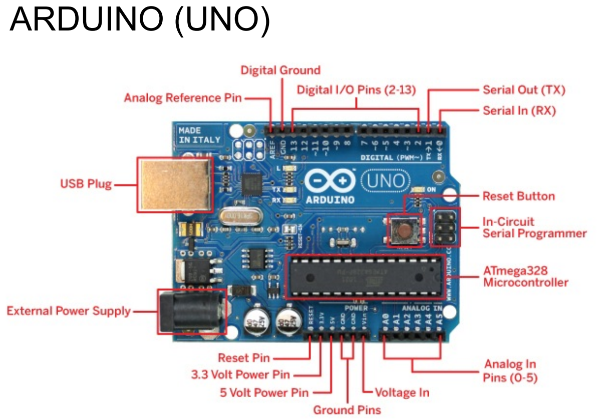
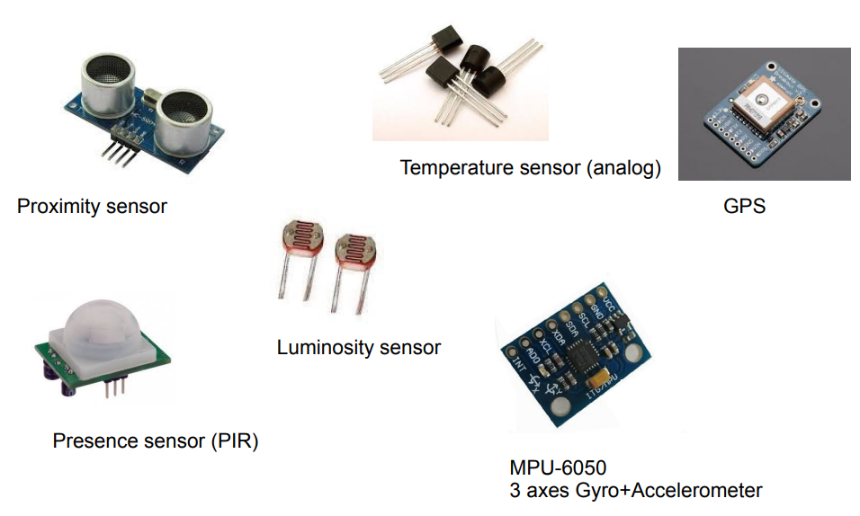
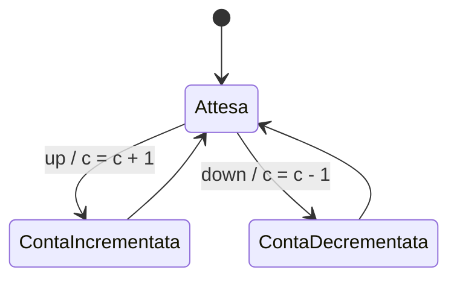
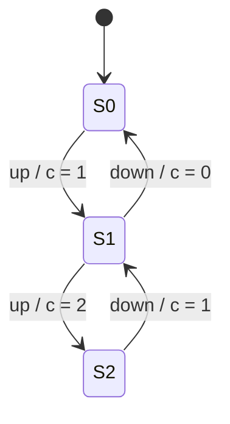
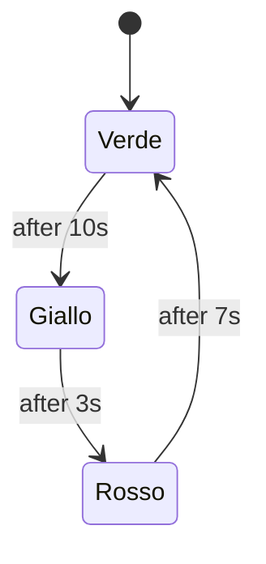
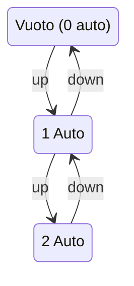

<script type="text/javascript" async
  src="https://cdnjs.cloudflare.com/ajax/libs/mathjax/2.7.7/MathJax.js?config=TeX-MML-AM_CHTML">
</script>
<script type="text/javascript" src="http://cdn.mathjax.org/mathjax/latest/MathJax.js?config=TeX-AMS-MML_HTMLorMML"></script>
<script type="text/x-mathjax-config"> MathJax.Hub.Config({ tex2jax: {inlineMath: [['$', '$']]}, messageStyle: "none" });</script>

# IOT

<div style="page-break-after: always;"></div>

- [IOT](#iot)
  - [Sistemi Embedded](#sistemi-embedded)
  - [Microcontrollori](#microcontrollori)
  - [Setting, Writing, Reading a Pin in Wiring](#setting-writing-reading-a-pin-in-wiring)
  - [Sensori ed Attuatori](#sensori-ed-attuatori)
  - [OOP per Sistemi Embedded](#oop-per-sistemi-embedded)
  - [Architetture Task-Based](#architetture-task-based)
  - [Event-Based Architetture](#event-based-architetture)
  - [FSM Asincrone](#fsm-asincrone)
  - [Embedded basati su SoC e RTOS](#embedded-basati-su-soc-e-rtos)
  - [Internet of Things (IoT)](#internet-of-things-iot)
  - [Tecnologie e Protocolli di Comunicazione Wirless](#tecnologie-e-protocolli-di-comunicazione-wirless)
  - [Protocolli IoT – CoAP e MQTT](#protocolli-iot--coap-e-mqtt)

<div style="page-break-after: always;"></div>


## Sistemi Embedded

**Definizione di Sistemi Embedded**
I sistemi embedded sono sistemi informatici a scopo speciale, progettati per svolgere una funzione o un compito specifico all'interno di dispositivi o sistemi fisici/elettronici.
Caratteristiche principali:
- Interazione con il mondo fisico tramite sensori e attuatori.
- Struttura composta da **hardware e software**, anche se in alcuni casi il software può mancare.

**Applicazioni dei Sistemi Embedded**
I sistemi embedded trovano applicazione in diversi settori:
- **Elettrodomestici**: dispositivi smart per la casa (es. termostati Nest, serrature Kevo).
- **Automotive**: controllo motore, sistemi di sicurezza.
- **Avionica**: controllo di volo, navigazione.
- **Industria**: automazione industriale, Industry 4.0.
- **Sanità**: dispositivi medici (es. WristOx).
- **Dispositivi mobili e indossabili**: smartwatch, braccialetti fitness.

**Caratteristiche dei Sistemi Embedded**
- **Funzionalità specifica**: progettati per un'applicazione particolare.
- **Esecuzione continua**: spesso funzionano in loop infinito.
- **Progettazione robusta**: devono essere affidabili e ottimizzati in termini di risorse.
- **Vincoli stringenti**: limitazioni su CPU, memoria, consumo energetico.
- **Metriche di progettazione**:
  - Costo (inclusi i costi NRE - Non-Recurring Engineering)
  - Dimensioni, prestazioni, efficienza energetica
- **Sistemi critici**:
  - Elevata affidabilità e disponibilità
  - Sicurezza e protezione (safety & security)
- **Reattività e real-time**:
  - Devono rispondere agli stimoli dell'ambiente entro un limite di tempo prestabilito.
  - Nei sistemi hard real-time, il mancato rispetto della scadenza porta al fallimento del sistema.

**Sistemi Cyber-Fisici (CPS)**
I CPS integrano computazione con processi fisici e si distinguono dai normali sistemi di elaborazione delle informazioni per:
- **Gestione del tempo**: essenziale per la correttezza del sistema.
- **Concorrenza**: i processi fisici avvengono in parallelo.
- **Reattività e eventi asincroni**.
- **Struttura**:
  - **Parte fisica**: dispositivi, sistemi meccanici/biologici, utenti.
  - **Parte computazionale**: piattaforme di calcolo con sensori, attuatori e computer.
  - **Parte di rete**: meccanismi di connessione tra le piattaforme computazionali.

**Architettura dei Sistemi Embedded**
- **CPU (Central Processing Unit)**
- **Memoria ROM (Read-Only Memory)**
- **Memoria RAM (Random Access Memory)**
- **Sensori e dispositivi di input**
- **Attuatori e dispositivi di output**
- **Circuiteria specifica per applicazione**
- **Interfacce di comunicazione**

**Tecnologie della CPU**
Tre principali tipologie di processori:
- **Processori general-purpose**: architettura predefinita con un set di istruzioni (ISA), l'esecuzione è definita dal software.
- **Processori a scopo specifico**: circuiti digitali progettati per un compito specifico (es. ASIC - Application-Specific Integrated Circuit).
- **Processori specifici per applicazioni (ASIP)**: programmabili ma ottimizzati per una classe di applicazioni (es. microcontrollori, SoC, DSP).

**Processori a Scopo Specifico**
Diversi livelli di implementazione:
- **Full-Custom/VLSI**: progettazione completamente personalizzata.
- **Semi-custom (ASIC)**: utilizzo di livelli predefiniti.
- **PLD (Programmable Logic Device)**: dispositivi logici programmabili.

**Tipologie di PLD**
- **PLA (Programmable Logic Array)**: array di porte logiche programmabili.
- **PAL (Programmable Array Logic)**: variante semplificata del PLA.
- **FPGA (Field Programmable Gate Array)**: circuiti integrati programmabili via software, utilizzabili per logiche complesse.
  - Linguaggi di programmazione: Verilog, VHDL, LabView.

**Microcontroller Unit (MCU)**
I microcontrollori si differenziano dai microprocessori perché integrano su un unico chip tutti i componenti necessari:
- CPU, memoria persistente e volatile, canali di I/O, unità di gestione delle interruzioni e altri componenti specializzati.
- Possono essere basati su architettura **CISC** (Von Neumann) o **RISC** (es. MSP430).
- Classificati in **8, 16, 32 bit**.

**Esempi di microcontrollori**
- **Storici**: Motorola 68000, Intel 8080, Zilog Z80, Intel 8051.
- **Moderni**: Atmel AVR, Texas Instruments MSP430, Microchip PIC16C84, ARM 32-bit, PowerPC.

**Microcontrollori vs. Microprocessori**
| Caratteristica       | Microcontrollore | Microprocessore |
|--------------------|--------------------|------------------|
| Max clock speed    | 200 MHz        | 4 GHz          |
| Max MegaFLOPS     | 200            | 5000           |
| Consumo energetico | 1 W            | 50 W           |

**Single-Board Microcontroller**
Le soluzioni single-board integrano un microcontrollore e i circuiti necessari per eseguire compiti di controllo.
Esempi:
- **Arduino** (mercato consumer e maker).
- **XMC family** (industriale).

**Famiglia Arduino**



- **Arduino UNO**: Microcontrollore a 8 bit, 16 MHz, 2 KB di SRAM, 32 KB di flash memory, 14 pin digitali + 6 pin analogici.
- **Arduino Mega**: 8 bit, 16 MHz, 8 KB di SRAM, 256 KB di flash memory, 54 pin digitali + 16 pin analogici.
- **Arduino Yun**: 32 bit, 400 MHz, 64 MB di RAM, 16 MB di flash memory.
- **Arduino M0**: 32 bit, 48 MHz, 32 KB di SRAM, 256 KB di flash memory.

**ESP**
- **ESP8266**: SoC per IoT con processore a 32 bit, 80 MHz, 64 KB di RAM per istruzioni, 96 KB di RAM per dati, 16 pin GPIO, Wi-Fi integrato.
- **ESP32**: Successore dell'ESP8266 con processore dual-core a 32 bit, 160-240 MHz, 520 KB di RAM, 448 KB di ROM, 34 pin GPIO, Wi-Fi e Bluetooth integrati.

**SoC (System-on-a-Chip)**

Integra CPU, memoria, controller I/O e di rete. Esempi: Broadcom BCM2837 (Raspberry Pi 3), ARM Sitara AM335x (BeagleBone).

**Famiglia Raspberry Pi**
- **Raspberry Pi (2012)**: SoC Broadcom BCM2835, 700 MHz, 256 MB RAM.
- **Raspberry Pi 2 (2015)**: SoC Broadcom BCM2836, 900 MHz quad-core, 1 GB RAM.
- **Raspberry Pi 3 (2016)**: SoC Broadcom BCM2837, 1.2 GHz quad-core, 1 GB RAM.
- **Raspberry Pi 4 (2019)**: SoC Broadcom BCM2711, 1.5 GHz quad-core, 1-4 GB RAM.
- **Raspberry Pi 5 (2023)**: SoC Broadcom BCM2712, 2.4 GHz quad-core, 4-8 GB RAM.

**Sensori e Attuatori**
- **Sensori**: Dispositivi che misurano fenomeni fisici (temperatura, umidità, accelerazione) o chimici (fumo). Possono essere analogici o digitali.



- **Attuatori**: Dispositivi che producono effetti misurabili sull'ambiente.

**Protocolli di Comunicazione**
- **I2C, SPI, JTAG**: Protocolli di comunicazione seriale.
- **CAN-bus**: Protocollo seriale usato nel settore automobilistico.
- **UART**: Protocollo seriale asincrono per la conversione di flussi di bit paralleli in sequenziali.
- **Wireless**: Bluetooth, ZigBee, Z-Wave, LoRaWAN, Wi-Fi.

Ecco degli appunti dettagliati e ben organizzati sugli elementi dei microcontrollori, basati sul materiale che hai fornito.


## Microcontrollori

**Componenti Principali**

Un microcontrollore è un sistema integrato costituito da diversi componenti essenziali:
- **CPU** (Central Processing Unit)
- **Memoria** (Flash, SRAM, EEPROM)
- **Porte di I/O generiche** (GPIO - General Purpose Input/Output)
- **Convertitori Analogico/Digitale (ADC)**
- **Timer**
- **Bus di comunicazione seriale** (SPI, I2C, UART)
- **Clock** (per il sincronismo del sistema)
- **Circuito di alimentazione** (gestione della tensione di funzionamento)


**Architettura di Riferimento: Arduino Uno**

**Arduino Uno** è basato sul microcontrollore **ATMega328P**, con le seguenti caratteristiche:
- **CPU AVR 8-bit a 16 MHz**
- **Memoria:**
  - **Flash:** 32 KB (di cui 0.5 KB occupati dal bootloader)
  - **SRAM:** 2 KB
  - **EEPROM:** 1 KB
- **I/O:**
  - **14 pin digitali**, di cui 6 supportano **PWM**
  - **6 ingressi analogici**
- **Connettività:**
  - **Porta USB** per la programmazione e alimentazione
  - **Connettore ICSP** (In-Circuit Serial Programming)
  - **Jack di alimentazione**
  - **Pulsante di reset**
- **Alimentazione:**
  - **Tensione operativa:** 5V
  - **Tensione di ingresso raccomandata:** 7-12V
  - **Corrente massima per ogni pin I/O:** 40 mA
  - **Corrente massima sulla linea 3.3V:** 50 mA


**Architetture della CPU nei Microcontrollori**

L'architettura **Von Neumann** segue un ciclo **fetch-decode-execute**:
1. **Fetch:** preleva l'istruzione dalla memoria
2. **Decode:** decodifica l'istruzione
3. **Execute:** esegue l'operazione e aggiorna i registri/memoria

**Architettura Harvard**
- Separazione tra memoria **dati** e memoria **istruzioni**
- Usata in microcontrollori come **ATMega328P** per migliorare prestazioni e consumo energetico
- **Flash** per il codice (lettura veloce, scrittura lenta)
- **SRAM** per i dati (lettura e scrittura veloci)
- **EEPROM** per dati persistenti


**4. Memoria nei Microcontrollori**
| **Tipo di Memoria** | **Caratteristiche** |
| **Flash** | Non volatile, lettura veloce, scrittura lenta, ~100.000 cicli di scrittura |
| **SRAM** | Veloce, volatile, consuma più energia |
| **EEPROM** | Non volatile, lenta, utilizzabile con la libreria Arduino EEPROM |

**Nota**: la quantità di **SRAM** è limitata, quindi bisogna ottimizzare l'uso delle variabili.


**Programmazione dei Microcontrollori**
- Il codice viene scritto su un PC e compilato in un file **eseguibile**.
- Il programma viene trasferito al microcontrollore tramite:
  - **USB** con bootloader
  - **ICSP** (In-Circuit Serial Programming)
- Il microcontrollore esegue il codice senza un sistema operativo.

**Caso Arduino**
- Programmazione tramite **Arduino IDE** (basato su Wiring e avr-gcc)
- Linguaggio **C/C++**
- **Bootloader** per l'upload via USB (occupa 0.5 KB di memoria)
- Possibilità di usare strumenti avanzati come **AVR Libc** e **avr-objdump** per debugging.

**GPIO - General Purpose Input/Output**
- **I pin possono essere configurati come input o output**.
- **Pin digitali**: possono assumere valori **HIGH (1)** o **LOW (0)**.
- **Pin analogici**: possono leggere valori continui (0-5V su Arduino).
- Alcuni pin hanno **funzioni multiple** (es. pin 0 e 1 usati anche per la comunicazione seriale).

**GPIO su ATMega328P**
- **23 linee I/O** suddivise in **3 porte**:
  - **Porta B**: pin 8-13
  - **Porta C**: pin analogici
  - **Porta D**: pin 0-7

**Parametri operativi**
- **Tensione operativa:** 5V (Arduino) o 3.3V (ESP, Raspberry Pi)
- **Corrente massima per I/O:** 40mA (Arduino), 12mA (ESP)
- **Pull-up resistor**: resistenze interne per evitare stati indefiniti nei pin di input

**Super Loop**
Struttura di base senza uso di sistemi operativi:
```c
void setup() {
  // Inizializzazione
}

void loop() {
  // Eseguito continuamente
}
```
**Pro**:
- Semplice, efficiente, affidabile
- Non richiede un sistema operativo

**Contro**:
- Non preciso nei tempi
- Bassa flessibilità
- Alto consumo energetico se non ottimizzato


**Ciclo di Esecuzione e Prestazioni**
- **Clock ATMega328P**: 16 MHz → 1 ciclo macchina = **62.5 ns**
- **Istruzioni eseguite in 1-2 cicli** → tempo di esecuzione prevedibile
- Importante per **sistemi real-time**


**Assembly AVR**
- Il codice viene tradotto in **linguaggio macchina** tramite il compilatore:
```assembly
00000090 <setup>:
 90: 08 95    ret
00000092 <loop>:
 92: 08 95    ret
```

## Setting, Writing, Reading a Pin in Wiring

**Wiring API per la gestione dei Pin**

L'API di Wiring permette di lavorare con i pin della scheda:
- `pinMode(pin, mode)`: imposta la direzione del pin (INPUT/OUTPUT)
- `digitalWrite(pin, value)`: imposta il valore di un pin in OUTPUT
- `digitalRead(pin)`: legge il valore di un pin in INPUT

Internamente, questa API interagisce con i registri delle porte del microcontrollore.

**Esempio di OUTPUT: Blinking LED**
```cpp
#define LED_PIN 13
void setup() {
    pinMode(LED_PIN, OUTPUT);
}
void loop() {
    digitalWrite(LED_PIN, HIGH);
    delay(1000);
    digitalWrite(LED_PIN, LOW);
    delay(1000);
}
```

**Dettagli su delay()**
- `delay(ms)`: blocca l'esecuzione per il tempo specificato in millisecondi usando una busy-waiting.
- Utilizza internamente `millis()`, che restituisce il numero di millisecondi trascorsi dall'accensione del dispositivo.
- Svantaggi: riduce la reattività del sistema.

Implementazione in Wiring:
```cpp
void delay(unsigned long ms) {
    unsigned long start = millis();
    while (millis() - start <= ms);
}
```

**Esempio di INPUT/OUTPUT: Button-LED**
```cpp
const int buttonPin = 2;
const int ledPin = 13;
int buttonState = 0;
void setup() {
    pinMode(ledPin, OUTPUT);
    pinMode(buttonPin, INPUT);
}
void loop() {
    buttonState = digitalRead(buttonPin);
    if (buttonState == HIGH) {
        digitalWrite(ledPin, HIGH);
    } else {
        digitalWrite(ledPin, LOW);
    }
}
```

**Funzioni Multiplexed dei Pin**
Alcuni pin hanno funzionalità aggiuntive:
- Pin 0 e 1: interfaccia seriale TTL
- Pin 2 e 3: interrupt
- Pin 3, 5, 6, 9, 10, 11: PWM
- Pin 10, 11, 12, 13: SPI bus
- Pin 13: LED integrato
- Pin A4 e A5: I2C bus

**Segnali Analogici e ADC**
- Un segnale digitale può assumere solo due valori (HIGH/LOW, 1/0).
- Un segnale analogico può assumere qualsiasi valore in un intervallo di tensione.
- Un ADC (Analog-to-Digital Converter) converte segnali analogici in digitali.
- Arduino UNO utilizza un ADC a 10 bit, quindi converte il segnale in un valore da 0 a 1023.

API per leggere i valori analogici:
```cpp
int analogRead(int PIN);
```

Funzione per rimappare un valore in un altro intervallo:
```cpp
int map(valore, min1, max1, min2, max2);
```

**Esempio: Lettura di un Potenziometro**
```cpp
const int analogInPin = A0;
const int analogOutPin = 9;
int sensorValue = 0;
int outputValue = 0;
void setup() {
    Serial.begin(9600);
}
void loop() {
    sensorValue = analogRead(analogInPin);
    outputValue = map(sensorValue, 0, 1023, 0, 255);
    analogWrite(analogOutPin, outputValue);
    Serial.print("sensor = "); Serial.print(sensorValue);
    Serial.print("\t output = "); Serial.println(outputValue);
    delay(2);
}
```

**PWM (Pulse Width Modulation)**
- Metodo per simulare un segnale analogico su un pin digitale generando un'onda quadra.
- La tensione media dipende dal duty cycle.
- Pin PWM su Arduino: 3, 5, 6, 9, 10, 11.
- API: `analogWrite(pin, value)` (dove `value` va da 0 a 255).

Esempio: Fade di un LED
```cpp
int led = 9;
int brightness = 0;
int fadeAmount = 5;
void setup() {
    pinMode(led, OUTPUT);
}
void loop() {
    analogWrite(led, brightness);
    brightness = brightness + fadeAmount;
    if (brightness == 0 || brightness == 255) {
        fadeAmount = -fadeAmount;
    }
    delay(30);
}
```

**Interrupts su Arduino**
- Gli interrupt permettono alla CPU di reagire a eventi esterni.
- ATMega328P ha due pin per gli interrupt esterni: 2 e 3.
- Tipologie di trigger:
  - `RISING` (fronte di salita)
  - `FALLING` (fronte di discesa)
  - `CHANGE` (qualsiasi variazione)
  - `LOW` (stato basso)

Esempio:
```cpp
volatile int count = 0;
void setup() {
    attachInterrupt(digitalPinToInterrupt(2), inc, RISING);
    Serial.begin(9600);
}
void loop() {
    Serial.println(count);
}
void inc() {
    count++;
}
```

Disabilitare/abilitare interrupt:
```cpp
noInterrupts(); // Disabilita
interrupts(); // Abilita
```

Miglioramento con gestione della concorrenza:
```cpp
#define BUTTON_PIN 2
volatile int count = 0;
int prev = 0;
void setup() {
    Serial.begin(9600);
    attachInterrupt(digitalPinToInterrupt(BUTTON_PIN), inc, RISING);
}
void loop() {
    noInterrupts();
    int current = count;
    interrupts();
    if (current != prev) {
        Serial.println(current);
        prev = current;
    }
}
void inc() { count++; }
```

**Timer e Interrupt su ATMega328**
- ATMega328 ha 3 timer:
  - `timer0` e `timer2`: 8 bit
  - `timer1`: 16 bit
- Timer usati per:
  - Misurare intervalli di tempo
  - PWM
  - Timeout e allarmi
  - Multi-tasking con scheduling preemptivo
- Modalità CTC (Clear Timer on Compare Match): genera un interrupt quando il contatore raggiunge un valore predefinito.

Esempio API timer:
```cpp
unsigned long millis() {
    unsigned long m;
    uint8_t oldSREG = SREG;
    cli();
    m = timer0_millis;
    SREG = oldSREG;
    return m;
}
```

**TIMER E PWM**
- Nei microcontrollori Arduino, i timer sono utilizzati per gestire il segnale di uscita PWM.
- I timer specifici per i pin PWM sono:
  - **Timer0**: Pin 5 e 6
  - **Timer1**: Pin 9 e 10
  - **Timer2**: Pin 11 e 3

**WATCHDOG TIMER**
- Timer che conta fino a un valore specificato, quindi genera un segnale di reset per riavviare il sistema.
- Funzionamento:
  - Se il sistema funziona normalmente, il watchdog riceve periodicamente un segnale di reset.
  - Se non riceve il segnale in tempo, significa che il microprocessore potrebbe essere bloccato, quindi viene eseguito un reset.
- Ampiamente utilizzato nei sistemi embedded.

**MULTIPLEXING E INTERFERENZE**
- I timer e le interruzioni vengono utilizzati per più funzioni in Wiring.
- Possibili interferenze e malfunzionamenti se più funzioni utilizzano lo stesso timer.
- Per evitare problemi, consultare attentamente la documentazione delle API.

**GESTIONE DELL'ENERGIA**
- La maggior parte dei microcontrollori supporta la gestione energetica con modalità di basso consumo (sleep mode).
- **ATMega328P**: 5 modalità di risparmio energetico:
  1. **Idle Mode**: Ferma la CPU ma consente il funzionamento di SPI, USART, ADC, Timer, Watchdog.
  2. **ADC Noise Reduction Mode**: Ferma la CPU ma mantiene attivi ADC, interruzioni esterne, Timer2, Watchdog.
  3. **Power-save Mode**: Simile a Power-down, ma Timer2 continua a funzionare se è asincrono.
  4. **Standby Mode**: Simile a Power-down, ma l'oscillatore rimane attivo.
  5. **Power-down Mode**: Disattiva quasi tutti i clock, lasciando attive solo alcune funzioni asincrone.

**REGISTRO DI CONTROLLO MCU (MCUCR)**
- Contiene bit di controllo per la gestione dell'energia.
- **Bit 7 - SE (Sleep Enable)**: Attiva la modalità sleep.
- **Bit 6-4 - SM2..0 (Sleep Mode Select)**: Seleziona la modalità di sleep tra le 5 disponibili.

**ESEMPIO ARDUINO - MODALITÀ SLEEP**
```cpp
void sleepNow() {
  set_sleep_mode(SLEEP_MODE_PWR_DOWN);
  sleep_enable();
  attachInterrupt(0, wakeUpNow, LOW);
  sleep_mode();
  sleep_disable();
  detachInterrupt(0);
}
```

**BUS E PROTOCOLLI DI COMUNICAZIONE**
- **Parallelo**: Trasferisce più bit contemporaneamente (8-bit, 16-bit, 32-bit).
- **Seriale**: Trasmette dati bit per bit su un singolo canale.
  - **Asincrono**: Nessuna linea di clock (USB, RS-232, TTL).
  - **Sincrono**: Utilizza un segnale di clock per la sincronizzazione (I2C, SPI).

**INTERFACCIA SERIALE ASINCRONA**
- Comunicazione seriale senza segnale di clock.
- Sincronizzazione ottenuta tramite protocollo con:
  - **Baud rate** (tipico: 9600 bps, max: 115200 bps).
  - **Frame dati** (start bit, dati 5-9 bit, stop bit, bit di parità).

**ESEMPIO ASINCRONO ARDUINO - ECHO PROGRAM**
```cpp
char data;
void setup() {
  Serial.begin(9600);
}
void loop() {
  if (Serial.available()) {
    data = Serial.read();
    Serial.print(data);
  }
}
```

**I2C - BUS E PROTOCOLLO**
- Protocollo sincrono standard con solo 2 linee (SDA per dati, SCL per clock).
- Bus a 7 o 10 bit con velocità fino a 100 kbit/s in modalità standard.

**SPI - SERIAL PERIPHERAL INTERFACE**
- Protocollo seriale sincrono ad alta velocità.
- Richiede almeno 3 linee:
  - MOSI (Master Out, Slave In)
  - MISO (Master In, Slave Out)
  - SCLK (Clock)
- Può supportare più dispositivi slave con una linea CS (Chip Select) per ciascuno.


**Codice di esempio per Arduino (lettura della temperatura):**

```cpp
#include <Wire.h>
int temp_address = 72; //1001000 in decimale

void setup() {
  Serial.begin(9600);
  Wire.begin(); // Inizializzazione della libreria Wire
}

void loop() {
  Wire.beginTransmission(temp_address); 
  Wire.write(0); // Comando di lettura
  Wire.endTransmission(); 
  Wire.requestFrom(temp_address, 1); // Richiesta di 1 byte
  while(Wire.available() == 0);
  int c = Wire.read(); // Lettura del dato
  Serial.print(c);
  Serial.print("C ");
  delay(500);
}
```

**Funzioni della libreria Wire:**
- `Wire.beginTransmission`: Avvia la sessione di comunicazione con il dispositivo.
- `Wire.write`: Invia il comando per leggere il valore dal registro dati.
- `Wire.endTransmission`: Invia il segnale di fine scrittura.
- `Wire.requestFrom`: La master richiede un byte.
- `Wire.available()`: Controlla se i dati sono arrivati.
- `Wire.read()`: Legge il valore.

**Altri esempi di dispositivi I2C:**
- **MPU6050**: Sensore combinato accelerometro + giroscopio.
- **LSM330**: Sensore combinato bussola + accelerometro.

**Dispositivi SPI:**
- **LED Display**: Display a 16x2 caratteri.

**Protocollo SPI:**
- **Descrizione**: Protocollo seriale full-duplex che consente la comunicazione bidirezionale tra master e slave. Utilizza linee separate per la trasmissione e ricezione dei dati, e una linea di selezione per scegliere lo slave con cui comunicare.
- **Struttura**:
   - 3 linee di comunicazione: SCK (clock), MOSI (master out slave in), MISO (master in slave out).
   - Linea SS (Slave Select) per selezionare lo slave.

**Comunicazione SPI su Arduino (ATmega328P):**
- Pin di SPI predefiniti: 10 (SS), 11 (MOSI), 12 (MISO), 13 (SCK).

**Libreria SPI su Arduino**:
- Metodi per inizializzare e chiudere la comunicazione (`SPI.beginTransaction()` / `SPI.endTransaction()`).
- Trasferimento di dati con `SPI.transfer()`.

**Controllo di un potenziometro digitale (MCP4231)**:
- **Funzionalità**: Due potenziometri su un chip, risoluzione a 7 bit, intervallo di resistenza 0-10 kOhm.
- **Pinout**:
   - P0A, P0W, P0B per il primo potenziometro.
   - P1A, P1W, P1B per il secondo potenziometro.
   - CS per la selezione dello slave (SS).

**Comandi SPI per MCP4231**:
- 8-bit: Incremento del potenziometro.
- 16-bit: Impostazione completa del valore del potenziometro.

**Esempio di controllo della luminosità di LED con MCP4231 (2 potenziometri, 4 LED):**

```cpp
#include <SPI.h>
const int SS1 = 10; // Slave Select Chip 1
const int SS2 = 9;  // Slave Select Chip 2
const byte REG0 = B00000000; // Comando per il registro 0
const byte REG1 = B00010000; // Comando per il registro 1

void setup() {
  pinMode(SS1, OUTPUT);
  pinMode(SS2, OUTPUT);
  SPI.begin();
}

void setLed(int SS, int reg, int level) {
  digitalWrite(SS, LOW); 
  SPI.transfer(reg); 
  SPI.transfer(level); 
  digitalWrite(SS, HIGH); 
}

void loop() {
  for (int i = 0; i <= 128; i++) {
    setLed(SS1, REG0, i);
    setLed(SS1, REG1, i);
    setLed(SS2, REG0, i);
    setLed(SS2, REG1, i);
    delay(10);
  }
  delay(300);

  for (int i = 128; i >= 0; i--) {
    setLed(SS1, REG0, i);
    setLed(SS1, REG1, i);
    setLed(SS2, REG0, i);
    setLed(SS2, REG1, i);
    delay(10);
  }
  delay(300);
}
```

**Confronto tra I2C e SPI**:
- **I2C**:
   - 2 linee di comunicazione.
   - Modalità di indirizzamento slave più flessibile.
- **SPI**:
   - Può lavorare a velocità più elevate.
   - Non necessita di resistenze di pull-up.

## Sensori ed Attuatori

Gli **embedded systems** (sistemi embedded) interagiscono con l'ambiente esterno tramite sensori e attuatori.

**Sensori**
- Dispositivi trasduttori che misurano un fenomeno fisico (es. temperatura, umidità, radiazioni, ecc.) o rilevano e quantificano concentrazioni chimiche (es. gas).
- Forniscono una rappresentazione misurabile di un fenomeno su una scala o intervallo di misurazione.
  - Esempio: tensione.
- Possono essere **analogici** (se il valore elettrico prodotto in uscita, come tensione o corrente, è continuo) o **digitali** (se il valore elettrico è discreto).
- I microcontroller utilizzano un dispositivo specifico chiamato **convertitore analogico-digitale (ADC)** per convertire i segnali analogici in digitali.

**Attuatori**
- Dispositivi che producono un effetto sull'ambiente (rispetto ai sensori che rilevano fenomeni).
- Possono essere **analogici** o **digitali** (equipaggiati con un **convertitore digitale-analogico (DAC)**).


**Quantità Fisiche e Segnali**

Le **quantità fisiche** possono essere classificate in:
- **Continua**: valori che variano all'interno di un certo intervallo (es. temperatura, distanza, velocità angolare di un motore, ecc.).
- **Discreta**: possono assumere solo un set discreto di valori (es. direzione di rotazione, numero di pezzi lavorati, ecc.).

I segnali associati alle quantità fisiche possono essere:
- **Analogici**: valori continui.
- **Discreti**: ulteriormente classificabili in:
  - **Logici**: con due valori ammessi (vero/falso).
  - **Codificati**: con più di due valori, codificati in una stringa di bit.


**Principi di Funzionamento dei Sensori**

I sensori si basano su leggi fisiche che regolano la relazione tra una quantità fisica da misurare e una quantità elettrica di uscita (ad esempio, tensione).

**Esempio**: **termoresistenza** (sensore di temperatura):
- La resistività cambia al variare della temperatura. Per acquisire il segnale, è necessario fornire una corrente (o tensione) e misurare la tensione (o corrente) generata.


**Sensori - Tipologie**

In base al tipo di segnale che forniscono, i sensori si distinguono in:
- **Analogici**: forniscono un segnale elettrico continuo con risoluzione infinita.
- **Digitali**: forniscono un'informazione numerica con risoluzione finita, assumendo un numero finito di valori.
- **Logici**: con uscita booleana, di tipo vero (presenza) o falso (assenza).
- **Codificati**: uscita numerica codificata in una stringa di bit.


**Campionamento e Quantizzazione dei Segnali**

Per poter essere elaborato da un computer digitale, un segnale analogico prodotto da un sensore deve essere campionato tramite un dispositivo **convertitore analogico-digitale (ADC)**.
- **Campionamento**: leggere i campioni del segnale in tempi discreti specificati.
- **Quantizzazione**: il segnale campionato è approssimato al valore digitale più vicino.


**Incertezza e Errori di Misura**

Quando vengono effettuate più misurazioni dello stesso parametro, i valori ottenuti possono variare. Questo è dovuto a diverse cause, tra cui gli strumenti di misura e l'ambiente.

- **Incertezza di misura**: indica il livello di confidenza rispetto al risultato. Si rappresenta come un valore ± l'incertezza (errore).
- **Errori di misura**:
  - **Sistematici**: errori che si verificano in modo ripetitivo sotto le stesse condizioni.
  - **Casuali**: errori che cambiano variando le condizioni di misurazione.
  - **Gravi**: errori dovuti all'operatore o a guasti degli strumenti di misura.


**Caratteristiche Metrologiche degli Strumenti di Misura**

- **Caratteristiche statiche**: riguardano il comportamento dello strumento quando l'ingresso varia lentamente.
  - Esempi: accuratezza, precisione, linearità, sensibilità, risoluzione, ripetibilità, stabilità.
- **Caratteristiche dinamiche**: riguardano il comportamento dello strumento quando l'ingresso varia rapidamente.
  - Risposta dinamica critica in quanto può limitare la larghezza di banda dell'intero sistema di controllo.
  - **Tempo di risposta**: il tempo necessario per raggiungere una percentuale del valore finale.


**Calibrazione e Precisione**

- **Calibrazione**: processo di regolazione dei parametri del sensore per allineare i valori di uscita con quelli corretti misurati con uno strumento di riferimento.
- **Precisione**: misura di quanto un sensore è influenzato da errori casuali. Più misurazioni di un sensore preciso saranno concentrate attorno al valore medio.

**Esempio di precisione**:
- Misurazioni ripetute della dimensione di una stanza da un sonar danno valori che variano leggermente. La precisione è data dalla deviazione massima dai valori medi.


 **Comportamento Dinamico**

- Quando un segnale di ingresso è un **segnale a gradino**, la risposta del sensore varia fino a stabilizzarsi al nuovo valore.
- I tempi critici includono:
  - **Tempo di salita**: tempo per passare dal 10% al 90% del valore finale.
  - **Tempo di risposta**: tempo necessario per raggiungere una percentuale del valore finale.


**Tipi di Sensori**
I sensori si suddividono in diverse categorie, tra cui:
- **Sensori di prossimità**
- **Sensori di movimento**
- **Trasduttori di posizione angolare**
- **Sensori di accelerazione**
- **Sensori di contatto**
- **Sensori ottici**
- **Sensori di elettricità e magnetismo**
- **Sensori ambientali**
- **Sensori fisiologici/vitali**
- **Sensori acustici**
- **Sensori di localizzazione**
- **Sensori di identità**

Ogni tipologia di sensore è progettata per misurare specifiche grandezze fisiche, come temperatura, forza, pressione, posizione, velocità, intensità luminosa, ecc. 

**Wiring Libraries e Arduino Playground**
- **Wiring Libraries su sensori e attuatori**:  
  Le librerie di Wiring permettono di interfacciarsi con sensori e attuatori in modo semplice ed efficiente. Un elenco delle librerie disponibili si trova sul sito ufficiale di Wiring.  
  Link: [Wiring Libraries](http://wiring.org.co/learning/libraries/)

- **Arduino Project Hub**:  
  Una piattaforma con esempi e progetti realizzati con Arduino, dove è possibile esplorare varie applicazioni pratiche.  
  Link: [Arduino Project Hub](https://create.arduino.cc/projecthub)

**Sensori di Prossimità**

Questi sensori rilevano la presenza di oggetti a una certa distanza, senza misurarne la distanza esatta. I sensori di prossimità si basano su tecnologie diverse:
- Sonar (ultrasuoni)
- Ottico (infrarossi)
- Induttivo
- Magnetico

- **Sensori di Prossimità a Ultrasuoni**:  
  Funzionano emettendo un impulso sonar e rilevando l'eco che ritorna, utile per rilevare la presenza di un oggetto entro una distanza nominale.  
  - **Vantaggi**:  
    - Distanze nominali lunghe (fino a 10 m)
    - Non influenzati da interferenze elettromagnetiche
    - Possono rilevare oggetti di materiali diversi
  - **Svantaggi**:  
    - Risposta lenta
    - Sensibilità alla superficie dell'oggetto (orientamento)
  - Esempio: **HC-SR04**.  
    - Distanza di rilevamento: 3 cm - 6 m
    - Due pin di controllo: **Echo** e **Trig**
    - Funzionamento: L'impulso inviato sul pin **Trig** viene misurato sul pin **Echo** per calcolare la distanza.

- **Calcolo della Distanza**:  
  La distanza viene calcolata conoscendo la velocità del suono, che dipende dalla temperatura.  
  Formula:  
  $$
  d = \frac{v_s \times \Delta t}{2}
  $$
  dove:
  - $v_s$ = velocità del suono (343 m/s a 20°C)
  - $\Delta t$ = tempo di ritorno dell'eco in secondi
  - $d$ = distanza dell'oggetto

- **Esempio di Programma Arduino**:  
  Il programma utilizza la libreria **pulseIn()** per misurare il tempo di ritorno dell'impulso.  
  Ecco un esempio di codice per l'HC-SR04:
  ```cpp
  const int trigPin = 8;
  const int echoPin = 7;
  const float vs = 331.5 + 0.6 * 20;  // velocità del suono a 20°C
  
  void setup() {
    Serial.begin(9600);
    pinMode(trigPin, OUTPUT);
    pinMode(echoPin, INPUT);
  }
  
  float getDistance() {
    digitalWrite(trigPin, LOW);
    delayMicroseconds(3);
    digitalWrite(trigPin, HIGH);
    delayMicroseconds(5);
    digitalWrite(trigPin, LOW);
    
    float tUS = pulseIn(echoPin, HIGH);
    float t = tUS / 1000000.0 / 2;
    float d = t * vs;
    return d;
  }
  
  void loop() {
    float d = getDistance();
    Serial.println(d);
    delay(200);
  }
  ```

**Sensori di Prossimità Ottici**

  Questi sensori si basano sulla luce (tipicamente infrarossa) e rilevano la riflessione della luce da un oggetto.  
  - La distanza nominale è generalmente tra 10 e 100 cm, ma con un riflettore montato sull'oggetto, può arrivare fino a 50 m.
  - Esempio: **Sharp GP2Y0A41SK0F**.


**Sensori di Movimento PIR**

  I sensori PIR (Passive Infrared) rilevano variazioni nel livello di radiazione infrarossa dovuta a movimenti.  
  - Funzionano rilevando variazioni di temperatura rispetto a una situazione di riferimento.
  - Esempio di utilizzo: rilevamento di presenza umana in una stanza.
  - Link di esempio: [PIR Sensor Guide](https://learn.adafruit.com/pir-passive-infraredproximity-motion-sensor/)

**Trasduttori di Posizione Angolare**

  Rilevano la posizione angolare di un oggetto. Esistono due tipologie:
  1. **Inclinometro**: Rileva la posizione sfruttando la forza di gravità.
  2. **Encoder**: Dispositivo che converte la posizione angolare in impulsi elettrici.


**Sensori di Accelerazione e Giroscopi**

- **Accelerometri**:  
  Rilevano l'accelerazione di un oggetto. Esempio: **MPU-6050**, che combina accelerometro e giroscopio.
  
- **Giroscopi**:  
  Dispositivi che preservano una direzione fissa per il loro asse di rotazione. Utilizzati in applicazioni come la bussola digitale.

- **Tecnologia MEMS**:  
  I sensori di accelerazione e giroscopi si basano sulla tecnologia MEMS (Micro Electro-Mechanical Systems), che integra dispositivi elettronici e meccanici in un chip di silicio.


**Sensori di Contatto**

- **Pulsanti Tattile e Microswitches**:  
  I sensori di contatto rilevano la pressione fisica su un oggetto, come nel caso di un pulsante o un interruttore meccanico.

- **Potenzimetro**:  
  Sensore che cambia la resistenza e quindi il livello di tensione in un circuito in risposta a un movimento meccanico.

- **Sensori Capacitive**:  
  Rilevano la capacità elettrica creata da un oggetto vicino, senza contatto fisico diretto.


**Sensori di Pressione**

- **Sensore di Forza Sensibile (FSR)**:  
  Rileva la forza esercitata su una superficie sensibile. Esempio: sensore FSR da Adafruit.


**Sensori Ottici e Fotoelettrici**

- **Fotoresistori**:  
  Sensori che rilevano l'intensità luminosa. La resistenza dipende dalla quantità di luce percepita, con resistenza bassa in presenza di luce intensa.  
  - Esempio: Fotoresistore LDR.

- **Sensori a Diode e Fotocellule**:  
  Sensori più avanzati come i fotodiodi, che rilevano la radiazione elettromagnetica in base alla sua intensità.


**Sensori Chimici**

- **Sensori di Gas**:  
  Utilizzati per rilevare la presenza di gas specifici nell'aria, come il sensore **MQ** per il gas metano.

- **Sensori di Polvere**:  
  Rilevano la qualità dell'aria, come il **PM2.5 Air Quality Sensor**.


**Sistemi di Localizzazione**

- **GPS**:  
  Il **GPS** è un sistema di posizionamento globale che utilizza una rete di satelliti per determinare la posizione geografica.  
  - Precisione: circa metri, dipende dalle condizioni atmosferiche e dalla qualità del ricevitore.

- **RFID e NFC**:  
  Tecnologie per la localizzazione e l'identificazione basate su tag e lettori.  
  - **RFID**: Funziona su distanze da pochi cm a qualche metro.
  - **NFC**: Funziona su distanze molto brevi.

- **UWB**:  
  Tecnologia di localizzazione molto precisa (fino a pochi cm) ma costosa.


**Attuatori e Dispositivi di Uscita**

- **Transduttori di Uscita**:  
  Convertitori di energia che permettono di agire sull'ambiente fisico. Esempi di attuatori:
  - LED
  - Buzzer piezoelettrici
  - Relè (interruttori elettrici)

- **LED**:  
  Diode che emettono luce quando attraversati da corrente elettrica. Sono molto efficienti, durevoli e consumano poca energia.

**Display LCD**

I display LCD (Liquid Crystal Display) funzionano grazie alle proprietà ottiche dei cristalli liquidi, che sono intrappolati tra due superfici di vetro dotate di numerosi contatti elettrici. Questi contatti generano un campo elettrico che influisce sui cristalli liquidi, controllando così la visualizzazione delle immagini.

- **Proprietà**:
  - Basso consumo energetico, molto utile per i sistemi embedded.
  - Ogni contatto elettrico controlla una piccola porzione del pannello, corrispondente a un pixel (o subpixel in uno schermo a colori).
  
**Esempio di Display LCD**
Un esempio comune è il display LCD 16x2, che ha 16 colonne e 2 righe, con un singolo connettore a 16 pin. Tutti i display LCD paralleli hanno lo stesso pinout e possono essere collegati a un Arduino in vari modi, ad esempio:
- **Modalità a 8 pin**: 6 pin digitali devono essere collegati ai pin digitali dell'Arduino + 2 pin per VCC e GND.
- **Modalità a 6 pin**: 4 pin sono usati per inviare i dati e i restanti 2 per il controllo.

**Programmazione**:
- La libreria LiquidCrystal è inclusa nell'IDE di Arduino, con una versione che supporta anche I2C. Le funzionalità includono il controllo del cursore, lo scorrimento del testo, e la creazione di caratteri personalizzati.

**Esempio di codice per Arduino**:
```cpp
#include <LiquidCrystal.h>
int time = 0
LiquidCrystal lcd(2, 3, 4, 5, 6, 7);
void setup()
{
 lcd.begin(16, 2); 
 lcd.print("Cesena");
}
void loop()
{
 lcd.setCursor(0,1);
 lcd.print(time);
 delay(1000);
 time++;
}
```

**Motori Elettrici**

I motori elettrici sono dispositivi che convertono l'energia elettrica in un effetto meccanico (movimento). Un motore elettrico è composto principalmente da due parti:
- **Stator**: la parte fissa del motore.
- **Rotor**: la parte mobile, che include l'albero.

**Tipologie di motori elettrici**:
- Motori a corrente continua (DC)
- Motori passo-passo (stepper)
- Servomotori

**Motori a Corrente Continua (DC)**

Utilizzati in progetti in cui è necessario:
- Rotazione continua
- Controllo della velocità angolare
- Movimenti a 360° completi.

**Principio di funzionamento**:
Il motore DC sfrutta un campo magnetico generato dalla corrente che passa in una bobina avvolta attorno a un nucleo di ferro. Un commutatore permette di alternare l'energia elettrica tra le bobine, creando un campo magnetico rotante che interagisce con il campo magnetico dei magneti fissi nello statore, facendo ruotare l'albero.

**Esempio di motore per Arduino**:
Motore Hobby 711696 con ingranaggi:
[Link al prodotto](http://www.robot-italy.com/it/hobby-motor-gear.html)

**Motore Passo-Passo (Stepper)**

Un motore passo-passo è un motore brushless che divide la rotazione in passi precisi, consentendo un controllo molto preciso della posizione dell'albero. Utilizzato in applicazioni come:
- Stampanti 3D
- Macchine a controllo numerico
- Controllo degli arti nei robot

**Servomotori**

I servomotori permettono un controllo preciso della posizione dell'albero, ma a differenza dei motori passo-passo, la posizione è assoluta, non relativa all'attuale posizione dell'albero. La gamma di rotazione è limitata a 180° (non a 360° come nei motori DC).

**Esempio di servo economico**:
Servomotore HS-53 Microservo:
[Link al prodotto](http://www.robot-italy.com/it/hs-53-microservo.html)

**Controllo dei Servomotori**:
Il controllo avviene inviando un segnale di impulsi digitali a una frequenza di circa 50 Hz, dove la durata dell'impulso determina l'angolo di rotazione. La durata dell'impulso varia tipicamente da 1 ms per -90° a 2 ms per +90°.

**Controllo del Motore con Arduino**:

Ecco un esempio di codice per controllare un servomotore in Arduino:
```cpp
int servoPin = 2;
void pulseServo(int servoPin, int pulseLen)
{
 digitalWrite(servoPin, HIGH);
 delayMicroseconds(pulseLen);
 digitalWrite(servoPin, LOW);
 delay(15);
}
int c;
enum { MINUS_90, PLUS_90 } state;
void setup()
{
 pinMode(servoPin, OUTPUT);
 state = MINUS_90;
 Serial.begin(9600);
 c = 0;
}
void loop(){
 c++;
 switch (state) {
 case MINUS_90:
 pulseServo(servoPin, 250);
 if (c > 100){
 Serial.println("--> +90");
 state = PLUS_90;
 c = 0;
 }
 break;
 case PLUS_90:
 pulseServo(servoPin, 2250);
 if (c > 100){
 Serial.println("--> -90");
 state = MINUS_90;
 c = 0;
 }
 }
}
```

**Motori a Corrente Continua (DC) con PWM**:

I motori DC sono disponibili in due tipi:
- **Brushless (stepper)**
- **Brushed (spazzolati)**

I motori brushed sono meno costosi ma hanno una durata inferiore. La velocità di rotazione si controlla cambiando la tensione ai terminali, mentre la direzione si inverte invertendo la tensione.

**Controllo della velocità con Arduino tramite PWM**:
Per controllare la velocità di un motore DC, si utilizza un segnale PWM che regola il duty cycle, ovvero la percentuale del tempo in cui il segnale è alto.

Ecco un esempio di codice Arduino:
```cpp
const int MOTOR = 9;
void setup() {
 pinMode(MOTOR, OUTPUT);
}
void loop() {
 for (int i = 0; i < 256; i++) {
 analogWrite(MOTOR,i);
 delay(10);
 }
 delay(2000);
 for (int i = 255; i >= 0; i--) {
 analogWrite(MOTOR,i);
 delay(10);
 }
 delay(2000);
}
```

**Controllo della Direzione con H-Bridge**:
Per invertire la direzione di un motore, si utilizza un circuito H-bridge che include quattro transistor. Questo circuito permette di controllare la direzione e la velocità di un motore DC.

Ecco un esempio di codice per controllare la direzione del motore con un H-bridge:
```cpp
const int EN = 9; // Half bridge Enable
const int MC1 = 3; // Motor Control 1
const int MC2 = 2; // Motor Control 2
const int POT = 9; // POT on Analog pin 0
int val = 0; // Valore del potenziometro
int velocity = 0; // Velocità desiderata

void forward(int rate) {
 digitalWrite(EN, LOW);
 digitalWrite(MC1, HIGH);
 digitalWrite(MC2, LOW);
 analogWrite(EN, rate);
}

void backward(int rate) {
 digitalWrite(EN, LOW);
 digitalWrite(MC1, LOW);
 digitalWrite(MC2, HIGH);
 analogWrite(EN, rate);
}

void brake() {
 digitalWrite(EN, LOW);
 digitalWrite(MC1, LOW);
 digitalWrite(MC2, LOW);
 digitalWrite(EN, HIGH);
}

void loop() {
 val = analogRead(POT);
 if (val > 562) {
 velocity = map(val, 563, 1023, 0, 255);
 forward(velocity);
 } else if (val < 462) {
 velocity = map(val, 0, 461, 0, 255);
 forward(velocity);
 } else {
 brake();
 }
}
```

**Controllo di Circuiti Esterni**

Per controllare circuiti esterni, inclusi quelli alimentati a corrente alternata (AC), i microcontrollori possono usare dispositivi elettronici come interruttori, ad esempio transistor, relè o optocoupler.

**Relè**:
Un relè è un interruttore elettromeccanico che può aprire o chiudere un circuito ad alta tensione, come quelli che gestiscono l'AC, ma controllato tramite il microcontrollore.


**Problema**

I sensori e gli attuatori possono operare a due diversi livelli di tensione: generalmente 5V (ad esempio con Arduino) e 3,3V (ad esempio con ESP32, Raspberry Pi, ecc.). Quando è necessario interfacciare sensori o attuatori che lavorano a 3,3V con schede MCU che operano a 5V, è fondamentale adottare strategie specifiche per evitare di danneggiare i componenti.

Questo problema si presenta anche quando si collegano sistemi tramite bus seriali, come ad esempio collegando un Arduino e un ESP tramite seriale asincrona o sincrona.

- **Seriale Asincrona:**
  - **TX (ESP)** => **RX (Arduino)**: Non c'è problema, poiché il livello di 3,3V è sufficiente per essere interpretato come un segnale alto su Arduino.
  - **TX (Arduino)** => **RX (ESP)**: Qui sorge un problema! 5V in ingresso sull'ESP può danneggiare la scheda.

Una soluzione possibile per affrontare questo problema è l'uso di **partitori di tensione**.

**Partitore di Tensione**

Un partitore di tensione è un circuito che permette di ridurre una tensione di ingresso (ad esempio 5V) a una tensione di uscita inferiore (ad esempio 3,3V). 

La relazione fondamentale per ottenere una tensione di uscita $V_{out}$ è data dalla formula:

$$
V_{out} = V_{in} \times \frac{R_2}{R_1 + R_2}
$$

Dove:
- $R_1$ e $R_2$ sono le resistenze del circuito.
- $V_{in}$ è la tensione di ingresso (ad esempio 5V).
- $V_{out}$ è la tensione di uscita desiderata (ad esempio 3,3V).

**Importante:**
- La chiave per ottenere una corretta tensione di uscita è il **rapporto tra le resistenze**, non i loro valori assoluti.
- Tuttavia, i valori assoluti delle resistenze influenzano la corrente che attraversa il circuito, quindi devono essere scelti in modo appropriato per non sovraccaricare il circuito.
- Utilizzando i partitori di tensione, possiamo connettere dispositivi a 5V (come Arduino) con dispositivi a 3,3V (come l'ESP32), evitando danni ai componenti elettronici a causa di livelli di tensione incompatibili.

## OOP per Sistemi Embedded

Esistono due principali approcci alla modellazione:

1. **Approccio Top-Down**  
   - Parte dalla modellazione del dominio utilizzando paradigmi ad alto livello, come la programmazione orientata agli oggetti (OO).  
   - Permette di astrarre dalle caratteristiche specifiche dell’hardware e concentrarsi su concetti generali e riutilizzabili.  
   
2. **Approccio Bottom-Up**  
   - Parte dalle caratteristiche hardware e dai concetti legati al loro funzionamento.  
   - Si focalizza sulla gestione diretta delle risorse hardware, spesso con un impatto sulla portabilità e sulla manutenibilità del codice.  

In questo modulo viene adottato l’approccio **Top-Down**, che consente di sviluppare sistemi in modo più strutturato e scalabile.

**Paradigmi di Programmazione e Modellazione**
- I paradigmi di programmazione, come l'OO, sono prima di tutto **paradigmi di modellazione**.  
- Definiscono come **concettualizzare, rappresentare e modellare un sistema**.  
- Consentono di **analizzare un problema** e di definire una soluzione all’interno di un determinato dominio applicativo.  

**Il Concetto di Modello**
- Un **modello** è una rappresentazione delle caratteristiche rilevanti di un sistema, astratta dagli aspetti non essenziali.  
- Un modello considera tre dimensioni fondamentali:  
  1. **Struttura** → quali sono le parti che compongono il sistema.  
  2. **Comportamento** → come si comportano le singole componenti.  
  3. **Interazione** → come le parti interagiscono tra loro.  

C'è una forte relazione tra modellazione e programmazione, come evidenziato dagli studi della scuola scandinava, in particolare quelli di **Ole Lehrmann Madsen**.

**Importanza della Modellazione**
L’uso della modellazione prima dell’implementazione presenta diversi vantaggi:
- **Comprensione più chiara del sistema** e gestione della complessità.  
- **Riutilizzabilità** e **portabilità** del codice.  
- **Estensibilità**, ovvero la possibilità di aggiungere nuove funzionalità senza modificare l’intero sistema.  
- **Maggiore rigore** nella verifica della correttezza del sistema.  

**Paradigmi di Modellazione**
- Definiscono concetti e principi per creare modelli strutturati.  
- Esempio: **Paradigma a Oggetti (OO)** → basato su classi, oggetti, incapsulamento, ereditarietà e polimorfismo.  

**Linguaggi di Modellazione**
- Permettono di rappresentare i modelli in modo rigoroso e non ambiguo.  
- Esempio: **UML (Unified Modeling Language)**, fortemente ispirato al paradigma OO, in particolare per la modellazione della **struttura** e delle **interazioni** tra componenti.  

**Paradigma Object-Oriented (OO)**
- È il principale paradigma utilizzato nella modellazione e programmazione software.  
- Fornisce un elevato livello di astrazione per rappresentare gli aspetti essenziali del problema.  
- Favorisce proprietà fondamentali come:
  - **Modularità** → divisione del codice in parti indipendenti e riutilizzabili.  
  - **Incapsulamento** → nasconde i dettagli interni degli oggetti.  
  - **Meccanismi di riuso ed estensibilità**.  

**Aspetti non direttamente coperti dal paradigma OO**  
- **Concorrente e interazioni asincrone** tra componenti.  
- **Sistemi distribuiti**, dove diversi elementi collaborano in ambienti differenti.  

**Modellazione del Software Embedded**
1. **Controller**  
   - Contiene la logica di controllo e applicativa.  
   - Accede e utilizza le risorse del sistema (sensori, attuatori, ecc.).  
   - È un **componente attivo**, basato su un'architettura di controllo.  

2. **Elementi controllati**  
   - Sono le risorse e i dispositivi gestiti dal controller (es. **I/O, sensori, attuatori**).  
   - Hanno interfacce ben definite e possono essere osservati o controllati.  
   - Sono **componenti passivi** che forniscono funzionalità al controller.  

**Esempio: Sistema Button-Led**

- **Button (Interfaccia)**  
  ```cpp
  class Button {
  public:
    virtual bool isPressed() = 0;
  };
  ```

- **Led (Interfaccia e Implementazione)**  
  ```cpp
  class Light {
  public:
    virtual void switchOn() = 0;
    virtual void switchOff() = 0;
  };

  class Led: public Light {
  public:
    Led(int pin);
    void switchOn();
    void switchOff();
  private:
    int pin;
  };
  ```

**Ciclo di Controllo**

Il **controller** utilizza un **super-loop** per verificare continuamente lo stato del pulsante:

```cpp
bool lightOn = false;

void loop() {
  bool isPressed = button->isPressed();

  if (!lightOn && isPressed) {
    light->switchOn();
    lightOn = true;
  } else if (lightOn && !isPressed) {
    light->switchOff();
    lightOn = false;
  }
}
```

**Smart Light System**

Un'evoluzione del sistema Button-Led prevede:
- **Sensore di movimento** per rilevare la presenza di persone.  
- **Sensore di luce** per verificare l'intensità luminosa dell’ambiente.  
- **Controller intelligente** per gestire la logica di accensione e spegnimento automatico.  

**Modello a Oggetti**

- **MovementDetector (Interfaccia)**
  ```cpp
  class MovementDetector {
  public:
    virtual bool detected() = 0;
  };
  ```

- **LightDetector (Interfaccia)**
  ```cpp
  class LightDetector {
  public:
    virtual double getIntensity() = 0;
  };
  ```

- **SmartLightController (Ciclo di Controllo)**
  ```cpp
  bool lightOn = false;

  void loop() {
    bool detected = movementDetector->detected();
    double intensity = lightSensor->getIntensity();
    bool isLowIntensity = intensity < LIGHT_THRESHOLD;

    if (!lightOn && detected && isLowIntensity) {
      light->switchOn();
      lightOn = true;
    } else if (lightOn && (!isLowIntensity || !detected)) {
      light->switchOff();
      lightOn = false;
    }
  }
  ```

**Approccio Agenti per il Controllo**
- Il **controller** è un'entità **attiva**, con un proprio flusso di controllo.  
- Gli **agenti** sono concetti chiave nella modellazione OO dei sistemi embedded.  
- Un **agente**:
  - È autonomo e reattivo.  
  - Incapsula un comportamento proattivo.  
  - Percepisce l’ambiente attraverso sensori e agisce tramite attuatori.  

**Dai Sistemi Individuali ai Sistemi Multi-Agente**
- Nei sistemi **distribuiti** (es. **IoT, smart home, smart city**), più agenti collaborano.  
- I **Multi-Agent Systems (MAS)** permettono di modellare interazioni e cooperazioni complesse.  

**OOP**

I modelli per i sistemi embedded comprendono sia **componenti discreti** che **continui**:
- I **componenti continui** evolvono in modo fluido nel tempo.
- I **componenti discreti** cambiano stato in maniera brusca, con transizioni **atomiche**.

Le dinamiche fisiche del sistema possono essere modellate con:
- **Equazioni differenziali** o **integrali** (per i componenti continui).
- **Macchine a stati finiti (FSM)** (per i componenti discreti).

In questo corso, ci focalizziamo sui **sistemi embedded composti principalmente da componenti discreti**, modellandoli con le **Finite State Machines (FSM)**.

**Esempio: Contatore di un parcheggio**

Un sistema che conta il numero di auto presenti in un parcheggio può essere modellato con tre sottosistemi principali:

1. **ArrivalDetector**: genera un evento quando arriva un'auto.
2. **DepartureDetector**: genera un evento quando un'auto esce.
3. **Counter**: mantiene il conteggio aggiornato e produce un evento di output ogni volta che il conteggio cambia.

Ogni ingresso o uscita è modellata come un **evento discreto**.

**Modello della FSM per il Contatore**



- Lo stato **Attesa** rappresenta il sistema in attesa di eventi.
- Se arriva un'auto (**up**), il conteggio viene incrementato.
- Se un'auto esce (**down**), il conteggio viene decrementato.
- Dopo ogni aggiornamento del conteggio, il sistema ritorna allo stato di attesa.

**Segnali di Input e Output**

I segnali di input **u** (arrivo auto) e **d** (partenza auto) possono essere modellati come funzioni:

$$
u: \mathbb{R} \rightarrow \{ assente, presente \}
$$

- Se $u(t) = presente$, significa che si è verificato un evento in quell'istante.
- Se $u(t) = assente$, non ci sono eventi.

Il segnale di output **c** (conteggio) è invece rappresentato come:

$$
c: \mathbb{R} \rightarrow \{ assente \} \cup \mathbb{N}
$$

- Quando un evento di input è presente, **c** assume un valore numerico.
- Altrimenti, **c** è assente.

**Dinamica del Sistema: Reazioni**

Le **reazioni** descrivono l'evoluzione del sistema in base agli eventi:
- Ogni reazione è **istantanea** (tempo di durata pari a zero).
- Una reazione può essere **event-triggered** o **time-triggered**.

Nel caso del contatore del parcheggio:
- Il sistema reagisce quando si verifica un evento **up** o **down**.
- Se entrambi gli input sono assenti, il sistema **non cambia stato**.

**Definizione di Stato**

Lo **stato** di un sistema è la sua condizione in un dato istante e determina la sua reazione agli input.

$$
state: \mathbb{R} \rightarrow \{ 0, 1, 2, ... M \}
$$

- Nel nostro caso, lo stato è il numero di auto nel parcheggio (tra **0 e M** posti disponibili).

**Transizioni e Azioni nelle FSM**

Le **transizioni** determinano la dinamica della FSM e dipendono da:
- **Guardie** (condizioni di attivazione).
- **Azioni** (output generato dalla transizione).

Esempio di FSM per il contatore del parcheggio:



**FSM Sincrone e Asincrone**

Le FSM possono essere classificate in:
1. **FSM Asincrone (Event-Triggered)**
   - La reazione avviene **quando si verifica un evento di input**.
   - Il sistema reagisce in momenti **non predeterminati**.
  
2. **FSM Sincrone (Time-Triggered)**
   - Le reazioni avvengono **a intervalli di tempo regolari** (periodo fisso).
   - Il periodo determina la **frequenza di esecuzione** della macchina.

Esempio di FSM per un semaforo pedonale sincrono (**periodo = 1s**):



**Esempio di Implementazione di una FSM in C**

Ecco un esempio di codice per implementare una FSM in un **microcontrollore**:

```c
enum States { OFF, ON } state;

void setup() {
    state = OFF;
}

void step() {
    switch (state) {
        case OFF:
            if (button.isPressed()) {
                light.switchOn();
                state = ON;
            }
            break;
        case ON:
            if (!button.isPressed()) {
                light.switchOff();
                state = OFF;
            }
            break;
    }
}

void loop() {
    step();
}
```

**Macchine di Mealy e Moore**

Esistono due principali modelli di FSM:
- **Macchina di Mealy**: le uscite dipendono sia dallo stato attuale che dagli input.
- **Macchina di Moore**: le uscite dipendono solo dallo stato attuale.

Esempio di **Moore Machine** per il contatore del parcheggio:



In questo caso, il valore di output è determinato solo dallo **stato corrente**.

**FSM Temporizzate: Gestione del Tempo**

Le FSM temporizzate gestiscono eventi **periodici**. Un esempio è il **blinking LED** su un microcontrollore Arduino:

```c
#include "Led.h"
#include "Timer.h"
#define LED_PIN 13

Light* led;
Timer timer;
enum { ON, OFF } state;

void step() {
    switch (state) {
        case OFF:
            led->switchOn();
            state = ON;
            break;
        case ON:
            led->switchOff();
            state = OFF;
            break;
    }
}

void setup() {
    led = new Led(LED_PIN);
    state = OFF;
    timer.setupPeriod(500); // 500 ms
}

void loop() {
    timer.waitForNextTick();
    step();
}
```

**Conclusioni**
- Le **Finite State Machines (FSM)** sono uno strumento potente per modellare sistemi embedded.
- Le **FSM sincrone** sono utili per sistemi con vincoli temporali.
- Le **FSM estese (EFSM)** permettono di gestire stati complessi con variabili.

## Architetture Task-Based

Nell'ambito della progettazione di sistemi embedded complessi, uno dei problemi principali è la modellazione e il design del software. La sfida consiste nel trovare metodi appropriati per decomporre e modularizzare il comportamento e le funzionalità del sistema, in modo da gestire la complessità crescente. Un'architettura task-based scompone il comportamento del software embedded in una serie di task concorrenti, dove ogni task rappresenta una specifica unità di lavoro ben definita. Ogni task può essere descritto mediante una Macchina a Stati Finita (FSM) e il comportamento complessivo del sistema è dato dall'interazione e dall'esecuzione parallela di queste FSM. Un esempio è il "LED-Show", dove più LED operano con logiche differenti:

1. **Un LED singolo** lampeggia con un periodo di 500 ms.
2. **Altri tre LED** si accendono e spengono in sequenza, con intervalli di 500 ms.

Questa configurazione può essere rappresentata come un unico task/FSM, ma il modello diventa più semplice se si dividono i comportamenti in due task distinti, riducendo il numero di stati e transizioni.

**Diagramma a Blocchi e Vantaggi della Decomposizione in Task**

Ogni task può essere rappresentato come un blocco rettangolare che mostra le variabili di input e output, facilitando così la modularità. Grazie a questa decomposizione, si ottengono i seguenti vantaggi:

- **Modularità**: ogni task è un modulo indipendente, con interfacce definite dagli input/output condivisi con altri task.
- **Riduzione della complessità**: il task singolo è meno complesso rispetto al comportamento globale.
- **Facilità di debugging** e **riutilizzabilità** del codice.

**Sfide della Concorrenza tra Task**

Dato che i task operano in parallelo, il loro flusso di controllo logico può sovrapporsi nel tempo. Per gestire questa concorrenza, è necessario implementare meccanismi di coordinamento e interazione basati su variabili e oggetti condivisi.

**Implementazione delle Architetture Task-Based**

**Classe Base Astratta Task**

Per rappresentare i task in maniera modulare, si utilizza una classe astratta `Task`, con due metodi principali:

- `init()`: inizializza il task, chiamato una volta.
- `tick()`: incapsula il comportamento del task, richiamato periodicamente.

Ogni task concreto estende questa classe e implementa il proprio comportamento all’interno di `tick()`. In questo modo, i task possono essere gestiti da un loop principale che periodicamente invoca `tick()`.

**Esempio Implementativo: LED-Show su Arduino**
Di seguito, una versione implementativa del "LED-Show" su Arduino:

1. **BlinkTask**: rappresenta un LED che lampeggia.
   ```cpp
   class BlinkTask: public Task {
       int pin;
       Light* led;
       enum { ON, OFF } state;
       ...
       void tick() {
           switch (state) {
               case OFF: led->switchOn(); state = ON; break;
               case ON:  led->switchOff(); state = OFF; break;
           }
       }
   };
   ```

2. **ThreeLedsTask**: gestisce tre LED in sequenza.
   ```cpp
   class ThreeLedsTask: public Task {
       int pin[3];
       Light* led[3];
       int state;
       ...
       void tick() {
           led[state]->switchOff();
           state = (state + 1) % 3;
           led[state]->switchOn();
       }
   };
   ```

3. **Main Loop**: gestisce i task con un timer che richiama i metodi `tick` periodicamente.
   ```cpp
   void setup() {
       blinkTask.init();
       threeLedsTask.init();
       timer.setupPeriod(500);
   }
   void loop() {
       timer.waitForNextTick();
       blinkTask.tick();
       threeLedsTask.tick();
   }
   ```

**Scheduler Cooperativo e Gestione di Periodi Diversi**

Quando si ha la necessità di gestire task con periodi differenti, è utile implementare uno scheduler cooperativo che tenga traccia dei task da eseguire e li chiami al proprio periodo specifico. Lo scheduler utilizza una strategia **round-robin cooperativa**, con un periodo base pari al massimo comun divisore dei periodi dei task. Ad ogni periodo base, lo scheduler richiama `tick()` per ciascun task.

**Implementazione del Scheduler**
Lo scheduler è definito dalla classe `Scheduler`:
   ```cpp
   class Scheduler {
       int basePeriod;
       Task* taskList[MAX_TASKS];
       ...
       void schedule() {
           timer.waitForNextTick();
           for (int i = 0; i < nTasks; i++) {
               if (taskList[i]->updateAndCheckTime(basePeriod)) {
                   taskList[i]->tick();
               }
           }
       }
   };
   ```

**Esempio di Sistema Motion-Triggered Lamp**

Consideriamo un sistema embedded che accende un LED al rilevamento di un movimento. È progettato come segue:

- Un sensore rileva il movimento (P4) e attiva il LED collegato (P2) quando il movimento è rilevato due volte consecutive (200 ms).
- La luce rimane accesa per 10 secondi dopo l’ultimo rilevamento.
- Un altro LED lampeggia (P3) con un periodo di 200 ms mentre il movimento è rilevato.

I task necessari sono:
1. `DetectMotion`
2. `IlluminateLamp`
3. `BlinkLed`

**Variabili Condivise, Azioni Atomiche e Condizioni di Gara**

Quando più task utilizzano variabili condivise, si rischiano condizioni di gara nelle letture/scritture concorrenti. Nella nostra architettura cooperativa, ogni esecuzione di `tick()` è **atomica** per l’intero sistema, ma l’interleaving delle chiamate tra task può introdurre condizioni di gara a livello logico.

**Modalità Sleep per Risparmio Energetico**

Con un periodo abbastanza ampio, lo scheduler può sfruttare la modalità sleep per risparmiare energia. Dopo l’esecuzione dei task, il sistema va in sleep fino al prossimo tick del timer.

**Analisi dell’Esecuzione: Utilizzo della CPU e WCET**

Nei sistemi FSM sincroni, si suppone che le azioni siano istantanee. Tuttavia, in un sistema reale, bisogna considerare la durata reale delle azioni per evitare eccezioni di overrun. Il parametro di **utilizzo della CPU (U)** è la percentuale di tempo in cui la CPU è utilizzata per eseguire un task, calcolata come:

$$
U = \left(\frac{\text{tempo utilizzato dal task}}{\text{tempo totale}}\right) * 100\%
$$

**Esempio di Calcolo di U con più Task**

Per il caso di più task con lo stesso periodo, il WCET totale è la somma dei WCET di ciascun task. Ad esempio, nel caso del LED-Show con `BlinkLed` e `ThreeLeds`, entrambi con periodo 500 ms:

- **WCET** per `BlinkLed` = 3 istruzioni → 0.03 s.
- **WCET** per `ThreeLeds` = 9 istruzioni → 0.09 s.
- **Utilizzo della CPU U** = $\frac{0.03 + 0.09}{0.5} = 24\%$

Se il WCET totale superasse il 100%, si verificherebbe un **overrun**, che può essere risolto aumentando il periodo della FSM, ottimizzando il codice, utilizzando un MCU più veloce, o rimuovendo funzionalità.

**Gestione di Task con Periodi Diversi**

Per task con periodi diversi, si calcola il WCET sull’**iperperiodo** (minimo comune multiplo dei periodi). Ad esempio, per `BlinkLed` con periodo 300 ms e `ThreeLeds` con periodo 200 ms, l'iperperiodo è 600 ms, in cui `BlinkLed` viene eseguito 2 volte e `ThreeLeds` 3 volte. Il parametro U diventa:

$$
U = \frac{(2 \times 20 \text{ms} + 3 \times 90 \text{ms})}{600 \text{ms}} = 55\%
$$

L'approccio task-based semplifica la gestione di sistemi embedded complessi grazie a modularità, facilità di debugging e possibilità di riutilizzo. Tuttavia, richiede una gestione attenta delle variabili condivise, del consumo energetico e dell’utilizzo della CPU per evitare overrun e garantire l’affidabilità del sistema.

## Event-Based Architetture

**Dalgli interrupt alle Architetture Basate su Eventi**  

**Concetti chiave:**  

- Il **meccanismo di interrupt** può essere sfruttato per progettare architetture basate su eventi.  
- Gli **interrupt** possono essere visti come eventi di basso livello che interrompono il flusso di controllo di un **super-loop** per eseguire il relativo gestore di eventi.  
- L'uso degli interrupt permette di **evitare il polling** nella gestione dei sensori e degli input, migliorando l'efficienza:  
  - Non è il processore a controllare continuamente lo stato del sensore, ma è il sensore stesso a **notificare** il cambiamento quando avviene.  
- **Architetture basate su eventi di alto livello** includono:  
  - **Observer pattern**  
  - **FSM asincrone (Finite State Machines asincrone)**  

**Observer Pattern**  

**Elementi principali:**  

1. **Sorgente o generatore di eventi**  
   - Fornisce un’interfaccia/API per permettere agli osservatori (listener) di registrarsi e ricevere notifiche sugli eventi.  
   - Esempio: un **tasto tattile** come sorgente di eventi.  

2. **Eventi generati**  
   - Esempio: un evento di pressione del tasto (**button pressed event**).  

3. **Osservatore (listener)**  
   - Si registra sulla sorgente degli eventi per ricevere notifiche.  
   - Esempio: un metodo `buttonPressed()` che risponde alla pressione del tasto.  

**Implementazione con Interrupt**  

- Gli interrupt vengono utilizzati all’interno delle **sorgenti di eventi** per segnalare eventi che si verificano.  
- Il **gestore dell’interrupt** chiama i listener registrati sulla sorgente degli eventi.  

**Esempio di Implementazione - Observer Pattern**  

- Esempio disponibile nel repository:  
  - **module-lab-2.4/pattern-observer-example**  
  - Basato su un **tasto tattile** come sorgente.  

**Componenti principali:**  
1. **Libreria Observer Pattern**  
   - **Classe astratta `EventSource`**  
     - Modella una sorgente generica di eventi che genera eventi utilizzando interrupt.  
   - **Classe `InterruptDispatcher`**  
     - Funziona come **ponte tra gli interrupt handler e la sorgente degli eventi**.  

2. **Componente del Tasto Tattile basato su Eventi**  
   - **Interfaccia `Button`**  
   - **Classe astratta `AbstractButton`**  
     - Classe base per bottoni basati su eventi.  
   - **Classe `ButtonImpl`**  
     - Implementazione specifica del bottone.  

**Osservazioni sull’Observer Pattern**  
- Il codice dei listener viene eseguito nel **contesto dell’interrupt handler**.  
- Questo introduce alcune limitazioni:  
  - I listener **non possono eseguire operazioni lunghe** o chiamare funzioni che richiedano **interrupt abilitati**.  
  - È necessario **rendere atomico l’accesso alle variabili condivise** tra il super-loop e i listener per evitare **race condition**:  
    - Questo si ottiene **disabilitando e riabilitando gli interrupt** durante l’accesso a tali variabili.  

## FSM Asincrone

**Concetti chiave:**  
- Le FSM asincrone sfruttano gli **interrupt** per progettare e implementare sistemi **basati su eventi**.  
- Differenze rispetto alle FSM **sincrone**:  
  - Nelle **FSM sincrone**, la valutazione delle reazioni avviene **a intervalli regolari** (es. cicli di clock).  
  - Nelle **FSM asincrone**, la valutazione delle reazioni avviene solo **quando si verifica un evento** generato da un interrupt.  
  - Non esiste un **periodo fisso**, ma è possibile modellare un comportamento periodico usando **timer che generano eventi temporali**.  

**Esempio di Implementazione - FSM Asincrone**  
- Esempio disponibile nel repository:  
  - **module-lab-2.4/button-led-async-fsm**  
  - Implementazione di un sistema **tasto-LED** basato su FSM asincrone.  

**Componenti principali:**  
1. **Framework `async-fsm`**  
   - API e architettura per implementare **finite state machines asincrone**.  
2. **Tasto Tattile**  
   - Funziona come **sorgente di eventi**.  

**Framework per FSM Asincrone**  

**Struttura del framework `async-fsm`**  
- Classi principali:  
  - **`Event`**, **`EventSource`**, **`Observer`**  
    - Rappresentano gli eventi generati dagli interrupt, le sorgenti di eventi e gli osservatori degli eventi.  
  - **Classe `InterruptDispatcher`**  
    - Funziona come ponte tra gli **interrupt handler** e le **sorgenti degli eventi**.  
  - **Classe astratta `AsyncFSM`**  
    - Classe base per l’implementazione di FSM asincrone specifiche.  
    - Funziona come **osservatore di eventi** generati dai componenti della sorgente di eventi.  
    - Utilizza una **event queue** per tenere traccia degli eventi in sospeso.  

**Osservazioni sulle FSM Asincrone**  

- L’**intera esecuzione è disaccoppiata** tra:  
  1. **Generazione degli eventi** (tramite interrupt).  
  2. **Reazioni e azioni** (eseguite dal super-loop).  
- **Vantaggi:**  
  - Non ci sono limitazioni dovute all'esecuzione dei listener all’interno degli interrupt handler.  
  - Il sistema **mantiene un’elevata reattività** e **risposta immediata** agli eventi.  
  - Si evitano le **race condition** perché gli interrupt handler **non accedono direttamente alle variabili**.  
- L’implementazione segue il **Reactor Pattern** (noto anche come **Event-Loop Architecture**).  

**Conclusione** 

L'uso delle **architetture basate su eventi** in sistemi embedded e IoT offre diversi vantaggi rispetto ai modelli tradizionali basati su polling o FSM sincrone. Le tecniche chiave presentate in questo modulo comprendono:  
- **Uso degli interrupt** per evitare il polling e migliorare l'efficienza.  
- **Pattern Observer** per strutturare il codice in modo modulare e reattivo.  
- **FSM asincrone** per una gestione flessibile e reattiva degli eventi.  
- **Uso del Reactor Pattern** per separare la generazione di eventi dalla loro elaborazione.  

## Embedded basati su SoC e RTOS

- I sistemi embedded basati su **SoC (System-On-a-Chip)** superano i microcontrollori tradizionali, integrando una CPU, memoria sufficiente e componenti per ospitare un sistema operativo, spesso **RTOS (Real-Time Operating System)**.
- **RTOS**: sistema operativo progettato per rispondere a eventi in tempo reale, ottimizzato per sistemi con vincoli temporali stringenti.

**SoC: System-On-a-Chip**
- **Definizione**: circuito integrato che combina componenti essenziali di un computer o sistema elettronico (CPU, memoria, controller I/O, interfacce di rete, ecc.).
- **Esempi**:
  - BROADCOM BCM2837 (Raspberry Pi 3).
  - ARM Sitara AM335x (BeagleBone, Arduino Tre).
  - ESP8266 e ESP32 (IoT).

- **Architettura di un SoC**
    - **Processori**: microcontroller, microprocessori, DSP.
    - **Memoria**: moduli integrati (ROM, RAM, EEPROM, FLASH).
    - **Interfacce standard**: USB, Ethernet, I²C, SPI.
    - **Connettività**: interfacce radio (Wi-Fi, Bluetooth).
    - **Componenti aggiuntivi**: DAC, ADC, timer, GPIO.


- **SoC per IoT**
    - **ESP8266**: processore RISC 32-bit a 80 MHz, 64 KiB RAM istruzioni, Wi-Fi integrato IEEE 802.11 b/g/n.
    - **ESP32**: evoluzione dell’ESP8266, dual-core a 240 MHz, RAM 320 KiB, con Wi-Fi e Bluetooth v4.2, fino a 34 GPIO, ADC e DAC avanzati.


**Sistemi Operativi Embedded e RTOS**
- I SoC forniscono le risorse necessarie per ospitare sistemi operativi completi, come RTOS, progettati per sistemi embedded.
- Gli **RTOS** ottimizzano la gestione di eventi e risorse, garantendo tempi di risposta deterministici.

- **Ruolo del Sistema Operativo**
    - Orchestrare l’esecuzione dei programmi applicativi.
    - Mediare l’accesso alle risorse hardware.
    - Fornire astrazione, controllo e protezione delle risorse.

- **Obiettivi principali dell’OS**
    1. **Esecuzione e controllo dei programmi**: gestione delle risorse hardware.
    2. **Ottimizzazione**: uso efficace delle risorse.
    3. **Coordinamento**: interazione tra applicazioni, utenti e risorse.


**Architettura a Livelli nei Sistemi Embedded**
- La progettazione di un sistema è basata su una struttura gerarchica, composta da moduli che incapsulano funzionalità specifiche, organizzati su più livelli:
  - **Hardware**: circuiti logici, CPU, memoria.
  - **Sistema Operativo**: interfaccia tra hardware e software applicativo.
  - **Software Applicativo**: programmi e applicazioni.

(NON SICURO DELLA POSIZIONE DI QUESTA FORO SULLE SLIDEI CE NE SONO ALTRE DA VALUTARE)


- **Livelli e Interfacce Principali**
    1. **ISA (Instruction Set Architecture)**:
    - Interfaccia tra hardware e software.
    - Divisa in:
        - **User ISA**: istruzioni accessibili dai programmi utente.
        - **System ISA**: istruzioni privilegiate riservate all’OS.
    2. **ABI (Application Binary Interface)**:
    - Interfaccia che consente l’accesso a risorse hardware e servizi di sistema.
    - Composta da User ISA + System Call Interface.
    3. **System Call Interface**:
    - Funzionalità fondamentali offerte dall’OS ai programmi.
    - Permette il controllo dell’OS e l’accesso sicuro all’hardware.


**API e Mediatore OS**
- **API (Application Programming Interface)**:
  - Fornisce una serie di funzioni o primitive OS (system calls) per interfacciarsi con le risorse hardware.
  - Garantisce indipendenza tra software applicativo e hardware.

- **Ruolo di Mediazione dell’OS**
    - Coordina e controlla l’accesso alle risorse hardware richiesto dalle applicazioni.
    - Converte richieste applicative in operazioni eseguibili sull’hardware.
    - Favorisce indipendenza tra applicazioni e hardware.

**Virtualizzazione e Astrazione**
- **Macchina Virtuale**: permette di astrarre l’hardware fisico, fornendo un ambiente di esecuzione uniforme per le applicazioni.
- La virtualizzazione consente di suddividere il sistema in livelli più gestibili:
  - **Macchina fisica**: hardware reale.
  - **Macchina virtuale**: strato intermedio tra hardware e software.

**Organizzazione del Sistema Operativo**
- **Driver**: gestione periferiche.
- **Gestore della memoria**: allocazione e traduzione della memoria.
- **Scheduler**: gestione della pianificazione dei processi.

**Sistema Operativo come Macchina Virtuale**
- Il sistema operativo (OS) nasconde la complessità dell’hardware sottostante, presentando agli sviluppatori una macchina virtuale o astratta:
  - Più semplice rispetto alla macchina fisica.
  - Fornisce un livello superiore di astrazione.
  - Accessibile tramite chiamate di sistema (*system calls*), che fungono da interfaccia della macchina virtuale.

- **Vantaggi**
    1. **Facilità di sviluppo**: gli sviluppatori non devono conoscere i dettagli dell’hardware per accedere alle risorse.
    2. **Portabilità dei programmi**: lo stesso programma può essere eseguito su diverse macchine virtuali, semplificando il passaggio da un OS all’altro.


**Sistema Operativo come Gestore delle Risorse**
- **Gestione delle risorse**:
  - Condivisione delle risorse tra più programmi, eventualmente in esecuzione concorrente.
  - Protezione e sicurezza per evitare interferenze tra programmi.
- **Funzioni principali**:
  1. Ottimizzazione dell’accesso (*scheduling*).
  2. Sicurezza e protezione dei dati.
  3. Gestione multi-utente e multi-programmazione.

**Virtualizzazione delle Risorse**
- **Memoria virtuale**: ogni programma vede uno spazio di memoria lineare e teoricamente illimitato.
- **File system virtuale**: accesso uniforme ai file indipendentemente dal loro tipo o posizione (locale o remota).

- **Esecuzione dei Programmi**
    - **Multi-programmazione**:
    - Permette di caricare più programmi in memoria centrale e di eseguirli per ottimizzare l’uso della CPU.
    - Se un programma è in attesa di un’operazione I/O, la CPU viene assegnata a un altro programma.
    - **Time-sharing**:
    - Estende la multi-programmazione consentendo l’esecuzione concorrente di programmi che richiedono interazione con l’utente.
    - La CPU è condivisa tra i programmi in base a specifici algoritmi di scheduling.


**Sistemi Embedded e RTOS**
- **Caratteristiche generali**:
  - Compattezza, efficienza, affidabilità.
  - Determinismo e prevedibilità (soprattutto nei sistemi hard real-time).
- **Differenze rispetto agli OS desktop**:
  - Un RTOS è progettato per eseguire una singola applicazione, solitamente multi-threaded.
- **Esempi**:
  - Open-source: FreeRTOS, eCos, RT Linux.
  - Commerciali: VxWorks, QNX, Windows IoT Core.


**Sistemi Real-Time**
- **Classificazione**:
  - **Hard real-time**: le scadenze temporali devono essere rigorosamente rispettate (es. sistemi di sicurezza critici).
  - **Soft real-time**: le scadenze possono essere violate occasionalmente, ma devono essere gestite.
- **Determinismo**:
  - Essenziale per prevedere il tempo massimo necessario per completare un’azione.
  - Il sistema deve garantire tempi di latenza e di cambio contesto noti.

**Funzioni del Kernel di un RTOS**
1. **Gestione dei task**:
   - Scheduling preemptivo per massimizzare l’uso della CPU.
   - Supporto per multi-threading e sincronizzazione (semafori, mutex).
2. **Gestione della memoria**:
   - Allocazione e deallocazione dinamica.
3. **Gestione I/O**:
   - Accesso controllato alle periferiche.
4. **Sicurezza e protezione**:
   - Prevenzione di problemi come il priority inversion.


**Scheduling nei Sistemi Real-Time**
1. **Algoritmi principali**:
   - **Rate Monotonic (RM)**: assegna priorità fisse, dove i task con periodo più breve hanno priorità più alta.
   - **Earliest Deadline First (EDF)**: priorità dinamiche basate sulle scadenze temporali più vicine.
2. **Categorie di task**:
   - **Periodici**: rilasciati a intervalli regolari.
   - **Aperiodici**: rilasciati a tempi arbitrari.
   - **Sporadici**: come gli aperiodici, ma con scadenze rigide.
3. **Parametri temporali**:
   - Tempo di rilascio (r): quando il task è pronto per l’esecuzione.
   - Tempo di esecuzione (e): tempo massimo necessario per completare il task.
   - Scadenza (D): limite massimo entro cui il task deve essere completato.
   - Tempo di risposta (res): intervallo tra rilascio e completamento.

- **Vantaggi dell’RTOS**
    1. **Miglioramento della reattività**:
    - Evita il polling continuo sfruttando il cambio di contesto.
    2. **Facilitazione dello sviluppo**:
    - Fornisce un’astrazione che semplifica l’accesso all’hardware.
    3. **Modularità**:
    - Permette lo sviluppo modulare delle applicazioni.
    4. **Portabilità**:
    - Le applicazioni sono indipendenti dall’hardware sottostante grazie all’interfaccia RTOS.

- **Quando un RTOS non è necessario**
    - Applicazioni semplici basate su *super-loop*.
    - Applicazioni a singolo scopo o singolo task (es. dimensioni < 32 KiB).

## Internet of Things (IoT)  

**Definizione e Origini**
- Il termine **Internet of Things (IoT)** è stato introdotto nel 1999 da Kevin Ashton, durante progetti sull'RFID al MIT.  
  - Obiettivo iniziale: digitalizzare automaticamente il mondo fisico (oggetti, identificazioni, misurazioni, eventi) tramite sensori che inviano dati in tempo reale a Internet, evitando errori manuali.   
- L'IoT ha un impatto significativo non solo sul piano tecnico ma anche sulla società, contribuendo a trasformazioni in vari settori.   

**Elementi Principali**
1. **“Things” (oggetti fisici)**:  
   - Tipicamente sistemi embedded dotati di sensori e attuatori.  
2. **Connettività e Comunicazione**:  
   - Uso di protocolli specifici come MQTT e CoAP per comunicare tramite Internet.  
   - Sfida nell'interoperabilità: l’IoT è considerato un sistema di sistemi.  
3. **Aspetti Critici**:  
   - **Sicurezza**: Identità, autenticazione e autorizzazione.  
   - **Privacy e proprietà dei dati**: Protezione delle informazioni sensibili.   

**Smart Things**
- Gli oggetti smart combinano oggetti fisici, sensori e connessione Internet.  
- **Esempi di oggetti smart**:  
  - Interruttori WeMo, termostati Google Nest, smartwatch Fitbit.  
- Gli oggetti sono "incantati" (enchanted), secondo la visione di David Rose, integrando tecnologia avanzata in oggetti comuni.  

**Il Ruolo degli Smartphone nell'IoT**
- Gli smartphone possono essere:  
  - **Sistemi embedded**: Dotati di sensori per raccogliere dati e inviarli a Internet.  
  - **Controller universali**: Interfacce utente per gestire dispositivi smart.  
  - **Unità di controllo**: Governano dispositivi vicini tramite Bluetooth e connessioni con dispositivi indossabili.   

**5 Fasi dell’Evoluzione**
1. **Prodotti base**: Dispositivi semplici come un condizionatore.  
2. **Prodotti smart**: Dispositivi programmabili, come un condizionatore con programmazione automatica.  
3. **Prodotti connessi**: Dispositivi controllabili via Internet, con manutenzione predittiva basata sui dati raccolti.  
4. **Sistemi di prodotti**: Dispositivi che collaborano (es. termostati che comunicano con tapparelle e pavimenti riscaldati).  
   - **Standard e piattaforme**:  
     - Iniziative come il Web of Things (WoT).  
     - Piattaforme come Apple HomeKit, Amazon Echo, e Samsung SmartThings.  
5. **Sistemi di sistemi**: Collaborazione tra elettrodomestici, sistemi di sicurezza, automobili e dispositivi medici.  

**Dall’IoT all’IoT Industriale e Aziendale**
- **Industry 4.0**  
  - La quarta rivoluzione industriale si basa sull’integrazione di sensori, Big Data e sistemi in tempo reale per ottimizzare la produzione e i processi aziendali.  
  - **Differenze tra Enterprise IoT e Industrial IoT (I-IoT)**:  
    - **Enterprise IoT**: Termine generico per applicazioni IoT nel contesto aziendale.  
    - **I-IoT**: Specifico per il settore manifatturiero e industriale.  

**Architettura e Sistemi SCADA**
- **Sistemi SCADA**: Supervisory Control and Data Acquisition (SCADA): Sistemi industriali per monitorare e controllare processi su larga scala.  
  - **Elementi principali**:  
    - **RTU (Remote Terminal Units)**: Rilevano e digitalizzano i dati dai sensori.  
    - **PLC (Programmable Logic Controller)**: Supervisionano la raccolta dati e controllano i dispositivi.  
    - **MTU (Master Terminal Unit)**: Server di controllo che elabora e archivia i dati.  
    - **HMI (Human-Machine Interface)**: Interfaccia per operatori umani.  
    - **Historian**: Software per l'archiviazione e analisi di dati temporali.  

- **PLC e Standard IEC 61131-3**: Programmazione dei PLC tramite linguaggi standard come:  
  - **Diagrammi Ladder** (visuale).  
  - **Blocchi funzionali** (visuale).  
  - **Testo strutturato** (testuale).  
  - **Grafici sequenziali** (per programmi complessi). 

**Standard OPC: Open Platform Communication**
- L'OPC è uno **strato software** che facilita l'interazione tra le sorgenti di dati industriali e i sistemi esterni.  
- Funzioni principali:  
  - Traduce i protocolli specifici di **PLC** (Programmable Logic Controller) o **DCS** (Distributed Control Systems), come Modbus e Profibus, in un'interfaccia standard.  
  - Agisce come mediatore per sistemi SCADA e simili, convertendo richieste OPC generiche in richieste specifiche per i dispositivi, e viceversa.  
  - Espone **tag**, serie temporali, eventi e sequenze di eventi (SOE) ai sistemi che implementano l'interfaccia OPC.  

**Specifiche OPC** 
1. **OPC Classic**:  
   - Introdotto nel 1995.  
   - Basato su Windows, utilizza tecnologie come OLE e DCOM.  
2. **OPC-UA (Unified Architecture)**:  
   - Definito nel 2005 secondo lo standard **IEC 62451**.  
   - Architettura orientata ai servizi (Service-Oriented Architecture, SOA).  
   - Compatibile con dispositivi piccoli e non solo su Windows.  

**Il Dispositivo Edge**
- Situato fisicamente in fabbrica, il dispositivo edge collega:  
  - **Dati industriali** tramite server OPC.  
  - **Cloud** tramite gateway IoT. Il Cloud Computing è un modello di erogazione di servizi IT che consente l'accesso on-demand a un pool condiviso di risorse computazionali configurabili (ad esempio, reti, server, storage, applicazioni e servizi) che possono essere rapidamente fornite e rilasciate con uno sforzo minimo di gestione o interazione con il fornitore di servizi. Questo modello offre diversi vantaggi, tra cui scalabilità, flessibilità, efficienza dei costi e accessibilità globale.
- I dispositivi edge sono fondamentali per l’implementazione dell'IIoT e si adattano a diversi approcci industriali.  

**IoT e Cloud**
- **Caratteristiche Principali del Cloud nell'IoT**  
  - **Capacità di invio dati** direttamente o indirettamente su Internet.  
  - **Gestione di Big Data e Big Streams**:  
    - Necessaria per i sensori che generano grandi volumi di dati non archiviabili localmente.  
  - **Servizi offerti dal cloud**:  
    - Gestione dispositivi.  
    - Archiviazione e analisi dati offline.  
    - Sistemi aperti per lo scambio dati tra applicazioni, incluse le mobile app.  

**Modelli di Cloud Computing**
  1. **IaaS** (Infrastructure as a Service):  
    - Risorse virtualizzate come server, rete e storage.  
  2. **PaaS** (Platform as a Service):  
    - Runtime di esecuzione, database, server web, IDE.  
  3. **SaaS** (Software as a Service):  
    - Applicazioni come CRM, suite per ufficio, email.

  

**Domini Applicativi e Sfide dell'IoT**
- **Applicazioni e Smart City**  
  - **Domini applicativi**: Logistica, smart home, eHealth, smart city.  
  - **Smart City**:  
    - Utilizzo di infrastrutture IoT e servizi cloud per ottimizzare i servizi urbani (Urban OS).  
- **Sfide Critiche**  
  1. **Sicurezza**: Protezione dei dispositivi e delle comunicazioni.  
  2. **Privacy**: Garanzia della protezione dei dati personali.  
  3. **Interoperabilità**: Standard e architetture di riferimento per l’integrazione a livello applicativo.  


**Web of Things (WoT)**
- **Definizione e Obiettivi**  
  - Il **Web of Things (WoT)** integra i dispositivi IoT nel Web, fornendo API RESTful.  
    - Abilita l'interoperabilità a livello applicativo.  
    - Supporta protocolli sottostanti come Zigbee, Bluetooth, 6LoWPAN.  

- **Topologie di Rete nel WoT**  
  1. **Star Topology**:  
    - Nodo centrale che connette tutti gli altri dispositivi.  
  2. **Mesh Topology**:  
    - Nessun nodo centrale; i dispositivi inoltrano i messaggi creando una rete estesa e resiliente.  

- **Vantaggi del WoT**  
  - Maggiore semplicità di programmazione.  
  - Integrazione rapida di dati e servizi.  
  - Soluzioni ottimizzate per dispositivi embedded con basso consumo energetico.  

**Mobile e Wearable Computing nell'IoT** 

- **Mobile Computing**  
  - **Dispositivi mobili**: Smartphone e tablet.  
    - Interfacce per interagire con dispositivi IoT.  
    - Raccolta e analisi di dati tramite sensori.  

- **Wearable Computing**  
  - **Dispositivi indossabili**: Smartwatch, smartglasses.  
    - Tipicamente connessi a dispositivi mobili tramite Bluetooth.  
    - Estensione dell’interazione con ambienti fisici tramite realtà aumentata (AR) o mista (XR).  

## Tecnologie e Protocolli di Comunicazione Wirless

**Comunicazione nei Sistemi M2M e IoT**
- **Ruolo della comunicazione**:
  - Fondamentale per consentire lo scambio di dati tra dispositivi e sottosistemi.
- **Tipologie di connessione**:
  - **Cablate**: utilizzano moduli come shield/board con porte Ethernet e supporto per protocollo 802.11.
  - **Wireless**: impiegano moduli trasmettitori/ricevitori integrati o USB dongle.
- **Interfaccia microcontrollore-modulo**:
  - Avviene tramite **porta seriale**.

**Connessione Internet nei Dispositivi Embedded**
- **Modalità principali**:
  1. **Connessione indiretta**:
     - Comunicazione tramite un nodo intermediario che funge da gateway.
     - Tecnologie: ZigBee, Bluetooth.
  2. **Connessione diretta**:
     - Modulo ricevitore/trasmettitore montato direttamente sul dispositivo.
     - Tecnologie: 3G/4G/5G, Wi-Fi.
- **Protocolli di riferimento**:
  - **IP**, **TCP/IP**, **UDP/IP**.

**Architettura ISO-OSI e Internet Stack**
- Struttura a strati per standardizzare la comunicazione.
- Nello stack Internet, IP funge da "collo di bottiglia" permettendo l'interoperabilità tra protocolli superiori e inferiori.

**Comunicazioni Wireless**
- **Principi di base**:
  - Utilizzano segnali elettromagnetici in frequenza radio (RF).
  - Classificazione:
    - **Terrestre**: basata su infrastrutture a terra.
    - **Satellitare**: basata su infrastrutture in orbita terrestre.
- **Categorie principali**:
  - **Short Range**: decine di metri (Bluetooth, Visible Light Communication).
  - **Medium Range**: centinaia di metri (Wi-Fi, WPAN).
  - **Long Range**: distanze superiori a 1 miglio (reti cellulari, LPWA).

**Topologie di Rete Wireless**
- **Tipologie utilizzate**:
  - **Punto a Punto (P2P)**.
  - **Stella**.
  - **Albero (Tree)**.
  - **Mesh**: comunicazione ridondante e resiliente.

**Tecnologie Wireless**
**Wi-Fi**
- Standard: **IEEE 802.11x**.
- Caratteristiche principali:
  - Velocità: fino a 54 Mbps.
  - Distanza: ~150 metri.
  - Frequenza: 5 GHz.
- Limiti:
  - Elevato consumo energetico, non ideale per sistemi embedded.

**Reti Cellulari (pre-5G)**
- Tecnologie: GPRS, 3G, WiMax, LTE (4G).
- Caratteristiche:
  - Velocità: da 80 Kbps (GPRS) a vari Mbps (3G/4G).
  - Portata: chilometri.
  - Frequenze: 800-1900 MHz.
- Consumo elevato e latenza incompatibile alle necessità, poco adatte per IoT.

**5G**
- Progettato per IoT:
  - Velocità: fino a 10 Gbps.
  - Bassa latenza: 1-10 ms.
  - Affidabilità e flessibilità elevate.
  - Ideale per sensori, wearable e applicazioni IoT.

**Bluetooth (BT)**

Bluetooth è uno standard largamente adottato per la trasmissione di dati in reti personali wireless (WPAN). La sua flessibilità e basso consumo energetico lo rendono ideale per applicazioni su dispositivi di consumo e IoT.  

- **Caratteristiche Generali**
  - **Standard**: **IEEE 802.15.1**, inizialmente sviluppato da Ericsson nel 1994 e formalizzato dal Bluetooth Special Interest Group (SIG), che include Sony Ericsson, IBM, Intel, Toshiba e Nokia.
  - **Ambito di applicazione**: 
    - Ampiamente utilizzato in dispositivi come smartphone, tablet, laptop, stampanti, fotocamere digitali.
    - Ideale per la comunicazione a breve distanza (fino a decine di metri).  
  - **Obiettivi principali**:  
    - Ridotto consumo energetico.  
    - Comunicazione a basso costo.  
    - Facilità di connessione dinamica.  

- **Tecnologia e Prestazioni**
  - **Frequenza operativa**: 2,45 GHz (banda libera).  
  - **Tecnica di trasmissione**: **Frequency hopping** (cambi di frequenza 1.600 volte al secondo per ridurre le interferenze).  
  - **Velocità**:
    - Versioni 1.1 e 1.2: fino a 723,1 kbit/s.
    - Versione 2.0: modalità ad alta velocità fino a 3 Mbit/s (ma con maggiore consumo energetico).  
    - Versioni successive ottimizzano il consumo energetico con segnali più corti rispetto al Bluetooth 1.2.  

- **Classi di Dispositivi**
  - **Classi BT**:
    - I dispositivi Bluetooth si dividono in quattro classi, basate su consumo energetico e portata:
      - **Classe 1**: Alta potenza, portata fino a 100 metri.  
      - **Classe 2**: Potenza intermedia, portata di circa 10 metri (la più comune).  
      - **Classe 3**: Bassa potenza, portata ridotta a pochi metri.  

- **Topologie di Rete**
  - **Piconet**:
    - Architettura **master-slave**.
    - Un master può gestire fino a 7 dispositivi slave.  
    - La comunicazione è sincronizzata con il clock del master.
  - **Scatternet**:
    - Interconnessione tra più piconet.  
    - Un dispositivo slave può partecipare a più piconet contemporaneamente.  
    - Un master di una piconet può essere slave in un'altra.  
    - Possibilità di formare reti più grandi e flessibili.  

- **Tipi di Connessione**
  - **Connessione orientata**: Richiede l'instaurazione di una connessione prima di inviare dati.  
  - **Connessione senza stato**: Non richiede connessione; i pacchetti vengono inviati direttamente conoscendo l'indirizzo del ricevitore.  
  - **Tipologie specifiche**:
    - **ACL** (Asynchronous ConnectionLess): Trasmissione dati best-effort.  
    - **SCO** (Synchronous Connection Oriented): Trasmissione in tempo reale, adatta a dati multimediali.

- **Stack del Protocollo**
  - Organizzato in strati, simile all'architettura ISO/OSI.  
  - Include livelli fisici e data-link come minimo.  
  - **RFCOMM**:
    - Protocollo utilizzato per emulare porte seriali RS-232, consentendo una connessione senza soluzione di continuità con dispositivi compatibili.

- **Profili Bluetooth**
  Per facilitare l'adozione e l'uso, sono stati definiti profili applicativi come:
    - **GAP** (Generic Access Profile).  
    - **SDAP** (Service Discovery Application Profile).  
    - **SPP** (Serial Port Profile).  
    - **HSP** (Headset Profile).  
    - **FTP** (File Transfer Profile).  
    - Altri, per applicazioni specifiche come intercomunicazione, trasferimento file, sincronizzazione, etc.

- **Sicurezza**
  - Algoritmo **SAFER+** per l'autenticazione dei dispositivi e la generazione di chiavi per la crittografia dei dati.

- **Evoluzione di Bluetooth**
  - **Versione 4.0 (Bluetooth Smart)**:
    - Include:
      - **Classic Bluetooth**: Versioni precedenti.  
      - **Bluetooth High Speed**: Basato su Wi-Fi.  
      - **Bluetooth Low Energy (BLE)**: Specificamente progettato per IoT.  
    - Caratteristiche BLE:
      - Consumo energetico ridotto.  
      - Comunicazione più reattiva.  
      - Implementazioni: 
        - **Single-mode** (solo stack BLE).  
        - **Dual-mode** (integrazione con funzioni Classic).
  - **Bluetooth 5**:
    - Disponibile dal 2016, ottimizzato per IoT.
    - Portata quadruplicata a pari consumo.
    - Velocità raddoppiata fino a 2 Mbps in modalità low-power.

- Bluetooth Low Energy (BLE)
  - Evoluzione di BT, introdotta con **Bluetooth 4.0**.
  - Caratteristiche:
    - Minore consumo energetico.
    - Comunicazione ottimizzata per IoT.
    - Presenta la capacità di aggiornare i collegamenti in maniera dinamenica
  - Versione **Bluetooth 5**:
    - Area di trasmissione quadruplicata con lo stesso consumo.
    - Velocità raddoppiata fino a 2 Mbps.


**Standard IEEE 802.15.4**
- Standard per WPAN a basso costo e bassa velocità.
- Caratteristiche:
  - Frequenza: 2.4 GHz, 900 MHz, 868 MHz.
  - Velocità: fino a 250 kbps.
  - Portata: 100 m - 1 Km.
- Applicazioni:
  - Automazione domestica e industriale.
  - Reti di sensori wireless.
- Implementazioni:
  - **ZigBee**: basso consumo, ideale per IoT.
  - **6LoWPAN**: ottimizzazione IPv6 per reti a bassa potenza.

**ZigBee**
- Basato su IEEE 802.15.4.
- Dispositivi:
  - **Coordinator**: unico per rete, gestisce sicurezza e configurazione.
  - **Router**: instrada dati tra dispositivi.
  - **End Device**: limitate capacità di comunicazione.
- Topologie:
  - **Stella**, **Albero**, **Mesh**.

**Thread Protocol**
- Protocollo IPv6 per WPAN in **mesh network**.
- Progettato per:
  - Automazione domestica e connettività cloud.
  - Sicurezza, affidabilità e basso consumo.

**Matter**
- Standard aperto per la connettività smart home e IoT (dal 2022).
- Supporto da giganti come Amazon, Apple e Google.
- Obiettivo: interoperabilità tra dispositivi smart, sostituendo protocolli proprietari.

**Protocolli di Livello Applicativo**
- **Tipologie**:
  - **Generici**: SCADA, UDP/TCP.
  - **Specifici per IoT**:
    - **MQTT**: leggero, basato su pubblicazione/sottoscrizione.
    - **CoAP**: ottimizzato per reti a bassa potenza e perdita.
  
## Protocolli IoT – CoAP e MQTT  
  
CoAP (**Constrained Application Protocol**) e MQTT (**Message Queue Telemetry Transport**) sono due protocolli chiave per la comunicazione in ambienti IoT, progettati per dispositivi con risorse limitate.  

- **CoAP** è basato sul modello *request-response* (simile a HTTP) ed è ottimizzato per reti a bassa potenza (*LLN – Low-power and Lossy Networks*).  
- **MQTT** è basato sul modello *publish-subscribe* ed è progettato per comunicazioni efficienti e affidabili tra dispositivi tramite un broker.  

**Differenze principali tra CoAP e MQTT**  
| **Caratteristica**   | **CoAP**  | **MQTT**  |
|---------------------------|-------------------------------------|---------------------------------------|
| Modello di comunicazione | *Request/Response* (simile a HTTP) | *Publish/Subscribe* (basato su broker) |
| Tipo di trasporto | UDP | TCP |
| Efficienza in reti a bassa potenza | Alta | Media |
| Supporto al multicast | ✔ | ✘ |
| Sicurezza | DTLS (UDP) | SSL/TLS (TCP) |
| Complessità | Bassa | Media |
| Applicazioni tipiche | Sensori, attuatori | Messaggistica, telemetria |

**CoAP (Constrained Application Protocol)**  
 
- Protocollo **ottimizzato per dispositivi vincolati** (low-power e low-bandwidth).  
- Basato su **architettura REST**, simile a HTTP ma più leggero.  
- Funziona su **UDP** (può operare anche su 6LoWPAN, IPv4, IPv6).  
- Supporta **multicast**, utile per individuare dispositivi e comunicare attraverso firewall.  
- Definito dalla **RFC 7252** ([link RFC 7252](https://tools.ietf.org/html/rfc7252)).  

**Stack protocollare di CoAP**  
Lo stack protocollare di CoAP si divide in quattro livelli:  

1. **Link Layer**: Ethernet, Wi-Fi (IEEE 802.3, 802.11), WPAN (IEEE 802.15.4).  
2. **Network Layer**: IPv4, IPv6, 6LoWPAN.  
3. **Transport Layer**: UDP, DTLS (per sicurezza).  
4. **Application Layer**: CoAP Messaging, Request/Response.  

**Formato dei messaggi CoAP**  
- Messaggi **compatti** (minimo 4 byte).  
- Struttura binaria ottimizzata per essere inclusa in pacchetti UDP.  
- Metodi supportati: **GET, POST, PUT, DELETE** (simili a HTTP).  
- Due tipi di messaggi:  
  - **Confirmable (CON)**: richiede un *ACK* dal destinatario.  
  - **Non-Confirmable (NON)**: non richiede conferma.  

**Estensioni e nuove funzionalità di CoAP**  
- **Multicast**: per scoprire dispositivi o comunicare attraverso firewall.  
- **Block Transfer**: per trasferire grandi quantità di dati.  
- **Event Subscription & Notification**: le risorse possono inviare notifiche agli osservatori (*observe*).  
- **Sicurezza**: supporto per **DTLS (Datagram Transport Layer Security)** per crittografia e autenticazione.  

**Tecnologie e strumenti per CoAP**  
- **Californium**: implementazione CoAP per Java ([GitHub](https://github.com/eclipse/californium)).  
- **Copper (Cu)**: Add-on per Firefox per testare risorse CoAP ([Firefox Add-on](https://addons.mozilla.org/en-US/firefox/addon/copper-270430)).  
- **CoAP.me**: Strumento web per test CoAP ([CoAP.me](http://coap.me/)).  

**MQTT (Message Queue Telemetry Transport)**  
  
- Protocollo basato su **publish-subscribe**.  
- Richiede un **broker centrale** per smistare i messaggi tra dispositivi.  
- Funziona su **TCP**, con supporto opzionale per **SSL/TLS**.  
- Ottimizzato per **ambienti a bassa larghezza di banda e alta latenza**.  
- Standardizzato da **OASIS MQTT 5.0** ([MQTT 5.0](https://docs.oasis-open.org/mqtt/mqtt/v5.0/mqtt-v5.0.html)).  

**Architettura MQTT (Publish-Subscribe)**  
MQTT utilizza tre attori principali:  

1. **Publisher**: invia messaggi su un *topic* al broker.  
2. **Broker**: riceve e distribuisce i messaggi ai sottoscrittori.  
3. **Subscriber**: si iscrive a uno o più *topic* e riceve i messaggi.  

**Topic e struttura ad albero**  
- I messaggi sono organizzati in **topic**, simili a percorsi di un filesystem (`/sensori/temperatura`).  
- Il simbolo `/` separa i livelli della gerarchia.  
- **Wildcard (`#`)** permette di iscriversi a più topic contemporaneamente.  

**Livelli di Qualità del Servizio (QoS)**  
MQTT offre tre livelli di **QoS (Quality of Service)** per il recapito dei messaggi:  

1. **QoS 0 – At most once** (*fire and forget*): il messaggio viene inviato senza conferma.  
2. **QoS 1 – At least once**: il messaggio viene confermato dal ricevitore (può essere ricevuto più volte).  
3. **QoS 2 – Exactly once**: il messaggio viene consegnato **una sola volta**, con meccanismo di doppia conferma.  

**Sicurezza in MQTT**  
- **Autenticazione debole**: supporta username e password in chiaro (rischioso in reti non protette).  
- **Crittografia**: può essere utilizzato **SSL/TLS** per proteggere le comunicazioni.  
- **Altre soluzioni** (non standard nel protocollo):  
  - Certificati client-side.  
  - Chiavi precondivise (PSK).  
  - Crittografia dei messaggi lato applicazione.  

**Tecnologie e strumenti per MQTT**  
- **Eclipse Mosquitto**: popolare broker MQTT ([Mosquitto](https://www.mosquitto.org/)).  
- **Librerie client**:  
  - Arduino MQTT ([GitHub](https://github.com/knolleary/pubsubclient)).  
  - Altre librerie disponibili su [MQTT Software](https://mqtt.org/software/).  

**Confronto tra CoAP, MQTT e altri protocolli**  

| **Feature**            | **HTTP** | **CoAP** | **MQTT** | **XMPP** |
|------------------------|----------|----------|----------|---------|
| Request/Response       | ✔       | ✔       | ✘       | ✔       |
| Publish/Subscribe     | ✘       | ✘       | ✔       | ✔       |
| Multicast             | ✘       | ✔       | ✘       | ✔       |
| Event/Push            | ✔       | ✔       | ✔       | ✔       |
| Firewall-friendly     | ✘       | (✔)     | ✔       | ✔       |
| Encryption            | ✔       | ✔       | ✔       | ✔       |
| Compression           | ✔       | ✘       | ✘       | ✔       |
| Reliable messaging    | ✘       | ✘       | ✔       | ✘       |

**Conclusioni**  
- **CoAP** è ideale per **sensori e attuatori** con risorse limitate, utilizzando un modello *request-response*.  
- **MQTT** è ottimale per **telemetria e messaggistica**, grazie al modello *publish-subscribe* con broker.  
- Entrambi i protocolli offrono vantaggi distinti e possono essere **combinati** in architetture IoT complesse.