<script type="text/javascript" async
  src="https://cdnjs.cloudflare.com/ajax/libs/mathjax/2.7.7/MathJax.js?config=TeX-MML-AM_CHTML">
</script>
<script type="text/javascript" src="http://cdn.mathjax.org/mathjax/latest/MathJax.js?config=TeX-AMS-MML_HTMLorMML"></script>
<script type="text/x-mathjax-config"> MathJax.Hub.Config({ tex2jax: {inlineMath: [['$', '$']]}, messageStyle: "none" });</script>

# Ricerca Operativa

<div style="page-break-after: always;"></div>

## Programmazione Matematica

**Introduzione alla Programmazione Matematica**

La **Programmazione Matematica** è una disciplina che si occupa di ottimizzare (minimizzare o massimizzare) una funzione obiettivo, soggetta a vincoli. È ampiamente utilizzata in ambiti come la logistica, la produzione, la finanza e molti altri.

Ecco una panoramica della notazione utilizzata:

- **Insiemi**:
  - $\mathbb{R}$: Insieme dei numeri reali.
  - $\mathbb{R}^n$: Spazio vettoriale a $n$ dimensioni.
  - $\mathbb{Z}$: Insieme dei numeri interi.
  - $\mathbb{Z}^+$: Numeri interi positivi.
  - $[a, b]$: Intervallo chiuso $\{x \in \mathbb{R} : a \leq x \leq b\}$.
  - $(a, b)$: Intervallo aperto $\{x \in \mathbb{R} : a < x < b\}$.

- **Norme e Valori Assoluti**:
  - $\|x\| = \sqrt{\sum_{i=1}^n x_i^2}$: Norma euclidea di un vettore $x$.
  - $|z|$: Valore assoluto di uno scalare $z$.

- **Insiemi e Cardinalità**:
  - $Q = \{q_1, \dots, q_n\}$: Insieme di $n$ elementi.
  - $Q = \{x \in \mathbb{R}^n : P(x)\}$: Insieme dei punti che soddisfano le condizioni $P$.
  - $|Q|$: Cardinalità dell'insieme $Q$.

- **Funzioni e Operatori**:
  - $\arg\min\{f(i) : i \in I\}$: Punto $i^* \in I$ che minimizza $f(i)$.
  - $\lfloor z \rfloor$: Parte intera inferiore di $z$.
  - $\lceil z \rceil$: Parte intera superiore di $z$.

**Vettori e Matrici**

- **Vettori**:
  - $x = \begin{pmatrix} x_1 \\ x_2 \\ \vdots \\ x_n \end{pmatrix}$: Vettore colonna $n$-dimensionale.
  - $c^T = [c_1, \dots, c_n]$: Vettore riga $n$-dimensionale.
  - $c^T x = \sum_{j=1}^n c_j x_j$: Prodotto scalare.

- **Matrici**:
  - $A = \begin{pmatrix} a_{11} & \dots & a_{1n} \\ \vdots & \ddots & \vdots \\ a_{m1} & \dots & a_{mn} \end{pmatrix}$: Matrice $m \times n$.
  - $A x = \begin{pmatrix} \sum_{j=1}^n a_{1j} x_j \\ \vdots \\ \sum_{j=1}^n a_{mj} x_j \end{pmatrix}$: Prodotto matrice-vettore.
  - $\text{rango}(A)$: Rango della matrice $A$.
  - $\det(A)$: Determinante di $A$.
  - $A^{-1}$: Matrice inversa di $A$.

**Combinazione Convessa**

- **Definizione**:
  - Un punto $z$ è una **combinazione convessa** di $x$ e $y$ se esiste $\lambda \in [0, 1]$ tale che:
    $$
    z = \lambda x + (1 - \lambda) y
    $$
  - Esempio: Se $x, y \in \mathbb{R}^2$, $z$ è un punto sul segmento che congiunge $x$ e $y$.

- **Combinazione Convessa di $K$ punti**:
  - Dati $p_1, p_2, \dots, p_K \in \mathbb{R}^n$, $z$ è una combinazione convessa se:
    $$
    z = \sum_{i=1}^K \lambda_i p_i \quad \text{con} \quad \lambda_i \geq 0 \quad \text{e} \quad \sum_{i=1}^K \lambda_i = 1
    $$

**Insiemi Convessi**

- **Definizione**:
  - Un insieme $F \subseteq \mathbb{R}^n$ è **convesso** se, per ogni $x, y \in F$ e $\lambda \in [0, 1]$, si ha:
    $$
    z = \lambda x + (1 - \lambda) y \in F
    $$
  - Esempi:
    - Un cerchio è un insieme convesso.
    - Una stella non è un insieme convesso.

- **Proprietà**:
  - L'intersezione di insiemi convessi è convessa.
  - $\mathbb{R}^n$ è convesso.

**Funzioni Convesse**

- **Definizione**:
  - Una funzione $\phi : F \to \mathbb{R}$ è **convessa** se, per ogni $x, y \in F$ e $\lambda \in [0, 1]$, si ha:
    $$
    \phi(\lambda x + (1 - \lambda) y) \leq \lambda \phi(x) + (1 - \lambda) \phi(y)
    $$
  - Esempio: $\phi(x) = x^2$ è una funzione convessa.

**Problemi di Ottimizzazione**

- **Formulazione Generale**:
  - Dato un vettore di variabili decisionali $x = (x_1, \dots, x_n) \in \mathbb{R}^n$, un insieme ammissibile $F \subseteq \mathbb{R}^n$ e una funzione obiettivo $\phi : F \to \mathbb{R}$, il problema di ottimizzazione è:
    $$
    \min \phi(x) \quad \text{con} \quad x \in F
    $$
  - L'obiettivo è trovare $x^* \in F$ (ottimo globale) tale che:
    $$
    \phi(x^*) \leq \phi(x) \quad \forall x \in F
    $$

- **Regione Ammissibile**:
  - $F$ può essere definita esplicitamente (es. $[0, 1]^2$) o implicitamente tramite vincoli (es. $5x_1 + 3x_2 \leq 15$).

**Minimi Locali e Globali**

- **Definizione**:
  - Un punto $y \in F$ è un **minimo locale** se esiste un intorno $N \subseteq F$ tale che:
    $$
    \phi(y) \leq \phi(x) \quad \forall x \in N
    $$
  - Un **minimo globale** è un punto $x^* \in F$ tale che:
    $$
    \phi(x^*) \leq \phi(x) \quad \forall x \in F
    $$

- **Convessità e Ottimalità**:
  - Se $F$ è convesso e $\phi$ è convessa, ogni minimo locale è anche un minimo globale.

**Classificazione dei Problemi di Ottimizzazione**

- **Programmazione Lineare (PL)**:
  - $\phi$, $g_i$, $h_j$ sono funzioni lineari.
  - Esistono algoritmi efficienti (es. Simplesso).

- **Programmazione Lineare Intera (PLI)**:
  - Variabili decisionali intere.
  - Problema difficile, risolto con algoritmi come Branch-and-Bound.

- **Programmazione Non Lineare (PNL)**:
  - $\phi$, $g_i$, $h_j$ sono funzioni non lineari.
  - Non esistono algoritmi generali, ma metodi per trovare ottimi locali.

- **Programmazione Convessa (PC)**:
  - $\phi$ e $g_i$ sono convesse, $h_j$ sono lineari.
  - Ottimo locale $\equiv$ ottimo globale.

**Algoritmi Numerici**

- **Iterazione**:
  - Gli algoritmi di ottimizzazione sono generalmente iterativi:
    1. Partono da una soluzione iniziale $x_0$.
    2. Generano una sequenza $x_0, x_1, \dots, x_k$ che converge a $x^*$.
    3. Terminano quando $x_k$ è ottima o si raggiunge una condizione di terminazione.

- **Convergenza**:
  - Nel caso generale, la convergenza è a un ottimo locale.
  - Nel caso convesso, la convergenza è a un ottimo globale.

**Esempi di Problemi di Ottimizzazione**

- **Esempio 1**:
  - Problema continuo: $F = [0, 3/2]^2$, $\max \phi(x) = x_1 + x_2$.
  - Soluzione: $x^* = (3/2, 3/2)$.

- **Esempio 2**:
  - Problema discreto: $F = [0, 3/2]^2 \cap \mathbb{Z}^2$, $\max \phi(x) = x_1 + x_2$.
  - Soluzione: $x^* = (1, 1)$.

- **Esempio 3**:
  - Problema continuo: $F = [0, 1]^2$, $\min \phi(x) = (x_1 - 1/2)^2 + (x_2 - 1/2)^2$.
  - Soluzione: $x^* = (1/2, 1/2)$.

## **Programmazione Lineare (PL)**

**Introduzione alla Programmazione Lineare**

La **Programmazione Lineare (PL)** è una tecnica di ottimizzazione utilizzata per massimizzare o minimizzare una funzione obiettivo lineare, soggetta a vincoli lineari. È ampiamente applicata in problemi di produzione, logistica, gestione delle risorse e altro.

Un problema di PL è definito come:
- **Funzione obiettivo lineare**: $\phi(x) = c^T x = c_1 x_1 + c_2 x_2 + \dots + c_n x_n$.
- **Regione ammissibile $F \subseteq \mathbb{R}^n$**: Definito da vincoli lineari $g_i(x) \leq 0$ e $h_j(x) = 0$, dove $g_i$ e $h_j$ sono funzioni lineari.

**Forma matriciale**:
$$
\min c^T x \quad \text{s.t.} \quad A x \geq d, \quad x \geq 0
$$
- $A$: Matrice dei coefficienti dei vincoli.
- $d$: Vettore dei termini noti.
- $c$: Vettore dei coefficienti della funzione obiettivo.

**Regione Ammissibile e Convessità**

- **Regione ammissibile $F$**: È un **poliedro convesso**, ovvero un insieme convesso definito dall'intersezione di un numero finito di semispazi.
- **Vertici**: La soluzione ottima di un problema di PL si trova sempre in uno dei vertici del poliedro $F$.

**Esempio di Problema di PL**
**Problema**:
$$
\min 3x_1 - 2x_2 + x_3
$$
soggetto a:
$$
2x_1 + x_2 - x_3 \geq 2, \quad x_1 + 2x_3 \geq 1, \quad x_1, x_2, x_3 \geq 0
$$

**Forma matriciale**:
- $c^T = [3, -2, 1]$
- $A = \begin{pmatrix} 2 & 1 & -1 \\ 1 & 0 & 2 \end{pmatrix}$
- $d = \begin{pmatrix} 2 \\ 1 \end{pmatrix}$

**Formulazione di Problemi di PL**
La formulazione di un problema di PL segue questi passi:
1. **Identificare le variabili decisionali**.
2. **Definire la funzione obiettivo**.
3. **Definire i vincoli**.
4. **Aggiungere vincoli di non negatività**.

**Esempi Pratici di PL**

**Esempio 1: Produzione di Sedie**
- **Variabili decisionali**:
  - $x_1$: Numero di sedie in legno prodotte.
  - $x_2$: Numero di sedie in alluminio prodotte.
- **Funzione obiettivo**:
  $$
  \max z = 30x_1 + 50x_2
  $$
- **Vincoli**:
  - $10x_1 \leq 40$ (Lavorazione legno).
  - $20x_2 \leq 120$ (Lavorazione alluminio).
  - $30x_1 + 20x_2 \leq 180$ (Lavorazione tessuto).
  - $x_1, x_2 \geq 0$.

**Esempio 2: Produzione di Vasche**
- **Variabili decisionali**:
  - $x_1$: Numero di vasche Blue Tornado.
  - $x_2$: Numero di vasche Hot Spring.
- **Funzione obiettivo**:
  $$
  \max z = 350x_1 + 300x_2
  $$
- **Vincoli**:
  - $x_1 + x_2 \leq 200$ (Motori disponibili).
  - $9x_1 + 6x_2 \leq 1566$ (Ore di lavoro).
  - $12x_1 + 16x_2 \leq 2880$ (Metri di tubazione).
  - $x_1, x_2 \geq 0$.

**Esempio 3: Problema della Dieta**
- **Variabili decisionali**:
  - $x_1, x_2, x_3$: Quantità di alimenti A1, A2, A3 da acquistare.
- **Funzione obiettivo**:
  $$
  \min z = 5x_1 + 2x_2 + x_3
  $$
- **Vincoli**:
  - $5x_1 + 3x_2 + 3x_3 \geq 8$ (Carboidrati).
  - $3x_1 + 3x_2 + x_3 \geq 4$ (Grassi).
  - $x_2 + 2x_3 \geq 20$ (Proteine).
  - $x_1, x_2, x_3 \geq 0$.

**Soluzione Grafica di Problemi di PL**

Per problemi con 2 variabili, è possibile risolvere graficamente:
1. **Disegnare i vincoli** per definire la regione ammissibile.
2. **Identificare i vertici** della regione ammissibile.
3. **Valutare la funzione obiettivo** in ciascun vertice per trovare l'ottimo.

**Esempio**:
$$
\max z = 3x_1 + 5x_2
$$
soggetto a:
$$
x_1 \leq 4, \quad 2x_2 \leq 12, \quad 3x_1 + 2x_2 \leq 18, \quad x_1, x_2 \geq 0
$$
- **Vertici**: $(0,0)$, $(4,0)$, $(4,3)$, $(2,6)$, $(0,6)$.
- **Soluzione ottima**: $(2,6)$ con $z = 36$.

**Forme di Programmazione Lineare**

- **Forma generale**:
  $$
  \min c^T x \quad \text{s.t.} \quad A x \geq d, \quad x \geq 0
  $$
- **Forma canonica**:
  $$
  \min c^T x \quad \text{s.t.} \quad A x \geq d, \quad x \geq 0
  $$
- **Forma standard**:
  $$
  \min c^T x \quad \text{s.t.} \quad A x = d, \quad x \geq 0
  $$

**Equivalenza tra forme**:
- Le tre forme sono equivalenti e possono essere trasformate l'una nell'altra tramite:
  - Aggiunta di variabili slack/surplus.
  - Sostituzione di variabili libere con differenze di variabili non negative.

**Teoremi Fondamentali**

- **Teorema 1**: Ogni punto di un politopo è una combinazione convessa dei suoi vertici.
- **Teorema 2**: In un problema di PL con $F$ non vuoto e limitato, esiste sempre almeno un vertice ottimo.

**Limiti della Programmazione Lineare**
- **Proporzionalità**: L'effetto delle variabili è proporzionale al loro valore.
- **Additività**: Non ci sono interazioni tra le variabili.
- **Divisibilità**: Le variabili possono assumere valori non interi.
- **Certezza**: I parametri sono noti e costanti.

## **Spreadsheet e Online LP Solvers**

**Risoluzione di Problemi di PL con più di 2 Variabili**
- **Caso 3D (3 Variabili)**:
  - Un **vertice** in 3D è definito da 3 equazioni/disequazioni.
  - **Proprietà dei vertici**: La soluzione ottima si trova ancora in un vertice della regione ammissibile.
  - **Complessità**: Per un problema con $m$ vincoli, ci sono $\binom{m}{3}$ potenziali vertici.
  - **Condizione aggiuntiva**: Il punto deve essere **ammissibile** (verificare tutti i vincoli rimanenti).

**Esercizio**:
Rappresentare graficamente la regione ammissibile del seguente problema di PL:
$$
\max Z = X + Y + Z
$$
soggetto a:
$$
2X + 4Y \leq 4, \quad X, Y, Z \geq 0
$$

**Soluzione di Problemi di PL con Software**
- **Excel Solver**:
  - Basato sul **metodo del Simplesso**, una versione algebrica del metodo grafico.
  - Valuta una sequenza di vertici rilevanti per trovare la soluzione ottima.
  - Fornisce anche informazioni utili per l'analisi di sensitività.
  - **Limiti**: Supporta fino a 200 variabili decisionali e 100 vincoli.

- **Software Specializzati**:
  - Utilizzati in ambito industriale per risolvere problemi di PL e altri modelli analitici.
  - Esempi: IBM ILOG CPLEX, GUROBI, FICO XPRESS.
  - Alcuni sono gratuiti per ricerca e educazione (es. Soplex, COIN-OR, QSopt).

**3. Precisione Numerica in Excel**
- **Problemi di precisione**:
  - I tool di calcolo, incluso Excel, hanno una precisione numerica limitata.
  - Problemi sorgono quando:
    - Il modello non è formulato correttamente.
    - Il problema è molto grande (molte variabili e vincoli).
    - I coefficienti delle variabili sono molto grandi o molto piccoli.
    - I dati di input sono complicati (valori molto piccoli/grandi).
  - La precisione può essere regolata, ma maggiore precisione richiede più tempo di esecuzione.

**Ambiguità del Solver**
- **Esempio**:
  $$
  \max Z = X + Y
  $$
  soggetto a:
  $$
  X \leq 2, \quad Y \leq 3, \quad X + Y \leq 4, \quad X, Y \geq 0
  $$
  - La soluzione ottima può variare in base a:
    - Formulazione del problema.
    - Ordine delle variabili e delle espressioni inserite nel solver.
    - Parametri del solver (es. metodo di soluzione, tolleranze numeriche).

**Limiti di Excel**
- **Dimensioni massime**:
  - Fino a 200 variabili decisionali.
  - Fino a 100 vincoli.
- **Complessità**:
  - Esistono problemi di PL più difficili da risolvere rispetto ad altri.
  - La complessità pratica non è costante e dipende dalla struttura del problema.

**OpenSolver**
- **Cos'è OpenSolver**:
  - Un add-in per Excel che estende le funzionalità del Solver integrato.
  - Utilizza il motore di ottimizzazione **COIN-OR CBC** per risolvere problemi di PL (inclusi quelli interi) in modo efficiente.
  - Compatibile con i modelli esistenti di Excel Solver.
  - **Nessun limite** sulla dimensione del problema.

- **Funzionalità aggiuntive**:
  - Visualizzazione del modello direttamente sul foglio di calcolo.
  - Modalità **QuickSolve** per risolvere rapidamente il modello dopo modifiche.
  - Strumento di costruzione automatica del modello.

- **Installazione**:
  1. Scaricare `OpenSolver.zip` da [www.opensolver.org](http://www.opensolver.org).
  2. Estrarre i file in una cartella.
  3. Aprire `OpenSolver.xlam` in Excel.
  4. I comandi di OpenSolver appariranno nella scheda **Dati** di Excel.

**Online Solvers**
- **Strumenti online per risolvere problemi di PL**:
  - [Zweigmedia Simplex](https://www.zweigmedia.com/RealWorld/simplex.html)
  - [PHPSimplex](http://www.phpsimplex.com/en/)
  - [LP Tools](https://home.ubalt.edu/ntsbarsh/Business-stat/otherapplets/LPTools.htm)
  - [Online Optimizer](http://online-optimizer.appspot.com)
  - [Mathstools Simplex Calculator](http://www.mathstools.com/section/main/simplex_online_calculator)
  - [WolframAlpha LP Solver](https://www.wolframalpha.com/widgets/view.jsp?id=1e692c6f72587b2cbd3e7be018fd8960)
  - [Desmos Calculator](https://www.desmos.com/calculator/tdhxorkxgb) (utile per rappresentare graficamente le regioni ammissibili).

### **Appunti di Programmazione Lineare Intera (PLI)**

**Introduzione alla Programmazione Lineare Intera (PLI)**
La **Programmazione Lineare Intera (PLI)** è una variante della Programmazione Lineare (PL) in cui le variabili decisionali devono assumere valori **interi**. Questo vincolo aggiuntivo rende il problema più complesso da risolvere rispetto alla PL continua.

- **Formulazione generale**:
  $$
  z_P = \min c^T x \quad \text{s.t.} \quad A x \geq d, \quad x \geq 0, \quad x \in \mathbb{Z}
  $$
  - $x \in \mathbb{Z}$: Vincolo di interezza (non lineare).
  - $x$ binaria: $x (x - 1) = 0$ (caso particolare di interezza).

**Rilassamento Continuo di PLI**
- **Rilassamento continuo $C(P)$**:
  - Si rimuove il vincolo di interezza, trasformando il problema in una PL continua.
  - La soluzione del rilassamento continuo $z_{C(P)}$ è un **limite inferiore** per la soluzione ottima del problema intero $z_P$:
    $$
    z_{C(P)} \leq z_P
    $$
  - Se la soluzione del rilassamento continuo $x_{C(P)}$ è intera, allora è anche ottima per il problema intero $P$.

**Problemi e Algoritmi per PLI**
- **Algoritmi esatti**:
  - Determinano la soluzione ottima, ma il tempo di calcolo cresce esponenzialmente con la dimensione del problema.
  - Esempi: Branch-and-Bound, Cutting Planes, Programmazione Dinamica.
  
- **Algoritmi euristici**:
  - Forniscono soluzioni ammissibili di buona qualità in tempi ragionevoli.
  - Non garantiscono l'ottimalità, ma possono essere utili per problemi di grandi dimensioni.

**Algoritmo Euristico per PLI**
Un semplice algoritmo euristico per PLI è il seguente:
1. Risolvi il rilassamento continuo $C(P)$ con il metodo del Simplesso.
2. Se $C(P)$ è impossibile, allora $P$ è impossibile.
3. Se $C(P)$ è illimitato, allora $P$ è illimitato (tranne casi particolari).
4. Se la soluzione $x_{C(P)}$ è intera, allora è ottima per $P$.
5. Altrimenti, arrotonda ogni componente frazionaria di $x_{C(P)}$ all'intero più vicino.

**Problemi**:
- L'arrotondamento può produrre soluzioni non ammissibili o di scarsa qualità, specialmente quando i valori delle variabili sono piccoli.

**Casi di Applicazione**
- **Caso 1: Soluzioni utili**:
  - Quando i valori delle variabili sono molto grandi, l'arrotondamento può essere efficace.
  - Esempio: Produzione di grandi quantità di pezzi.
    $$
    x_1 = 2449.51 \rightarrow 2450, \quad x_2 = 14301.1 \rightarrow 14301
    $$

- **Caso 2: Soluzioni inutili**:
  - Quando i valori delle variabili sono piccoli, l'arrotondamento può portare a soluzioni non ammissibili o di scarsa qualità.
  - Esempio: Numero di edifici da costruire, veicoli da assegnare.

- **Caso 3: Soluzioni non ammissibili**:
  - L'arrotondamento può produrre soluzioni che violano i vincoli.
  - Esempio: Nessuno dei punti interi vicini alla soluzione continua è ammissibile.

**Formulazioni Equivalenti**
- **Formulazioni di PLI**:
  - Diverse formulazioni possono rappresentare lo stesso problema, ma i loro rilassamenti continui non sono equivalenti.
  - Una formulazione $Q_1$ è migliore di $Q_2$ se $Q_1 \subset Q_2$, ovvero se il rilassamento continuo di $Q_1$ è più "stretto".

- **Formulazione ideale**:
  - La formulazione ideale di un problema di PLI è il **guscio convesso** (convex hull) dell'insieme delle soluzioni ammissibili.
  - Il guscio convesso è il più piccolo insieme convesso che contiene tutte le soluzioni ammissibili intere.

**Algoritmi Generali per PLI**
- **Metodi tradizionali**:
  - **Cutting Planes (Piani di Taglio)**: Aggiunge vincoli per "tagliare" le soluzioni frazionarie.
  - **Branch-and-Bound**: Divide il problema in sotto-problemi e utilizza limiti inferiori/superiori per escludere soluzioni non ottimali.
  - **Programmazione Dinamica**: Utile per problemi con struttura particolare.

- **Metodi avanzati**:
  - **Branch-and-Cut**: Combina Branch-and-Bound con Cutting Planes.
  - **Branch-and-Price/Column Generation**: Utilizzato per problemi con un numero elevato di variabili.

## **Algoritmo Branch and Bound per la Programmazione Lineare Intera (PLI)**

**Introduzione all'Algoritmo Branch and Bound**
L'algoritmo **Branch and Bound** (B&B) è una tecnica generale per risolvere problemi di ottimizzazione combinatoria, tra cui la Programmazione Lineare Intera (PLI). Si basa sulla suddivisione del problema originale in sottoproblemi più semplici, che vengono esplorati in modo sistematico.

**Concetti Fondamentali**
- **Problema originale $P_0$**:
  $$
  z_0 = \min c^T x \quad \text{s.t.} \quad A x \geq d, \quad x \geq 0, \quad x \in \mathbb{Z}
  $$
  - $z_0$: Valore ottimo della funzione obiettivo.
  - $F(P_0)$: Regione ammissibile del problema.

- **Sottoproblemi**:
  - Il problema $P_0$ viene suddiviso in $K$ sottoproblemi $P_1, P_2, \dots, P_K$, ciascuno con una regione ammissibile $F(P_k)$.
  - La suddivisione avviene in modo che:
    $$
    F(P_0) = \bigcup_{k=1}^K F(P_k) \quad \text{e} \quad F(P_i) \cap F(P_j) = \emptyset \quad \text{per} \quad i \neq j
    $$

**Rappresentazione ad Albero**
- **Albero decisionale**:
  - I nodi rappresentano i sottoproblemi.
  - Gli archi rappresentano le relazioni di suddivisione (branching).
  - Esempio:
```
    P0
    /  \
   P1   P2
   / \   / \
  P3 P4 P5 P6
```

**Passi dell'Algoritmo Branch and Bound**
1. **Risolvi il rilassamento continuo**:
   - Per ogni sottoproblema $P_k$, risolvi il rilassamento continuo $C(P_k)$.
   - Ottieni una soluzione $x_{Ck}$ e un valore $z_{Ck}$.

2. **Verifica l'ammissibilità**:
   - Se $x_{Ck}$ è intera, allora è una soluzione ammissibile per $P_k$.
   - Se $z_{Ck} \geq z_{\text{Best}}$, il sottoproblema $P_k$ può essere scartato (bounding).

3. **Branching**:
   - Se $x_{Ck}$ non è intera, scegli una variabile frazionaria $x_j$ e crea due nuovi sottoproblemi:
     - $P_{k1}$: $x_j \leq \lfloor x_{Ck,j} \rfloor$
     - $P_{k2}$: $x_j \geq \lfloor x_{Ck,j} \rfloor + 1$

4. **Esplorazione**:
   - Continua a esplorare i sottoproblemi attivi fino a quando non ci sono più nodi da esaminare.

**Esempio di Applicazione**

**Problema PLI**:
$$
\max z = x_1 + x_2
$$
soggetto a:
$$
5x_1 + 3x_2 \leq 15, \quad 5x_1 - 3x_2 \geq 0, \quad x_2 \geq \frac{1}{2}, \quad x_1, x_2 \geq 0, \quad x_1, x_2 \in \mathbb{Z}
$$

**Passi**:
1. **Risolvi il rilassamento continuo $C(P_0)$**:
   - Soluzione: $x_{C0} = \left( \frac{3}{2}, \frac{5}{2} \right)$, $z_{C0} = 4$.

2. **Branching su $x_1$**:
   - $P_1$: $x_1 \leq 1$
   - $P_2$: $x_1 \geq 2$

3. **Risolvi $C(P_1)$ e $C(P_2)$**:
   - $P_1$: $x_{C1} = (1, \frac{5}{3})$, $z_{C1} = \frac{8}{3}$.
   - $P_2$: $x_{C2} = (2, \frac{5}{3})$, $z_{C2} = \frac{11}{3}$.

4. **Branching su $x_2$ in $P_2$**:
   - $P_3$: $x_2 \leq 1$
   - $P_4$: $x_2 \geq 2$

5. **Risolvi $C(P_3)$ e $C(P_4)$**:
   - $P_3$: $x_{C3} = \left( \frac{12}{5}, 1 \right)$, $z_{C3} = \frac{17}{5}$.
   - $P_4$: Impossibile.

6. **Branching su $x_1$ in $P_3$**:
   - $P_5$: $x_1 \leq 2$
   - $P_6$: $x_1 \geq 3$

7. **Risolvi $C(P_5)$**:
   - $P_5$: $x_{C5} = (2, 1)$, $z_{C5} = 3$ (soluzione intera).

8. **Terminazione**:
   - La soluzione ottima è $x^* = (2, 1)$ con $z^* = 3$.

**Strategie di Esplorazione**

- **Scelta del prossimo sottoproblema**:
  - Si preferisce esplorare il sottoproblema con il miglior limite superiore (per problemi di massimizzazione) o inferiore (per problemi di minimizzazione).
  - Esempio: Se $z_{C1} = \frac{8}{3}$ e $z_{C2} = \frac{11}{3}$, si esplora prima $P_2$.

- **Scelta della variabile per il branching**:
  - Si sceglie la variabile con la parte frazionaria più grande.

**Terminologia**

- **Nodo radice**: Il problema originale $P_0$.
- **Nodi foglia**: Sottoproblemi che non possono essere ulteriormente suddivisi.
- **Nodi attivi**: Sottoproblemi ancora da esplorare.
- **Bound**: Limite superiore/inferiore utilizzato per scartare sottoproblemi non promettenti.

## **Modelli di Programmazione Lineare Intera (PLI)**

**Introduzione ai Modelli PLI**
La **Programmazione Lineare Intera (PLI)** è una tecnica di ottimizzazione in cui le variabili decisionali devono assumere valori **interi**. Questi modelli sono utilizzati in una vasta gamma di applicazioni, dalla pianificazione della produzione alla gestione delle risorse.

**Modelli PLI con Esempi**

**Modello PLI per la Produzione di Mobili**

**Problema**:
- **Furniturissimo** produce scrivanie, armadi e sedie di lusso.
- **Costi di setup settimanali**:
  - Scrivanie: 120 €
  - Armadi: 130 €
  - Sedie: 70 €
- **Requisiti di produzione**:
  - Ore di lavoro: 200 ore/settimana
  - Legno: 100 piedi quadrati/settimana
- **Obiettivo**: Massimizzare il profitto settimanale.

**Dati**:
| Prodotto | Ore di Lavoro | Legno (piedi²) | Prezzo di Vendita (€) | Costi Variabili (€) |
|----------|---------------|----------------|-----------------------|---------------------|
| Scrivanie| 16            | 10             | 330                   | 82                  |
| Armadi   | 29            | 15             | 620                   | 97                  |
| Sedie    | 10            | 3              | 150                   | 28                  |

**Formulazione PLI**:
- **Variabili decisionali**:
  - $x_1$: Numero di scrivanie prodotte.
  - $x_2$: Numero di armadi prodotti.
  - $x_3$: Numero di sedie prodotte.
- **Funzione obiettivo**:
  $$
  \max z = (330 - 82)x_1 + (620 - 97)x_2 + (150 - 28)x_3 - 120x_1 - 130x_2 - 70x_3
  $$
- **Vincoli**:
  $$
  16x_1 + 29x_2 + 10x_3 \leq 200 \quad \text{(ore di lavoro)}
  $$
  $$
  10x_1 + 15x_2 + 3x_3 \leq 100 \quad \text{(legno)}
  $$
  $$
  x_1, x_2, x_3 \geq 0 \quad \text{e intere}
  $$

**Modello PLI per Indagine di Mercato**

**Problema**:
- **Obiettivo**: Minimizzare il costo delle telefonate per intervistare utenti in due fasce orarie (mattina e sera).
- **Costi**:
  - Mattina: 1 €/telefonata (almeno il 50% delle chiamate).
  - Sera: 1.5 €/telefonata.
- **Requisiti**:
  - Categorie di utenti da intervistare: A, B, C, D.

**Formulazione PLI**:
- **Variabili decisionali**:
  - $x_1$: Numero di telefonate al mattino.
  - $x_2$: Numero di telefonate alla sera.
- **Funzione obiettivo**:
  $$
  \min z = x_1 + 1.5x_2
  $$
- **Vincoli**:
  $$
  0.3x_1 + 0.3x_2 \geq 150 \quad \text{(Categoria A)}
  $$
  $$
  0.1x_1 + 0.2x_2 \geq 110 \quad \text{(Categoria B)}
  $$
  $$
  x_1 \geq x_2 \quad \text{(Almeno il 50/100 al mattino)}
  $$
  $$
  x_1, x_2 \geq 0 \quad \text{e intere}
  $$

**Modello PLI per il Noleggio di Macchinari**

**Problema**:
- **Obiettivo**: Minimizzare il costo di noleggio di macchinari per 6 mesi.
- **Opzioni di noleggio**:
  - 1 mese: 400 €
  - 2 mesi: 700 €
  - 3 mesi: 900 €
- **Fabbisogno mensile**:
  | Mese | Gen | Feb | Mar | Apr | Mag | Giu |
  |------|-----|-----|-----|-----|-----|-----|
  | Fabbisogno | 9 | 5 | 7 | 9 | 10 | 5 |

**Formulazione PLI**:
- **Variabili decisionali**:
  - $GE1, GE2, GE3$: Macchinari noleggiati a Gennaio per 1, 2, 3 mesi.
  - $FE1, FE2, FE3$: Macchinari noleggiati a Febbraio per 1, 2, 3 mesi.
  - ...
- **Funzione obiettivo**:
  $$
  \min z = 400(GE1 + FE1 + \dots) + 700(GE2 + FE2 + \dots) + 900(GE3 + FE3 + \dots)
  $$
- **Vincoli**:
  $$
  GE1 + GE2 + GE3 \geq 9 \quad \text{(Gennaio)}
  $$
  $$
  FE1 + FE2 + FE3 + GE2 + GE3 \geq 5 \quad \text{(Febbraio)}
  $$
  $$
  \dots
  $$
  $$
  GE1, GE2, \dots \geq 0 \quad \text{e intere}
  $$

**Modello PLI per il Mix di Pubblicità**

**Problema**:
- **Obiettivo**: Massimizzare il numero di utenti raggiunti con un budget di 150.000 €.
- **Canali pubblicitari**:
  - Giornali: 1.000 €/annuncio (max 30 annunci).
  - TV: 10.000 €/annuncio (max 15 annunci).
- **Utenti raggiunti**:
  - Giornali: 900 (1-10 annunci), 600 (11-20), 300 (21-30).
  - TV: 10.000 (1-5 annunci), 5.000 (6-10), 2.000 (11-15).

**Formulazione PLI**:
- **Variabili decisionali**:
  - $G1, G2, G3$: Annunci su giornali nelle 3 fasce.
  - $T1, T2, T3$: Annunci su TV nelle 3 fasce.
- **Funzione obiettivo**:
  $$
  \max z = 900G1 + 600G2 + 300G3 + 10000T1 + 5000T2 + 2000T3
  $$
- **Vincoli**:
  $$
  G1 + G2 + G3 + 10T1 + 10T2 + 10T3 \leq 150
  $$
  $$
  G1, G2, G3 \leq 10, \quad T1, T2, T3 \leq 5
  $$
  $$
  G1, G2, G3, T1, T2, T3 \geq 0 \quad \text{e intere}
  $$

**Modello PLI per la Turnazione del Personale**

**Problema**:
- **Obiettivo**: Minimizzare il numero di persone necessarie per coprire i turni settimanali.
- **Requisiti giornalieri**:
  | Giorno | Lun | Mar | Mer | Gio | Ven | Sab | Dom |
  |--------|-----|-----|-----|-----|-----|-----|-----|
  | Personale | 22 | 18 | 13 | 14 | 15 | 18 | 25 |

**Formulazione PLI**:
- **Variabili decisionali**:
  - $x_1, x_2, \dots, x_7$: Persone che iniziano il turno nei 7 giorni.
- **Funzione obiettivo**:
  $$
  \min z = x_1 + x_2 + \dots + x_7
  $$
- **Vincoli**:
  $$
  x_1 + x_4 + x_5 + x_6 + x_7 \geq 22 \quad \text{(Lunedì)}
  $$
  $$
  x_1 + x_2 + x_5 + x_6 + x_7 \geq 18 \quad \text{(Martedì)}
  $$
  $$
  \dots
  $$
  $$
  x_1, x_2, \dots, x_7 \geq 0 \quad \text{e intere}
  $$

## **Constraint Programming (CP)**

**Concetti Fondamentali della Programmazione a Vincoli (CP)**

La **Programmazione a Vincoli (CP)** è una tecnica di ottimizzazione che si basa su tre componenti principali:

1. **Variabili decisionali**:
   - Le variabili sono rappresentate da **domini**, che possono essere booleani, interi o numerici.
   - I domini finiti sono spesso rappresentati come intervalli (es. $x = [1, 5] = \{1, 2, 3, 4, 5\}$).
   - Se ci sono "buchi" nel dominio, questi vengono rappresentati esplicitamente (es. $x' = \{1, 3, 4, 10\}$).

2. **Vincoli**:
   - I vincoli collegano le variabili e possono essere lineari o non lineari.
   - Esistono vincoli predefiniti come `ALL_DIFFERENT`, che impone che un insieme di variabili assuma valori diversi.
   - Ogni vincolo ha un **propagatore**, che aggiorna i domini delle variabili in base alle implicazioni del vincolo.

3. **Funzione obiettivo**:
   - La funzione obiettivo può essere qualsiasi espressione matematica, inclusi operatori come `MAX`, `MIN`, `IF/THEN`, `POWER`.
   - È possibile accedere alle proprietà delle variabili di intervallo per costruire espressioni complesse.

**Algoritmi di Risoluzione: Branch and Bound**

L'algoritmo **Branch and Bound** è comunemente utilizzato nella CP per risolvere problemi di ottimizzazione. Ecco un esempio:

**Problema**:
$$
\min 2X + Y
$$
soggetto a:
$$
2X + 3Y \geq 3, \quad X + Y \leq 4, \quad 2X - 3Y \geq 0, \quad X \leq 3, \quad X, Y \geq 0, \quad X, Y \in \mathbb{Z}
$$

**Passi**:
1. **Rilassamento continuo**: Risolvi il problema senza vincoli di interezza.
2. **Branching**: Suddividi il problema in sottoproblemi aggiungendo vincoli (es. $X \leq 1$ e $X \geq 2$).
3. **Bound**: Utilizza i limiti inferiori/superiori per escludere sottoproblemi non promettenti.
4. **Esplorazione**: Continua fino a trovare la soluzione ottima intera.

**Linguaggi di Modellazione**

- **FlatZinc**: Linguaggio di modellazione di basso livello, standard per la CP.
- **MiniZinc**: Linguaggio di alto livello che permette di descrivere problemi in modo più intuitivo. MiniZinc traduce i modelli in FlatZinc per l'uso con vari solver.

**Solver per la Programmazione a Vincoli**

I solver CP sono strumenti software che risolvono problemi di ottimizzazione basati su vincoli. Ecco alcuni esempi:

- **IBM ILOG CP Optimizer**:
  - Interfacce: C/C++, Java, Python, OPL.
  - Focus su modelli interi e problemi di scheduling.
  - Include una libreria ricca di vincoli predefiniti.
  - Supporta l'ottimizzazione automatica e l'analisi dei conflitti.

- **GECODE**:
  - Solver open-source, gratuito e potente.
  - Supporta modelli con domini finiti e vincoli complessi.

- **CHOCO**:
  - Solver open-source scritto in Java.
  - Adatto per problemi di ottimizzazione combinatoria.

- **CHUFFED**:
  - Solver ibrido che combina tecniche SAT e CP.

**Applicazioni di Successo della CP**

La Programmazione a Vincoli è utilizzata in una vasta gamma di applicazioni, tra cui:

- **Scheduling**:
  - Pianificazione di turni di lavoro, produzione, trasporti.
  - Esempio: Assegnazione di risorse a task con vincoli temporali.

- **Timetabling**:
  - Creazione di orari per scuole, università, eventi.
  - Esempio: Assegnazione di aule e insegnanti a corsi.

- **Configurazione di prodotti**:
  - Personalizzazione di prodotti in base a vincoli specifici.
  - Esempio: Configurazione di automobili con opzioni compatibili.

**Vantaggi e Svantaggi della CP**

**Vantaggi**:
- **Facilità di modellazione**: I modelli CP sono facili da impostare e eseguire.
- **Vincoli complessi**: La CP permette di modellare vincoli non lineari e complessi.
- **Efficienza**: Trova soluzioni ammissibili rapidamente e identifica l'inammissibilità velocemente.
- **Soluzioni rapide**: Ideale per problemi con struttura combinatoria complessa.

**Svantaggi**:
- **Scalabilità**: Non è adatta per problemi di grandi dimensioni con poca struttura.
- **Qualità delle soluzioni**: Non garantisce direttamente la qualità della soluzione ottima.
- **Comportamento a scatola chiusa**: Alcuni solver possono comportarsi in modo imprevedibile.
- **Formulazione efficiente**: Richiede esperienza per formulare problemi in modo efficiente.

**Risorse Utili**

- **Libri e articoli**:
  - "IBM ILOG CP Optimizer for Detailed Scheduling Illustrated on Three Problems", Philippe Laborie, 2009.
  - "CP Optimizer Walkthrough", Paul Shaw, 2013.
  - "Modeling and Solving Scheduling Problems with CP Optimizer", Philippe Laborie, 2014.
  - "An Introduction to CP Optimizer", Philippe Laborie, 2016.

- **Siti web**:
  - **MiniZinc Challenge**: Competizione annuale di solver CP ([www.minizinc.org/challenge.html](http://www.minizinc.org/challenge.html)).
  - **Global Constraint Catalogue**: Catalogo di vincoli globali ([http://sofdem.github.io/gccat](http://sofdem.github.io/gccat)).
  - **MiniZinc Tool**: Strumento gratuito per modellazione e risoluzione di problemi CP ([www.minizinc.org](http://www.minizinc.org)).

(VERIFICA DIAGRAMMI)

## **Teoria dei Grafi**

**1. Introduzione alla Teoria dei Grafi**
La **Teoria dei Grafi** è una branca della matematica che studia le proprietà dei grafi, strutture composte da **vertici** (o nodi) e **lati** (o archi) che connettono coppie di vertici. I grafi sono utilizzati per modellare una vasta gamma di problemi reali, dalle reti di trasporto ai social network.

**Grafi Non Orientati e Orientati**
- **Grafi non orientati**:
  - Un grafo non orientato $G = (V, E)$ è definito da:
    - $V$: Insieme di vertici (nodi).
    - $E$: Insieme di lati, dove ogni lato $e = \{i, j\}$ connette due vertici $i$ e $j$.
  - Esempio:
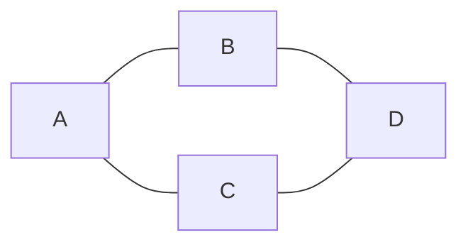

- **Grafi orientati**:
  - Un grafo orientato $G = (V, A)$ è definito da:
    - $V$: Insieme di vertici.
    - $A$: Insieme di archi, dove ogni arco $a = (i, j)$ connette il vertice $i$ al vertice $j$.
  - Esempio:
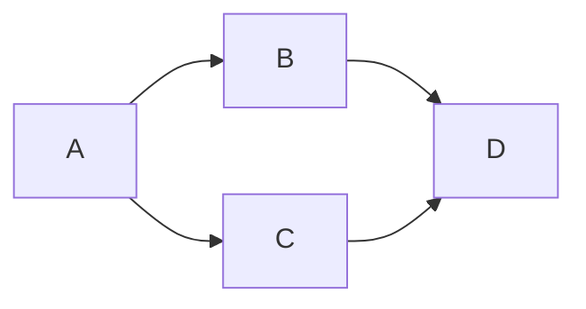

**Grafi Pesati**
- Un grafo è **pesato** se ai lati o agli archi è associato un peso (costo, distanza, ecc.).
- Esempio:
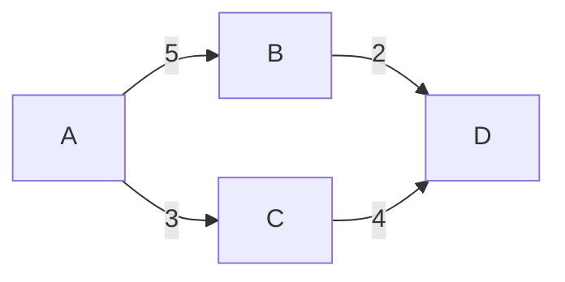

**Grafi Multipli, Semplici e Complet**i
- **Grafi multipli**: Possono avere più lati tra la stessa coppia di vertici.
- **Grafi semplici**: Non hanno lati multipli né loop (lati che connettono un vertice a sé stesso).
- **Grafi completi**: Ogni coppia di vertici è connessa da un lato.
- Esempio di grafo completo:
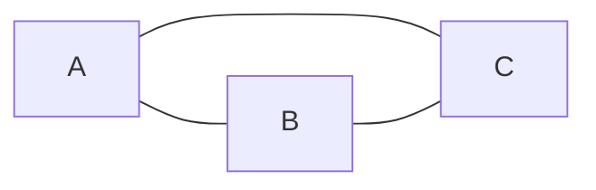

**Applicazioni dei Grafi**

- **Cammini Euleriani**: Problema dei ponti di Königsberg.
- **Colorazione dei grafi**: Assegnazione di colori a regioni confinanti.
- **Problema della clique**: Trovare il sottografo completo più grande.

**Taglio di un Grafo**

**Taglio in Grafi Non Orientati**
- Dato un sottoinsieme $S \subseteq V$, il **taglio** $\delta(S)$ è l'insieme dei lati che connettono $S$ a $V \setminus S$.
- Esempio:

  Se $S = \{A, B\}$, allora $\delta(S) = \{\{A, C\}, \{B, D\}\}$.

**Taglio in Grafi Orientati**
- In un grafo orientato, si distinguono:
  - **Archi uscenti** $\delta^+(S)$: Archi che partono da $S$ e vanno a $V \setminus S$.
  - **Archi entranti** $\delta^-(S)$: Archi che partono da $V \setminus S$ e vanno a $S$.

**Cammini**
- Un **cammino** è una sequenza di vertici $v_1, v_2, \dots, v_k$ tali che ogni coppia consecutiva è connessa da un lato o arco.
- Esempio:
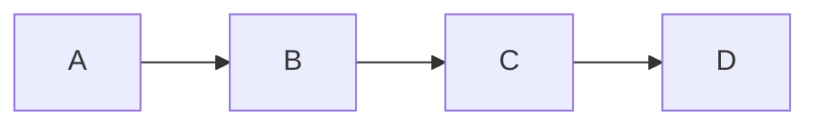
  Cammino: $(A, B, C, D)$.

**Circuiti e Cicli**
- **Circuito**: Cammino in cui il primo e l'ultimo vertice coincidono.
- **Ciclo**: Versione non orientata di un circuito.
- Esempio di circuito:
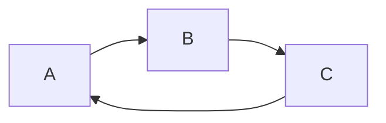

**Alberi**

- Un **albero** è un grafo connesso e aciclico.
- Proprietà:
  - Ha $n-1$ lati.
  - Se si rimuove un lato, il grafo diventa disconnesso.
- Esempio:
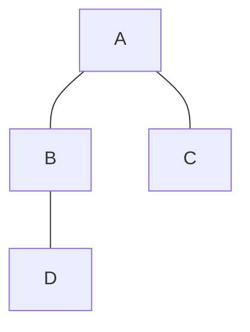

**Rappresentazione dei Grafi**

**Matrice di Adiacenza**
- Una matrice $Q$ di dimensione $|V| \times |V|$ dove:
  $$
  q_{ij} = 
  \begin{cases}
  1 & \text{se } \{i, j\} \in E \text{ (grafo non orientato)} \\
  1 & \text{se } (i, j) \in A \text{ (grafo orientato)} \\
  0 & \text{altrimenti}
  \end{cases}
  $$
- Esempio:
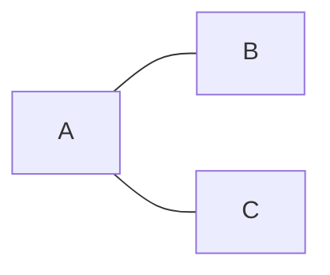
  Matrice di adiacenza:
  $$
  Q = \begin{bmatrix}
  0 & 1 & 1 \\
  1 & 0 & 0 \\
  1 & 0 & 0
  \end{bmatrix}
  $$

**Matrice di Incidenza**
- Una matrice $D$ di dimensione $|V| \times |E|$ dove:
  $$
  d_{ik} = 
  \begin{cases}
  1 & \text{se il lato } e_k \text{ è incidente su } i \\
  0 & \text{altrimenti}
  \end{cases}
  $$
- Esempio:

  Matrice di incidenza:
  $$
  D = \begin{bmatrix}
  1 & 1 \\
  1 & 0 \\
  0 & 1
  \end{bmatrix}
  $$

**Liste di Adiacenza**
- Ogni vertice ha una lista dei vertici adiacenti.
- Esempio:

  Liste di adiacenza:
  - $A$: $[B, C]$
  - $B$: $[A]$
  - $C$: $[A]$

## **Cammini Minimi (Shortest Paths)**

Il **problema del cammino minimo** consiste nel trovare il percorso più breve tra due nodi in una rete, dove la "distanza" può rappresentare costi, tempi, o altre metriche. Questo problema è fondamentale in applicazioni come la pianificazione di percorsi, il controllo di macchine e i sistemi di trasporto.

**Concetti di Base**

**Reti e Notazione**
- **Nodi (Vertici)**: Punti di intersezione o località.
- **Archi (Lati orientati)**: Collegamenti diretti tra nodi.
- **Pesi**: Valori associati agli archi (es. distanza, tempo).
- **Grado di un nodo**: Numero di vicini. Per reti orientate, si distingue tra **grado entrante** e **grado uscente**.

**Esempio di rete orientata**:


**Problema del Cammino Minimo**

**Formulazione del Problema**
- **Obiettivo**: Trovare il percorso più breve dal nodo $A$ al nodo $B$.
- **Variabili decisionali**:
  - $x_{i,j} = 1$ se l'arco $(i, j)$ è usato nel cammino minimo, $0$ altrimenti.
- **Vincoli**:
  - **Flusso uscente dal nodo sorgente**:
    $$
    \sum_{j \in \text{vicini uscenti di } A} x_{A,j} = 1
    $$
  - **Flusso entrante nel nodo sorgente**:
    $$
    \sum_{j \in \text{vicini entranti di } A} x_{j,A} = 0
    $$
  - **Conservazione del flusso nei nodi intermedi**:
    $$
    \sum_{i \in \text{vicini entranti di } v} x_{i,v} = \sum_{j \in \text{vicini uscenti di } v} x_{v,j}
    $$
  - **Flusso entrante nel nodo destinazione**:
    $$
    \sum_{i \in \text{vicini entranti di } B} x_{i,B} = 1
    $$
- **Funzione obiettivo**:
  $$
  \min \sum_{(i,j) \in A} w_{i,j} x_{i,j}
  $$

**Algoritmo di Dijkstra (1956)**
L'algoritmo di Dijkstra trova il cammino minimo da un nodo sorgente a tutti gli altri nodi in una rete con pesi non negativi.

**Passi**:
1. **Inizializzazione**:
   - Imposta $d(i) = \infty$ per ogni nodo $i$.
   - Imposta $d(A) = 0$ per il nodo sorgente $A$.
   - Segna tutti i nodi come non visitati.

2. **Selezione del nodo**:
   - Scegli il nodo non visitato $i$ con la distanza minima $d(i)$.

3. **Aggiornamento delle distanze**:
   - Per ogni nodo $j$ raggiungibile da $i$:
     $$
     d(j) = \min(d(j), d(i) + w_{i,j})
     $$
     - Se $d(j)$ viene aggiornato, imposta $i$ come predecessore di $j$: $\text{PRED}(j) = i$.

4. **Marcatura**:
   - Segna $i$ come visitato.

5. **Terminazione**:
   - Ripeti i passi 2-4 fino a quando tutti i nodi sono visitati.

6. **Risultato**:
   - Il cammino minimo è codificato nel vettore $\text{PRED}$.

**Esempio**:
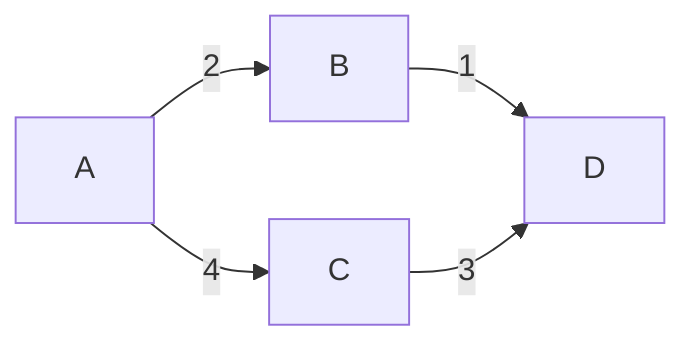
- **Cammino minimo da $A$ a $D$**: $A \rightarrow B \rightarrow D$ con distanza $3$.

**Esempi di Applicazione**

**Esempio 1: Cammino Minimo da $A$ a $H$**
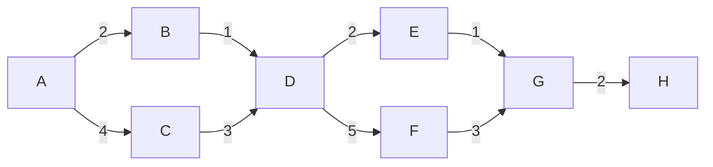
- **Cammino minimo**: $A \rightarrow B \rightarrow D \rightarrow E \rightarrow G \rightarrow H$ con distanza $8$.

**Esempio 2: Cammino Minimo da $A$ a $H$**
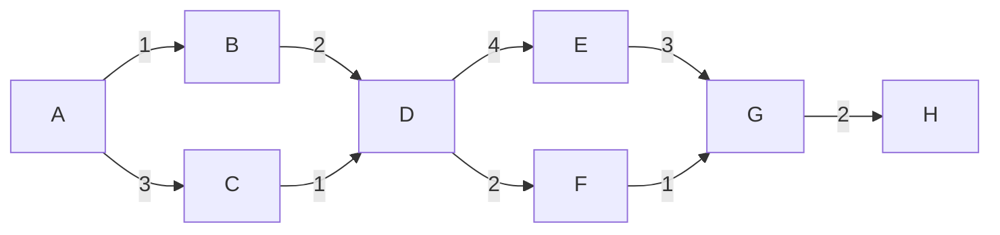
- **Cammino minimo**: $A \rightarrow C \rightarrow D \rightarrow F \rightarrow G \rightarrow H$ con distanza $7$.

**Esercizi**

**Esercizio 1: Applicazione dell'Algoritmo di Dijkstra**
1. **Trova i cammini minimi da**:
   - **a) Nodo $A$**:

   - **b) Nodo $F$**:
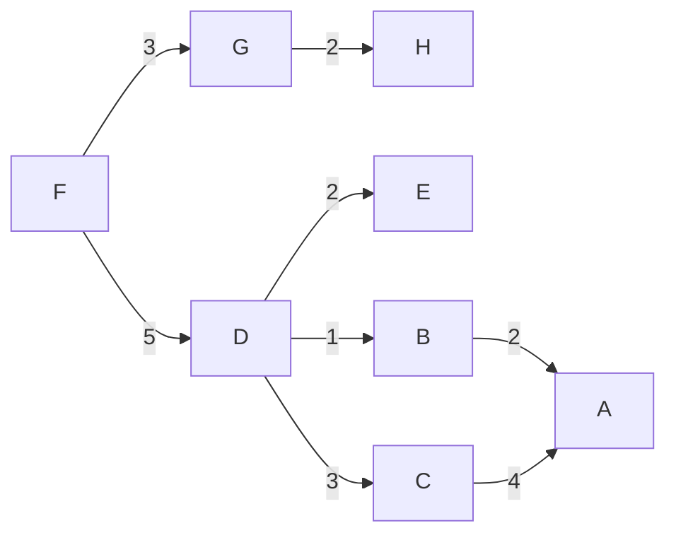

1. **Costruisci un modello di Programmazione Lineare Intera (PLI) per trovare i cammini minimi**:
   - **c) Da $A$ a $G$**.
   - **d) Da $C$ a $E$**.