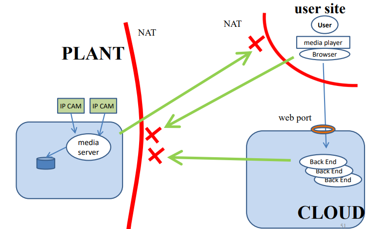

<script type="text/javascript" async
  src="https://cdnjs.cloudflare.com/ajax/libs/mathjax/2.7.7/MathJax.js?config=TeX-MML-AM_CHTML">
</script>
<script type="text/javascript" src="http://cdn.mathjax.org/mathjax/latest/MathJax.js?config=TeX-AMS-MML_HTMLorMML"></script>
<script type="text/x-mathjax-config"> MathJax.Hub.Config({ tex2jax: {inlineMath: [['$', '$']]}, messageStyle: "none" });</script>

# Virtualizzazione e Integrazione di Sistemi

<div style="page-break-after: always;"></div>

- [Virtualizzazione e Integrazione di Sistemi](#virtualizzazione-e-integrazione-di-sistemi)
  - [La Figura del Systems Integrator](#la-figura-del-systems-integrator)
  - [Scenari di Integrazione](#scenari-di-integrazione)
    - [Integrazione col Mondo dell'Automazione](#integrazione-col-mondo-dellautomazione)
    - [Sistemi a Micro-Servizi](#sistemi-a-micro-servizi)
      - [Applicativi "Monolitici" e "a Micro-Servizi"](#applicativi-monolitici-e-a-micro-servizi)
      - [Esempio di Micro-Servizi in Cloud](#esempio-di-micro-servizi-in-cloud)
      - [Vantaggi dei Micro-Servizi](#vantaggi-dei-micro-servizi)
      - [Problematiche da Considerare](#problematiche-da-considerare)
      - [Progettazione delle Comunicazioni](#progettazione-delle-comunicazioni)
      - [Esempio di Comunicazioni Locali](#esempio-di-comunicazioni-locali)
      - [Problema di Comunicazione](#problema-di-comunicazione)
      - [Soluzione di Integrazione](#soluzione-di-integrazione)
      - [Bus di Messaggi (o Message Broker)](#bus-di-messaggi-o-message-broker)
    - [Sistema a Micro-Servizi Principalmente in Cloud](#sistema-a-micro-servizi-principalmente-in-cloud)
      - [Sicurezza nei Sistemi Informatici](#sicurezza-nei-sistemi-informatici)
    - [Directory Service](#directory-service)
      - [Autenticazione in Canali Wireless](#autenticazione-in-canali-wireless)
      - [Autorizzazione all'Uso di Applicazioni (Single Sign-On)](#autorizzazione-alluso-di-applicazioni-single-sign-on)
    - [Dispiegamento di Servizi Scalabili e Isolati mediante Virtualizzazione e Containerizzazione](#dispiegamento-di-servizi-scalabili-e-isolati-mediante-virtualizzazione-e-containerizzazione)
      - [Virtualizzazione](#virtualizzazione)
      - [Containerizzazione](#containerizzazione)
      - [Container vs. Virtual Machine](#container-vs-virtual-machine)
      - [Cloud e Categorie di Servizi Cloud](#cloud-e-categorie-di-servizi-cloud)
      - [PaaS vs. IaaS](#paas-vs-iaas)
      - [Piattaforme di Gestione di Cloud Privati](#piattaforme-di-gestione-di-cloud-privati)
      - [Multitenancy](#multitenancy)
    - [Progettazione delle Comunicazioni in Reti Protette da NAT e Firewall](#progettazione-delle-comunicazioni-in-reti-protette-da-nat-e-firewall)
      - [Virtual Private Network (VPN)](#virtual-private-network-vpn)
      - [Esposizione di Porte Remote mediante SSH Remote Port Forwarding](#esposizione-di-porte-remote-mediante-ssh-remote-port-forwarding)
  - [Sincronizzazione degli Orologi](#sincronizzazione-degli-orologi)
    - [Importanza della Sincronizzazione nella Sicurezza](#importanza-della-sincronizzazione-nella-sicurezza)
    - [Tipi di Clock](#tipi-di-clock)
    - [Meccanismi di Sincronizzazione](#meccanismi-di-sincronizzazione)
    - [Meccanismo Three-Way di Sincronizzazione](#meccanismo-three-way-di-sincronizzazione)
    - [Problemi e Limitazioni](#problemi-e-limitazioni)
    - [Sincronizzazione dei Clock Fisici](#sincronizzazione-dei-clock-fisici)
    - [Sincronizzazione Esterna dei Clock Fisici](#sincronizzazione-esterna-dei-clock-fisici)
    - [NTP (Network Time Protocol)](#ntp-network-time-protocol)
  - [Crittografia](#crittografia)
    - [Crittografia a Chiave Segreta (Simmetrica)](#crittografia-a-chiave-segreta-simmetrica)
    - [Crittografia a Chiave Pubblica (Asimmetrica)](#crittografia-a-chiave-pubblica-asimmetrica)
    - [Funzioni Hash Crittografiche](#funzioni-hash-crittografiche)
    - [Integrità di Messaggi e Firma Digitale](#integrità-di-messaggi-e-firma-digitale)
    - [Ricezione del Messaggio con MAC](#ricezione-del-messaggio-con-mac)
    - [Crittografia a Chiave Segreta vs. Crittografia a Chiave Pubblica](#crittografia-a-chiave-segreta-vs-crittografia-a-chiave-pubblica)
  - [Kerberos](#kerberos)
    - [Strategie di Kerberos](#strategie-di-kerberos)
    - [Requisiti di Tempo in Kerberos](#requisiti-di-tempo-in-kerberos)
    - [Applicabilità di Kerberos](#applicabilità-di-kerberos)
    - [Archittettura Kerberos](#archittettura-kerberos)
    - [Chiavi Statiche e Dinamiche in Kerberos](#chiavi-statiche-e-dinamiche-in-kerberos)
    - [Fasi del Protocollo Kerberos](#fasi-del-protocollo-kerberos)
    - [Meccanismo di Autenticazione e Verifica](#meccanismo-di-autenticazione-e-verifica)
  - [Virtualizzazione e Container](#virtualizzazione-e-container)
    - [Virtualizzazione vs. Emulazione](#virtualizzazione-vs-emulazione)
    - [Virtualizzazione: Livello Hardware vs. Livello OS](#virtualizzazione-livello-hardware-vs-livello-os)
    - [Spazio Kernel e Spazio Utente](#spazio-kernel-e-spazio-utente)
    - [Virtualizzazione di Tipo 1 e Tipo 2](#virtualizzazione-di-tipo-1-e-tipo-2)
    - [Full Virtualization vs. Para-Virtualization](#full-virtualization-vs-para-virtualization)
    - [Container](#container)
      - [Principali Tecnologie di Containerizzazione](#principali-tecnologie-di-containerizzazione)
  - [Comandi Doker](#comandi-doker)
    - [Installazione di Docker](#installazione-di-docker)
      - [Installazione su Ubuntu](#installazione-su-ubuntu)
      - [Installazione su Debian](#installazione-su-debian)
    - [Esecuzione di Docker senza sudo](#esecuzione-di-docker-senza-sudo)
    - [Utilizzo del Comando Docker](#utilizzo-del-comando-docker)
    - [Lavorare con le Immagini Docker](#lavorare-con-le-immagini-docker)
      - [Esecuzione di un Container di Test](#esecuzione-di-un-container-di-test)
      - [Ricerca e Download di Immagini](#ricerca-e-download-di-immagini)
      - [Rimozione di Immagini Locali](#rimozione-di-immagini-locali)
    - [Esecuzione di un Container Docker](#esecuzione-di-un-container-docker)
    - [Gestione dei Container Docker](#gestione-dei-container-docker)
      - [Stop \& Start dei Container](#stop--start-dei-container)
      - [Rimozione dei Container](#rimozione-dei-container)
    - [Committing delle Modifiche in un Container](#committing-delle-modifiche-in-un-container)
    - [Cambiare Nome a un'Immagine Docker](#cambiare-nome-a-unimmagine-docker)
    - [Pubblicare un'Immagine Docker su un Registro](#pubblicare-unimmagine-docker-su-un-registro)
    - [Selezione dei Container](#selezione-dei-container)
    - [Parametri del Comando `docker run`](#parametri-del-comando-docker-run)
    - [Reti](#reti)
    - [Immagini Docker e Filesystem](#immagini-docker-e-filesystem)
    - [Utilizzo dei Bind Mounts in Docker](#utilizzo-dei-bind-mounts-in-docker)
  - [Dockerfile](#dockerfile)
    - [Comandi Dockerfile](#comandi-dockerfile)
    - [Comandi Dockerfile](#comandi-dockerfile-1)
    - [Nome di un'Immagine Docker](#nome-di-unimmagine-docker)
    - [RUN Command Details](#run-command-details)
    - [Esempio di Dockerfile Semplice](#esempio-di-dockerfile-semplice)
    - [Compiti di Init in Shell ed Exec mode](#compiti-di-init-in-shell-ed-exec-mode)
    - [ENV e ARG - Confronto](#env-e-arg---confronto)
    - [Ispezione di un'immagine Docker](#ispezione-di-unimmagine-docker)
    - [Filesystem dei container in esecuzione](#filesystem-dei-container-in-esecuzione)
    - [Struttura incrementale delle immagini](#struttura-incrementale-delle-immagini)
    - [Condivisione e gestione dei layers](#condivisione-e-gestione-dei-layers)
    - [Docker Area e Storage Driver](#docker-area-e-storage-driver)
  - [Reti Docker Definite dall'Utente](#reti-docker-definite-dallutente)
      - [Esempi di Utilizzo del Comando `docker inspect`](#esempi-di-utilizzo-del-comando-docker-inspect)
    - [Creazione e Gestione delle Reti](#creazione-e-gestione-delle-reti)
      - [Esempio di Creazione di una Rete:](#esempio-di-creazione-di-una-rete)
    - [Collegamento dei Container alle Reti](#collegamento-dei-container-alle-reti)
      - [Esempio di Collegamento dei Container:](#esempio-di-collegamento-dei-container)
    - [Server DNS Embedded di Docker](#server-dns-embedded-di-docker)
      - [Esempio di Utilizzo del Server DNS:](#esempio-di-utilizzo-del-server-dns)
  - [DokerCompose e Formato di File YAML](#dokercompose-e-formato-di-file-yaml)
    - [Struttura e Regole di YAML](#struttura-e-regole-di-yaml)
      - [Alcuni Principi Fondamentali di YAML:](#alcuni-principi-fondamentali-di-yaml)
      - [Esempi Separati](#esempi-separati)
    - [Docker Compose e File YAML](#docker-compose-e-file-yaml)
    - [Componenti Principali del Compose File](#componenti-principali-del-compose-file)
      - [Esempi di Utilizzo](#esempi-di-utilizzo)
    - [Comandi Utili di Docker Compose](#comandi-utili-di-docker-compose)
  - [Gestione delle Applicazioni con Docker Compose](#gestione-delle-applicazioni-con-docker-compose)
    - [Esempio Pratico di un'Applicazione Locale](#esempio-pratico-di-unapplicazione-locale)
      - [L'Applicazione](#lapplicazione)
      - [Files Necessari](#files-necessari)
      - [Configurazione del Progetto](#configurazione-del-progetto)
    - [Comprendere Docker Compose e Docker Swarm](#comprendere-docker-compose-e-docker-swarm)
    - [Struttura del Compose File](#struttura-del-compose-file)
    - [Comandi e Configurazioni di Docker Compose](#comandi-e-configurazioni-di-docker-compose)
    - [Gestione delle Reti e dei Volumi](#gestione-delle-reti-e-dei-volumi)
      - [Esempio di Configurazione di Rete:](#esempio-di-configurazione-di-rete)
  - [Esempio: Applicazione Node.js + MongoDB con Docker Compose](#esempio-applicazione-nodejs--mongodb-con-docker-compose)
    - [Descrizione dell’Applicazione](#descrizione-dellapplicazione)
    - [1. Installazione del pacchetto Docker Compose su Linux](#1-installazione-del-pacchetto-docker-compose-su-linux)
    - [2. Creazione delle Reti Virtuali Docker](#2-creazione-delle-reti-virtuali-docker)
    - [3. Costruzione dell’Immagine del Container per l’Applicazione Web Node.js/Express/Mongoose](#3-costruzione-dellimmagine-del-container-per-lapplicazione-web-nodejsexpressmongoose)
    - [4. Costruzione e Gestione del Container e dei Dati MongoDB](#4-costruzione-e-gestione-del-container-e-dei-dati-mongodb)
    - [5. Costruzione dell’Immagine Per MongoDB e Inizializzazione Database](#5-costruzione-dellimmagine-per-mongodb-e-inizializzazione-database)
    - [6. Esecuzione del Container con MongoDB e il Database dbsa](#6-esecuzione-del-container-con-mongodb-e-il-database-dbsa)
    - [7. Esecuzione del Container con l’Applicazione Web Node.js](#7-esecuzione-del-container-con-lapplicazione-web-nodejs)
    - [8. Automazione Completa con Docker Compose](#8-automazione-completa-con-docker-compose)
  - [Introduzione a Docker Swarm](#introduzione-a-docker-swarm)
    - [Costruire Servizi Replicati su un Cluster](#costruire-servizi-replicati-su-un-cluster)
    - [Struttura di Docker Swarm](#struttura-di-docker-swarm)
      - [Struttura di Base](#struttura-di-base)
      - [Stack e Servizi](#stack-e-servizi)
    - [Funzionamento di un Swarm](#funzionamento-di-un-swarm)
    - [Presupposti di Rete](#presupposti-di-rete)
    - [Comandi Ed Esempi](#comandi-ed-esempi)
    - [Struttura dell'Esempio Docker Swarm](#struttura-dellesempio-docker-swarm)
    - [Dettagli Strutturali](#dettagli-strutturali)
  - [Pubblicazione delle Porte e Routing Mesh](#pubblicazione-delle-porte-e-routing-mesh)
    - [Meccanismo di Pubblicazione](#meccanismo-di-pubblicazione)
    - [Sicurezza](#sicurezza)
  - [Problematiche di Sicurezza](#problematiche-di-sicurezza)
    - [Esposizione a Rischi](#esposizione-a-rischi)
    - [Soluzioni](#soluzioni)
  - [Discovery Automatica delle Repliche Attive](#discovery-automatica-delle-repliche-attive)
    - [Processo](#processo)
    - [Strumenti Usati](#strumenti-usati)
    - [Riepilogo](#riepilogo)
  - [Esempio Docker Swarm: App Node.js + MongoDB](#esempio-docker-swarm-app-nodejs--mongodb)
    - [Definizione dei Servizi](#definizione-dei-servizi)
    - [Reti Overlay](#reti-overlay)
    - [Volumi per Persistenza](#volumi-per-persistenza)
    - [Considerazioni Chiave](#considerazioni-chiave)
    - [Comandi Swarm Utili (Ripasso)](#comandi-swarm-utili-ripasso)
  - [Kubernetes](#kubernetes)
    - [Kubernetes Concepts](#kubernetes-concepts)
    - [Autoscaling](#autoscaling)
    - [Kubernetes Architecture](#kubernetes-architecture)
    - [Prodotti per Orchestrazione di Container basati su Kubernetes](#prodotti-per-orchestrazione-di-container-basati-su-kubernetes)
      - [Dispiegamento in Cloud](#dispiegamento-in-cloud)
      - [Dispiegamento On-Premise (Cluster di Nodi Utente)](#dispiegamento-on-premise-cluster-di-nodi-utente)
      - [Infrastruttura Minimale (Singolo Nodo) per Apprendimento/Sviluppo](#infrastruttura-minimale-singolo-nodo-per-apprendimentosviluppo)
    - [Organizzazione delle Macchine Virtuali per le Esercitazioni in Aula (Esempio su PC del Docente)](#organizzazione-delle-macchine-virtuali-per-le-esercitazioni-in-aula-esempio-su-pc-del-docente)
    - [Esempio di Applicazione con Kubernetes (su Minikube)](#esempio-di-applicazione-con-kubernetes-su-minikube)
    - [Kubernetizzare l'Applicazione](#kubernetizzare-lapplicazione)
    - [Aspetti di Collegamento tra i Pods](#aspetti-di-collegamento-tra-i-pods)
    - [Ambiente delle Prove (Configurazione Locale)](#ambiente-delle-prove-configurazione-locale)
    - [Comandi Pratici per Dispiegare l'Applicazione](#comandi-pratici-per-dispiegare-lapplicazione)
  - [Active Directory](#active-directory)
    - [Dominio Windows](#dominio-windows)
    - [Protocolli di Active Directory](#protocolli-di-active-directory)
    - [Struttura di Active Directory](#struttura-di-active-directory)
    - [Partizioni di Active Directory](#partizioni-di-active-directory)
    - [Global Catalog](#global-catalog)
    - [Ruoli FSMO (Operations Masters)](#ruoli-fsmo-operations-masters)
    - [Livelli di Funzionalità](#livelli-di-funzionalità)
    - [Relazioni di Trust](#relazioni-di-trust)
    - [Replicazione all’interno del Dominio](#replicazione-allinterno-del-dominio)
    - [Replicazione con DFS](#replicazione-con-dfs)
  - [Group Policy](#group-policy)
    - [Gestione delle Group Policy](#gestione-delle-group-policy)
    - [Tipi di Policy](#tipi-di-policy)
    - [Applicazione delle Policy](#applicazione-delle-policy)
    - [Preferenze delle Group Policy (GPP)](#preferenze-delle-group-policy-gpp)
    - [Verifica delle Policy](#verifica-delle-policy)
    - [Modalità di Elaborazione Loopback](#modalità-di-elaborazione-loopback)
  - [Deleghe](#deleghe)
    - [Gestione delle Deleghe](#gestione-delle-deleghe)
  - [RADIUS (Remote Authentication Dial-In User Service)](#radius-remote-authentication-dial-in-user-service)
    - [Funzionamento di RADIUS](#funzionamento-di-radius)
    - [Esempio di RADIUS](#esempio-di-radius)
    - [Installazione di RADIUS](#installazione-di-radius)
  - [Virtuslizzazione sul Campus di Cesena](#virtuslizzazione-sul-campus-di-cesena)
    - [Macchine Virtuali](#macchine-virtuali)
    - [Campus \& Virtualizzazione Desktop](#campus--virtualizzazione-desktop)
    - [Server Virtualization](#server-virtualization)
  - [SAMBA,DNS, RADIUS](#sambadns-radius)
    - [I Pilastri di un Dominio (Active Directory, LDAP, Kerberos)](#i-pilastri-di-un-dominio-active-directory-ldap-kerberos)
      - [**1. Active Directory (AD): Il Concetto di Directory Service**](#1-active-directory-ad-il-concetto-di-directory-service)
      - [**2. LDAP (Lightweight Directory Access Protocol): Il Protocollo di Accesso**](#2-ldap-lightweight-directory-access-protocol-il-protocollo-di-accesso)
      - [**3. Kerberos: Il Protocollo di Autenticazione**](#3-kerberos-il-protocollo-di-autenticazione)
    - [Preparazione del Server Linux e DNS](#preparazione-del-server-linux-e-dns)
      - [**1. Gestione dei Servizi e del Sistema con `systemd`**](#1-gestione-dei-servizi-e-del-sistema-con-systemd)
      - [**2. Gestione Utenti Locali e Privilegi con `sudo`**](#2-gestione-utenti-locali-e-privilegi-con-sudo)
      - [**3. Configurazione di Rete Statica con `netplan`**](#3-configurazione-di-rete-statica-con-netplan)
      - [**4. Il Servizio DNS (Domain Name System) con BIND**](#4-il-servizio-dns-domain-name-system-con-bind)
    - [Samba come Domain Controller Active Directory](#samba-come-domain-controller-active-directory)
      - [**1. Samba: Oltre la Condivisione di File**](#1-samba-oltre-la-condivisione-di-file)
      - [**2. Winbind: Il Ponte tra Mondi**](#2-winbind-il-ponte-tra-mondi)
      - [**3. ACL (Access Control List) e Attributi Estesi: Permessi "alla Windows" su Linux**](#3-acl-access-control-list-e-attributi-estesi-permessi-alla-windows-su-linux)
      - [**4. Il Processo di "Provisioning" del Dominio**](#4-il-processo-di-provisioning-del-dominio)
      - [**5. I File di Configurazione Chiave**](#5-i-file-di-configurazione-chiave)
      - [**6. Comandi Essenziali per la Gestione (`samba-tool`)**](#6-comandi-essenziali-per-la-gestione-samba-tool)
    - [Gestione del Dominio e Autenticazione Avanzata (RADIUS)](#gestione-del-dominio-e-autenticazione-avanzata-radius)
      - [**1. Amministrazione Remota da un Client Windows (RSAT)**](#1-amministrazione-remota-da-un-client-windows-rsat)
      - [**2. I Ruoli FSMO (Flexible Single Master Operation)**](#2-i-ruoli-fsmo-flexible-single-master-operation)
      - [**3. RADIUS (Remote Authentication Dial-In User Service): Centralizzare l'Autenticazione di Rete**](#3-radius-remote-authentication-dial-in-user-service-centralizzare-lautenticazione-di-rete)


<div style="page-break-after: always;"></div>

## La Figura del Systems Integrator

- Il termine "sistemista" è obsoleto. Aveva senso quando si trattava di gestire batterie di singoli computer.
- Oggi, il "sistemista" deve progettare e realizzare infrastrutture software per gestire, a livelli architetturali diversi, una molteplicità di entità differenziate che interagiscono continuamente.
- Il termine più corretto per individuare l'attività del sistemista moderno è "Systems Integration and Testing".
- La figura professionale viene definita dall'EUCIP nel seguente documento: [EUCIP Systems Integration and Testing Engineer](http://www.eucip.it/profili/profili-professionali/SystemsIntegrationandTestingEngineerVersion2.4.pdf).
- I numerosi task della figura professionale originano dalla seguente responsabilità di massima:  
  "The Systems Integration and Testing Engineer works within organizations (either as an employee or as an external provider) to ensure that software systems and components are successfully integrated across hardware systems and meet specified requirements."
- Tra le competenze richieste si distingue la conoscenza degli standard software de jure e de facto:  
  "Requirements include a specific knowledge on how interfaces between software modules are built."
- In alcuni casi, si distingue la figura dell'installatore/configuratore/manutentore di sistemi rispetto alla figura del designer di sistemi complessi.
- La figura del Systems Integration Architect si occupa principalmente della progettazione delle infrastrutture software per gestire, a livelli architetturali diversi, una molteplicità di entità differenziate che interagiscono continuamente.
- La realizzazione, installazione e manutenzione è lasciata al Systems Integrator.

Il Systems Integrator deve:
- Progettare e realizzare sistemi complessi,
- Costituiti da molteplici componenti,
- Che interagiscono via rete,
- Mediante interfacce standard.

Egli necessita di competenze che spaziano in molti ambiti dell'informatica, in particolare di conoscenze riguardanti:
- Protocolli di rete.
- Sicurezza nei sistemi di rete.
- Programmazione e scripting.
- IDM (Identity Management Systems, Sistemi di Gestione dell'Identità).
- Sistemi di Provisioning.
- Architetture a MicroServizi e sviluppo.
- Gestione centralizzata di servizi distribuiti.
- Sistemi per Virtualizzazione.
- Amministrazione di specifici sistemi operativi per desktop e server.
- Amministrazione di sistemi cloud privati.

## Scenari di Integrazione
Progettare soluzioni aderendo agli standard (de jure e de facto):
1. Integrazione col mondo dell'automazione.
2. Applicazioni monolitiche vs. Sistemi a micro-servizi.
3. Sistemi a micro-servizi in cloud.
4. Sicurezza.
5. Identity and Access Management (IAM) Directory Service.
6. Dispiegamento (deployment) scalabile mediante virtualizzazione e container.
7. Scenari di rete e ostacoli (firewall).

### Integrazione col Mondo dell'Automazione

- Le macchine automatiche, anche di grandi dimensioni, sono controllate da sistemi che non sono computer, ma PLC.
- L'integrazione con il resto del mondo (Industria 4.0) concerne spesso l'esportazione in tempo reale di dati dai sensori della macchina, su cui si opera con vari sistemi di analisi, big data e intelligenza artificiale. Anche flussi da videocamere sono spesso utilizzati.
- L'integrazione richiede la conoscenza di protocolli di comunicazione specifici per l'ambiente dell'automazione e i meccanismi di sicurezza.
- La gestione di queste macchine, data l'importanza produttiva in ralazione a i costi e tempi di intervento in caso di rottuta, si è orientata fortemente alla manutenzione predittiva per contenere le perdite in caso di rotture non previste.

### Sistemi a Micro-Servizi

#### Applicativi "Monolitici" e "a Micro-Servizi"

Avete sempre visto un'applicazione costituita da un solo pezzo o, al massimo, da due. Si può trattare di un'applicazione in Java, di un servizio web, o di un servizio web combinato con il tier del database, che sono indissolubili. In realtà, gli applicativi moderni nel mondo reale sono costituiti da molteplici componenti separati e personalizzabili, detti micro-servizi, che possono essere eseguiti su uno stesso host oppure su più host distribuiti in rete. Questi componenti interagiscono tra loro scambiandosi messaggi mediante interfacce software e protocolli standard, consentendo il riutilizzo del software. Un'applicazione a micro-servizi lavora, dunque, per moduli disgiunti, più o meno complessi, che comunicano tramite API, in modo tale che i componenti possano essere standardizzati, duplicati a run-time, personalizzati e debuggati singolarmente, anche a run-time aumentando notevolmente la scalabilità e il riuso, inooltre lavorando per api non dovrò interrompere il macro servizio per apportare modifiche al micro. In ultima istanza potrò costantemente monitorare il sistema via codice verificando la saturazione del sistema ed allocando nuove risorse o sostituuendo componenti software che via vai potrebbero andare in down.

#### Esempio di Micro-Servizi in Cloud

Quando parliamo di micro-servizi nel contesto del cloud, un esempio significativo è rappresentato da Microsoft Azure. È importante notare che non tutti i prodotti disponibili su questa piattaforma sono sviluppati da Microsoft; alcuni sono open-source e possono essere installati su macchine virtuali nel cloud.

Le macchine virtuali (VM) possono essere configurate in base alle esigenze specifiche, scegliendo il sistema operativo, la potenza della CPU, la quantità di memoria RAM e lo spazio su disco. Inoltre, il disco virtuale è accessibile da tutte le VM, facilitando la gestione dei dati. Per le esigenze di archiviazione, Azure offre Archive Storage, una soluzione a basso costo per dati che vengono acceduti raramente.

Per quanto riguarda i database, Azure supporta diverse istanze, tra cui database relazionali come MySQL e database documentali come MongoDB. Inoltre, è possibile utilizzare Microsoft Azure CosmosDB, che offre più tipi di API di accesso, sia documentali che relazionali.

Un altro aspetto interessante è la presenza di un distributore di carico web, che consente di gestire picchi di traffico creando nuove VM in tempo reale, il tutto configurabile attraverso regole specifiche utilizzando Kubernetes. Azure offre anche servizi come VPN gateway, DNS, Content Delivery Network, Stream Analytics e Machine Learning, oltre a strumenti per la gestione dell'identità come Active Directory e Multi-factor Authentication. Un secondo tipo di distrubuzione è quello di natura Content Delivery Network ovvero distrubuzione di media come audio o video, qui in focus è concetrato non solo sull'architettura software ma ache sull'infrastruttura hardware ed un uso intelligente di quest'ultima.

Un esempio di integrazione è rappresentato da Microsoft Azure IoT Hub, un gateway centralizzato per la gestione dei messaggi provenienti da vari sensori, utilizzando protocolli come AMQP, MQTT e HTTPS. Inoltre, RabbitMQ è un bus di messaggi che supporta i protocolli AMQP e MQTT, ed è progettato per funzionare in locale ma può essere dispiegato anche su macchine virtuali. CloudAMQP, invece, è una versione di RabbitMQ disponibile in cloud, accessibile anche da fonti esterne.

#### Vantaggi dei Micro-Servizi

La struttura degli applicativi basati su micro-servizi è composta da numerosi componenti disaccoppiati, distribuiti su diversi host o datacenter. Questo approccio consente di considerare l'applicazione nel suo complesso come un sistema integrato. La scomposizione in micro-servizi offre diversi vantaggi:

- **Riusabilità:** I micro-servizi possono essere riutilizzati in diversi applicativi, aumentando l'efficienza dello sviluppo.
- **Scalabilità:** Solo i micro-servizi che necessitano di essere replicati e bilanciati vengono gestiti, ottimizzando l'uso delle risorse.
- **Deployment:** I micro-servizi possono essere distribuiti su una singola macchina o su più macchine, con la possibilità di riconfigurare i servizi di comunicazione per adattarsi a indirizzi diversi, tenendo conto della presenza di firewall e della sicurezza.
- **Cloud:** I micro-servizi sono particolarmente adatti per lo sviluppo di applicativi progettati per il cloud computing, poiché i provider cloud offrono principalmente soluzioni basate su micro-servizi.

#### Problematiche da Considerare

Tuttavia, la necessità di comunicazione tra i micro-servizi presenta alcune sfide. È fondamentale:

- Creare micro-servizi che espongano solo interfacce software e protocolli di comunicazione ampiamente condivisi (standard de facto).
- Progettare le applicazioni in modo che utilizzino esclusivamente questi standard.
- Garantire che la rete di comunicazione consenta il passaggio dei messaggi, oppure implementare infrastrutture e servizi adeguati per superare firewall e NAT.

#### Progettazione delle Comunicazioni

Un aspetto cruciale nella progettazione di un sistema a micro-servizi è la definizione delle comunicazioni tra i vari componenti. È necessario individuare i protocolli di comunicazione standard più adatti allo scenario specifico, scegliendo tra quelli che hanno implementazioni mature e ampiamente diffuse.

#### Esempio di Comunicazioni Locali

Anche un'applicazione che opera su un singolo host può necessitare di comunicare tra diversi micro-servizi. Immaginiamo un'applicazione web in cui gli utenti, tramite un browser, visualizzano le statistiche sui pezzi prodotti da una macchina automatica. Questa applicazione è realizzata utilizzando tecnologie come Nginx, Node.js e Puma, e funziona all'interno di container su un server Linux situato nello stesso stabilimento della macchina.

Gli utenti sono serviti attraverso connessioni persistenti HTML5, con un'istanza del back-end web dedicata a ciascun utente. La macchina automatica, che non è un computer ma un PLC, invia informazioni sui pezzi prodotti al server utilizzando il protocollo standard OPC-UA. Il server gestisce due database: uno relazionale (MySQL) e uno documentale (MongoDB) ovvero DB in cui salviamo dati eterogenei non adatti ad un immagazzinamento tabellare.

Un servizio separato, chiamato OPC client, riceve i dati dalla macchina, li inserisce nel database documentale e aggiorna le statistiche nel database relazionale. Dopo ogni inserimento, l'OPC client informa tutte le istanze del back-end web, che stanno servendo gli utenti, di aggiornare i grafici visualizzati, poiché sono disponibili nuovi dati. Inoltre, un altro software monitora la raggiungibilità di un magazzino e, in caso di problemi, invia notifiche agli utenti connessi al servizio web.

#### Problema di Comunicazione

Una delle sfide principali è come gestire le comunicazioni locali in un contesto "molti a molti", specialmente quando non si conosce a run-time chi siano e quanti siano questi "molti".


#### Soluzione di Integrazione

Per affrontare questa problematica, si può implementare un bus di messaggi di tipo publish/subscribe orientato ai topic. In questo sistema, ogni entità ricevente si registra e indica a quali topic è interessata. Chi desidera inviare un messaggio pubblica il messaggio stesso, specificando un subject. Il messaggio viene quindi consegnato a tutte le entità che hanno manifestato interesse per quel subject.


#### Bus di Messaggi (o Message Broker)

I bus di messaggi, noti anche come Message Bus o Message Broker, utilizzano diversi protocolli per lo scambio di messaggi. Tra i più comuni ci sono AMQP e MQTT. Questi protocolli definiscono il formato base dei messaggi, che include un body, e offrono diverse modalità di consegna (affidabile, non affidabile, con ricevuta di consegna, ecc.). Inoltre, mantengono i messaggi in code secondo politiche di consegna specifiche e forniscono API per vari linguaggi e sistemi operativi come per esempio time out sul numero di messaggi in coda o TTL.

Le applicazioni di solito sviluppano un proprio strato software per definire il formato interno dei messaggi, spesso optando per un body in formato JSON per semplificare il processo.

Tra le implementazioni più diffuse di bus di messaggi troviamo RabbitMQ, un sistema open-source che supporta sia AMQP che MQTT e può essere installato su vari sistemi operativi. RabbitMQ è in grado di far comunicare entità su macchine fisiche diverse, inclusi ambienti cloud. Esiste anche un servizio pre-installato in cloud, CloudAMQP, accessibile tramite API.

Un altro esempio è Microsoft Azure Service Bus Messaging, che opera nei datacenter di Microsoft Azure, supporta AMQP e MQTT, e offre API per entità che operano su host esterni al cloud, garantendo livelli di sicurezza adeguati.

Va considerato che questi strumenti ovviamenete introducono un ritardo di comunicazione ma contengono decisamente la complessità della comuczionine molti a molti con actor dinamici.


### Sistema a Micro-Servizi Principalmente in Cloud

Parliamo di sistemi che controllano dispositivi distribuiti a livello globale, caratterizzati da un elevato numero di client e risorse centrali limitate. È plausibile che queste macchine comunichino utilizzando protocolli diversi e siano gestite da utenti con dispositivi eterogenei. Inoltre, la presenza di proprietari diversi aumenta la complessità del sistema, rendendo necessaria una particolare attenzione alla tutela dei dati.

Per integrare questi sistemi, possiamo adottare una soluzione basata su container Docker, che consente di gestire i micro-servizi in modo efficiente senza dover necessariamente aumentare le risorse hardware disponibili. I componenti del sistema possono comunicare tra loro attraverso un bus di messaggi, utilizzando protocolli come MQTT. Il server web gestisce le richieste degli utenti, mentre i dati vengono archiviati in database come MySQL e Azure Cosmos DB, che supportano API MongoDB. Azure File Storage e IoT Hub possono essere utilizzati per gestire i dati provenienti dai dispositivi.

In questo contesto, i PLC (Programmable Logic Controllers) delle macchine automatiche inviano dati al server, e gli utenti possono accedere a queste informazioni tramite un'interfaccia web. Un bilanciatore di carico (Load Balancer) e Kubernetes possono essere impiegati per gestire i container, garantendo che il sistema rimanga scalabile e reattivo.

È necessario introdurre nuove componenti per offrire servizi a interfacce e gestire i componenti cloud dinamici. L'IoT Hub funge da interfaccia di comunicazione con le macchine automatiche, che operano con logiche implementative e protocolli di comunicazione eterogenei. Questo componente si interfaccia con un host del sito produttivo, evitando di esporre le macchine al pubblico e gestendo la loro comunicazione interna, che spesso non è complessa.

Il Load Balancer, responsabile dell'interfaccia con gli utenti, smista il traffico e tiene traccia delle richieste per istanziare o eliminare i container Docker quando necessario. È fondamentale garantire la sicurezza delle comunicazioni, spesso realizzata tramite certificati predefiniti con scadenze stabilite.


#### Sicurezza nei Sistemi Informatici

La sicurezza è un criterio fondamentale nella progettazione di qualsiasi sistema informatico e non deve essere considerata un aspetto secondario. Spesso, un requisito di progettazione è la centralizzazione delle funzionalità di autenticazione e autorizzazione in un servizio unico. Questa centralizzazione non solo semplifica la gestione, ma rappresenta anche un fattore di sicurezza, poiché limita i punti di attacco e facilita il controllo.

I servizi di directory sono responsabili dell'autenticazione e dell'autorizzazione, e ci sono innumerevoli scenari in cui la sicurezza influisce sulla progettazione dei sistemi. Alcuni aspetti chiave della sicurezza includono:

- **Sicurezza nei mezzi trasmissivi:** Utilizzo di canali wireless (server Radius), comunicazioni applicative sicure (HTTPS, SSL/TLS) e reti private virtuali (VPN).
- **Autenticazione delle entità:** Utilizzo di certificati X.509.
- **Autenticazione degli utenti:** Implementazione di sistemi di autenticazione multi-fattore.
- **Autorizzazione all'accesso alle risorse:** Gestione delle infrastrutture, dei servizi di directory, dei domini e del DNS.

### Directory Service

Un Directory Service è un sistema centralizzato progettato per la gestione e la fruizione delle informazioni relative a utenti, reti, servizi e applicazioni all'interno di un dominio. In uno scenario di integrazione con autenticazione e autorizzazione centralizzate, il processo di autenticazione avviene tramite un access token, che fornisce l'identità dell'utente e le impostazioni di sicurezza necessarie per accedere alle risorse e svolgere compiti nel sistema.

Il processo di autenticazione inizia quando l'utente fornisce un nome utente e una password. Il sistema confronta queste informazioni con quelle memorizzate nel database appropriato. Se le informazioni corrispondono e l'account utente è abilitato, viene creato un access token per l'utente, che include i diritti di utilizzo. In caso contrario, l'accesso al dominio o al computer locale viene negato. 

Questo servizio prevede dunque che si salvino i dati di configurazione delle macchine della rete, questo sistema permentte di asseganre routine di gestione ed esecuzione legate a specifiche situazioni con il grande vantaggio di poter apportare modifiche per macro gruppi in maniera centralizzata per tutte la macchine che fanno parte del dominio attraverso un certificato datogli durante il join fatto tra macchian e dominio.

Un esempio pratico di Directory Service è rappresentato dai laboratori e dai computer del personale amministrativo dell'Università di Bologna (Unibo). Qui è stato implementato un sistema centralizzato di autenticazione e autorizzazione che utilizza **Microsoft Active Directory**, distribuito su sistemi Windows Server 2008, sui sistemi Linux trovaimo il fratello quasi equivalente **Samba**. Questo sistema gestisce le responsabilità e le funzionalità su cinque campus, distinguendo tra i domini interni unibo.it e studio.unibo.it.

I PC degli studenti appartengono al dominio "studio.unibo.it" e gli studenti si autenticano presso server localizzati nei campus. Possono accedere a servizi condivisi, come file system remoti, forniti da sistemi Windows o Linux attraverso protocolli standard come SMB, CIFS e Samba. Le politiche di sicurezza sono centralizzate, consentendo un join immediato per i PC Windows, mentre i PC Linux utilizzano applicativi e protocolli come LDAP e Samba per accedere alle risorse. È anche possibile avere server basati su Linux, utilizzando applicativi della suite Samba, informalmente noti come Linux Active Directory, e client Windows.

#### Autenticazione in Canali Wireless

Per l'autenticazione nell'accesso a punti di accesso WiFi e alle reti retrostanti, si utilizza un server RADIUS data la sua capacità di interfacciarsi con una grande varietà di protocolli anche molto datati, in conformità con gli standard WPA2 e 802.1x. Lo standard WPA2 per la sicurezza nelle reti wireless prevede l'uso di 802.1x per gestire l'autenticazione, offrendo ottima sicurezza e grande flessibilità, poiché consente di gestire vari metodi di autenticazione.

IEEE 802.1x è uno standard per l'autenticazione e l'autorizzazione in rete, sviluppato inizialmente per reti cablate, e si basa sul protocollo EAP (Extensible Authentication Protocol) per l'autenticazione. Questo standard prevede tre entità principali:
- **Authenticator:** richiede l'autenticazione prima di offrire il servizio (è l'access point).
- **Supplicant:** desidera accedere al servizio e deve essere autenticato (è il terminale wireless).
- **Authentication Server:** verifica le credenziali del supplicant a nome dell'authenticator (nel nostro caso, il server RADIUS).

L'autenticazione avviene tramite il protocollo EAP, che consente di negoziare diversi metodi di autenticazione, tra cui EAP-MD5, EAP-TLS, EAP-TTLS e PEAP. Durante il processo di autenticazione, l'authenticator ha un ruolo passivo, occupandosi solo di ricevere i messaggi dal supplicant, contenuti nel protocollo EAP, e di inoltrarli al server RADIUS, e viceversa.


#### Autorizzazione all'Uso di Applicazioni (Single Sign-On)

Il **Single Sign-On (SSO)** è un meccanismo che consente a un utente di accedere a più applicazioni con una sola richiesta di credenziali, l'iserimento di crdenziali molteplici volte va non solo ad interrompere il flusso lavorativo ma ci espone anche a livello di sicurezza. L'implementazione del SSO può variare a seconda di diversi fattori, tra cui la posizione del computer dell'utente (se si trova nello stesso dominio dei server delle applicazioni o meno), il sistema operativo in uso (Microsoft o altro) e se le applicazioni sono basate su web.

Tra i sistemi di SSO per **servizi web**, uno dei più utilizzati è **Shibboleth**, anche se negli anni ha preso piede **OpenAutentication (O-Aut)**. Il SSO consente l'autorizzazione all'uso di più applicazioni con una sola richiesta di credenziali utente, basandosi su protocolli come Kerberos e marche temporali. **Shibboleth** si basa su HTTP POST e su SAML v2.0 (Security Assertion Markup Language). Questo sistema consente di gestire l'autenticazione degli utenti attraverso diversi web server e applicazioni, semplificando l'accesso e migliorando l'esperienza utente grazie all'utilizzo di token rinnovabili. L'**Identity and Access Management (IAM)** contiene parte della librera Shibboleth, implementazione di u **SAML v2.0 (Security Assertion Markup Language)**, che viene posta in cumunicazione con la restate parte della libreria contenuta nel web-server.


Per servizi **non web-based** si utilizza **Kerberos**, specialmente in contesti in cui le macchine operano tutte sulla stessa rete, dove è possibile assumere un livello di sicurezza maggiore. Nonostante Kerberos presenti alcune vulnerabilità (ad esempio, la possibilità che script richiedano o trasportino credenziali in chiaro), il suo utilizzo risulta accettabile se il dominio di applicazione è strettamente controllato. Questo sistema si basa su scadenze (**marche temporali**) temporali che richiedono una sincronia tra tutte le macchine non capillare al microsecondo ma sufficiente a garantire il servizio.


### Dispiegamento di Servizi Scalabili e Isolati mediante Virtualizzazione e Containerizzazione

Di seguito il testo riorganizzato, corretto e con le parole importanti evidenziate:

#### Virtualizzazione

La **virtualizzazione** è il processo di creazione di una rappresentazione virtuale, basata su software, di risorse fisiche. Questa tecnologia consente di virtualizzare applicazioni, server, storage e reti. In particolare, la virtualizzazione del server permette di eseguire un **sistema operativo** isolato all'interno di una **macchina virtuale (VM)**, che non è fisica ma viene realizzata tramite uno strato software chiamato **Virtual Machine Monitor** o **Hypervisor**.

Esistono diversi modi per realizzare la virtualizzazione del server, distinti in base a vari fattori:

- **Livello di esecuzione:** Gli hypervisor possono operare a livello **hardware** o **software**, sfruttando le funzionalità offerte da un eventuale sistema operativo sottostante. Se l'hypervisor si appoggia direttamente sull'hardware, esso può svolgere anche compiti tipici del sistema operativo, fornendo un'interfaccia trasparente. La differenza risiede nelle funzionalità aggiuntive eventualmente offerte dall'hypervisor.

- **Funzionalità fornite:** Gli hypervisor possono fornire le stesse funzionalità dell'hardware o funzionalità diverse. Nel secondo caso, è necessario modificare il sistema operativo ospitato per adeguarlo alle nuove capacità.

- **Modalità di esecuzione:** Le modalità con cui vengono eseguite le istruzioni del sistema operativo ospitato possono variare, influenzando l'efficienza e l'isolamento dell'ambiente virtuale.

La virtualizzazione offre il vantaggio di **isolamento**, in quanto consente di eseguire un'applicazione all'interno del sistema operativo della macchina virtuale in maniera indipendente dalle altre applicazioni. Tuttavia, presenta anche alcuni svantaggi, quali la necessità di eseguire l'intero sistema operativo all'interno della VM per isolare ed eseguire una specifica applicazione e la dipendenza dell'applicazione dalla versione, configurazione e dai software presenti nel sistema operativo ospitato.

#### Containerizzazione

La tecnologia dei container sposta l'attenzione dalla virtualizzazione del server alla virtualizzazione dell'applicazione. I container creano un **contesto di esecuzione virtualizzato** per le applicazioni, senza dover virtualizzare l'intero server (hardware e sistema operativo), usa dunque il **Kernel** del SO sottostante. I container realizzano un sottoinsieme delle risorse offerte da un sistema operativo e mettono a disposizione queste risorse alle applicazioni eseguite al loro interno.

I container isolano ulteriormente le applicazioni all'interno del sistema operativo ospitato, astrando in parte dal sistema operativo e dalla macchina virtuale in cui gira. Questo approccio rende l'applicazione dipendente dal container, ma non dalla versione e configurazione del sistema operativo ospitato nella macchina virtuale. È importante notare che i container sfruttano pesantemente il sistema operativo sottostante, riutilizzando la maggior parte delle sue funzionalità per minimizzare il peso del container e rendere più agile la sua esecuzione.

#### Container vs. Virtual Machine

Un'applicazione può essere inserita in un container all'interno di un sistema operativo oppure sopra un sistema operativo all'interno di una macchina virtuale. 


Il cambio di contesto da VM a VM è estrmamente più pesante che quello da processo a processo, ben più leggero invece è il passaggio da container a container.

#### Cloud e Categorie di Servizi Cloud

Il cloud di un provider è essenzialmente un insieme di datacenter, ognuno dei quali fornisce micro-servizi. I micro-servizi più essenziali consistono in macchine virtuali, per le quali è possibile richiedere specifiche tipologie di CPU, caratteristiche hardware, quantità di memoria e spazio su disco. Su queste basi vengono poi costruiti micro-servizi più complessi, alcuni dei quali consentono di gestire la ridondanza dei dati e il recupero da guasti verso altri datacenter.

I servizi cloud si distinguono per il livello di componibilità e per la capacità di scalare in modo trasparente per l'utente. Possiamo classificare i servizi cloud in tre categorie principali:

- **SaaS (Software as a Service):** Un servizio applicativo che non richiede all'utente di conoscere né il sistema operativo né l'host su cui opera. Un esempio è Google Documents, dove gli utenti possono modificare documenti senza preoccuparsi dell'infrastruttura sottostante.
  
- **PaaS (Platform as a Service):** Fornisce API di sviluppo per comporre servizi più complessi, senza che l'utente debba preoccuparsi del sistema operativo o dell'host. Un esempio è CosmosDB, un database scalabile in modo trasparente.

- **IaaS (Infrastructure as a Service):** Fornisce un'infrastruttura su cui installare servizi, come macchine virtuali e connessioni di rete. In questo caso, la scalabilità deve essere gestita aumentando la potenza o il numero delle istanze.

#### PaaS vs. IaaS

Per chiarire la differenza tra PaaS e IaaS, consideriamo un esempio pratico. Supponiamo di dover costruire un servizio web. Abbiamo due opzioni:

- **PaaS:** Affidarci a un servizio PaaS fornito da un provider, che garantisce di servire fino a 1000 utenti contemporaneamente, con un costo base e un costo aggiuntivo per ogni richiesta utente che supera le 2000 richieste al giorno. In questo caso, dobbiamo scrivere le funzioni del server utilizzando le API di Nginx, senza preoccuparci della scalabilità. Un esmpio potrebbe essere un DB installato e gestito in un server remoto che io, attraverso delle api configuro e sfrutto per delle query.

- **IaaS:** Costruire il servizio web partendo da componenti IaaS, istanziando le macchine virtuali, collocando i container contenenti Nginx su di esse e istanziando un bilanciatore di carico Kubernetes che, all'occorrenza, avvia nuove macchine virtuali e container con Nginx.


#### Piattaforme di Gestione di Cloud Privati

Un privato che desidera costruire un proprio datacenter per realizzare un sistema cloud può farlo grazie a specifiche architetture software che consentono di utilizzare le risorse di più macchine fisiche, rendendole disponibili parzialmente su richiesta. Queste architetture sono conosciute come Piattaforme di Gestione del Cloud (**Cloud Management Platform**). Tra le principali architetture troviamo **OpenStack** e **OpenNebula**.

In un datacenter gestito tramite OpenStack, ad esempio, si possono avere diversi componenti come il **Cloud Controller (CLC)**, il **Walrus (storage controller)**, il **Cluster Controller (CC)** e il **Node Controller (NC)**. Questi componenti lavorano insieme per fornire un'infrastruttura cloud efficiente e scalabile.


Le esigenze per cui si potrebbe voler avere un cloude privato sono molteplici ma per lo più fanno tutte riferiento a probemi di privacy o di gestione della sicurezza.

#### Multitenancy

La multitenancy consente di condividere dinamicamente le risorse hardware tra diversi clienti, questa esigenza emerge dal fatto che gestico dati di macro utenti diversi che non vanno fatti aderire l'uno con l'altro. Ogni applicazione cliente opera in una propria macchina virtuale, garantendo isolamento per motivi di sicurezza e privacy. Questo approccio permette di pianificare l'uso delle risorse condivise, consentendo a un'applicazione di essere multithreaded in una macchina virtuale, mentre i dati e i profili degli utenti possono risiedere in altre macchine virtuali.

### Progettazione delle Comunicazioni in Reti Protette da NAT e Firewall

#### Virtual Private Network (VPN)

Le Virtual Private Network (VPN) consentono di creare una rete privata, simile a una LAN, tra host che possono trovarsi anche a grande distanza geografica. Esistono due principali tipologie di VPN:

- **Site-to-Site VPN:** Queste VPN vengono instaurate tra due reti, ad esempio tra due sedi distaccate di una stessa azienda, per utilizzare una rete privata unica.
- **Remote Access VPN:** Questa tipologia consente il collegamento di un singolo computer a una rete privata tramite VPN.


Tuttavia, l'uso delle VPN presenta un problema di sicurezza: se un computer esterno, collegato a una rete di un dominio tramite VPN, viene compromesso, c'è il rischio che l'intera rete del dominio venga messa in pericolo.

#### Esposizione di Porte Remote mediante SSH Remote Port Forwarding

Immaginiamo un server 0 che si trova dietro un NAT e espone un servizio sulla sua porta locale 44444, ma nessuno riesce a raggiungerlo dato che non espone ip pubblici. Un altro server, chiamato server 1, ha un indirizzo IP pubblico e un demone SSH attivo, fungendo da relay. In questo scenario, l'utente Joe è un utente del server 1. Il server 0 espone la sua porta locale 44444 come porta 55555 del server 1 utilizzando il comando **SSH**. Con **iptables**, il server 1 ridirige le connessioni in arrivo sulla porta webport verso la sua porta 55555. In questo modo, viene instaurata una connessione tra il client e il server 0 passando attraverso il server 1.

Ecco un esempio di comando SSH per realizzare questa configurazione:

```
ssh -R public_IPaddr:55555:localhost:44444 joe@public_IPaddr
```


- **Es: Video Controllo da Remoto con Superamento Firewall** (LEZIONE NON SEGIUTA!!!!!)

Consideriamo un sistema in cui diverse macchine automatiche, dotate di videocamera, si trovano in stabilimenti diversi. Gli utenti, sparsi nel mondo e con dispositivi vari, desiderano visualizzare le immagini delle macchine. Non ci sono vincoli sui dispositivi, quindi si utilizza video streaming basato su HTTP. Tuttavia, è necessario controllare l'identità dell'utente tramite un server centrale, e potrebbero esserci NAT e firewall davanti ai plant e agli utenti (reti private).

Il sistema di live streaming crea video in tempo reale e consente la visualizzazione da remoto. Sono coinvolti quattro attori software:
- **Media Server:** Acquisisce flussi audio e video dalle videocamere e li codifica. In alcuni casi, la videocamera stessa può avere funzionalità avanzate per questa operazione.
- **Utenti:** Possono accedere al flusso video tramite un browser, sia all'interno che all'esterno del plant.
- **Servizio di Signalling:** Gestisce la comunicazione tra i vari componenti del sistema.
- **Servizio di Distribuzione dei Contenuti:** Può essere centralizzato in cloud, fungendo da relay per i flussi video del media server, oppure decentralizzato, attivando una connessione diretta tra l'utente e il media server.


Tuttavia, la presenza di NAT, in particolare di tipo simmetrico, può rendere impossibile il collegamento diretto tra i due end-system, richiedendo un intermediario. 



Per superare le limitazioni imposte dal NAT, si possono adottare diverse strategie:

1. **Collegamento mediante Intermediario in Cloud:** Un servizio con indirizzo IP pubblico opera come relay per i flussi video, duplicando i flussi e rimanendo sempre nel percorso dei dati. Questo approccio, sebbene efficace, utilizza una notevole quantità di banda.


2. **Collegamento mediante Server TURN:** In questo caso, il canale di signalling (del quale non esistono standar dùe dunque è implemetato in maniera eterogenea) serve a concordare tra browser e media server le credenziali temporanee di accesso al server TURN e a stabilire le porte da utilizzare per i flussi video. Browser e media server tentano di stabilire un canale diretto tra loro; se non ci riescono, stabiliscono un canale indiretto che passa costantemente dal server TURN.


La probabilità di instaurare una connessione diretta tra due end-system è ridotta quando entrambi sono protetti da NAT simmetrici. Studi stimano che gli end-system protetti da NAT simmetrici rappresentino tra il 16% e il 23% del totale, a seconda che si tratti di sistemi desktop o mobile. È importante considerare che alcuni firewall bloccano il traffico UDP, quindi è consigliabile utilizzare protocolli di trasporto basati su HTTP, se possibile.


Il costo del servizio di live streaming di Azure è composto da cinque componenti principali:
1. Costo di instaurazione del channel (1 per ciascuna videocamera): gratuito.
2. Costo del servizio di streaming dal channel, basico, senza codifica: 0.835 €/ora, con un massimo di 600 Mbps, tariffa a consumo.
3. Costo della codifica in cloud: non utilizzato, poiché la codifica avviene in locale.
4. Costo della banda entrante in Azure: gratuito.
5. Costo della banda uscente da Azure verso gli utenti: 0.074 € per GB per consumi entro i 10 TB/mese.

Considerando il costo mensile per lo streaming di una videocamera, ipotizzando che da Azure esca un flusso di 1.6 Mbps verso ciascun utente e che lo streaming venga utilizzato ogni giorno da un solo utente per un totale di X ore giornaliere, il costo mensile può essere calcolato come segue:

$$
COSTO\_MENSILE(X) = X \times \left[30 \, \text{gg} \times 0.835 \, \text{€/h} + \left(\frac{1.6 \, \text{Mbps}}{8 \times 1000} \times 3600 \, \text{s} \times 30 \, \text{gg} \times 0.074 \, \text{€/GB}\right)\right]
$$

Per un'ora giornaliera di video inspection su una videocamera, il costo sarà:

$$
COSTO\_MENSILE(1 \, \text{ora al giorno}) = 26.6484 \, €
$$

## Sincronizzazione degli Orologi 
Nei sistemi distribuiti, molti processi operano su computer differenti e comunicano scambiandosi messaggi. Di norma, ogni computer utilizza il proprio orologio locale, il che significa che non esiste una “visione temporale” condivisa. La sincronizzazione degli orologi ha l’obiettivo di garantire che, pur operando in ambienti fisicamente separati, tutti i processi abbiano la medesima nozione del tempo. Questa sincronizzazione è fondamentale per diverse ragioni: ad esempio, può servire a determinare l’istante esatto in cui si verifica un evento, misurare l’intervallo di tempo tra due eventi o stabilire l’ordine relativo degli eventi, come avviene con l’utilizzo dei clock logici (ad esempio, quelli proposti da Lamport).

### Importanza della Sincronizzazione nella Sicurezza
In molti sistemi distribuiti, specialmente in quelli in cui la sicurezza è essenziale, i protocolli fanno uso di marcature temporali (timestamp) per concedere l’accesso a risorse in maniera limitata nel tempo. Ad esempio, protocolli come SSL/TLS e Kerberos utilizzano i timestamp per assicurare che le credenziali o i ticket abbiano una validità breve, limitando così la finestra di attacco in caso di compromissione. Nel caso di Kerberos, è cruciale che gli orologi dei server siano sincronizzati accuratamente; altrimenti, se vi sono differenze troppo marcate, i client non potranno autenticarsi correttamente e il sistema rischia di non funzionare.

### Tipi di Clock  
Ogni computer è dotato di due tipi principali di orologi, che svolgono funzioni complementari:

- **Clock Hardware (o CMOS/ Digital Clock):** Questo orologio è realizzato attraverso un contatore digitale alimentato da una batteria e continua a contare il tempo anche se il computer è spento. All’accensione, il sistema operativo legge il valore del clock hardware per inizializzare il clock software. Sebbene il clock hardware sia generalmente affidabile, può essere influenzato da variazioni nella tensione o nella temperatura – per questo, è basato su un oscillatore al quarzo che garantisce una frequenza relativamente stabile. In molti sistemi, è possibile visualizzare o modificare il clock hardware (ad esempio, utilizzando il comando “hwclock” su Linux).

- **Clock Software (o System Clock):** 
  Il clock software è gestito dal sistema operativo ed è in funzione solo quando il computer è acceso. Durante il processo di avvio, il sistema operativo imposta il clock software utilizzando il valore del clock hardware. Successivamente, il sistema operativo aggiorna il clock software tramite incrementi periodici, generalmente noti come tick. Durante tali aggiornamenti, è possibile applicare un offset per correggere eventuali deviazioni, in modo da mantenere il sistema sincronizzato rispetto a fonti esterne, come i server NTP.

### Meccanismi di Sincronizzazione

- **Meccanismo di Sincronizzazione Semplice:** Una strategia basilare per sincronizzare gli orologi prevede che un dispositivo, indicato come “master”, invii periodicamente un messaggio che contiene il proprio timestamp attuale. Il dispositivo “slave”, ricevendo questo messaggio, aggiorna il proprio orologio con il valore indicato. Tuttavia, poiché il messaggio impiega un certo tempo per raggiungere il destinatario, il valore ricevuto corrisponde a un istante passato. Ciò introduce un piccolo errore, noto come errore di fase, dovuto al ritardo di trasmissione.

- **Meccanismo Round-Trip Time (RTT) di Sincrinizzazione:** Per ridurre l’errore di sincronizzazione dovuto al ritardo di rete, si possono adottare algoritmi che misurano il round-trip time (RTT). In pratica, il master invia un messaggio e attende una risposta dal slave, così da misurare il tempo totale impiegato per l’invio e il ritorno del messaggio. Supponendo che il ritardo sia simmetrico, il ritardo effettivo per un solo verso può essere approssimato come la metà dell’RTT.  
Ad esempio, in alcuni algoritmi (come l’algoritmo di Berkeley) il dispositivo slave invia il proprio timestamp (T₁) in una richiesta; il master riceve tale messaggio, registra il proprio orario di ricezione (T₂) e spedisce una risposta, includendo sia T₂ che l’istante di spedizione (T₃). Quando il slave riceve la risposta (all’istante T₄), può calcolare il delay come:  

  D = ((T₄ – T₁) – (T₃ – T₂)) / 2

Successivamente, il dispositivo slave aggiorna il proprio orologio applicando tale delay, riducendo l’errore introdotto dal ritardo di rete. Un’altra formula utile è quella per calcolare l’offset, cioè la differenza tra il tempo del master e quello dello slave, che può essere approssimato come:  

  Offset ≈ ((T₂ – T₁) + (T₃ – T₄)) / 2


Attraverso questi calcoli, è possibile regolare il clock dello slave per avvicinarlo il più possibile a quello del master.

### Meccanismo Three-Way di Sincronizzazione

Nel meccanismo three-way di sincronizzazione, il processo inizia con il **master** che invia una richiesta contenente il proprio timestamp, indicato come **T₁**. Questo messaggio viene inviato allo **slave**, il quale, al momento della ricezione, registra il proprio timestamp come **T₂**. Successivamente, lo slave prepara una risposta includendo il valore ricevuto, ovvero **T₁**, insieme al suo timestamp di ricezione (**T₂**) e al timestamp al momento dell'invio della risposta (**T₃**).

Una volta che il master riceve la risposta dallo slave (al tempo **T₄**), egli stima il ritardo di trasmissione (**Delay D**) approssimandolo come metà del **round-trip time (RTT)**. La formula utilizzata per calcolare il ritardo è la seguente:

  D = RTT/2 = ((T₄ – T₁) – (T₃ – T₂)) / 2

Successivamente, il master stima l’**offset** (O), cioè la differenza temporale tra il suo orologio e quello dello slave, con la formula:

  O = ((T₂ – T₁) + (T₃ – T₄)) / 2

Questo offset indica di quanti secondi bisogna rallentare il clock dello slave. Una volta calcolati delay e offset, il master invia al slave un messaggio contenente questi dati, che funge da ordine per aggiornare il proprio orologio. Ricevuto il messaggio, lo slave modifica il proprio orologio, applicando la correzione, cioè impostando il nuovo valore del clock secondo:

  T_slave' = T_slave – O


- **Esempio**

- Supponiamo che:
  - Il clock del **master** sia indietro di 1 secondo rispetto a quello dello **slave**.
  - Il tempo di trasmissione per ogni messaggio sia costante, pari a circa 0.5 secondi.
  - Il tempo impiegato (T₃ – T₂) per elaborare e rispondere al messaggio sia di 1 secondo.

In questo caso, possiamo calcolare il **round-trip time (RTT)** come segue:

  RTT = ((T₄ – T₁) – (T₃ – T₂))  
  Supponendo T₁ = 1.0, T₄ = 3.0, T₂ = 2.5, T₃ = 3.5,  
  RTT = (3.0 – 1.0) – (3.5 – 2.5) = 2.0 – 1.0 = 1.0 secondo.

Da qui, il **Delay D** risulta:

  D = RTT/2 = 1.0 / 2 = 0.5 secondi.

Successivamente, l'**offset O** si calcola come:

  O = ((T₂ – T₁) + (T₃ – T₄)) / 2  
  O = ((2.5 – 1.0) + (3.5 – 3.0)) / 2  
  O = (1.5 + 0.5) / 2 = 1.0 secondo.

Questo significa che, per allinearsi al clock del master, lo slave deve rallentare il proprio orologio di 1 secondo.

Nel seguito del processo, al momento T₅ il master invia il messaggio di aggiornamento, contenente il valore dell’offset (O = 1.0, insieme al delay D = 0.5). Successivamente, quando lo slave riceve questo messaggio all’istante T₆ (ad esempio T₆ = 6.5), esso aggiorna il proprio clock:

  T_slave' = T₆ – O = 6.5 – 1.0 = 5.5

Così, lo slave corregge il proprio orologio per sincronizzarlo con quello del master.

### Problemi e Limitazioni
Nonostante le tecniche avanzate, la sincronizzazione degli orologi nei sistemi distribuiti presenta alcune problematiche. In primo luogo, i ritardi di trasmissione tra i dispositivi possono variare notevolmente, impedendo di avere una vista istantanea e globale dei tempi. Inoltre, anche se tutti i clock fossero inizializzati allo stesso istante, il fenomeno del drift – ovvero la differenza nel ritmo di avanzamento di ciascun orologio – richiede correzioni continue per mantenere la precisione. Infine, la presenza di componenti malfunzionanti o “faulty” può rendere ancora più difficile ottenere una sincronia perfetta.

### Sincronizzazione dei Clock Fisici

Nei sistemi distribuiti non basta avere un ordinamento temporale privo di ambiguità; in molte applicazioni è fondamentale conoscere il tempo reale in cui avvengono gli eventi. Per questo motivo, oltre ai cosiddetti clock logici – che garantiscono solo un ordinamento degli eventi – è necessario fare riferimento ai **clock fisici**, che siano essi hardware o software, in quanto essi forniscono un’**approssimazione del tempo reale**. Nei sistemi complessi è auspicabile disporre di più clock fisici, ma questo porta a dover affrontare tre problematiche principali:

1. **Definire un tempo ufficiale e i mezzi per ottenerlo:**  
   L’obiettivo è stabilire una base comune, come rappresentata dal **UTC (Universal Coordinated Time)**.

2. **Sincronizzazione diretta con la fonte ufficiale:**  
   È necessario stabilire metodi per sincronizzare direttamente gli orologi con i detentori del tempo ufficiale, ad esempio tramite **WWV**, una stazione radio a onde corte che trasmette segnali temporali.

3. **Sincronizzazione degli orologi tra loro:**  
   I sistemi devono essere in grado di coordinarsi internamente, utilizzando ad esempio il **Network Time Protocol (NTP)** per mantenere gli orologi in linea tra di loro. 

Spesso in certi sistemi non basta disporre di un ordinamento temporale per determinare l’ebrezza degli eventi; ciò che conta è il tempo effettivo in cui si verificano. I clock fisici – che siano realizzati in hardware o gestiti via software – forniscono una stima del tempo reale, mentre i clock logici si limitano a ordinare gli eventi. Per una gestione efficiente e ridondante dei sistemi distribuiti è preferibile che siano presenti diversi clock fisici. Tuttavia ciò introduce tre sfide:
 
- Stabilire un tempo ufficiale (es. **UTC**) e definire i mezzi fisici per ottenerlo.
- Determinare come sincronizzare direttamente gli orologi con i detentori del tempo ufficiale (ad esempio tramite **WWV**).
- Coordinare e sincronizzare gli orologi tra loro, per cui si utilizza solitamente il **NTP (Network Time Protocol)**.

La base di riferimento per il tempo ufficiale a livello globale è il **UTC**.  
- Numerosi laboratori in tutto il mondo dispongono di orologi atomici, molti dei quali basati sul cesio 133, e comunicano periodicamente al **Bureau International de l’Heure (BIH)** di Parigi il loro numero di tick.  
- Il BIH esegue una media di tali valori per produrre il **Tempo Atomico Universale (TAI)**. Il giorno del TAI risulta leggermente più corto, di circa 3 microsecondi, rispetto al giorno solare; per compensare questa differenza viene applicato un tempo di compensazione, dando origine all’UTC – il riferimento internazionale che coincide, a piccole approssimazioni, con il tempo medio di Greenwich (**GMT**).

Per mettere a disposizione l'UTC agli utenti che richiedono un tempo preciso, esiste una stazione radio a onde corte, nota come **WWV**, che trasmette un segnale (un beep) ogni secondo UTC.  
- Naturalmente, il segnale viaggia attraverso l’atmosfera e introduce dei ritardi; per compensare ciò è necessario conoscere con precisione la distanza tra il trasmettitore e il ricevitore, in modo da calcolare il ritardo di propagazione. 

Quando due processi, ad esempio c e c′, sono considerati sincronizzati al tempo T se la differenza tra i loro clock è inferiore a un delta stabilito (|c(T) – c′(T)| < δ), si affrontano due sistemi:
 
- **Sincronizzazione interna:**  
  In assenza di una fonte esterna, più clock fisici paritetici si sincronizzano tra di loro per minimizzare la massima differenza interna, creando così quasi un clock comune.

- **Sincronizzazione esterna:**  
  Quando esiste una sorgente di tempo reale, l’obiettivo è che i clock degli host siano quanto più vicino possibile a questa fonte.

Nei casi di sincronizzazione esterna, ci si focalizza sull’allineare il clock di uno o più host con il tempo ufficiale fornito, ad esempio, da una sorgente NTP.

### Sincronizzazione Esterna dei Clock Fisici

Un **time server process** è il componente responsabile della sincronizzazione degli orologi. Esso può leggere il **clock hardware (HC)** dell’host al tempo t, mentre il **clock software (SC)** viene infatti definito via software come: 

  SC(t) = HC(t) + A(t)

dove A(t) è la funzione di correzione che dipende dal tempo. La sfida consiste nel determinare A(t) in maniera adeguata, anche in presenza di malfunzionamenti nei sistemi, che possono riguardare processori, clock o link di comunicazione. Questo problema è affrontato dal protocollo **NTP**, che garantisce che anche se alcuni sistemi responsabili del tempo risultano difettosi, l’algoritmo continui a funzionare.

### NTP (Network Time Protocol)

Per sincronizzare l’orario tra i server e i client esiste il **Network Time Protocol (NTP)**.  
- Numerosi server NTP pubblici permettono di sincronizzare gli orologi: in una LAN, NTP può raggiungere la precisione al millisecondo, mentre in una WAN la precisione tipica è entro decine di millisecondi.
- I server NTP sono organizzati in livelli detti **stratum**:  
  - I server primari, classificati come **stratum 1**, si sincronizzano direttamente con fonti esterne (GPS, orologi atomici, WWV).  
  - I server pubblici di **stratum 2** si sincronizzano con quelli di stratum 1 e forniscono il tempo ai client.
  
Ad oggi è possibile trovare liste di server NTP dello stratum 2, da utilizzare per una sincronizzazione efficace. Nel contesto di sistemi più complessi, ad esempio quando si configura un servizio di directory, è comune impostare i server Kerberos per interrogare più server NTP di stratum 2.

**Architettura e Formato dei Dati NTP** 
 
Ogni computer possiede un orologio hardware che, sebbene scarsamente preciso, fornisce un tick a intervalli variabili.  
- Speciali ricevitori permettono di ottenere il segnale orario da fonti esterne come WWV o il GPS.  
- Non è economico equipaggiare ogni sistema con tali ricevitori; invece, alcuni computer, agendo come **server primari**, si sincronizzano direttamente con queste fonti e propagano il tempo agli altri sistemi, organizzando così una gerarchia (o albero) di sincronizzazione suddivisa in strati (stratum).

I messaggi NTP utilizzano formati di dati appositamente progettati per rappresentare il tempo. Esistono vari formati:
  
- **NTP Date Format:**  
  Un formato a 128 bit, diviso in due parti da 64 bit ciascuna, in cui i 64 bit iniziali rappresentano i secondi e i successivi 64 bit rappresentano la frazione di secondo. Questo formato include anche la suddivisione in “Ere” per coprire lunghe scale temporali.

- **NTP Timestamp Format:**  
  Un formato più compatto a 64 bit, in cui 32 bit memorizzano i secondi e 32 bit la frazione di secondo. È utilizzato nei pacchetti NTP per trasmettere i timestamp.

- **NTP Short Format:**  
  Un formato a 32 bit, utilizzabile quando sono necessari minori dettagli temporali.

L’obiettivo primario di NTP non è “settare” il clock di un client a un valore fisso, ma **aggiustarlo** (con il termine inglese “adjust”) applicando periodicamente una correzione alla funzione di aggiustamento A(t) del clock software. Questo processo richiede che, inizialmente, il clock del client non sia disallineato di oltre 68 anni rispetto al server, affinché la correzione sia possibile e significativa.

**Flusso dei Messaggi NTP**

Un client NTP mantiene una lista di server da cui richiedere il tempo. A intervalli regolari:
  
- Il client invia una richiesta a ciascun server, includendo il proprio timestamp di origine (T₁).  
- Il server risponde includendo i timestamp relativi alla ricezione (T₂) e alla trasmissione (T₃) del messaggio.  
- Il client, al ricevere la risposta, annota il proprio istante di ricezione (T₄) e calcola, per ciascun server, l’**offset** e il **delay** tramite i meccanismi di round-trip già descritti.  
- Dopo aver raccolto più campioni, il client scarta quelli con dati devianti e usa una media pesata degli offset per determinare la correzione da applicare al proprio clock.

I pacchetti NTP sono incapsulati in UDP e sono strutturati secondo la RFC 5905 (NTP versione 4). Essi contengono informazioni quali:
  
- **Leap Indicator (LI):** Avvisa di un imminente leap second.  
- **Version Number (VN):** Indica la versione del protocollo.  
- **Mode e Stratum:** Specificano il ruolo del mittente (client, server, broadcast, ecc.) e il livello gerarchico.  
- Altri campi contengono i vari timestamp (Reference, Origin, Receive e Transmit) e informazioni sui ritardi e dispersioni.

## Crittografia

La **crittografia** è una scienza antichissima che si occupa di codificare e decodificare informazioni. Le sue origini risalgono a epoche storiche come quella di Sparta. Il processo di crittografia implica due fasi fondamentali: 

- **Codificare:** trasformare un testo in chiaro in un testo codificato.
- **Decodificare:** riportare il testo codificato al suo stato originale, ovvero il testo in chiaro.

Entrambi i processi si basano su un **algoritmo** e una **chiave**. Ad esempio, un semplice metodo di codifica potrebbe essere quello di "shiftare" una stringa di un certo numero di posizioni. È importante notare che l'algoritmo utilizzato è pubblico, mentre la sicurezza del sistema dipende da due fattori principali:

1. **Segretezza della chiave:** Solo le parti autorizzate devono conoscere la chiave utilizzata per la codifica e la decodifica.
2. **Robustezza dell’algoritmo:** Un algoritmo forte rende più difficile per un attaccante decifrare il messaggio senza la chiave.

### Crittografia a Chiave Segreta (Simmetrica)

Nella crittografia a chiave segreta, la stessa chiave viene utilizzata sia per la codifica che per la decodifica. Questo richiede che solo il mittente e il destinatario conoscano la chiave segreta. I vantaggi di questo approccio includono:

- **Segretezza, autenticazione e integrità:** La chiave condivisa garantisce che solo le parti autorizzate possano accedere alle informazioni.
- **Velocità:** Gli algoritmi come **DES (Data Encryption Standard)**, **Triple-DES** e **AES (Advanced Encryption Standard)** sono generalmente veloci e possono essere implementati in modo efficiente.

Tuttavia, ci sono anche svantaggi significativi:

- **Distribuzione della chiave:** È necessario scambiare la chiave segreta in modo sicuro tra le parti, il che rappresenta un punto critico, poiché non esistono soluzioni generali affidabili per questo scambio.
- **Scalabilità:** Per n utenti, sono necessarie n*(n-1)/2 chiavi diverse, il che può diventare ingombrante in sistemi con molti utenti.

### Crittografia a Chiave Pubblica (Asimmetrica)

La crittografia a chiave pubblica utilizza due chiavi distinte: una per la codifica e una per la decodifica. In questo modello, il mittente e il destinatario non condividono una chiave segreta. Ogni utente possiede una coppia di chiavi:

- **Chiave privata:** Un segreto personale che deve essere custodito.
- **Chiave pubblica:** Un'informazione che può essere diffusa a chiunque.

Queste chiavi possono essere utilizzate per codificare o decodificare i messaggi. In particolare, un messaggio codificato con una chiave può essere decodificato solo con l'altra chiave. Un esempio comune di algoritmo di crittografia asimmetrica è **RSA**, che utilizza chiavi di dimensioni comprese tra 1024 e 2048 bit. È importante notare che chiavi inferiori a 2048 bit non sono più considerate sicure.

I vantaggi della crittografia a chiave pubblica includono:

- **Nessuna necessità di scambiare chiavi segrete:** Solo le chiavi pubbliche devono essere comunicate, il che semplifica il processo.
- **Segretezza, autenticazione, integrità e non ripudiabilità:** Queste proprietà sono garantite dalla struttura stessa del sistema.

Tuttavia, ci sono anche svantaggi:

- **Lentezza:** Gli algoritmi di crittografia asimmetrica sono generalmente più lenti rispetto a quelli simmetrici.
- **Verifica dell'identità:** È necessario garantire che la chiave pubblica di un utente sia effettivamente quella dell'utente stesso, per evitare attacchi di impersonificazione.

### Funzioni Hash Crittografiche

Le funzioni hash crittografiche, note anche come **one-way hash** o **funzioni digest**, sono progettate per prendere in input una stringa (messaggio) di lunghezza variabile e produrre una stringa (digest) di lunghezza fissa. Queste funzioni soddisfano la proprietà di non reversibilità, il che significa che deve essere computazionalmente impossibile trovare due messaggi distinti che producano lo stesso hash.

In sintesi, una funzione hash crittografica MD(m) produce un riassunto digitale del messaggio m. Le proprietà fondamentali di queste funzioni includono:

1. **Unicità:** Ogni messaggio deve generare un hash unico.
2. **Non reversibilità:** Dato un hash, non deve essere possibile risalire al messaggio originale.
3. **Resistenza alle collisioni:** È impossibile trovare due messaggi distinti che producano lo stesso hash.

Queste caratteristiche rendono le funzioni hash crittografiche strumenti essenziali per garantire la sicurezza e l'integrità dei dati in vari contesti, come la firma digitale e la verifica dell'integrità dei messaggi.

La **Message Authentication Code (MAC)** è una tecnica che consente di autenticare parzialmente l'origine di un messaggio, riconoscendo il mittente e garantendo l'integrità del messaggio stesso. Questa tecnica combina l'uso della crittografia, sia a chiave pubblica che a chiave segreta, con le funzioni hash crittografiche. 

Quando tra mittente e destinatario esiste una chiave segreta per la crittografia simmetrica, si utilizza la funzione hash insieme alla crittografia simmetrica. Questa rappresenta la vera tecnica MAC. Al contrario, se il mittente dispone di una chiave pubblica (parte di una coppia di chiavi pubblica e privata), si può utilizzare la funzione hash insieme alla crittografia asimmetrica, dando vita alla **firma digitale**.

### Integrità di Messaggi e Firma Digitale

Quando si desidera spedire un messaggio **m**, la tecnica della firma digitale mediante MAC prevede le seguenti operazioni:

1. **Applicazione della Funzione Hash:**  
   Prima di inviare il messaggio, si applica una funzione hash crittografica per creare un riassunto (digest) del messaggio stesso, ottenendo **MD(m)**.

2. **Codifica del Riassunto:**  
   Il digest del messaggio viene quindi codificato:
   - Utilizzando la chiave segreta **K** condivisa tra mittente e destinatario, si ottiene **MAC = E_K(MD(m))**.
   - Oppure, utilizzando la chiave privata del mittente, si ottiene **MAC = K^-(MD(m))**.

3. **Creazione del Messaggio Finale:**  
   Il codice di autenticazione del messaggio (MAC) viene concatenato al messaggio originale. Il messaggio spedito sarà quindi formato da **(m, MAC)**, ovvero **(m, K^-(MD(m)))** o **(m, E_K(MD(m)))**.

### Ricezione del Messaggio con MAC

Alla ricezione del messaggio con il formato **(m', MAC)**, il destinatario deve seguire questi passaggi:

1. **Separazione del Messaggio e del MAC:**  
   Il destinatario separa il messaggio **m'** dal MAC.

2. **Decodifica del MAC:**  
   Il MAC viene decodificato:
   - Utilizzando la chiave pubblica del mittente, si ottiene **K^+(K^-(MD(m))) = MD(m)**.
   - Oppure, utilizzando la chiave segreta condivisa, si ottiene **D_K(E_K(MD(m))) = MD(m)**.

3. **Verifica dell'Integrità:**  
   Se la decodifica produce errori, significa che il mittente non è quello dichiarato nel messaggio. Se la decodifica va a buon fine, il digest ottenuto è il digest del messaggio originale **MD(m)**. A questo punto, il destinatario calcola il digest del messaggio ricevuto **MD(m')** e confronta i due valori. Se **MD(m) == MD(m')**, il messaggio ricevuto è autentico e proviene dal mittente dichiarato.

### Crittografia a Chiave Segreta vs. Crittografia a Chiave Pubblica

La tecnica MAC è applicabile solo se mittente e destinatario conoscono una chiave segreta. In questo caso, il destinatario può verificare che, se riesce a decodificare il messaggio, questo proviene dall'altro (o da sé stesso). Tuttavia, non può dimostrare a osservatori esterni che l'altro ha realmente spedito il messaggio, il che implica che mancano segretezza e non ripudiabilità. Pertanto, le proprietà garantite sono:

- **Integrità**
- **Autenticazione**

D'altra parte, la firma digitale è applicabile solo se il mittente possiede una chiave pubblica/privata. In questo caso, chiunque può leggere il messaggio e riconoscere chi lo ha spedito, verificandone l'integrità. Le proprietà garantite dalla firma digitale includono:

- **Integrità**
- **Autenticazione**
- **Non ripudiabilità**

Tuttavia, manca la segretezza, poiché il messaggio è accessibile a chiunque. 

In generale, sia la MAC che la firma digitale sono più rapide rispetto alla codifica dell'intero documento, poiché non è necessario codificare tutto il messaggio, ma solo il digest.

## Kerberos

Kerberos è un sistema di autenticazione sviluppato nel 1983 grazie alla collaborazione tra il **Massachusetts Institute of Technology (MIT)**, **IBM** e **DEC**. Il nome "Kerberos" deriva dalla mitologia greca, dove era il nome del cane a tre teste che custodiva le porte dell'inferno. Questo simbolismo è significativo, poiché le tre teste rappresentano i tre obiettivi principali di Kerberos:

- **Autenticazione:** Verificare l'identità di un client o di un servizio.
- **Autorizzazione:** Consentire a un client autenticato di utilizzare un particolare servizio.
- **Cifratura:** Garantire che terze parti non possano ascoltare i contenuti delle comunicazioni.

Attualmente, esistono due versioni di Kerberos, che utilizzano protocolli diversi e non sono compatibili tra loro: la **versione 4**, sviluppata alla fine degli anni '80, e la **versione 5**, emanata nella RFC 1510 nel 1993 e stabilizzata nella RFC 4120 nel 2005, che offre maggiore sicurezza e supporto per ambienti multidominio.

La necessità di controllare l'accesso degli utenti che richiedono servizi da reti diverse ha portato allo sviluppo di Kerberos. I requisiti di autenticazione in una rete aperta devono essere:

- **Sicuri:** Proteggere le informazioni sensibili.
- **Affidabili:** Garantire che le identità siano verificate correttamente.
- **Scalabili:** Supportare un numero crescente di utenti e servizi.
- **Trasparenti:** Non richiedere complicate configurazioni da parte degli utenti.

Kerberos funge da **server fidato di gestione delle chiavi** (Trusted Key Server System), fornendo un servizio di autenticazione centralizzato basato su chiavi private (simmetriche). Questo sistema è separato dal servizio stesso, consentendo agli utenti di accedere a servizi distribuiti senza dover riporre fiducia nei server fornitori di servizio. Idealmente, gli utenti non devono fidarsi delle workstation nella rete in cui opera Kerberos, ma devono fidarsi del server di autenticazione centralizzato.

L'autenticazione nel sistema Kerberos si basa su un nuovo modello di fiducia, che differisce dal tradizionale modello a due parti. In quest'ultimo, le due entità devono avere fiducia reciproca. In Kerberos, invece, le due parti si fidano solo di una terza parte, il **KDC (Key Distribution Center)**, che funge da garante dell'identità di ciascuna parte.

All'interno di un **realm** (dominio di sicurezza), i "principal" sono sia utenti che servizi che possono autenticarsi tramite Kerberos. La struttura del nome di un principal è: **Primary/instance@NOMEREALM**, dove "Primary" rappresenta il nome dell'utente o del servizio e "instance" rappresenta la qualifica dell'utente. Ogni client e server condivide con il KDC una chiave (o password) crittografica, e il KDC si occupa di presentare un principal a un altro principal mantenendo la segretezza reciproca.

Kerberos si basa su alcune assunzioni fondamentali:

- Le password non devono essere "facili" da indovinare.
- Le workstation devono essere sicure, senza keylogger o software simili.
- La rete è considerata insicura, il che implica che Kerberos deve essere in grado di resistere a vari tipi di attacchi. Tuttavia, è preferibile utilizzare Kerberos all'interno di un dominio controllato.

### Strategie di Kerberos

Kerberos implementa diverse strategie per garantire la sicurezza:

- **Single Sign-On (SSO):** La password è richiesta e utilizzata solo una volta durante la sequenza di login.
- **Sicurezza delle Password:** Le password non vengono mai trasmesse in chiaro, rendendo il sistema resistente agli attacchi di sniffing.
- **Uso di Chiavi Private:** La comunicazione avviene esclusivamente tramite chiavi private, senza l'uso di crittografia a chiave pubblica.
- **Ambiente Sicuro per il KDC:** Ogni dominio di sicurezza di Kerberos deve operare in un ambiente fisico sicuro che ospiti il KDC.
- **Protocollo di Autenticazione:** Kerberos estende il protocollo di Needham-Schroeder per la distribuzione delle chiavi.

### Requisiti di Tempo in Kerberos

La sicurezza di Kerberos è anche legata all'uso di **timestamp** (marche temporali) nei ticket ovvero token a scadenza temporale per la gestione della comunicazione client-server. È cruciale che gli orologi dei server Kerberos siano regolati con precisione. I ticket hanno una scadenza breve per prevenire attacchi di forza bruta e di replica ma comunque adette a gestire ritardi legati alle comunicazioni attraverso la rete. Se gli orologi non sono sincronizzati entro un intervallo ragionevole, Kerberos può presentare errori fatali e smettere di funzionare. I client che tentano di autenticarsi da una macchina con un orologio non accurato falliranno il tentativo di autenticazione presso il KDC a causa della differenza di ora.

### Applicabilità di Kerberos

Kerberos non è facilmente applicabile in tutti i contesti, poiché utilizza un protocollo di comunicazione specifico tra l'entità che richiede un servizio e quella che lo fornisce. Le applicazioni devono essere modificate per supportare Kerberos, un processo noto come "kerberizzazione". Alcune applicazioni che già supportano Kerberos includono:

- AFS, NFS, Coda File System
- Apache (mod_auth_kerb) e Apache 2 (libapache-mod-auth-kerb)
- Cisco routers e switches
- Client di posta elettronica come Eudora e Mulberry
- Sistemi operativi come Mac OS X e Microsoft Windows
- OpenSSH e moduli di autenticazione pluggable (PAM)
- Samba e Netatalk
- Qualsiasi software che utilizzi il framework SASL


**Perché Usare Kerberos e LDAP Insieme?**

Kerberos è progettato per l'autenticazione e fornisce un sistema di **Single Sign-On (SSO)**. D'altra parte, **LDAP** (Lightweight Directory Access Protocol) può essere utilizzato per l'autenticazione, l'autorizzazione e i servizi di nomi, ma non offre SSO. L'**Active Directory** è un servizio di directory kerberizzato con un'interfaccia LDAP, quindi è vantaggioso utilizzare Kerberos per l'autenticazione e LDAP per l'autorizzazione e i servizi di nomi.


**Panoramica di Kerberos e Realms**

Un ambiente Kerberos è composto da:

- Un server Kerberos (KDC)
- Un numero di client, tutti registrati con il server e che condividono chiavi con esso.
- Server applicativi che condividono chiavi con il server.

Questo insieme di componenti è definito un **realm**, che tipicamente rappresenta un singolo dominio amministrativo.


### Archittettura Kerberos 

Kerberos è un sistema di autenticazione che si basa su un modello di terza parte fidata. La sua architettura è composta principalmente da un **Key Distribution Center (KDC)**, che si suddivide in due parti fondamentali:

1. **Authentication Server (AS):**  
   In questa fase iniziale, l'applicazione dell'utente negozia con l'AS per identificare l'utente stesso. L'AS fornisce quindi un **ticket granting ticket (TGT)**, che è una credenziale di autenticazione non alterabile.

2. **Ticket Granting Server (TGS):**  
   Nella fase successiva, l'utente richiede accesso a servizi specifici utilizzando il TGT ottenuto dall'AS.


### Chiavi Statiche e Dinamiche in Kerberos

**Chiavi Statiche:** Le chiavi private condivise sono memorizzate nel database del KDC e vengono definite durante la configurazione del sistema. Ad esempio, quando si inserisce un nuovo utente, viene generata una chiave **Kc** per l'utente, mentre per i servizi viene generata una chiave **Ks**. Queste chiavi sono essenziali per garantire la sicurezza delle comunicazioni tra client e server. La chiave **Kc** utilizzata da un utente per criptare le comunicazioni con l'Authentication Server è derivata dalla password dell'utente per il realm dell'AS, applicando una funzione hash. La funzione di libreria **string2key** trasforma la password in una chiave di cifratura simmetrica. La trasformazione varia a seconda dell'algoritmo di crittografia utilizzato, come **DES**, **Triple-DES** o **AES**.

### Fasi del Protocollo Kerberos

Il protocollo Kerberos si articola in tre fasi principali, ognuna delle quali è fondamentale per garantire un'autenticazione sicura e affidabile in un ambiente distribuito.

**1. Ottenimento del Ticket Granting Ticket (TGT)**

Nella prima fase, il client invia una richiesta al **server di autenticazione (AS)**. Questa richiesta contiene informazioni cruciali, come l'identificativo dell'utente e il realm di appartenenza. Il server AS, dopo aver verificato l'identità del client, risponde fornendo un **Ticket Granting Ticket (TGT)**. Questo ticket è una credenziale di autenticazione non alterabile, che consente all'utente di richiedere ulteriori ticket per accedere a servizi specifici all'interno della rete.

**2. Ottenimento del Ticket di Servizio**

Nella seconda fase, il client utilizza il TGT ottenuto per inviare una richiesta al **Ticket Granting Server (TGS)**. In questa richiesta, il client presenta il TGT e richiede un ticket di servizio per accedere a un servizio specifico. Il TGS, dopo aver verificato il TGT, risponde con un ticket di servizio che consente l'accesso al servizio desiderato, insieme a una chiave di sessione. Questo ticket di servizio è essenziale per garantire che solo gli utenti autorizzati possano accedere a risorse specifiche.

**3. Accesso al Servizio**

Nella terza fase, il client utilizza il ticket di servizio per autenticarsi presso il server del servizio richiesto. Il server verifica la validità del ticket e, se tutto è in ordine, consente l'accesso al servizio. Questo passaggio è cruciale, poiché garantisce che solo gli utenti che possiedono un ticket valido possano interagire con il servizio, mantenendo così la sicurezza dell'intero sistema.

### Meccanismo di Autenticazione e Verifica

Durante il processo di autenticazione, il client utilizza un **authenticator** per dimostrare la propria identità al TGS. L'authenticator include informazioni come l'identificativo dell'utente e un timestamp, garantendo che il ticket sia utilizzato solo una volta e limitando il rischio di attacchi di replay.

**Esempio di Flusso di Messaggi**

1. **Richiesta di TGT:** Il client invia una richiesta al server di autenticazione con il proprio identificativo e il realm.

2. **Risposta del Server:** Il server di autenticazione invia il TGT al client, che include la chiave di sessione e altre informazioni necessarie.

3. **Richiesta di Ticket di Servizio:** Il client invia il TGT al TGS per ottenere un ticket di servizio.

4. **Risposta del TGS:** Il TGS fornisce un ticket di servizio e una chiave di sessione per l'accesso al servizio richiesto.

5. **Accesso al Servizio:** Il client presenta il ticket di servizio al server del servizio, che verifica la validità del ticket e consente l'accesso.


## Virtualizzazione e Container

**Terminologia della Virtualizzazione**

- **Sistema Host:** La macchina fisica su cui gira il sistema operativo principale e che ospita le macchine virtuali.
- **Sistema Guest (Macchina Virtuale):** L'insieme delle risorse hardware e il sistema operativo eseguito "sopra" il sistema host.
- **Hypervisor o Virtual Machine Monitor:** Il componente software che crea e gestisce le VM. Ha il compito di astrarre e rendere disponibili le risorse hardware virtualizzate, svolgendo anche compiti di monitoraggio e sicurezza, ed è utilizzato per il debug.
- **Virtualizzazione Desktop:** La virtualizzazione desktop consente di utilizzare una VM che esegue sul PC dell'utente, sfruttando le periferiche della macchina fisica (tastiera, mouse, schermo) per consentire l'interazione con il sistema operativo guest. Questa tecnologia è realizzata tramite software specifici e permette di eseguire altri sistemi operativi "sopra" il sistema operativo host. Gli hypervisor utilizzati sono classificati come **Type 2 (hosted)**. La virtualizzazione desktop è utile per eseguire software non compatibili con il sistema operativo dell'host o per mantenere separato il software dell'host.

  **Principali Software per Virtualizzazione Desktop:**
  - **VirtualBox:** Open source e multipiattaforma.
  - **Qemu/KVM + libvirt + virt-manager:** Open source, Linux.
  - **VirtualPC:** Closed-source, Windows.
  - **Vmware Player:** Closed-source, Windows, MacOSX.
  - **UTM:** Open source, MacOSX.
  - **Parallels:** Closed-source, MacOSX.

- **Virtualizzazione Server:** La virtualizzazione server viene eseguita su hardware in sale macchine, e l'utente si collega da remoto alla macchina virtuale. Questa tecnologia è realizzata tramite sistemi operativi dedicati o customizzati ad hoc, permettendo di eseguire altri sistemi operativi direttamente sull'hardware. È utilizzata per virtualizzare server, servizi e appliance di organizzazioni di varie dimensioni, fino ad ambienti enterprise e datacenter. Gli hypervisor utilizzati sono classificati come **Type 1 (bare-metal)**.

  **Principali Software per Virtualizzazione Server:**
  - **Proxmox:** Open source, basato su Debian, utilizza Qemu/KVM + libvirt + virt-manager.
  - **Hyper-V:** Closed source, basato su Windows Server.
  - **VmWare ESX/ESXi:** Closed source, basato su RedHat.
  - **Xen:** Open source, basato su *NIX.


### Virtualizzazione vs. Emulazione

La virtualizzazione consente di eseguire uno o più sistemi operativi (e il relativo software applicativo) da un unico PC, in un ambiente protetto e monitorato chiamato macchina virtuale (VM). Il sistema operativo in cui viene eseguita la macchina virtuale è detto **ospitante (host)**, mentre la macchina virtuale è chiamata **ospite (guest)**. Il codice della macchina virtuale viene eseguito direttamente dal sistema ospitante, ma il sistema guest "pensa" di essere eseguito su una macchina reale.

- **Emulazione di CPU:** In questo caso, l'hardware viene completamente emulato dal programma di controllo, traducendo ogni istruzione del sistema guest in una sequenza di istruzioni della macchina host. L'emulazione è più lenta rispetto alla virtualizzazione a causa della traduzione delle istruzioni.

**Esempio di Emulatore di Processore: QEMU**
- **QEMU** è un emulatore di processore che emula l'hardware del sistema ospitante esaminando dinamicamente il codice eseguito all'interno della macchina virtuale e traducendolo in istruzioni comprensibili alla macchina ospitante. Supporta numerose architetture hardware, tra cui x86, x86_64, ARM, SPARC, PowerPC e MIPS.


### Virtualizzazione: Livello Hardware vs. Livello OS

- **Virtualizzazione OS-level (Container):** Composta da un solo kernel (quello del sistema operativo host) e multiple istanze isolate di user-space (partizioni o contenitori). Offre isolamento del filesystem, IPC e network, e gestisce risorse come CPU, memoria, rete e operazioni I/O.
  - **Vantaggi:** Basso overhead per il context-switch e di memoria.
  - **Svantaggi:** Non può ospitare sistemi operativi differenti e l'isolamento non è perfetto.

- **Virtualizzazione Hardware-level:** I sistemi operativi vengono eseguiti in modo concorrente sullo stesso hardware e possono essere eterogenei. L'hypervisor si occupa di multiplexare l'accesso alle risorse hardware e garantire protezione e isolamento tra le macchine.
  - **Vantaggi/Svantaggi:** Speculari rispetto a OS-level.

**Livello OS (Container):** Docker è un esempio prominente di virtualizzazione a livello di container su sistemi Linux, spesso utilizzato per dispiegare micro-servizi su sistemi in cloud.


### Spazio Kernel e Spazio Utente

Le moderne CPU sono progettate con **confini di sicurezza**, noti come **ring**, che definiscono diversi livelli di privilegio per l'esecuzione delle istruzioni. Le istruzioni macchina, fornite dal livello ISA (Instruction Set Architecture), si dividono in due categorie principali:

- **Istruzioni Privilegiate:** Queste istruzioni possono essere eseguite solo dal kernel del sistema operativo e richiedono l'accesso a un ring di esecuzione privilegiato della CPU. Sono fondamentali per operazioni che richiedono un controllo diretto dell'hardware.

- **Istruzioni Generali:** Queste possono essere eseguite anche dallo spazio utente, senza necessità di privilegi speciali.

**Livello Hardware vs. Livello OS**

La virtualizzazione può essere implementata a diversi livelli, a seconda delle risorse virtuali che si desidera presentare all'utente:

- **Virtualizzazione Hardware (Livello Hardware):** In questo caso, all'utente viene presentata un'interfaccia su cui installare un sistema operativo, con una CPU virtuale dello stesso tipo della CPU fisica e risorse hardware virtuali. L'hypervisor, noto anche come Virtual Machine Monitor, gestisce l'accesso alle risorse hardware e garantisce protezione e isolamento tra le macchine virtuali.

- **Virtualizzazione OS-level (Livello OS):** Qui, all'utente viene presentata una partizione del sistema operativo corrente, nota come container, su cui installare ed eseguire applicazioni. Queste applicazioni rimangono isolate nella partizione, pur accedendo ai servizi dello stesso sistema operativo. La virtualizzazione OS-level è composta da un solo kernel (quello del sistema operativo host) e multiple istanze isolate di user-space, che possono essere avviate e spente in maniera indipendente. Viene garantito l'isolamento del filesystem, IPC e network, e fornisce un sistema di gestione delle risorse quali CPU, memoria, rete e operazioni I/O.


### Virtualizzazione di Tipo 1 e Tipo 2

- **Tipo 1 (Bare-metal):**  
  In questo sistema di virtualizzazione, il sistema operativo host è assente e le sue funzioni vengono sostituite dall'hypervisor, che si esegue direttamente sull'hardware fisico. Questo approccio offre prestazioni migliori e un maggiore controllo delle risorse.

- **Tipo 2 (Hosted):**  
  Qui, l'hypervisor è un normale processo utente che gira sopra un sistema operativo host. Questo tipo di virtualizzazione è più comune nei sistemi desktop, dove l'hypervisor funziona come un'applicazione sopra il sistema operativo esistente. Un esempio tipico è **VirtualBox**, che molti utenti installano sui loro portatili.


### Full Virtualization vs. Para-Virtualization

- **Full Virtualization:** Fornisce macchine virtuali che hanno la stessa interfaccia di una macchina fisica. Idealmente, il sistema operativo guest non può identificare che si trova su una macchina virtuale. L'hypervisor gestisce le istruzioni privilegiate usando un sistema di **TRAP**. Questo approccio non richiede modifiche al sistema operativo guest. Sono tendenzialmente più pesanti a livello conputazionale dato che l'hypervisor deve monitorare ciò che fa la VM ma talvolta sono indispensabili qualora ci fossero vecchi SO non adatti alla para o utili se supportati da HW apposito che si permette di evitare il monitotaggio continuo.

- **Para-Virtualization:** In questo caso, la macchina virtuale presenta un'interfaccia diversa rispetto a una macchina fisica, richiedendo modifiche al sistema operativo guest per consentire l'esecuzione all'interno della macchina virtuale. L'hypervisor espone un insieme di API che il sistema operativo guest deve utilizzare, in particolare per le istruzioni privilegiate. Le chiamate a queste funzioni sono definite **Hypercall**. Ad esempio, il kernel di Linux può essere configurato per utilizzare moduli che sostituiscono alcune porzioni di codice, permettendo l'uso delle API dell'hypervisor. 


**Il Problema delle Istruzioni Privilegiate nella Full Virtualization**

Nella **full virtualization**, uno dei principali problemi riguarda la gestione delle **istruzioni privilegiate**, che devono essere eseguite in **kernel mode** (cioè in un ring privilegiato della CPU). Queste istruzioni hanno il potenziale di eseguire operazioni senza limitazioni, il che potrebbe compromettere l'isolamento tra le macchine virtuali, un esempio è la lettura e la modifica della tabella delle pagine caricate in memoria. Per garantire la sicurezza e l'isolamento, è essenziale limitare e controllare le azioni eseguite da queste istruzioni privilegiate.

**Soluzioni per Gestire le Istruzioni Privilegiate**

Esistono due approcci principali per affrontare questo problema:

1. **Traduzione Dinamica Binaria (Binary Translation):** Questa tecnica consiste nel riscrivere dinamicamente, a run-time, le parti del codice del sistema operativo guest che dovrebbero essere eseguite in modo privilegiato. VMware è stata una delle prime aziende ad applicare su larga scala questa tecnica. Le istruzioni non privilegiate del guest vengono eseguite direttamente, mentre per le istruzioni privilegiate, la CPU opera come se fosse in modalità debug, sospendendo l'esecuzione delle istruzioni. Il codice viene analizzato e parti di esso vengono copiate in una cache, dove vengono sostituite con codice che accede alle risorse virtualizzate invece che alle risorse reali, se necessario. Questo approccio evita di riscrivere più volte lo stesso codice quando viene eseguito un loop.

2. **Virtualizzazione Assistita dall'Hardware (HW Assisted):** Introdotta nel 2007 sui processori Intel e AMD, questa tecnologia è nota come **Intel VT-x** o **AMD-V**. Essa aggiunge un nuovo ring all'architettura standard x86, chiamato **Ring -1**. In questo scenario, il sistema operativo host e l'hypervisor vengono eseguiti nel nuovo ring -1, mentre il sistema operativo guest opera nel Ring 0. In questo modo, il sistema operativo guest può eseguire le istruzioni privilegiate sotto il controllo dell'hypervisor. L'hypervisor decide quando mettere la CPU in modalità -1 o 0, utilizzando istruzioni specifiche come **VMPTRLD**, **VMPTRST**, **VMCLEAR**, **VMREAD**, **VMWRITE**, **VMCALL**, **VMLAUNCH**, **VMRESUME**, **VMXOFF**, e **VMXON**. Queste istruzioni permettono di entrare e uscire da una modalità di esecuzione virtuale in cui il sistema operativo guest percepisce di operare con pieno privilegio (ring 0), mentre il sistema operativo host rimane protetto, volendo per esempio citare il priblema della tabella delle pagine si andea in modalità -1 a creare sottotabelle delle pagine ed assegrarle a specifiche VM, così facendo esse anche lavorando in ring 0 non potranno accedere ai contesti esecutivi altrui.

**Perché la Para-Virtualization Non Ha lo Stesso Problema**

Nella **para-virtualization**, il sistema operativo ospitato non invoca direttamente le istruzioni privilegiate. Invece, utilizza funzioni appositamente scritte dall'hypervisor, che si occupano di gestire le operazioni in modo sicuro, evitando potenziali danni. Questo approccio elimina la necessità di gestire direttamente le istruzioni privilegiate, riducendo i rischi associati.

### Container

I **container** offrono un modo diverso di gestire l'isolamento delle applicazioni. Creano uno spazio utente isolato, con proprie librerie e file, separando un'applicazione dal resto del sistema operativo. Questo approccio consente di pacchettizzare un'applicazione, rendendola pronta per il deployment.

**Vantaggi dei Container**

- **Efficienza e Condivisione:** Più container possono condividere lo stesso spazio kernel, risparmiando spazio su disco e condividendo i servizi di base. Una volta costruito e personalizzato un container per una specifica applicazione, è possibile replicarlo più volte, anche su una stessa VM o su VM diverse.

- **Gestione dei Dati:** È possibile salvare i dati permanenti delle applicazioni di un container su un servizio separato, magari anch'esso contenuto in un container.

- **Micro-servizi:** I container permettono di costruire applicazioni composte da molti micro-componenti riutilizzabili, ciascuno isolato in un container.

#### Principali Tecnologie di Containerizzazione

- **Docker:** Basato sulla specifica Open Container Initiative (OCI), Docker utilizza il supporto dei container fornito dal kernel Linux tramite **LXC** (Linux Containers).

- **Microsoft Hyper-V Containers e Windows Server Containers:** Offrono unità di isolamento su piattaforme Microsoft, con differenze dovute allo specifico ambiente di esecuzione (es. Windows Server versus Windows 10).

- **Windows Nano Server:** Una configurazione minimale di Windows Server, ottimizzata per l'esecuzione all'interno di macchine virtuali Hyper-V o per supportare container di Windows Server.

**Ecosistemi di Container su Linux**

L'ecosistema dei container su Linux è supportato da strumenti come Docker, Kubernetes, containerd, CRI-O e LXC, che definiscono standard e interfacce (Container Runtime Interface, CRI) per la gestione dei container. Queste soluzioni consentono la gestione e l'orchestrazione di micro-servizi in ambienti scalabili e dinamici, rendendo possibile la replicazione e il deployment rapido di applicazioni.


## Comandi Doker

### Installazione di Docker

- **Differenze tra `apt` e `apt-get`**:

  - **`apt`**: Introdotto come un'interfaccia più user-friendly per la gestione dei pacchetti su sistemi basati su Debian, `apt` combina le funzionalità più comuni di `apt-get` e `apt-cache`. È progettato per essere più intuitivo e fornisce messaggi di output più chiari e leggibili. `apt` è ideale per gli utenti che cercano un modo semplice e veloce per installare, aggiornare e rimuovere pacchetti.

  - **`apt-get`**: È uno strumento più vecchio e più stabile per la gestione dei pacchetti, che offre un controllo più granulare e opzioni avanzate. `apt-get` è spesso preferito dagli utenti esperti e dagli amministratori di sistema che necessitano di funzionalità avanzate e scriptabili. Sebbene `apt-get` offra più opzioni, la sua interfaccia è meno intuitiva rispetto a `apt`. Spesso lo preferiremo ad `apt` perchè genera warning non qualitativamnte ottimali in utilizzo combinato con `apk`.

#### Installazione su Ubuntu

Per installare Docker su Ubuntu, ci sono diversi metodi disponibili. Ecco una guida passo-passo per l'installazione tramite il repository **`apt`**:

1. **Aggiornare i pacchetti:**  
   ```bash
   sudo apt update
   ```

2. **Installare i pacchetti necessari:**  
   ```bash
   sudo apt install ca-certificates curl gnupg lsb-release apt-transport-https software-properties-common
   ```

3. **Registrare il portachiavi GPG di Docker:**  
   Questo passaggio permette a `apt` di convalidare i pacchetti Docker installati.
   ```bash
   sudo mkdir -p /etc/apt/keyrings
   curl -fsSL https://download.docker.com/linux/ubuntu/gpg | sudo gpg --dearmor -o /etc/apt/keyrings/docker.gpg
   sudo chmod a+r /etc/apt/keyrings/docker.gpg
   ```

4. **Aggiungere il repository Docker:**  
   ```bash
   echo "deb [arch=$(dpkg --print-architecture) signed-by=/etc/apt/keyrings/docker.gpg] https://download.docker.com/linux/ubuntu $(lsb_release -cs) stable" | sudo tee /etc/apt/sources.list.d/docker.list > /dev/null
   ```

5. **Installare Docker:**  
   ```bash
   sudo apt update
   sudo apt install docker-ce docker-ce-cli containerd.io
   ```

6. **Verificare lo stato di Docker:**  
   ```bash
   sudo systemctl status docker
   ```

#### Installazione su Debian

L'installazione su Debian è simile a quella su Ubuntu:

1. **Aggiornare i pacchetti:**  
   ```bash
   sudo apt-get update
   ```

2. **Installare i pacchetti necessari:**  
   ```bash
   sudo apt install apt-transport-https ca-certificates curl software-properties-common
   ```

3. **Aggiungere la chiave GPG di Docker:**  
   ```bash
   curl -fsSL https://download.docker.com/linux/debian/gpg | sudo apt-key add -
   ```

4. **Aggiungere il repository Docker:**  
   ```bash
   sudo add-apt-repository "deb [arch=amd64] https://download.docker.com/linux/debian $(lsb_release -cs) stable"
   ```

5. **Installare Docker:**  
   ```bash
   sudo apt-get update
   sudo apt-get install docker-ce docker-ce-cli containerd.io
   ```

6. **Verificare lo stato di Docker:**  
   ```bash
   sudo systemctl status docker
   ```

### Esecuzione di Docker senza sudo

Di default, il comando `docker` può essere eseguito solo dall'utente root o da un utente nel gruppo `docker`. Per evitare di dover digitare `sudo` ogni volta, è possibile aggiungere il proprio nome utente al gruppo `docker`:

1. **Aggiungere l'utente al gruppo docker:**  
   ```bash
   sudo usermod -aG docker ${USER}
   ```

2. **Verificare l'aggiunta al gruppo:**  
   ```bash
   id -nG
   ```

3. **Ricaricare l'utente:**  
   ```bash
   su - ${USER}
   ```

### Utilizzo del Comando Docker

La sintassi generale del comando Docker è:  
```bash
docker [option] [command] [arguments]
```

Per visualizzare tutti i sottocomandi disponibili, digitare:  
```bash
docker
```

**Comandi comuni:**

- **attach:** Collega input, output e errori standard locali a un container in esecuzione.
- **commit:** Crea una nuova immagine dalle modifiche di un container.
- **exec:** Esegue un comando in un container in esecuzione.
- **images:** Elenca le immagini.
- **ps:** Elenca i container.
- **run:** Esegue un comando in un nuovo container.
- **start/stop:** Avvia o ferma uno o più container.

### Lavorare con le Immagini Docker

Le immagini Docker sono la base per i container. Docker scarica queste immagini da Docker Hub, un registro gestito da Docker.

#### Esecuzione di un Container di Test

Per verificare che Docker funzioni correttamente, eseguire:  
```bash
docker run hello-world
```

#### Ricerca e Download di Immagini

Per cercare immagini su Docker Hub:  
```bash
docker search ubuntu
```

Per scaricare un'immagine:  
```bash
docker pull ubuntu
```

Per vedere le immagini scaricate:  
```bash
docker images
```

#### Rimozione di Immagini Locali

Per rimuovere immagini:  
```bash
docker rmi ubuntu httpd
```

### Esecuzione di un Container Docker

I container possono essere interattivi. Per esempio, per eseguire un container usando l'ultima immagine di Ubuntu:  
```bash
docker run -it ubuntu
```

Per assegnare un nome al container:  
```bash
docker run -it --name myubuntu ubuntu
```

### Gestione dei Container Docker

Per visualizzare i container attivi:  
```bash
docker ps
```

Per visualizzare tutti i container, inclusi quelli inattivi:  
```bash
docker ps -a
```

#### Stop & Start dei Container

Per fermare un container:  
```bash
docker stop myubuntu
```

Per avviare un container fermo:  
```bash
docker start d9b100f2f636
```

#### Rimozione dei Container

Per rimuovere un container:  
```bash
docker rm festive_williams
```

### Committing delle Modifiche in un Container

Dopo aver modificato un container, è possibile salvare lo stato come una nuova immagine Docker:  
```bash
docker commit -m "added node.js" -a "Vic" e602dd6d84c4 vic/ubuntu_with_node.js
```

### Cambiare Nome a un'Immagine Docker

Per rinominare un'immagine Docker, creare una copia e poi eliminare l'originale:  
```bash
docker tag mymongodb mymongodb_1
docker rmi mymongodb
```

### Pubblicare un'Immagine Docker su un Registro

Per condividere un'immagine su Docker Hub:

1. **Accedere a Docker Hub:**  
   ```bash
   docker login -u docker-registry-username
   ```

2. **Pubblicare l'immagine:**  
   ```bash
   docker push vittorioghini/ubuntu_with_node.js
   ```

Dopo aver pubblicato un'immagine, può essere scaricata su un'altra macchina con:  
```bash
docker pull vittorioghini/ubuntu_with_node.js
```

### Selezione dei Container

Il comando `docker ps` consente di filtrare e selezionare i container in base a diversi criteri. Ecco alcuni esempi di utilizzo:

- **Filtrare i container terminati:**  
  Per visualizzare solo i container che sono terminati, si può usare il filtro `status=exited`:
  ```bash
  docker ps -a -f status=exited
  ```

- **Rimuovere i container terminati:**  
  Per rimuovere tutti i container che sono terminati, si può combinare il comando `docker ps` con `docker rm`:
  ```bash
  docker rm $(docker ps -a -f status=exited -q)
  ```

- **Visualizzare solo gli ID dei container:**  
  Il flag `-q` mostra solo gli ID dei container:
  ```bash
  docker ps -a -q
  ```

- **Fermare e rimuovere tutti i container:**  
  Per fermare e rimuovere tutti i container, si possono usare i seguenti comandi:
  ```bash
  docker stop $(docker ps -a -q)
  docker rm $(docker ps -a -q)
  ```

**Nota:** `$()` è una sostituzione di comando in bash, che consente di eseguire un comando e utilizzare il suo output come argomento per un altro comando.


**Esercizio - Creare un'Immagine Docker da Ubuntu con Netcat e Netstat**

Per creare un'immagine Docker personalizzata basata su Ubuntu con i pacchetti `netcat` e `netstat`, segui questi passaggi:

1. **Cercare i pacchetti necessari:**  
   ```bash
   apt-cache search netcat
   apt-cache search netstat
   ```

2. **Eseguire un container Ubuntu interattivo:**  
   ```bash
   docker run -it --name ubuntu ubuntu
   ```

3. **Aggiornare i pacchetti e installare i necessari:**  
   ```bash
   apt update
   apt install netcat net-tools iputils-ping wget curl iproute2
   ```

4. **Uscire dal container:**  
   ```bash
   exit
   ```

5. **Commettere le modifiche in una nuova immagine Docker:**  
   ```bash
   docker commit -m "added_nc_netstat" -a "Vic" $(docker ps -a -q -f status=exited -f "name=ubuntu") vic/ubuntu_with_nc_netstat
   ```

6. **Rimuovere il container originale:**  
   ```bash
   docker rm ubuntu
   ```


### Parametri del Comando `docker run`

Il comando `docker run` supporta una vasta gamma di opzioni per configurare l'esecuzione di un container. Ecco alcuni parametri comuni:

- **-e:** Imposta variabili d'ambiente.
- **-d:** Esegue il container in background e stampa l'ID del container.
- **-i:** Mantiene aperto lo STDIN anche se non è collegato.
- **--name:** Assegna un nome al container.
- **--network:** Collega un container a una rete specifica.
- **-p:** Pubblica le porte del container sull'host.
- **-v:** Monta un volume.
- **--rm:** Rimuove automaticamente il container quando esce.

**Esecuzione Interattiva di un Container Docker**

I container possono essere eseguiti in modalità interattiva. Ad esempio, per eseguire un container Ubuntu interattivo:

```bash
docker run -it ubuntu
```

Oppure, per assegnare un nome al container:

```bash
docker run -it --name myubuntu ubuntu
```

All'interno del container, il prompt dei comandi cambierà per riflettere che stai lavorando all'interno del container.

**Esecuzione di Comandi Bash Interattivi all'interno di un Container**

All'interno del container, puoi eseguire qualsiasi comando. Ad esempio, per installare Node.js:

```bash
apt update
apt install nodejs
node -v
```

Per uscire dal container, digita `exit`. Questo fermerà il container.

**Esecuzione di un Container con un Comando Specifico**

Puoi eseguire un container e specificare un comando da eseguire:

```bash
docker run -it --name myubuntu ubuntu /usr/bin/find / -iname '*.sh'
```

Quando il comando `find` termina, il container si ferma.

**Variabili d'Ambiente**

Puoi impostare variabili d'ambiente quando esegui un container:

```bash
docker run -it -e "PIPPO=PIPPOEPLUTO" --name myubuntu ubuntu
```

All'interno del container, puoi verificare la variabile d'ambiente:

```bash
echo $PIPPO
```

**Esecuzione in Background**

Per eseguire un container in background:

```bash
docker run -d --name myubuntu ubuntu
```

Puoi controllare lo stato del container con `docker ps -a`.

**Esecuzione Interattiva di un Comando in un Container in Background**

Puoi eseguire comandi interattivi in un container in background usando `docker exec`:

```bash
docker exec -it -u root:root -w /usr/local/ myubuntu find ./ -iname '*ma*'
```

**Esecuzione di un Comando in Background in un Container in Background**

Per eseguire un comando in background in un container in background:

```bash
docker exec -d -u root:root -w /usr/local/ myubuntu find ./ -iname '*ma*'
```

**Collegare una Shell Interattiva a un Container in Background**

Puoi collegare una shell interattiva a un container in background:

```bash
docker attach myubuntu
```

**Scollegare un Container in Primo Piano**

Per scollegare un container in primo piano senza fermarlo, usa `CTRL+p` e `CTRL+q`.


### Reti

Il sottosistema di rete di Docker è altamente modulare e utilizza driver per fornire funzionalità di rete flessibili e scalabili. I driver di rete predefiniti includono:

- **Bridge:**  
  Questo driver consente ai container di comunicare tra loro e con servizi esterni. È il tipo di rete predefinito se non viene specificato un altro driver. Le reti bridge permettono ai container connessi di comunicare tra loro, fornendo isolamento dai container non connessi alla stessa rete. È possibile creare reti bridge personalizzate definite dall'utente per una maggiore flessibilità.

- **Host:**  
  Rimuove l'isolamento di rete tra il container e l'host Docker, permettendo al container di utilizzare direttamente la rete dell'host. Questo è utile per applicazioni che richiedono alte prestazioni di rete.

- **Overlay:**  
  Connette più demoni Docker, consentendo ai servizi swarm di comunicare tra loro. Le reti overlay sono ideali per la comunicazione tra container su diversi host Docker.

- **Macvlan:**  
  Assegna un indirizzo MAC a un container, facendolo apparire come un dispositivo fisico sulla rete. Questo è utile per applicazioni legacy che richiedono una connessione diretta alla rete fisica.

- **None:**  
  Disabilita tutte le funzionalità di rete per il container, utile per applicazioni che non necessitano di connettività di rete.

La **rete bridge predefinita** consente ai container di connettersi al mondo esterno. Tuttavia, per abilitare il forwarding del traffico dai container verso l'esterno, è necessario configurare il kernel Linux:

```bash
sysctl net.ipv4.conf.all.forwarding=1
sudo iptables -P FORWARD ACCEPT
```

Queste impostazioni non persistono dopo un riavvio, quindi potrebbero essere aggiunte a uno script di avvio.

**Dal punto di vista del container, la rete è trasparente**. Ogni container ha un'interfaccia di rete con un indirizzo IP, un gateway, una tabella di routing e servizi DNS. Quando un container viene avviato, può essere connesso a una singola rete utilizzando l'opzione `--network`. È possibile specificare l'indirizzo IP e il nome host del container usando i flag `--ip` e `--hostname`.

**Porte Pubblicate:** Per rendere una porta del container disponibile all'esterno, si utilizza il flag `--publish` o `-p`, che crea una regola firewall per mappare una porta del container a una porta sull'host Docker. Ad esempio:

```bash
docker run -p 8080:80 myimage
```

Questo comando mappa la porta 80 del container alla porta 8080 dell'host.

Un container **eredita le impostazioni DNS del demone Docker**, inclusi i file `/etc/hosts` e `/etc/resolv.conf`. Tuttavia, è possibile sovrascrivere queste impostazioni per ogni container, utilizzando i flag `--dns`, `--dns-search` e `--dns-opt`.

### Immagini Docker e Filesystem

Le immagini dei container sono salvate nel registro del demone Docker, nel filesystem dell'host, all'interno della directory `/var/lib/docker/`. Quando un container viene creato, ha un filesystem iniziale basato sull'immagine. Durante l'esecuzione, le modifiche apportate al filesystem del container sono salvate temporaneamente nel filesystem dell'host, utilizzando un modello di tipo Copy-on-Write (CoW).

**Volumi, Bind Mounts, Tmpfs Mounts**

- **Tmpfs Mounts:** Ovvero tmp (temporanei) fs (file system) sono partizioni temporanee in memoria, utili per dati che non devono essere persistenti.

- **Bind Mounts:** Consentono di collegare directory dell'host al filesystem del container, rendendo i dati persistenti oltre la vita del container. Questo è utile per condividere dati tra host e container. Bind perchè di fatto collegati.

- **Managed Volumes:** Volumi gestiti da Docker, che possono essere persistenti e condivisi tra più container.


**Motivazioni per l'Aggiunta di Volumi al Filesystem dei Container**

L'utilizzo dei volumi nei container Docker risponde a diverse esigenze fondamentali di gestione dei dati e delle risorse di storage. Ecco le principali motivazioni:

1. Persistenza e Condivisione dei Dati

I container, per loro natura, sono effimeri e le modifiche al filesystem vengono perse alla loro rimozione. L'aggiunta di volumi consente di:

- **Salvare Modifiche Permanenti:** Memorizzare dati che devono sopravvivere alla rimozione del container.
- **Condividere Spazi di Storage:** Permettere a più container di accedere contemporaneamente agli stessi dati.
- **Superare Limiti di Storage:** Lo spazio occupato nei volumi esterni non concorre al limite di 10GB per ciascun container.

2. Ottimizzazione delle Prestazioni di Scrittura

Il modello di filesystem dei container si basa su un meccanismo **Copy-on-Write (CoW)**, che:
- Condivide un'istanza di sola lettura dell'immagine originale
- Crea copie con sole le differenze per ogni container
- Risulta efficiente in termini di spazio su disco

Tuttavia, questo approccio può rallentare le scritture, specialmente per applicazioni con frequenti modifiche ai file, come i database. In questi casi, l'utilizzo di volumi con filesystem che non utilizzano il modello Copy-on-Write diventa vantaggioso.

3. Gestione Temporanea dei Dati

Per dati temporanei che non devono essere salvati su disco, è possibile utilizzare **volumi Tmpfs**:
- Memorizzazione in memoria RAM
- Eliminazione automatica alla chiusura del container
- Risparmio di accessi su disco temporalmente più costose

4. Condivisione tra Macchine Diverse

Per garantire **fault tolerance** e **resilienza**, è possibile:
- Configurare più repliche di un servizio
- Creare volumi che consentono l'accesso a file comuni
- Utilizzare driver di volume che astraggono la tecnologia di storage

**Rimozione Automatica del Container all'Uscita**

Il flag `--rm` rimuove automaticamente il container quando esce, insieme ai volumi unnamed, liberando risorse e spazio su disco.

### Utilizzo dei Bind Mounts in Docker

I bind mounts in Docker offrono un meccanismo per condividere directory del filesystem dell'host con i container, rendendo possibile la persistenza dei dati al di là del ciclo di vita del container stesso.  Questo esempio illustra l'utilizzo dei bind mounts per creare un semplice server web Apache, rendendo persistenti le pagine HTML in una directory dell'host.

**Configurazione e Esecuzione del Container**

1. **Creazione della Directory sull'Host:**  
   Prima di tutto, creiamo una directory sull'host che fungerà da spazio di archiviazione condiviso:
   ```bash
   mkdir /home/vic/htdocs
   ```

2. **Esecuzione del Server Web Apache:**  
   Eseguiamo il container Apache in background, utilizzando il flag `-d`, e mappiamo la porta 80 del container alla porta 8888 dell'host con `-p 8888:80`. L'opzione `-v /home/vic/htdocs:/usr/local/apache2/htdocs` crea il bind mount, collegando la directory `/home/vic/htdocs` dell'host alla directory `/usr/local/apache2/htdocs` all'interno del container.  Qualsiasi modifica apportata a questa directory sarà visibile sia sull'host che nel container.
   ```bash
   docker run -p 8888:80 --name web -d -v /home/vic/htdocs:/usr/local/apache2/htdocs httpd
   ```

3. **Accesso Interattivo al Container:**  
   Per accedere alla directory `/usr/local/apache2/htdocs` all'interno del container, utilizziamo il comando `docker exec`:
   ```bash
   docker exec -it web /bin/bash
   ```

4. **Creazione di un File HTML:**  
   Navighiamo nella directory `htdocs` e creiamo un semplice file HTML:
   ```bash
   cd /usr/local/apache2/htdocs
   echo '<h1>Hello World from Container</h1>' > index.html
   exit
   ```

**Verifica e Modifica dei Dati**

1. **Accesso alla Pagina Web:**  
   Possiamo ora accedere alla pagina web tramite il browser, utilizzando l'indirizzo `localhost:8888`.

2. **Modifica dei File:**  
   È possibile modificare i file sia dall'host che dal container. Tuttavia, poiché il file `index.html` è stato creato dall'utente root nel container, è necessario modificare i permessi per poterlo modificare dall'host:
   ```bash
   chmod 666 index.html
   ```

   Quindi, modifichiamo il file dall'host:
   ```bash
   echo '<h1>Hello Pippo from Pluto</h1>' > /home/vic/htdocs/index.html
   ```

   Riavviando il browser, si vedrà la modifica.

3. **Rimozione del Container:**  
   Per rimuovere il container, possiamo usare il flag `-f` per forzare la rimozione senza fermarlo prima:
   ```bash
   docker rm -f web
   ```

   Oppure, in alternativa:
   ```bash
   docker kill web
   docker rm web
   ```

**Miglioramento della Configurazione**

Per evitare problemi di permessi, è consigliabile creare il file `index.html` inizialmente sull'host e impostare i permessi corretti prima di avviare il container:

```bash
touch /home/vic/htdocs/index.html
chmod 666 /home/vic/htdocs/index.html
```

Riavviando il container Apache, le modifiche saranno immediatamente visibili.

**Sintassi Alternativa per Bind Mounts**

Esiste una sintassi alternativa per creare un bind mount usando il comando `docker volume create`:

```bash
docker volume create --name my_test_volume --opt type=none --opt device=/home/jinna/Jinna_Balu/Test_volume --opt o=bind
```

**Rimozione Automatica del Container**

Il flag `--rm` permette di rimuovere automaticamente il container alla sua terminazione, insieme a eventuali volumi unnamed:

```bash
docker run -it --rm --name nc1 vic/ubuntu_with_nc_netstat
```

## Dockerfile

Un Dockerfile è uno script che contiene comandi e istruzioni che vengono eseguiti automaticamente in sequenza nell'ambiente Docker per costruire una nuova immagine. Questo file contiene sia comandi specifici di Docker che comandi del sistema operativo (ad esempio, comandi Linux).

### Comandi Dockerfile

### Comandi Dockerfile

- **FROM:** Definisce l'immagine base per costruire una nuova immagine. Questo comando deve essere posizionato all'inizio del Dockerfile.

- **RUN:** Utilizzato per eseguire un comando sul container durante il processo di build dell'immagine Docker.

- **COPY:** Copia un file dalla macchina host alla nuova immagine Docker.

- **ADD:** Simile a COPY, ma offre la possibilità di utilizzare un URL come sorgente per il file da copiare; Docker scaricherà automaticamente quel file nella directory di destinazione.

- **ENV:** Definisce una variabile d'ambiente. Dopo che una variabile è stata definita, può essere utilizzata anche negli altri comandi.

- **ENTRYPOINT:** Definisce il comando predefinito e non sostituibile che verrà eseguito quando il container è in esecuzione, indipendentemente dal comando specificato in `docker run`.

- **CMD:** Utilizzato per eseguire un comando sostituibile quando si crea un nuovo container dall'immagine Docker. Se non c'è CMD, viene utilizzato quello dell'immagine di partenza. Questo comando sarà sostituito da quello specificato in `docker run`.

- **WORKDIR:** Imposta la directory di lavoro per il comando CMD.

- **USER:** Imposta l'utente o l'UID per il container creato con l'immagine.

- **VOLUME:** Abilita l'accesso a directory condivise tra il container e la macchina host.

- **ARG:** Utilizza variabili di build-time.

- **EXPOSE:** Descrive su quali porte l'applicazione è in ascolto.

- **HEALTHCHECK:** Controlla lo stato di salute di un container all'avvio.

- **LABEL:** Aggiunge metadati a un'immagine.

- **ONBUILD:** Specifica istruzioni da eseguire quando l'immagine viene utilizzata in una build.

- **SHELL:** Imposta la shell predefinita di un'immagine (utilizzata nella forma bash di entrambi i comandi ENTRYPOINT e CMD).

- **STOPSIGNAL:** Specifica il segnale di chiamata di sistema per uscire da un container.

**ENTRYPOINT vs CMD**

Sia ENTRYPOINT che CMD concorrono a definire il comando principale che viene eseguito quando il container è in esecuzione (Up).

- Se ci sono sia ENTRYPOINT che CMD senza che "docker run" specifichi un comando, allora il comando eseguito è dato da ENTRYPOINT seguito da CMD.

- La differenza tra CMD e ENTRYPOINT è che eventuali "comando e suoi argomenti" specificati dal comando "docker run":
  - Sostituiscono il comando specificato da CMD nel Dockerfile
  - Si aggiungono come ulteriori argomenti al comando specificato da ENTRYPOINT

**Esempio:**

```dockerfile
ENTRYPOINT [ "/bin/bash", "-c" ]
CMD [ "./hello.sh", "alfa", "beta", "gamma" ]
```

- Se eseguo 'docker run myimage' senza specificare un comando, verrà eseguito:
  ```
  /bin/bash -c ./hello.sh alfa beta gamma
  ```

- Se eseguo 'docker run myimage /home/vic/script.sh ciao come va', verrà eseguito:
  ```
  /bin/bash -c /home/vic/script.sh ciao come va
  ```

**Exec Form e Shell Form**

I comandi in ENTRYPOINT e CMD possono essere specificati in due forme:

- **Exec Form:**  
  ```dockerfile
  ENTRYPOINT [ "./program.exe", "uno", "due", "tre" ]
  ```
  Viene eseguito esattamente il comando: `./program.exe uno due tre`  
  Richiede doppi apici attorno a ciascuna parte.

- **Shell Form:**  
  ```dockerfile
  ENTRYPOINT ./hello.sh alfa beta gamma
  ```
  Viene lanciata una shell in cui viene eseguito il comando specificato.  
  In sostanza, viene eseguito: `/bin/sh -c ./hello.sh alfa beta gamma`  
  La shell predefinita è `/bin/sh`, ma può essere modificata con il comando SHELL.

**Caso particolare:**  
Se ENTRYPOINT è nella shell form e CMD è nella exec form, il comando specificato da CMD non viene considerato e non viene eseguito.

### Nome di un'Immagine Docker

Il nome completo di un'immagine Docker è composto da quattro parti, di cui solo una è obbligatoria:

```
[REGISTRY_HOST]/[NAMESPACE]/REPOSITORY:[TAG]
```

- **REGISTRY_HOST** (Facoltativo):  
  Indica l'host del registry. Deve avere almeno un punto, come i nomi di dominio, e può specificare una porta preceduta da `:`.  
  Esempi: `docker.io`, `ghcr.io`, `my-registry.com:5000`

- **NAMESPACE** (Facoltativo):  
  Indica l'utente o l'organizzazione proprietaria dell'immagine.

- **REPOSITORY**:  
  Nome logico dell'immagine (es. `ubuntu`, `nginx`).

- **TAG** (Facoltativo):  
  Specifica la versione dell'immagine (es. `:latest`, `:1.0`).

Per le immagini sul registry Docker Hub, se nella richiesta si omette il namespace, viene utilizzato `library` come default; se si omette il tag, viene utilizzato `:latest` come default.

Quindi, una richiesta `ubuntu` fatta a Docker Hub diventa `docker.io/library/ubuntu:latest`.

### RUN Command Details

Ogni comando RUN che modifica il filesystem crea un layer. Per evitare la sovrapposizione di numerosi layer, si possono concatenare i comandi in un singolo comando RUN utilizzando operatori bash di esecuzione condizionale (`&&`):

```dockerfile
RUN apt update && apt install wget gcc curl && apt autoclean
```

Oppure si può utilizzare l'operatore Here Document (`<<`):

```dockerfile
RUN <<EOF
apt update
apt install wget curl
apt install gcc
apt autoclean
EOF
```

### Esempio di Dockerfile Semplice

**File hello.sh**
```bash
#!/bin/bash
echo inizio
./hello1.sh
```

**File hello1.sh**
```bash
#!/bin/bash
echo vaf | nc www.cs.unibo.it 80
```

**Dockerfile**
```dockerfile
FROM ubuntu:latest
MAINTAINER vic ovvero io
ENV MYHOME=/home/

RUN apt-get update
RUN apt-get -y install net-tools
RUN apt-get -y install netcat
ADD hello.sh /home/hello.sh
ADD hello1.sh /home/hello1.sh
RUN chmod 777 ${MYHOME}/hello.sh
RUN chmod 777 ${MYHOME}/hello1.sh

WORKDIR /home
ENTRYPOINT [ "./hello.sh" ]
```

**Build e Verifica**
```bash
# Build
docker build -t "simple_netcat:1.0" .

# Verify -> voerifico se esiste
docker images "simple_netcat:1.0"

# Run
docker run simple_netcat:1.0
```

**Output**
```
inizio
HTTP/1.1 400 Bad Request
Date: Wed, 27 Apr 2022 05:25:37 GMT
Server: Apache/2.4.10 (Debian)
Content-Length: 311
Connection: close
Content-Type: text/html; charset=iso-8859-1
<!DOCTYPE HTML PUBLIC "-//IETF//DTD HTML 2.0//EN">
<html><head>
<title>400 Bad Request</title>
</head><body>
<h1>Bad Request</h1>
<p>Your browser sent a request that this server could not understand.<br />
</p>
<hr>
<address>Apache/2.4.10 (Debian) Server at serpina.cs.unibo.it Port 80</address>
</body></html>
```

### Compiti di Init in Shell ed Exec mode
- **Shell Form**: Se un processo è eseguito con il formato shell, la shell stessa avrà il PID 1, dunque il processo principale, non gestirà i processi zombie, tali processi possono essere gestiti solola dal processo con PID 1, inoltre la shell di base non ha le capacità di gestire i processi zombi. Rimane necessaria quando si devono eseguire comandi compositi con espansioni bash o operatori condizionali. Si può includere uno script inline nel Dockerfile che viene eseguito nella exec form. Inoltre torna utile per un uso rapido o di debug.

```dockerfilepartiamo da un'immagine alpine e non ubun#
FROM alpine
RUN apk add bash
COPY --chmod=755 <<EOT
/entrypoint.shusaimo questo camand, che non è un commento, ma che serve a spechificare l'interprete da usa#
#!/usr/bin/env bash
set -e
my-background-process &
my-program start
EOT
ENTRYPOINT ["/entrypoint.sh"]

FROM alpine
RUN apk add --no-cache bash tini
COPY --chmod=755 <<EOT /entrypoint.sh
#!/usr/bin/env bash
set -e
my-background-process &
my-program start
EOT
ENTRYPOINT [ "/usr/bin/tini", "--", "/entrypoint.sh"]
```

La shell di default utilizzata per eseguire i comandi specificati con il formato shell in `ENTRYPOINT` e `CMD` è normalmente `["/bin/sh", "-c"]`. 

- Se desideri modificarla, puoi utilizzare il comando `SHELL` in questo modo:
  ```dockerfile
  SHELL ["/bin/bash", "-c"]
  ```

- Ad esempio, se nel Dockerfile hai i seguenti comandi:
  ```dockerfile
  SHELL ["/bin/bash", "-c"]
  ENTRYPOINT "echo ciao; cd /home/vic && echo ok"
  ```

  Dopo la creazione, il container eseguirà:
  ```bash
  "/bin/bash" "-c" "echo ciao; cd /home/vic && echo ok"
  ```

In questo modo, hai specificato che i comandi devono essere eseguiti utilizzando `bash` anziché la shell predefinita `sh`, torna utile dato che `sh` differisce per alcuni elmenti che potrebbero rendere il nostro script errato.

- **Exec Form**: Quando un processo è eseguito con il formato exec (formato JSON), assume il PID 1 e deve svolgere i compiti del processo **Init**, come la gestione dei processi zombie e la reazione ai segnali SIGTERM e SIGKILL, ma non è detto che il mio processo "sappia" farlo, spesso modificarlo è complesso. Se il processo nel container deve gestire gli zombie e deve essere lanciato con il formato exec. Se non è capace, si può usare un sostituto del processo Init come `tini`. **Tini** è un processo init minimale per container Docker, leggero ed efficace nella gestione dei processi zombie. È spesso incluso nelle distribuzioni principali. Si può impostare `tini` come processo init nel Dockerfile usando `ENTRYPOINT ["/usr/bin/tini", "--"]` e specificare il comando principale con `CMD ["/path/to/processoPrincipale"]`.

### ENV e ARG - Confronto

- **ENV**
  - **Definizione**: `ENV` imposta variabili di ambiente all'interno del container. Queste variabili possono essere utilizzate anche durante il build del Dockerfile.
  - **Sovrascrittura**: Le variabili di ambiente definite con `ENV` nel Dockerfile possono essere sovrascritte a runtime utilizzando l'opzione `--env` con `docker run`, queste varaibili saranno presenti nel doker ma non nell'immagine che ormani è stata definita.
  - **Attenzione**: È importante considerare come le variabili `ENV` sono utilizzate nel Dockerfile, poiché potrebbero essere assegnate in modo definitivo.

- **ARG**
  - **Definizione**: `ARG` definisce variabili che possono essere passate a riga di comando e sono utilizzabili solo durante il build del Dockerfile.
  - **Uso nel Container**: Se è necessario utilizzare un valore `ARG` anche all'interno del container, deve essere assegnato a una variabile `ENV`.
  - **Sovrascrittura**: I valori `ARG` possono essere sovrascritti durante il build utilizzando l'opzione `--build-arg`.

**Esempio di Dockerfile con ARG e ENV**

```dockerfile
FROM ubuntu
ARG ARG1=arg1 ARG2=arg2 ARG3=arg3
ENV ENV1=env1 ENV2=env2 ENV3=${ARG3}  # Assegna a ENV il valore di ARG

# Crea uno script da eseguire come comando principale
# Per sovrascrivere a runtime le variabili ENV nello script, devono essere quotate con \
COPY --chmod=755 <<EOT /entrypoint.sh
#!/usr/bin/env bash
set -e
echo ARG1 is $ARG1 ARG2 is $ARG2 ARG3 is $ARG3 | tee /mio.txt
echo ENV1 is \$ENV1 ENV2 is \$ENV2 ENV3 is \$ENV3 | tee -a /mio.txt
EOT

# Nella forma EXEC non posso passare variabili, quindi le metto nello script
ENTRYPOINT [ "/bin/bash", "-c", "/entrypoint.sh" ]
```

**Esempi di Costruzione e Esecuzione**

1. **Build e Run senza modifiche**:
```bash
   docker build -t argenv .
   docker run --rm -it --name ubu argenv
   ```
   **Output**:
   ```
   ARG1 is arg1 ARG2 is arg2 ARG3 is arg3
   ENV1 is env1 ENV2 is env2 ENV3 is arg3
   ```

2. **Build con ARG modificati**:
```bash
   # sovrascittura di ARG
   docker build --build-arg ARG3=nuovoarg3 --build-arg ARG2=nuovoarg2 -t argenv .
   docker run --rm -it --name ubu argenv
   ```
   **Output**:
```bash
   ARG1 is arg1 ARG2 is nuovoarg2 ARG3 is nuovoarg3
   ENV1 is env1 ENV2 is env2 ENV3 is nuovoarg3
   ```

3. **Run con ENV modificato a runtime**:
```bash
   docker run --rm -it --name ubu --env ENV3=runtimeenv3 argenv
   ```
   **Output**:
```bash
   ARG1 is arg1 ARG2 is nuovoarg2 ARG3 is nuovoarg3
   ENV1 is env1 ENV2 is env2 ENV3 is runtimeenv3
   ```

### Ispezione di un'immagine Docker

- **Comando di ispezione**: Utilizzare `docker image inspect NOME_IMMAGINE` per ottenere dettagli completi su un'immagine Docker. Questo comando fornisce informazioni cruciali come l'Entrypoint, il comando di default (Cmd), l'utente (User), la directory di lavoro (WorkingDir), i volumi, l'architettura, il sistema operativo e l'Id dell'immagine.
- **Formato e selezione dei dati**: L'output è in formato JSON, ma è possibile estrarre campi specifici usando l'opzione `--format`. Ad esempio, per ottenere l'Id dell'immagine, si può usare `docker image inspect --format='{{.Id}}' NOME_IMMAGINE`.

### Filesystem dei container in esecuzione

- **Condivisione del filesystem**: I container condividono in sola lettura il filesystem dell'immagine di base. Ogni container aggiunge un proprio layer in lettura e scrittura per registrare le modifiche effettuate durante l'esecuzione.
- **Efficienza del Copy-on-Write**: Questo approccio consente di risparmiare spazio su disco, mantenendo un'unica copia dell'immagine di base e registrando solo le differenze nei container individuali. Le modifiche vengono eliminate quando il container viene rimosso.

### Struttura incrementale delle immagini

- **Creazione di immagini**: Le immagini Docker sono costruite in modo incrementale attraverso una serie di layers. Ogni comando nel Dockerfile che modifica il filesystem genera un nuovo layer che memorizza solo le differenze rispetto ai layers precedenti.
- **Vantaggi del modello incrementale**: Questo metodo consente di riutilizzare i layers comuni tra diverse immagini, riducendo il tempo di build e l'utilizzo dello spazio su disco. Al contrario, `docker commit` crea un'immagine con un unico grande layer.

### Condivisione e gestione dei layers

- **Condivisione dei layers**: Se due immagini partono dalla stessa immagine base, non duplicano la base ma mantengono solo le differenze. Immagini con lo stesso digest condividono gli stessi layers.
- **Immagini intermedie e dangling**: Durante il build, possono essere create immagini intermedie che fungono da cache. Queste immagini, quando non più referenziate, diventano "dangling" e possono essere eliminate per liberare spazio.

### Docker Area e Storage Driver

- **Memorizzazione delle immagini**: Le immagini e i layers sono memorizzati nel filesystem dell'host all'interno della Docker Area, situata tipicamente in `/var/lib/docker/`.
- **Gestione efficiente con OverlayFS**: La Docker Area può essere una partizione separata con un filesystem specializzato, come OverlayFS, che ottimizza la memorizzazione e la gestione dei layers. Il driver di storage predefinito, `overlay2`, gestisce la creazione e il collegamento dei layers, garantendo un uso efficiente dello spazio e proteggendo l'integrità dei container in esecuzione.

## Reti Docker Definite dall'Utente

Nel contesto della virtualizzazione e dell'integrazione di sistemi, le reti definite dall'utente in Docker offrono una flessibilità notevole per la gestione dei container e delle loro interazioni. Queste reti permettono di personalizzare la configurazione di rete e integrare facilmente i container su un host o su più host. Le reti definite dall'utente consentono agli sviluppatori di creare ambienti isolati per applicazioni, garantendo una migliore gestione della sicurezza e dell'accesso alle risorse. Grazie a Docker, è possibile creare diverse tipologie di reti, come le reti bridge e overlay, che soddisfano diverse esigenze di infrastruttura. Le reti bridge operano su singoli host, mentre le reti overlay si estendono su più host, consentendo comunicazione tra container distribuiti. Docker offre una serie di comandi utili per interagire con le reti e i container. Il comando `docker inspect` è particolarmente importante, poiché fornisce informazioni dettagliate sugli oggetti Docker. Utilizzando il formato JSON di default o personalizzato, si possono ottenere dettagli specifici delle configurazioni di rete e del sistema.

#### Esempi di Utilizzo del Comando `docker inspect`

1. **Avviare un container e ispezionarlo:**

   ```bash
   docker run --name=myubuntu ubuntu
   docker inspect myubuntu
   ```

   Questo esempio mostra come ottenere informazioni dettagliate su un container, inclusi lo stato, la configurazione di rete, e altre caratteristiche.

2. **Ottenere l'indirizzo IP del network bridge:**

   ```bash
   docker inspect --format='{{json .NetworkSettings.Networks.bridge.IPAddress}}' CONTAINER_ID
   ```

   Con questo comando, si può estrarre direttamente l'indirizzo IP del container collegato alla rete bridge.

### Creazione e Gestione delle Reti

La creazione di reti Docker è semplice grazie ai comandi dedicati come `docker network create`. È fortemente consigliato l'uso dell'opzione `--subnet` per evitare sovrapposizioni di indirizzi IP con altre reti dell'infrastruttura. Inoltre, le opzioni `--gateway` e `--aux-address` consentono di configurare ulteriormente la rete per esigenze specifiche.

#### Esempio di Creazione di una Rete:

1. **Creare una rete bridge:**

   ```bash
   docker network create simple-network
   docker network create -d bridge simple-network
   ```
   Questo comando crea una rete bridge chiamata "simple-network". Con l'opzione -d vado a specifiare il tipo di rete, che è settato a defaulte bridge dunque i 2 comandi sono equivalenti.

   ```bash
   docker network inspect simple-network
   ```
   Con questo comando mi è permesso ipezionare i parametri della mia rete.

   ```bash
   docker network rm simple-network
   ```
   Con questo comando elimino la rete.

2. **Creare una rete con subnet e gateway specifici:**

   ```bash
   docker network create --subnet=192.168.0.0/16 --gateway=192.168.0.100 my-network
   ```

   Utilizzando questo comando, si definisce una rete con subnet e gateway specifici, garantendo il controllo sulla configurazione IP.

### Collegamento dei Container alle Reti

I container possono essere collegati a più reti, consentendo comunicazioni incrociate e isolamento tra diverse applicazioni. È possibile collegare container esistenti o nuovi a reti specifiche, utilizzando il comando `docker network connect`.

#### Esempio di Collegamento dei Container:

1. **Collegare un container esistente a una rete isolata:**

   ```bash
   docker run -itd --name=container1 busybox
   docker network create -d bridge --internal isolated_nw
   docker network connect isolated_nw container1
   ```

   In questo esempio, si crea un container e lo si collega a una rete isolata, impedendo l'accesso da e verso host e internet, in particolare --internal mi permette di evitare che l'host possa interfaccairsi con la rete creata.

### Server DNS Embedded di Docker

Uno dei vantaggi delle reti Docker è il server DNS incorporato, che facilita la risoluzione dei nomi per i container collegati alla stessa rete. I container possono comunicare facilmente tra loro utilizzando i nomi, semplificando la gestione delle applicazioni distribuite.

#### Esempio di Utilizzo del Server DNS:

1. **Comunicare tra container tramite nomi:**

   Dopo aver collegato i container alla stessa rete, si può usare il comando `ping` per comunicare tra loro tramite il nome del container:

   ```bash
   # All'interno del container collegato, prova a eseguire:
   ping container2
   ```

   Questo esempio mostra come i container collegati alla stessa rete possano facilmente risolvere i nomi degli altri container, migliorando l'interazione tra applicazioni.

## DokerCompose e Formato di File YAML

YAML, acronimo di "Yet Another Markup Language" o "YAML Ain't Markup Language", è un formato di serializzazione di dati estremamente leggibile e utilizzato ampiamente per le configurazioni. La sua struttura semplice e ordinata con indentazioni basate su spazi lo rende simile a JSON, ma spesso più intuitivo da leggere per gli esseri umani.

### Struttura e Regole di YAML

Alla base di YAML c'è un sistema di chiavi e valori organizzati gerarchicamente. Questa organizzazione è resa per mezzo di indentazioni fatte esclusivamente con spazi (mai tabulazioni). Le chiavi sono seguite da due punti (:) e dal loro valore, il quale può essere una stringa, numero, booleano, oggetto o lista. L'indentazione corretta è cruciale per la definizione degli oggetti, liste e mappe.

#### Alcuni Principi Fondamentali di YAML:

1. **Coppie Chiave-Valore**:
   - Formato semplice che usa "chiave: valore".

2. **Liste**:
   - Gli elementi di una lista sono preceduti da un trattino (-) e devono essere indentati rispetto alla chiave.

3. **Oggetti Annidati**:
   - Gli oggetti possono essere annidati, e devono essere indentati rispetto alla chiave principale.

4. **Multi-Line Stringhe**:
   - YAML supporta stringhe multilinea che possono essere rappresentate in due modi, usando `>` per concatenare le righe senza newline e `|` per mantenere i newline.

5. **Alias e Riferimenti**:
   - Utilizzando le ancora (&) e i riferimenti (*), YAML permette di evitare ridondanze nella definizione dei dati.

#### Esempi Separati

1. **Coppie Chiave-Valore**:
   ```yaml
   chiave: valore
   numero: 42
   booleano: true
   stringa: "Testo con spazi"
   ```

2. **Liste**:
   ```yaml
   ports:
     - "5000:5000"
     - "8888:80"
     - "10022:22"
   ```

3. **Oggetti Annidati**:
   ```yaml
   services:
     web:
       image: nginx:latest
       depends_on:
         - app
     app:
       build: ./app
       ports:
   ```

4. **Stringhe Multilinea**:
   ```yaml
   descrizione: >
     Questa è una stringa
     multilinea YAML che viene
     trattata come una sola linea.
   testo: |
     Questa è una stringa multilinea
     che mantiene i newline.
   ```

5. **Alias e Riferimenti**:
   ```yaml
   luogo_originale: &luogo Milano
   ufficio: *luogo
   residenza: *luogo
   ```

### Docker Compose e File YAML

Un "Compose file" è un file YAML utilizzato da Docker Compose per gestire applicazioni multi-container. La sua struttura include diversi blocchi chiave come `version`, `services`, `volumes`, `networks`, e `secrets`, ciascuno dei quali ha una funzione specifica nel definire il comportamento dei container.

### Componenti Principali del Compose File

1. **Version**: Specifica la versione del formato del file Compose.
2. **Services**: Definisce i servizi che compongono l'applicazione.
3. **Volumes**: Gestisce i volumi per la persistenza dei dati.
4. **Networks**: Stabilisce le reti per la comunicazione tra servizi.
5. **Secrets**: Gestisce le informazioni riservate ai container.

#### Esempi di Utilizzo

1. **Schema di Applicazione con Database**:
   ```yaml
   services:
     web:
       image: nginx:latest
       ports:
         - "80:80"
       volumes:
         - ./nginx.conf:/etc/nginx/nginx.conf
       depends_on:
         - app
     app:
       build: ./app
       ports:
         - "5000:5000"
       environment:
         MYSQL_HOST: db
     db:
       image: mysql:8.0
       environment:
         MYSQL_ROOT_PASSWORD: password
       volumes:
         - db_data:/var/lib/mysql
   volumes:
     db_data:
   ```

   **Spiegazione**:
   - Il servizio `db` utilizza MySQL e definisce una password di root.
   - `volumes` definisce un volume denominato "db_data" per la persistenza dei dati.

2. **Schema di Utilizzo delle Reti**:
   ```yaml
   services:
     web:
       image: nginx:latest
       ports:
         - "80:80"
       volumes:
         - ./nginx.conf:/etc/nginx/nginx.conf
       depends_on:
         - app
       networks:
         - my_network
     app:
       build: ./app
       ports:
         - "5000:5000"
       environment:
         MYSQL_HOST: db
       networks:
         - my_network
     db:
       image: mysql:8.0
       environment:
         MYSQL_ROOT_PASSWORD: password
       volumes:
         - db_data:/var/lib/mysql
       networks:
         - my_network
   volumes:
     db_data:
   networks:
     my_network:
   ```

   **Spiegazione**:
   - Definisce una rete `my_network` per consentire la comunicazione tra i servizi.

### Comandi Utili di Docker Compose

- **`docker compose build`**: Costruisce le immagini definite nel Compose file.
- **`docker compose up`**: Avvia i servizi definiti nel Compose file.
- **`docker compose down`**: Arresta e rimuove i servizi.
- **`docker compose ps`**: Elenca i servizi in esecuzione.
- **`docker compose logs`**: Visualizza i log dei servizi.


## Gestione delle Applicazioni con Docker Compose

Docker Compose è uno strumento potente che permette di definire e gestire applicazioni multi-container usando un singolo file YAML noto come "Compose file". Questo strumento è particolarmente utile per orchestrare vari servizi su un singolo host, consentendo agli sviluppatori di definire le interazioni tra i container e le configurazioni di rete in modo preciso e leggibile.

### Esempio Pratico di un'Applicazione Locale

#### L'Applicazione

L'esempio che esploreremo coinvolge un'applicazione Python Flask che interagisce con un database in-memory Redis. Questa applicazione consente agli utenti di:

- **Aggiungere un nome di studente** nel database tramite una richiesta HTTP POST.
- **Visualizzare l'elenco degli studenti** nel database tramite una richiesta HTTP GET.

L'applicazione è composta da due container:

1. **Web Server Basato su Flask (app)**: Ascolta sulla porta TCP interna 5000.
2. **Database Redis (redis)**: Memorizza i dati degli studenti.

Entrambi i container condividono una rete, il che significa che possono comunicare usando il nome del servizio. Inoltre, il container dell'app espone la porta TCP 5000 alla porta TCP 8080 dell'host, consentendo agli utenti di interagire con l'applicazione tramite un browser.

#### Files Necessari

Per configurare l'applicazione, i seguenti file sono fondamentali:

- **requirements.txt**: Specifica le dipendenze necessarie.
- **app.py**: Contiene il codice dell'applicazione Flask.
- **Dockerfile**: Definisce come costruire l'immagine Docker.
- **docker-compose.yml**: Coordina i servizi in un unico ambiente.
- **README.txt**: Descrizione del progetto.

#### Configurazione del Progetto

1. **Creazione della Struttura del Progetto**:

   ```bash
   cd ~
   mkdir ComposeExample1
   cd ComposeExample1
   ```

2. **Modifica del File `app.py`**:

   ```python
   from flask import Flask, request, jsonify
   from redis import Redis
   
   app = Flask(__name__)
   redis = Redis(host="redis", db=0, socket_timeout=5, charset="utf-8", decode_responses=True)
   
   @app.route('/', methods=['POST', 'GET'])
   def index():
       if request.method == 'POST':  # Aggiungi uno studente
           name = request.json['name']
           redis.rpush('students', {'name': name})
           return jsonify({'name': name})
       if request.method == 'GET':  # Elenca gli studenti
           return jsonify(redis.lrange('students', 0, -1))
   ```

3. **Specificare le Dipendenze in `requirements.txt`**:

   ```
   flask
   redis<3.0.0
   ```

### Comprendere Docker Compose e Docker Swarm

Docker Compose gestisce applicazioni multi-container su una singola macchina. Al contrario, Docker Swarm estende questa funzionalità a cluster di computer, consentendo di distribuire stack di applicazioni su più macchine.

### Struttura del Compose File

Il `docker-compose.yml`, che definisce la configurazione dell'applicazione, include diverse sezioni:

- **version**: Specifichiamo la versione del formato Compose.
- **services**: Definiamo i servizi e i container associati.
- **networks**: Configuriamo la rete per comunicazioni tra servizi.
- **volumes**: Definiamo i volumi per la persistenza dei dati.

### Comandi e Configurazioni di Docker Compose

Con Docker Compose, è possibile avviare i servizi, costruire immagini e gestire container usando semplici comandi. È possibile eseguire questi comandi per creare l'applicazione e i relativi servizi:

- **Costruisci l'Immagine**:
  ```bash
  docker-compose build
  ```

- **Avvia i Servizi**:
  ```bash
  docker-compose up -d
  ```

- **Comunicazione tra Utente e Applicazione**:
  - Aggiungi uno studente: 
    ```bash
    curl --header "Content-Type: application/json" --request POST --data '{"name":"Rossi"}' localhost:8080
    ```

  - Elenca gli studenti: 
    ```bash
    curl localhost:8080
    ```

- **Arresta e Rimuovi i Servizi**:
  ```bash
  docker-compose down
  ```

### Gestione delle Reti e dei Volumi

Docker Compose permette di definire reti personalizzate e usare volumi per mantenere i dati persistenti anche dopo la rimozione dei container. Nella sezione `networks` del `docker-compose.yml`, si può specificare una rete utente definita che isola l'accesso ai container.

#### Esempio di Configurazione di Rete:

```yaml
version: '3'
services:
  app:
    image: flask-app
    networks:
      - mynet
  redis:
    image: redis
    networks:
      - mynet
networks:
  mynet:
```

Questa configurazione consente ai servizi `app` e `redis` di comunicare tra loro attraverso la rete `mynet`.

## Esempio: Applicazione Node.js + MongoDB con Docker Compose

### Descrizione dell’Applicazione

L’applicazione consiste in una web app realizzata in Node.js usando il framework Express, con un database gestito da MongoDB. L’intera soluzione è containerizzata tramite Docker e orchestrata con Docker Compose.

**Funzionalità dell’Applicazione**

- Il server Node.js gestisce richieste HTTP su tre endpoint principali:
  - **POST /submit:**  
    Riceve due parametri (`seq1` e `seq2`).  
    Calcola due nuove stringhe basate su questi parametri, poi salva nel database la quadrupla:  
    `seq1`, `seq2`, [nuova stringa 1], [nuova stringa 2].  
    Restituisce la quadrupla al client.
  - **GET /show:**  
    Restituisce l’intero contenuto (tutte le quadruple) presenti nel database.
  - **GET /**  
    Restituisce una pagina HTML con un form per inserire due stringhe (`seq1`, `seq2`).  
    Il form invia i dati al server tramite una richiesta POST su `/submit`, che poi mostra la quadrupla prodotta.

**Architettura e Struttura a Container**

Ciascun componente principale è isolato in un proprio container Docker:

- **Container 1:** Node.js + Express (porta 3000 TCP)
- **Container 2:** MongoDB (porta 27017 TCP)

I due container vengono gestiti tramite Docker Compose, che ne facilita l’esecuzione e la rete interna.


**Nota:** I browser client NON fanno parte dell’applicazione containerizzata.

**Esecuzione su Macchina Virtuale (VirtualBox)**

Se l’applicazione viene avviata su una macchina virtuale (es: VirtualBox con OS Linux):

- È necessario configurare il **port forwarding** di VirtualBox.
  - Per esempio, la porta 3000 del container Node.js va esposta come 8080 all’esterno della VM.
- In questo modo, i client sul PC host possono raggiungere il servizio all’indirizzo `localhost:8080`.


**Caso Alternativo:**  
Se i test vengono eseguiti all’interno della stessa VM (client interni), NON serve configurare il port forwarding; i client si connetteranno direttamente alla porta esposta da Node.js nel network della VM.

**Gestione del Codice e dei File**

Tutti i sorgenti, i file di configurazione Docker e i file necessari per la creazione e l’avvio dei container sono raccolti all’interno dell’archivio **ASWh4.zip**.

Continuazione degli appunti, mantenendo la formattazione e lo stile richiesti:

**Organizzazione del Documento:** Questo documento è strutturato in 10 parti fondamentali, che descrivono in dettaglio il processo completo di installazione, costruzione, esecuzione e automazione di una moderna applicazione multi-container composta da Node.js, Express e MongoDB, gestita tramite Docker Compose.

**Elenco delle Parti:**

1. **Installazione di Docker Compose.**
2. **Costruzione della rete virtuale "interna"** che connette tra loro i due container del web server Node.js e MongoDB **e costruzione della rete virtuale “esterna”** che permette la comunicazione tra il container web server, la VM host e altri eventuali container gateway.
3. **Creazione ed esecuzione del container dell’applicazione web** Node.js + Express, con particolare focalizzazione sulla corretta configurazione della rete affinché il servizio Node.js possa comunicare con il servizio MongoDB tramite DNS Docker, usando il nome del container come hostname.
4. [Mancante nel testo originale: salto numerazione]
5. **Costruzione dell’immagine del container MongoDB** con il database dbsa e la collection alignments. Si definisce il Dockerfile e il processo di build.
6. **Esecuzione del container con MongoDB e il database dbsa.** Istruzioni su come avviare, monitorare i log e verificare errori.
7. **Esecuzione del container Node.js/Express/Mongoose** e controllo dei log in caso di errori.
8. **Automatizzazione di tutte le operazioni** (build, deploy, esecuzione e terminazione dell’applicazione) tramite Docker Compose, inclusa la gestione e l’ispezione dei log.
9. [Ripetizione o salto: numerazione da correggere se necessario]
10. [Ripetizione o salto: numerazione da correggere se necessario]

### 1. Installazione del pacchetto Docker Compose su Linux

**Installazione di Docker su Ubuntu tramite script di convenienza**

Per procedere all’installazione, assicurarsi di avere i privilegi di `sudo`.

```bash
# Aggiornamento del sistema e installazione di curl
sudo apt-get update
sudo apt-get install curl

# Installazione del Docker Engine tramite script ufficiale
curl -fsSL https://get.docker.com -o get-docker.sh
sudo sh get-docker.sh

# Verifica installazione Docker
sudo docker -v
```

**Esecuzione di Docker senza "sudo"**

Per poter utilizzare Docker senza dover anteporre "sudo" ai comandi:

```bash
# Aggiungere l’utente corrente al gruppo docker
sudo usermod -aG docker ${USER}

# Verificare i gruppi dell’utente
id -nG

# Ricaricare la sessione dell’utente (necessario)
su - ${USER}

# Verifica che docker sia ora eseguibile senza sudo
docker -v
```

**Installazione di Docker Compose su Debian**

Se Docker è già installato, per aggiungere Docker Compose:

```bash
sudo apt update
sudo apt install docker-compose
```

### 2. Creazione delle Reti Virtuali Docker

**Rete "interna": comunicazione tra i container (Node.js ⇄ MongoDB)**

Scopo: permettere ai container di comunicare tra loro tramite i nomi dei container grazie al DNS interno creato da Docker.

```bash
docker network create -d bridge --internal interna
```
- La rete "interna" è **di tipo bridge** e **solo per il traffico tra container**.

Per verificare la rete creata:

```bash
docker network ls
```

Per ottenere dettagli specifici sulla rete "interna":

```bash
docker network inspect interna
```

**Rete "esterna": comunicazione tra Web Server e VM Host**

Serve a esporre il servizio web Node.js verso la macchina host (ad esempio la VM Linux/VirtualBox).

```bash
docker network create -d bridge esterna
```
- La rete "esterna" di tipo bridge consente di pubblicare porte e accettare richieste dall’esterno (host o LAN).

**Note:**  
- I container collegati alla stessa rete "interna" possono essere raggiunti tramite il nome del container, risolto automaticamente dal DNS Docker.
- L’uso di reti distinte ("interna" ed "esterna") permette di segmentare il traffico e controllare la visibilità dei servizi, migliorando sicurezza e scalabilità.

### 3. Costruzione dell’Immagine del Container per l’Applicazione Web Node.js/Express/Mongoose

All’interno della directory principale **ASWh4** si trovano due sottodirectory fondamentali:  
- **nodejs**: contiene i file per costruire l’immagine e il container dell’applicazione web  
- **mongodb**: contiene quanto necessario per la creazione dell’immagine del database documentale

**Struttura della directory ./ASWh4/nodejs**

```
./app
  ├── package-lock.json
  ├── package.json
  └── index.js
  └── src
       ├── controllers/
       │   └── controller.js
       ├── lib/
       │   └── sequences_alignment.js
       ├── models/
       │   └── alignmentModels.js
       └── routes/
           └── routes.js
./Dockerfile
```
- La cartella `app` contiene il codice sorgente organizzato in sottodirectory funzionali.
- Il file `package.json` gestisce le dipendenze necessarie (es. express, mongoose, body-parser).
- `index.js` è il punto di ingresso dell’applicazione.

**Estratto rilevante di `index.js`** 
Connessione Node.js ←→ MongoDB via nome DNS del container:

```js
var express = require('express');
var bodyParser = require('body-parser');
var mongoose = require('mongoose');
var Alignment = require('./src/models/alignmentModels');
var app = express();

app.use(bodyParser.urlencoded({ extended: true }));
app.use(bodyParser.json());

// Attenzione: "mongodb" qui è il nome del servizio/container come verrà definito nel compose file.
mongoose.connect('mongodb://mongodb/dbsa', { useNewUrlParser: true, useFindAndModify: false });

var routes = require('./src/routes/routes');
routes(app);

app.listen(3000, function () {
    console.log('Node API server started on port 3000!');
});
```
Grazie alla rete virtuale "interna" e al DNS Docker, il nome `mongodb` viene risolto all’interno della rete dei container.

**Dockerfile nella directory nodejs**

Esempio di Dockerfile utilizzato:

```Dockerfile
FROM ubuntu:xenial
ENV WORKINGDIR=/root/app
WORKDIR ${WORKINGDIR}
RUN mkdir -p ${WORKINGDIR} && chmod 666 ${WORKINGDIR}
COPY ./app ${WORKINGDIR}/
RUN apt-get -y update && \
    apt-get -y install apt-utils && \
    apt-get -y install nodejs && \
    apt-get -y install npm && \
    apt-get -y clean
RUN npm install
EXPOSE 3000
CMD nodejs index.js
```

- In WORKINGDIR=/root/app andrò a posizionare il mio js. Vado poi con COPY a copiare tutti i sorgenti ed provedo ad instalalre tutte le dipendenze (sarei potuto partire con un container con tutte le dipendenze già presenti) 
- `EXPOSE 3000`: la porta dove l’applicazione ascolterà tra i container (per essere realmente esposta all’host serve il mapping nel docker run o nel compose file)
- `CMD nodejs index.js`: comando di avvio

**Build dell’immagine**

Portarsi nella cartella `nodejs` contenente il Dockerfile e lanciare:

```bash
docker build -t nodejsapp .
```

Verifica della build:
```bash
docker images | grep nodejsapp
```

### 4. Costruzione e Gestione del Container e dei Dati MongoDB

MongoDB, per garantire la persistenza dei dati anche in caso di riavvio del container, mappa le proprie directory interne (/data/db e /data/configdb) su una directory del filesystem dell’host o su un volume Docker. Senza volume i dati andrebbero persi al termine del container, con il volume invece i dati risultano persistenti anche dopo la chiusura del container.


### 5. Costruzione dell’Immagine Per MongoDB e Inizializzazione Database

**Inizializzazione automatica del database e della collection**

Il comando principale del container mongodb è **docker-entrypoint.sh**.
Per impostazione predefinita, questo script cerca tutti i file di
scripting .js o .sh che, nel container, si trovano nella directory
/docker-entrypoint-initdb.d/ e li esegue la prima volta che il
container viene messo in esecuzione, o meglio, la volta che il
container viene messo in esecuzione e nel db non ci sono database.
Perciò, creo e scrivo un file in linguaggio javascript che farò
eseguire dal mio mongodb solo la prima volta che lo metterò in
esecuzione. Chiamo il file "mydbinit.js".

1. Creare uno script di inizializzazione, ad esempio **mydbinit.js**:

```js
// mydbinit.js
var conn = new Mongo();
var db = conn.getDB('dbsa');
db.createCollection('alignments', function(err, collection) {});
try { db.alignments.deleteMany({}); } catch (e) { print(e); }
db.alignments.insert({
    "s1": "GCATGCU",
    "s2": "GATTACA",
    "as1": "GCATGC-U",
    "as2": "G-ATTACA"
});
```
2. Dare permessi di esecuzione:
```bash
chmod 777 mydbinit.js
```

**Uso dei volumi Docker nel Dockerfile MongoDB**

Aggiungi riga specifica (già presente o da aggiungere):

```Dockerfile
VOLUME /data/db /data/configdb
```

Il container scriverà dati persistenti su questi volumi montati sull’host.

**Copia dello script di inizializzazione dentro l’immagine MongoDB**

Aggiungi questa riga nel Dockerfile dopo i commenti pertinenti:
```Dockerfile
COPY ./mydbinit.js /docker-entrypoint-initdb.d/
```
Docker/MongoDB eseguirà automaticamente qualsiasi script `.js` presente nella directory `/docker-entrypoint-initdb.d/` SOLO al primo avvio del container (quando il database non è inizializzato).

**Build dell’immagine personalizzata MongoDB**

Portarsi nella directory mongodb (contenente Dockerfile e script) e lanciare:

```bash
docker build -t mymongo .
```

Verifica:
```bash
docker images | grep mymongo
```

**Nota:**  
Ora disponi di due immagini personalizzate e pronte all’uso:  
- `nodejsapp` per l’applicazione web  
- `mymongo` per il database inizializzato e con persistenza dei dati.

Continuazione e conclusione degli appunti sulla gestione e automazione dei container Node.js e MongoDB tramite Docker e Docker Compose, mantenendo impostazione e formato coerente con i punti precedenti:

### 6. Esecuzione del Container con MongoDB e il Database dbsa

Prima di avviare il container MongoDB, controlla che la rete virtuale "interna" sia presente ed attiva:

```bash
docker network ls -f name=interna
```
Expected output (se la rete esiste):
```
NETWORK ID          NAME      DRIVER    SCOPE
7e9f77130cd4        interna   bridge    local
```
Se non esiste, crea la rete come nei punti precedenti:
```bash
docker network create -d bridge --internal interna
```

**Avvio del container MongoDB (in background) con nome mongodb:**

```bash
docker run -itd --network interna -p 27017-27019:27017-27019 --name mongodb mymongo
```
- **--network interna**: collega il container alla rete per la comunicazione interna coi servizi Node.js.
- **--name mongodb**: il nome del container deve corrispondere al nome usato dalla web app per il collegamento.
- **-p 27017-27019:27017-27019**: espone le porte per debugging e accesso diretto da host.

Verifica container in esecuzione:
```bash
docker ps -a
```
Esempio di output:
```
CONTAINER ID   IMAGE      COMMAND                  STATUS          PORTS                                      NAMES
0f70e9a6f83e   mymongo    "docker-entrypoint.s…"   Up 7 minutes    0.0.0.0:27017-27019->27017-27019/tcp       mongodb
```
In caso di problemi (status Exited, container errori), consulta il log con:
```bash
docker logs mongodb
```
Per verificare il contenuto della collection nel database dbsa direttamente dal container MongoDB:
```bash
docker exec -it mongodb /usr/bin/mongo --eval "var conn = new Mongo(); var db = conn.getDB('dbsa'); var cursor = db.alignments.find(); while ( cursor.hasNext() ) { printjson(cursor.next()); }"
```
Dovresti vedere il documento caricato tramite lo script di inizializzazione (esempio output semplificato):
```
{
    "_id" : ObjectId("..."),
    "s1" : "GCATGCU",
    "s2" : "GATTACA",
    "as1" : "GCATGC-U",
    "as2" : "G-ATTACA"
}
```
Puoi anche collegarti direttamente da host (es. con `mongodb-clients` installato) per test e debugging:
```bash
mongo 127.0.0.1:27017/dbsa
```
In questa shell puoi ispezionare e modificare dati come:
```javascript
use dbsa
db.alignments.find()
db.alignments.insert({"s1":"PAZTAZ", "s2":"ZACZAC", "as1":"PAZTAZ-U", "as2":"GZACZACVAF"})
```

### 7. Esecuzione del Container con l’Applicazione Web Node.js

Ora puoi avviare il container per la web application, collegandolo alla rete interna (e poi alla esterna):

```bash
docker run -itd --rm --network interna --name nodejsapp -p 3000:3000 nodejsapp
```
Poi collega il container alla rete esterna così che sia accessibile dall’host:
```bash
docker network connect esterna nodejsapp
```
- La porta 3000 sarà ora esposta e accessibile dai browser o tramite curl/postman sull’host.

Verifica il funzionamento con un esempio di POST:
```bash
curl --header "Content-Type: application/x-www-form-urlencoded" --request POST --data "seq1=ALFABETAGAMMA&seq2=UFFA" 0.0.0.0:3000/submit
```
Risposta attesa: un oggetto JSON con le stringhe elaborate e salvate su MongoDB:
```json
{"s1":"ALFABETAGAMMA","s2":"UFFA","as1":"LF-ABETAGAMMA","as2":"UF"}
```
**Comandi di gestione container Node.js:**
- Stop container:
    ```bash
    docker stop nodejsapp
    ```
- Rimozione container se non parte con --rm:
    ```bash
    docker rm nodejsapp
    ```

### 8. Automazione Completa con Docker Compose

Per automatizzare build, deploy, collegamento reti/volumi e avvio/stop di tutti i servizi, si utilizza **docker-compose**.

**Attenzione:**  
L’app Node.js potrebbe dover attendere che MongoDB sia pronto: inserire un delay di 10 secondi all’avvio (vedi esempio nel file index.js).

Esempio di modifica preventiva:
```js
function pausecomp(millis) {
  var date = new Date(); var curDate = null;
  do { curDate = new Date(); } while(curDate-date < millis);
}
pausecomp(10000);
mongoose.set('useFindAndModify', false);
mongoose.set('connectTimeoutMS', 30);
mongoose
  .connect('mongodb://mongodb:27017/dbsa', { useNewUrlParser: true })
  .then(() => console.log('MongoDB Connected'))
  .catch((err) => console.log(err));
```

**Esempio di file `docker-compose.yml`:**

```yaml
version: '3'
services:
  nodejsapp:
    build:
      context: ./nodejs
      dockerfile: Dockerfile
    image: nodejsapp
    depends_on:
      mongodb:
        condition: service_healthy
    ports:
      - 3000:3000
    networks:
      - interna
      - esterna
  mongodb:
    build:
      context: ./mongodb
      dockerfile: Dockerfile
    image: mymongodb
    restart: always
    #test lanciato a d intervalli regloari per verificare se il db è ancora su (si crea di consegieunza un nuovo possiblile stato del conteiner funzionate o meno)
    healthcheck:
      test: |
        host=`hostname --ip-address || echo '127.0.0.1'`;
        mongo --quiet $${host}/test --eval 'quit(db.runCommand({ ping: 1 }).ok ? 0 : 2)' && echo 0 || echo 1
      interval: 5s
    environment:
      - MONGO_INITDB_DATABASE=dbsa
    networks:
      - interna
    volumes:
      - type: volume
        source: mydb
        target: /data/db
        volume:
          nocopy: true
      - type: volume
        source: myconfigdb
        target: /data/configdb
        volume:
          nocopy: true

networks:
  interna:
    driver: bridge
    internal: true
    driver_opts:
      com.docker.network.bridge.name: "br-interna00000"
  esterna:
    driver: bridge
    internal: false
    driver_opts:
      com.docker.network.bridge.name: "br-esterna000000"

volumes:
  mydb:
  myconfigdb:
```

**Comandi principali di Docker Compose per la gestione dei servizi:**

- Build delle immagini (da dentro la directory del file compose):
    ```bash
    docker-compose build
    ```
- Avvio in background di tutti i container e creazione reti:
    ```bash
    docker-compose up -d
    ```
- Stop dei container (senza eliminare nulla):
    ```bash
    docker-compose stop
    ```
- Stop ed eliminazione dei container e delle reti:
    ```bash
    docker-compose down
    ```
- Stop, eliminazione container, reti e immagini:
    ```bash
    docker-compose down --rmi all
    ```
- Stop, eliminazione container, reti, immagini e volumi:
    ```bash
    docker-compose down --rmi all -v
    ```

I nomi generati da docker-compose seguono il pattern `<nome_progetto>-<servizio>-<numero>`, dove il nome progetto di default è quello della directory che contiene il `docker-compose.yml`.  
Puoi specificare il nome desiderato nel file `.env` così:
```
COMPOSE_PROJECT_NAME=aswh4
```

## Introduzione a Docker Swarm

### Costruire Servizi Replicati su un Cluster

Docker Swarm è uno strumento potente per orchestrare container Docker su un cluster di nodi. A differenza di Docker Compose, che opera su un singolo host, Docker Swarm consente di gestire applicazioni distribuendole su più macchine, garantendo scalabilità e ridondanza.

### Struttura di Docker Swarm

#### Struttura di Base

- **Swarm**: Un insieme di nodi (macchine) che lavorano insieme. 
- **Nodo Manager**: Coordina il cluster, distribuendo i compiti ai nodi worker e mantenendo lo stato del cluster.
- **Nodi Worker**: Eseguono i container, gestendo le istanze replicate dei servizi. Un nodo manager può anche agire come worker.

#### Stack e Servizi

- **Stack**: Un gruppo di servizi gestiti insieme. Simile ai servizi definiti in un file Compose, uno stack è composto da immagini container e le relative strutture (reti, volumi...).
- **Servizi**: Sono distribuiti su nodi worker, creando più istanze dei container, chiamate compiti (tasks).
  
### Funzionamento di un Swarm

Un swarm può eseguire più stack, e ogni stack è una collezione di servizi o tasks, gestiti da nodi worker e coordinati da un nodo manager. Il manager distribuisce le richieste dei client alle varie istanze dei servizi in esecuzione sui worker.

### Presupposti di Rete

- Docker Swarm utilizza iptables per indirizzare le connessioni dei client alle repliche selezionate.
- La comunicazione tra manager e worker avviene attraverso le porte TCP 2376 e 2377.
- Si presume che i nodi siano connessi tramite una rete.

### Comandi Ed Esempi

Tutti i comandi che seguono vengono lanciti sui nodi menager ad eccezione di join (che indirizza un nodo ad un claster con specifico manager facendolo diventare worker) e leave (con cui un worker puó lasciare il claster).

1. **Inizializzare il Manager del Swarm**, specificando su quale indirizzo ip si vogliono ricevere le richieste di join da parte dei worker:
   ```bash
   docker swarm init --advertise-addr 10.133.7.101
   ```

2. **Creare un Servizio Registry** ovvero la lista delle copie immagini da distribuire su necessità hai worker, passando dati come il nome del servizio ed specifiche dell'immagine da salvare, in particolare rispettivamente porta dell'host e del container per il servizio:
   ```bash
   docker service create --name myregistry --publish published=5000,target=5000 registry:2
   ```

3. **Visualizzare i Servizi**:
   ```bash
   docker service ls
   ```

4. **Distribuire uno Stack**, ovvero creare le repliche dei servizi descritti da un compose file con nome e path indicato da specifiche, successivamente specificheró il nome dell'applicazione per poi poer chiamarci sopra specifiche operazioni:
   ```bash
   docker stack deploy --compose-file docker-compose-v3.yml mystack
   ```

5. **Visualizzare i Servizi dello Stack**, specificando il nome della stessa:
   ```bash
   docker stack services mystack
   ```

6. **Unirsi al Cluster**:
   ```bash
   docker swarm join --token SWMTKN-1- 4oj8bfuo7wk1jh0kgymq33xosmj5rv94zn3r89nfhaurdr7290- 73ilqpldlphdxopip9ibc3dpt 10.133.7.101:2377
   ```

7. **Scalare un Servizio**: 
   ```bash
   docker service scale mystack_tcpreplayservice=2
   ```

8. **Visualizzare i Nodi del Cluster**:
   ```bash
   docker node ls
   ```

9. **Aggiornare la Disponibilità di un Nodo**, in particolare deve spegnere i container su quel nodo e ridistribuiscili se possible su altri nodi (compito del menager) altrimenti semplicemente muoino:
   ```bash
   docker node update --availability drain node-1
   ```

10. **Rimuovere un Nodo dal Swarm**, se lanciato sul manager così com'è non fará niente sarà necessario usare --force:
    ```bash
    docker swarm leave
    docker swarm leave --force
    ```

11. **Rimuovere uno Stack**, di base elminina l'intera applicazione ma si può utilizzare anche solo per eliminare un solo sevizio :
    ```bash
    docker stack rm mystack
    docker service rm mystack_tcpreplayservice
    docker service rm myregistry
    ```
    

### Struttura dell'Esempio Docker Swarm

- **Giallo**: VM con nodo Swarm.
- **Beige**: VM con client, emula client esterni.
- **Verde**: Host fisico.

### Dettagli Strutturali

- **Host Fisico**: Include macchine virtuali su Virtualbox.
- **VM `deb1` e `deb2`**: Rappresentano nodi worker e manager.
- **Clienti**: Emulati nella VM client.
- **Nodi Swarm**: Servizi deployati su macchine virtuali, ogni compito (task) eseguito su nodi distinti.

## Pubblicazione delle Porte e Routing Mesh

### Meccanismo di Pubblicazione

Non è essenziale collocare i worker su una rete interna separata. Attraverso la pubblicazione delle porte in modalità ingress, qualsiasi nodo può ricevere richieste e inoltrarle tramite routing mesh a un nodo che esegue il servizio richiesto.

### Sicurezza

- Aumenta la sicurezza collocando i worker su una rete interna per ricevere richieste solo tramite il manager. Riduce l'esposizione delle porte pubblicate e aumenta la sicurezza generale del sistema.

## Problematiche di Sicurezza

### Esposizione a Rischi

- Esporre le porte di tutti i nodi aumenta il rischio di attacchi. Limitare l'esposizione al solo nodo manager può mitigare questo rischio.

### Soluzioni

- Usare strumenti come Traefik o NGINX per la discovery automatica delle repliche attive aiuta nel mantenere la sicurezza e l'efficienza del cluster. È importante considerare la posizione di questi strumenti rispetto al nodo manager per ridurre il rischio.

## Discovery Automatica delle Repliche Attive

### Processo

- **Service Discovery**: Un reverse proxy come Traefik o NGINX rileva i container attivi, la loro posizione e porta, configurando dinamicamente le rotte.

### Strumenti Usati

1. **Docker Socket**: Accessibile solo dal nodo manager, semplice ma legato strettamente a Docker.
2. **Consul o Etcd**: Strumenti esterni per registrare i servizi attivi, più complessi ma portabili e fault-tolerant.

### Riepilogo

| Metodo         | Accesso al Cluster      | Complessità | Auto-discovery | Note                              |
|----------------|-------------------------|-------------|----------------|-----------------------------------|
| Docker Socket  | Solo nodo manager       | Bassa       | Sì             | Facile, legato a Docker           |
| Consul         | Totale                  | Media/Alta  | Sì             | Scalabile e multi-cluster         |
| Etcd           | Totale                  | Alta        | Sì             | Usato in ambienti Kubernetes      |
| Statico        | Nessuno                 | Bassa       | No             | Richiede configurazione manuale   |

Certo! Ecco la versione degli appunti riscritta **in formato Markdown**, mantenendo lo stile coerente con l'esempio fornito, **con commenti tecnici** per chiarire passaggi critici e concetti chiave (ad es. l'uso di reti `overlay` in ambiente distribuito):

## Esempio Docker Swarm: App Node.js + MongoDB

Questo esempio mostra il deploy di due servizi su Docker Swarm:

Un’applicazione **Node.js** (`nodejsapp`)
Un database **MongoDB** (`mongodb`)

Entrambi i servizi sono **conteneirizzati**, **replicati** e gestiti da **stack Swarm**, con reti overlay e volumi persistenti.

### Definizione dei Servizi

```yaml
services:

  # === Servizio APP Node.js ===
  nodejsapp:
    build:
      context: ./nodejs
      dockerfile: Dockerfile
      args:
        - IMAGE_VERSION=non_serve

    # Si utilizza un'immagine caricata in un registry privato
    # gestito dal nodo manager (registry su porta 5000)
    image: 10.133.7.101:5000/nodejsapp

    command: [ "nodejs", "index.js" ]

    restart: on-failure

    # `depends_on` NON HA EFFETTO in Swarm
    # quindi va gestita la dipendenza (es. MongoDB pronto)
    # a livello applicativo (retry logic)
    depends_on:
      - mongodb

    environment:
      - MIAVAR=non_serve__solo_come_esempio

    deploy:
      replicas: 1
      placement:
        constraints:
          - "node.role == manager"

    # Pubblico la porta 3000 per accedere da fuori
    ports:
      - 3000:3000

    networks:
      - esterna
      - interna


  # === Servizio DATABASE MongoDB ===
  mongodb:
    build:
      context: ./mongodb
      dockerfile: Dockerfile
      args:
        - IMAGE_VERSION=non_serve

    # Come sopra, immagine salvata nel registry
    image: 10.133.7.101:5000/mymongo

    deploy:
      replicas: 1
      placement:
        constraints:
          - "node.role == worker"

    # Comando esplicito di avvio per MongoDB
    command: [ "docker-entrypoint.sh", "mongod" ]

    restart: on-failure

    networks:
      - interna

    # Volumi esterni per persistenza dati
    volumes:
      - type: volume
        source: mydb
        target: /data/db
        volume:
          nocopy: true
      - type: volume
        source: myconfigdb
        target: /data/configdb
        volume:
          nocopy: true
```

### Reti Overlay

```yaml
networks:

  interna:
    # Rete overlay per comunicazione inter-container tra nodi diversi
    # Necessaria in un cluster multi-nodo (non possiamo usare `bridge`)
    driver: overlay
    internal: true  # Rende la rete accessibile solo internamente ai container
    driver_opts:
      com.docker.network.bridge.name: "br-interna89012"
      com.docker.network.enable_ipv6: "false"

  esterna:
    # Rete overlay accessibile anche dall'esterno (es. per HTTP)
    driver: overlay
    internal: false
    driver_opts:
      com.docker.network.bridge.name: "br-esterna89012"
      com.docker.network.enable_ipv6: "false"
```

In ambienti Swarm su più nodi, le reti `bridge` funzionano solo all’interno dello stesso nodo. Per comunicazioni cross-node, si usa **`overlay`**, che permette il traffico tra container su host diversi.

### Volumi per Persistenza

```yaml
volumes:
  mydb:
  myconfigdb:
```

I volumi vengono gestiti da Docker Swarm e montati sui nodi dove gira MongoDB. L’opzione `nocopy: true` impedisce che i dati presenti nella directory del container sovrascrivano il contenuto del volume montato.

### Considerazioni Chiave

**`depends_on` in Swarm è ignorato**: la sequenza di avvio deve essere gestita dentro l'app o tramite meccanismi come `healthcheck`, `retry`, o orchestratori esterni.

**Routing Mesh**: Docker Swarm permette di inoltrare richieste a qualunque nodo del cluster, indipendentemente da dove gira il container, tramite un sistema di **load balancing interno** (ingress mode).

**Sicurezza**: È buona pratica rendere **interne** le reti non necessarie all’esterno (`internal: true`) per evitare esposizione non voluta.

**Posizionamento dei servizi**:

  * MongoDB su `worker` per separare il livello dati dal frontend
  * Node.js su `manager` per esempio, accessibile da client esterni

### Comandi Swarm Utili (Ripasso)

```bash
# Avvio cluster manager
docker swarm init --advertise-addr 10.133.7.101

# Deploy dello stack
docker stack deploy -c docker-compose.yml mystack

# Visualizzare servizi
docker stack services mystack

# Scalare un servizio
docker service scale mystack_nodejsapp=3

# Rimuovere lo stack
docker stack rm mystack
```

## Kubernetes

Kubernetes è una potente architettura software client-server progettata per la gestione e l'orchestrazione di container su un cluster di host. L'amministratore interagisce tipicamente con Kubernetes tramite un client, come `kubectl`.

**Per approfondimenti, consultare:**
- Serie di articoli "Kubernetes and everything else" di Rinor Maloku: [https://rinormaloku.com/series/kubernetes-andeverything-else/](https://rinormaloku.com/series/kubernetes-andeverything-else/)
- Documentazione ufficiale di Kubernetes: [https://kubernetes.io/docs/home/](https://kubernetes.io/docs/home/)

### Kubernetes Concepts

- **Nodi (Nodes)**: Gli host all'interno di un cluster Kubernetes sono chiamati **nodi**.

- **Pods**: I Pods sono le unità fondamentali di dispiegamento in Kubernetes, realizzano specificge funzionalità raggruppando uno o più container che devono lavorare in stretta collaborazione, come se fossero su un unico host virtuale, per tanto:

-   **Condivisione IP**: I container all'interno dello stesso Pod condividono lo stesso indirizzo IP.
-   **Spazio Porte Condiviso**: Non possono esserci due container nello stesso Pod che utilizzano la stessa porta di protocollo.
-   **Comunicazione Interna**: Possono comunicare tra loro tramite `localhost` e le Inter Process Communications (IPC).
-   **Comunicazione Esterna**: Container in Pods diversi comunicano tra loro specificando l'indirizzo IP del Pod di destinazione.
-   **Localizzazione**: Ogni Pod risiede su un singolo nodo del cluster, ma un nodo può ospitare più Pods, ciascuno con il proprio indirizzo IP.

- **Labels**: Le **Labels** sono coppie chiave-valore (stringhe) utilizzate per classificare e organizzare le risorse Kubernetes (es. Pods). Tutti i Pods con la stessa coppia nome/valore di Label sono considerati equivalenti per una data funzionalità e possono agire come repliche.
*Esempio:* `role=production`.

- **Selectors**: I **Selectors** permettono di ricercare e filtrare risorse specificando una Label e il suo valore desiderato.
*Esempio:* cercare i Pods con la Label `role=production`.

- **Deployments**: I **Deployments** sono meccanismi per dispiegare e gestire gruppi di repliche di Pods. Quando Kubernetes dispiega un Pod che necessita di repliche, crea un Deployment per gestire questo gruppo. È fondamentale per la distribuzione del carico di lavoro e la selezione dei Pods.

*Flusso Operativo:* Per dispiegare un'applicazione, si istanziano prima i singoli Pods (o le repliche), creando il Deployment.

- **Services**: Un **Service** è un'astrazione che definisce un insieme di Pods (solitamente individuati da un Selettore) e le modalità per accedervi.
  -   **Accesso**: Fornisce l'indirizzo IP del Pod o il nome DNS con cui il Pod viene mappato.
  -   **Bilanciamento del Carico**: Include una politica per il bilanciamento del carico delle richieste tra i diversi Pods che fanno parte dello stesso Service. Questo bilanciamento può essere gestito internamente da Kubernetes o tramite un servizio esterno.
  -   **Protezione**: Ogni gruppo di Pods definito da uno stesso Selettore è "protetto" da un Service che ne regola l'accesso.

*Flusso Operativo:* Dopo aver creato il Deployment dei Pods, si istanzia il Service davanti a ciascun gruppo di Pods per regolarne l'accesso.


**Esempio di Service in un'Architettura a più Livelli**: Un client accede a un Service (es. `Load balancer SA-WebApp`) che inoltra la richiesta a un gruppo di Pods (es. `Pos SA-WebApp`). Questi Pods, a loro volta, per completare il servizio, richiedono un servizio da un altro gruppo di Pods (es. `Pod SA-Logic`), rivolgendosi al relativo Service (es. `Service SA-Logic`) che si occupa di inoltrare la richiesta a uno dei suoi Pods, seguendo una politica di bilanciamento del carico.

### Autoscaling

L'**Autoscaling** è una tecnica del cloud computing che consente di aumentare o ridurre dinamicamente le risorse computazionali messe a disposizione da una server farm. È cruciale per ottimizzare i costi e garantire le prestazioni in presenza di traffico imprevedibile.

- **Vantaggi dell'Autoscaling**:
  -   **Cloud Privati**: Spegnere/mettere in standby macchine non necessarie per risparmiare sui costi di elettricità.
  -   **Cloud Pubblici**: Ridurre i costi pagando solo le risorse effettivamente utilizzate quando necessario.
  -   **Robustezza**: Sostituisce le istanze "unhealthy" (con tempi di risposta elevati) per prevenire disservizi.

**Strumenti di Autoscaling in Kubernetes**

Kubernetes offre tre meccanismi principali per l'autoscaling:

1.  **Horizontal Pod Autoscaler (HPA)**: Scala automaticamente il **numero di repliche** di un Pod (incremento/riduzione) basandosi su metriche osservate (es. uso CPU, RAM). Non è sempre detto che aumentere i pods quando il carico è altro perchè la macchina potrebbe già essere sotto stress.

1.  **Vertical Pod Autoscaler (VPA)**: Aumenta o diminuisce le **risorse (CPU e memoria)** richieste da un Pod al nodo su cui è dispiegato.

2.  **Cluster Autoscaler**: Aumenta o diminuisce il **numero di nodi** di un cluster su cui eseguire i Pods. Per facilitarci in questo possimo usare MAAS (Metal As A Server) che permette di lanciare boot custom su specifiche macchine da remoto.

*possibile criticità*: troviamo un problema di privaci dovuto all'utilizzo della RAM su dispositivi estrni in clout dato che il prprietario delel macchie potreebe osservare ciò che c'è in memoria, si sta dunque studiando se è possibile criptare i dati in ram per poi decritarli in utilizzo senza un down prestazionale eccessivo.

### Kubernetes Architecture

L'architettura di kubernetes prevede che i nodi del cluster siano connessi da una rete di
tipo overlay e che tra i nodi del cluster ci sia un nodo che svolga il ruolo di master.


### Prodotti per Orchestrazione di Container basati su Kubernetes

Un'infrastruttura per gestire servizi containerizzati e orchestrati con Kubernetes può essere dispiegata in **cloud** o **on-premise**. In entrambi i casi, Kubernetes offre una dashboard di controllo per monitorare i servizi.

#### Dispiegamento in Cloud

Per l'infrastruttura cloud, esistono diverse opzioni:

-   **Servizi gestiti (Platform as a Service - PaaS)**:
    -   **Google Kubernetes Engine (GKE)**: Kubernetes è disponibile come servizio integrato.
-   **Installazione su Macchine Virtuali (Infrastructure as a Service - IaaS)**:
    -   **Amazon Web Services (AWS)** e **Microsoft Azure**: Prevedono l'installazione di Kubernetes su macchine virtuali (sebbene i servizi gestiti siano sempre più diffusi).
-   **Ambienti di Apprendimento (Kubernetes Playground)**:
    -   Piattaforme come **Katakoda** ([https://www.katacoda.com/courses/kubernetes/playground](https://www.katacoda.com/courses/kubernetes/playground)) offrono cluster Kubernetes preconfigurati nel cloud (es. cluster a 2 nodi) per la pratica e l'apprendimento tramite browser.

#### Dispiegamento On-Premise (Cluster di Nodi Utente)

Per l'utilizzo on-premise su cluster di nodi propri, si possono adottare diverse strategie:

-   **Distribuzioni Linux Generiche**:
    -   Utilizzare una distribuzione Linux standard e installare manualmente le dipendenze e i componenti necessari di Kubernetes.
-   **Distribuzioni Linux Specializzate per Kubernetes**:
    -   Alcune distribuzioni sono progettate specificamente per fungere da nodi di cluster Kubernetes, semplificando l'installazione e la gestione:
        -   **RancherOS**: Distribuzione open source ([https://rancher.com/rancher-os/](https://rancher.com/rancher-os/)).
        -   **Tectonic**: Prodotto commerciale (CoreOS, ora parte di Red Hat/IBM - il link `https://coreos.com/tectonic` potrebbe non essere più attivo o reindirizzare).

#### Infrastruttura Minimale (Singolo Nodo) per Apprendimento/Sviluppo

Per scopi di apprendimento o sviluppo locale su un singolo nodo, la soluzione più comune è:

-   **Minikube**:
    -   Applicativo che **genera una macchina virtuale** in cui emula un cluster Kubernetes.
    -   Permette di eseguire i Pods e i container dell'applicazione all'interno di questa VM simulata.
    -   Fornisce strumenti a riga di comando per la gestione del cluster.
    -   Viene installato insieme a `kubectl`, l'interfaccia a riga di comando di Kubernetes per l'orchestrazione dei servizi.
    -   Dispone di una **dashboard di Kubernetes** per il monitoraggio.
    -   Compatibile con sistemi operativi **Linux, Windows e Mac**.

### Organizzazione delle Macchine Virtuali per le Esercitazioni in Aula (Esempio su PC del Docente)

Questa sezione descrive una configurazione specifica per le esercitazioni, volta a superare le limitazioni di una VM minimale come Minikube e a integrare l'ambiente di sviluppo.

**Scenario: Minikube su Macchina Windows con VirtualBox**

Nell'esempio descritto, Minikube viene installato su una macchina Windows che utilizza VirtualBox come hypervisor.

**Composizione dell'Ambiente**:

-   **Host Fisico (Windows)**:
    -   File system principale (`C:\...`).
    -   Installato `minikube.exe` e `kubectl.exe` (applicativi a riga di comando Windows).
    -   Utilizzato **Cygwin** come emulatore Linux per avere una console Bash e interagire con `minikube.exe` e `kubectl.exe` come se si fosse in ambiente Linux.

-   **VM Ubuntu (su VirtualBox)**:
    -   Installata su Windows.
    -   Condivide una directory dell'host Windows (es. `C:\DIDATTICA\SystemsIntegration\DISPENSE\MINIKUBE\`) mappandola come `/media/MINIKUBE/`.
    -   Utilizzata per eseguire comandi `docker build` e creare le immagini dei container, salvandole nella directory condivisa.

-   **VM Minikube (creata da `minikube start`)**:
    -   Una macchina virtuale minimale generata da Minikube per ospitare Kubernetes e i Pods/container dell'applicazione.
    -   Mappa la directory dei sorgenti dell'applicazione dall'host Windows (e quindi dalla VM Ubuntu) come `/MINIKUBE/` al suo interno.
    -   Contiene un'installazione interna di Docker, utilizzata da `minikube.exe` e `kubectl.exe` (invocati da Cygwin) per operare sui container.

Flusso di Lavoro per le Esercitazioni:

1.  **Sorgenti Applicazioni**: Collocati nella directory `C:\DIDATTICA\SystemsIntegration\DISPENSE\MINIKUBE\` sul filesystem di Windows.
2.  **Creazione Immagini Docker**: Dalla VM Ubuntu (che vede la directory condivisa come `/media/MINIKUBE/`), si creano le immagini Docker dei container e si salvano nella stessa directory condivisa.
3.  **Avvio Cluster Minikube**: Dalla console Cygwin su Windows, si avvia il cluster Minikube con il comando `minikube start`. Questo creerà la VM Minikube.
4.  **Dispiegamento Applicazioni**: Sempre da Cygwin, si invocano i comandi `kubectl` con i parametri e i file di configurazione necessari per dispiegare le applicazioni sul cluster Minikube.
5.  **Interazione**: I comandi `minikube.exe` e `kubectl.exe` eseguiti da Cygwin interagiscono con il Docker Daemon all'interno della VM Minikube per gestire i Pods e i container.

### Esempio di Applicazione con Kubernetes (su Minikube)

L'applicazione Guestbook è composta da tre componenti, ciascuno implementato in un container:

1.  **`redis-master`**:
    *   Contiene il database Redis in memoria.
    *   Gestisce operazioni di lettura e scrittura.
    *   **Non può essere replicato**.

2.  **`redis-slave`**:
    *   Riceve solo ordini di lettura.
    *   Per effettuare le letture, si rivolge al `redis-master`.
    *   **Può essere replicato** per parallelizzare i compiti.

3.  **`frontend` (Web Server PHP)**:
    *   Riceve messaggi dall'utente tramite un browser web.
    *   Ordina la scrittura del messaggio sul `redis-master`.
    *   Ordina la lettura di tutte le stringhe dal `redis-slave` e le visualizza all'utente.
    *   **Può essere replicato** per parallelizzare i compiti.
  
  

### Kubernetizzare l'Applicazione

Ogni componente dell'applicazione viene mappato a oggetti Kubernetes:

*   Ciascun componente viene realizzato da un **Pod**.
*   Per ogni insieme di componenti analoghi (che possono essere replicati) si istanzia un **Deployment**.
*   Davanti a ciascun Deployment si istanzia un **Service** che si occupa di bilanciare il carico di richieste tra i diversi Pods a cui fa da interfaccia.

**Strutturazione in Deployments e Services:**

*   **Deployment `redis-master`**: Un solo deployment (corrispondente all'unico Pod `redis-master`).
*   **Service `redis-master`**.
*   **Deployment `redis-slave`**: Più di uno (per le repliche).
*   **Service `redis-slave`**.
*   **Deployment `frontend`**: Più di uno (per le repliche).
*   **Service `frontend`**.

### Aspetti di Collegamento tra i Pods

1.  **Bilanciamento di Carico**: Viene gestito automaticamente da Kubernetes.
2.  **Risoluzione Nomi**: Ciascun Pod accede agli altri Pods specificando, nel proprio codice, il **nome del servizio** a cui vuole accedere. Questo nome viene risolto automaticamente in un indirizzo IP dal **DNS implicito fornito da Kubernetes**.
    *   **Nel codice PHP del frontend**: si cita `redis-master` per le scritture e `redis-slave` per le letture.
    *   **Nella configurazione del `redis-slave`**: si specifica `redis-master` come riferimento per il suo master.
    *   *Nota*: Altri sistemi di orchestrazione potrebbero non fornire un servizio DNS implicito, richiedendo strumenti aggiuntivi.
3.  **Servizio Frontend**: Differente dagli altri, poiché è **acceduto da browser esterni** (non da container gestiti da Kubernetes). Non può quindi usufruire del DNS implicito di Kubernetes. È necessario ottenere l'indirizzo esterno del frontend da Kubernetes e fornirlo al browser.

### Ambiente delle Prove (Configurazione Locale)

L'ambiente di prova sfrutta una configurazione a 3 macchine virtuali su un PC Windows, con una directory di codice condivisa. Si assume che le immagini dei container siano già state create dalla VM Ubuntu.

*   **Host Fisico (Windows)**: Contiene i sorgenti dell'applicazione e gli eseguibili `minikube.exe`, `kubectl.exe`.
*   **VM Ubuntu (su VirtualBox)**: Per la creazione delle immagini Docker. Condivide la directory dei sorgenti con l'host Windows.
*   **Cygwin (su Windows)**: Emulatore di terminale Linux per eseguire i comandi `minikube` e `kubectl`.
*   **VM Minikube (creata all'avvio)**: Ospita i Pods e i container di Kubernetes. Mappa la directory condivisa dei sorgenti al suo interno.

### Comandi Pratici per Dispiegare l'Applicazione

**1. Avvio del Cluster e Navigazione Progetto:**

```bash
minikube start             # Avvia il cluster Minikube
cd ./examples-master/guestbook # Spostati nella directory del progetto
```

**2. Dispiegamento del `redis-master` (Deployment e Service):**

```bash
kubectl apply -f redis-master-deployment.yaml # Dispiega il Deployment
```
**Contenuto di `redis-master-deployment.yaml`:**
```yaml
apiVersion: apps/v1
kind: Deployment
metadata:
  name: redis-master
  labels:
    app: redis
spec:
  selector:
    matchLabels:
      app: redis
      role: master
      tier: backend
  replicas: 1
  template:
    metadata:
      labels:
        app: redis
        role: master
        tier: backend
    spec:
      containers:
        - name: master
          image: redis # Immagine Docker di Redis
          resources:
            requests:
              cpu: 100m
              memory: 100Mi
          ports:
            - containerPort: 6379
```

```bash
kubectl get pods                     # Verifica lo stato del Pod
kubectl logs -f <NOME_POD_REDIS_MASTER> # Visualizza i log del Pod (es. redis-master-...)
```
*(Per eliminare un deployment in caso di errori: `kubectl delete -f redis-master-deployment.yaml`)*

```bash
kubectl apply -f redis-master-service.yaml   # Crea il Service
```
**Contenuto di `redis-master-service.yaml`:**
```yaml
apiVersion: v1
kind: Service
metadata:
  name: redis-master
  labels:
    app: redis
    role: master
    tier: backend
spec:
  ports:
    - port: 6379
      targetPort: 6379
  selector:
    app: redis
    role: master
    tier: backend
```

```bash
kubectl get service                  # Verifica il Service creato
```

**3. Dispiegamento dei `redis-slave` (Deployment e Service):**

```bash
kubectl apply -f redis-slave-deployment.yaml # Dispiega il Deployment
```
**Contenuto di `redis-slave-deployment.yaml`:**
```yaml
apiVersion: apps/v1
kind: Deployment
metadata:
  name: redis-slave
  labels:
    app: redis
spec:
  selector:
    matchLabels:
      app: redis
      role: slave
      tier: backend
  replicas: 2 # Due repliche
  template:
    metadata:
      labels:
        app: redis
        role: slave
        tier: backend
    spec:
      containers:
        - name: slave
          image: gcr.io/google_samples/gb-redisslave:v1 # Immagine del redis slave
          resources:
            requests:
              cpu: 100m
              memory: 100Mi
          env:
            - name: GET_HOSTS_FROM
              value: dns # Utilizza il DNS di Kubernetes per trovare il master
          ports:
            - containerPort: 6379
```

```bash
kubectl get pods                     # Verifica lo stato dei Pods
```

```bash
kubectl apply -f redis-slave-service.yaml    # Crea il Service
```
**Contenuto di `redis-slave-service.yaml`:**
```yaml
apiVersion: v1
kind: Service
metadata:
  name: redis-slave
  labels:
    app: redis
    role: slave
    tier: backend
spec:
  ports:
    - port: 6379
  selector:
    app: redis
    role: slave
    tier: backend
```

```bash
kubectl get service                  # Verifica il Service
```

**4. Dispiegamento del `frontend` (Deployment e Service):**

```bash
kubectl apply -f frontend-deployment.yaml    # Dispiega il Deployment
```
**Contenuto di `frontend-deployment.yaml`:**
```yaml
apiVersion: apps/v1
kind: Deployment
metadata:
  name: frontend
  labels:
    app: guestbook
spec:
  selector:
    matchLabels:
      app: guestbook
      tier: frontend
  replicas: 3 # Tre repliche
  template:
    metadata:
      labels:
        app: guestbook
        tier: frontend
    spec:
      containers:
        - name: php-redis
          image: us-docker.pkg.dev/googlesamples/containers/gke/gb-frontend:v5 # Immagine del frontend
          resources:
            requests:
              cpu: 100m
              memory: 100Mi
          env:
            - name: GET_HOSTS_FROM
              value: dns # Utilizza il DNS di Kubernetes per trovare i servizi Redis
          ports:
            - containerPort: 80
```

```bash
kubectl get pods -l app=guestbook -l tier=frontend # Verifica i Pods del frontend
```

```bash
kubectl apply -f frontend-service.yaml       # Crea ed espone il Service
```
**Contenuto di `frontend-service.yaml`:**
```yaml
apiVersion: v1
kind: Service
metadata:
  name: frontend
  labels:
    app: guestbook
    tier: frontend
spec:
  type: NodePort # Espone il servizio tramite una porta sul nodo
  ports:
    - port: 80
  selector:
    app: guestbook
    tier: frontend
```

```bash
kubectl get services                 # Verifica i servizi
```

**5. Accesso all'Applicazione Frontend:**

```bash
minikube service frontend --url      # Ottieni l'URL di accesso al servizio frontend
kubectl get service frontend         # Visualizza i dettagli del servizio frontend
```
*Copia l'URL restituito e incollalo nel tuo browser per accedere all'applicazione.*

**6. Scalabilità del Frontend:**

```bash
kubectl scale deployment frontend --replicas=5 # Aumenta le repliche a 5
kubectl get pods                             # Verifica i Pods
```

```bash
kubectl scale deployment frontend --replicas=2 # Diminuisci le repliche a 2
kubectl get pods                             # Verifica i Pods
```

**7. Pulizia delle Risorse:**

```bash
kubectl delete deployment -l app=redis       # Elimina i deployment Redis
kubectl delete service -l app=redis          # Elimina i servizi Redis
kubectl delete deployment -l app=guestbook   # Elimina i deployment Guestbook
kubectl delete service -l app=guestbook      # Elimina i servizi Guestbook
kubectl get pods                             # Verifica che i Pods siano stati eliminati
kubectl get services                         # Verifica che i servizi siano stati eliminati
```

**8. Arresto del Cluster Minikube:**

```bash
minikube stop                        # Ferma il cluster Minikube
```


## Active Directory

Active Directory è un insieme di protocolli di rete che include servizi di directory, autenticazione e naming. I principali protocolli utilizzati sono LDAP, Kerberos, NTP e DNS.

### Dominio Windows

Un dominio Windows è un gruppo logico di computer che condividono un database di directory centralizzato, noto come Domain Controller. Questo database contiene gli account utente e le informazioni sulle risorse del dominio, come stampanti e condivisioni di file. All'interno di un dominio, un utente può accedere a risorse utilizzando un unico username e password.

**Domain Controller:** Un **Domain Controller** è un server che risponde alle richieste di autenticazione all'interno del dominio. Nei sistemi Pre-Windows 2000, esisteva un **Primary Domain Controller (PDC)** che manteneva il database degli utenti del dominio, e uno o più **Backup Domain Controller (BDC)** che mantenevano una copia in sola lettura del database. In Active Directory (Post-Windows 2000), i DC sono paritari e ognuno ha una copia del database in lettura/scrittura, sincronizzata attraverso protocolli specifici i DC possono idfferenziasi sotto diversi ruoli FSMO (Flexible Single Master Operation).

**Directory Service:** Un Directory Service è un programma o un insieme di programmi che organizzano, gestiscono e memorizzano informazioni e risorse centralizzate e condivise all'interno di reti di computer. Fornisce un controllo degli accessi e un'interfaccia di astrazione tra le risorse e gli utenti. La struttura dati di un Directory Service è simile a quella di un database, ma è organizzata in una **struttura gerarchica ad albero**, ottimizzata per la lettura e non gestisce le transazioni ovvero non potremmo compiere operazioni atomiche su di esso. Ogni entry ha un set di attributi definiti nello schema, e un identificativo unico chiamato **Distinguished Name (DN)** composto da due componenti **Relative Distinguished Name (RDN)**, cioè il nome vero e proprio della entry ed il **Parent DN** cioè il path per arrivare alla entry stessa.

### Protocolli di Active Directory

**LDAP:** LDAP (Lightweight Directory Access Protocol) è un protocollo per l'accesso a un servizio di directory. Definisce lo scambio di informazioni tra client e server e permette di navigare nei dati della directory tramite strumenti specifici.

**Kerberos:** Kerberos è un protocollo di rete che permette l'autenticazione degli utenti tramite un sistema di ticket. Richiede che gli orologi dei computer siano sincronizzati, utilizzando NTP per garantire la precisione temporale, attraverso terze parti, permette il SSO (Single Sign-on).

**NTP:** NTP (Network Time Protocol) è un protocollo che sincronizza gli orologi dei computer attraverso una rete. È essenziale per il funzionamento corretto di Kerberos e di altri servizi di rete ed è anche uno dei principali motivi per cui si interrompono le autenticazioni.

**DNS:** Il **Domain Name System (DNS)** è un sistema fondamentale per la risoluzione dei nomi di dominio in indirizzi IP e viceversa. Questo sistema consente agli utenti di connettersi a qualsiasi computer in rete utilizzando un nome logico semplice, come ad esempio `www.unibo.it`, invece di dover ricordare il suo indirizzo IP numerico, come `137.204.24.35`.

**Struttura del DNS:**
- **Forward Zone:**  
  Queste zone sono responsabili della trasformazione di un nome logico in un indirizzo IP. Sono essenziali per la navigazione web, poiché permettono di tradurre i nomi di dominio in indirizzi IP che i computer possono comprendere.

- **Reverse Zone:**  
  Al contrario, le reverse zone forniscono un nome logico dato un indirizzo IP. Questo è utile per la risoluzione inversa, dove si parte da un indirizzo IP per ottenere il nome di dominio associato.

Una **zona DNS** è una parte dello spazio dei nomi, costituita da un dominio e dai suoi sottodomini che non sono ulteriormente delegati. Ogni zona è sotto una gestione amministrativa unificata e viene gestita da uno o più server DNS.

**Server DNS:** 
- **Server DNS Primari:**  
  Questi server contengono la copia principale dei dati DNS per una zona. Sono responsabili della gestione e dell'aggiornamento delle informazioni DNS.

- **Server DNS Secondari:**  
  I server secondari mantengono copie automatiche dei dati presenti nei server primari. Entrano in gioco quando il server primario non è disponibile, garantendo la continuità del servizio DNS.

**Resource Records:** All'interno delle zone DNS, esistono diversi tipi di record, noti come **Resource Records types**, che forniscono informazioni specifiche sui nomi di dominio. I principali tipi di record includono:

- **A (Address Record):** Associa un nome di dominio a un indirizzo IPv4.

- **PTR (Pointer Record):** Utilizzato per la risoluzione inversa, associa un indirizzo IP a un nome di dominio.

- **CNAME (Canonical Name Record):** Definisce un alias per un nome di dominio, permettendo di associare più nomi a un singolo indirizzo IP.

- **NS (Name Server Record):** Indica quali server DNS sono autorevoli per una zona specifica.

- **MX (Mail Exchange Record):** Specifica i server di posta elettronica responsabili della ricezione delle email per un dominio.

- **SRV (Service Record):** Utilizzato per individuare i servizi all'interno di un dominio, come server di messaggistica o di telefonia.

### Struttura di Active Directory

Active Directory è organizzato in domini, alberi e foreste. Ogni dominio è un gruppo logico di computer, mentre un albero è una struttura di domini che condividono uno spazio dei nomi contiguo. Una foresta è un insieme di alberi che condividono il global catalog, lo schema e la configurazione della directory.


microsoft.com è un dominio connesso ad un albero che è l'isieme di domini con stessa sia radice e l'intera immaginie è una foresta.

**OU (Organizational Units):** Le OU sono contenitori che organizzano oggetti come computer, utenti e gruppi, rappresentando la struttura dell'organizzazione. Le policy di gruppo possono essere applicate alle OU per gestire le configurazioni e i sistemi di deleghe.

**Siti:** I siti sono raggruppamenti fisici di computer, spesso legati da una stessa sottorete IP. Definiscono le connessioni e controllano il traffico di replicazione tra i domini.

### Partizioni di Active Directory

Le informazioni all’interno di AD sono logicamente suddivise in diverse partizioni, ognuna con uno scopo specifico:

- **Schema Partition:** Esiste una sola **Schema Partition** per l'intera foresta. Contiene la definizione degli oggetti e le regole per la loro creazione e gestione. Viene replicata in **ogni Domain Controller (DC)** della foresta.

- **Configuration Partition:** Anche questa è unica per l'intera foresta. Contiene la topologia della foresta, inclusi i DC e i siti. Viene replicata su **tutti i DC** della foresta.

- **Domain Partition:** Esiste una **Domain Partition** per ogni dominio nella foresta. Contiene informazioni sugli utenti, i gruppi, i computer e le Organizational Units (OU) del dominio. Viene memorizzata e replicata su **tutti i DC** del dominio.

- **Application Partition:** Memorizza informazioni relative alle applicazioni di Active Directory. Ad esempio, se viene utilizzato il DNS di Microsoft, le informazioni del DNS sono archiviate in questa partizione.

### Global Catalog

Un **Domain Controller** configurato come **Global Catalog (GC)** conserva tutte le informazioni relative al proprio dominio, oltre a una parte delle informazioni sugli altri domini della foresta. 

**Caratteristiche del Global Catalog**
- Un **Global Catalog** conserva:
  - L'intera partizione del proprio dominio.
  - Le partizioni **schema** e **configuration** della foresta.
  - Una replica parziale e di sola lettura delle partizioni degli altri domini.
- Gli oggetti replicati sui Global Catalog sono definiti a livello di **schema**.
- Per ogni **sito** della foresta è preferibile avere almeno un **Global Catalog**. Questo approccio consente di effettuare richieste al GC senza dover interrogare Domain Controller al di fuori del proprio sito, riducendo l'uso di collegamenti WAN (costosi).

**Principali Funzioni del Global Catalog**
1. **Ricerche:** Contenendo tutte le informazioni sul proprio dominio e una parte delle informazioni sugli altri domini, il GC viene utilizzato dai client per effettuare ricerche in Active Directory.

2. **Logon dell’utente e appartenenza ai Gruppi Universali:**  
   - Quando un utente effettua il login su un Domain Controller, viene generato un **access token** per l’utente. Questo token contiene le **SID** dei gruppi a cui l’utente appartiene.  
   - I **Gruppi Universali** vengono replicati tra i GC. Il Domain Controller che autentica l’utente si rivolge a un GC per ottenere le **SID** dei Gruppi Universali a cui l’utente appartiene.

3. **UPN (User Principal Name):**  
   - Quando un utente si autentica utilizzando l’**UPN**, il Global Catalog identifica il dominio di appartenenza dell’account.  
   - Ad esempio, se l’account `mario.rossi@unibo.it` appartiene al dominio `personale.dir.unibo.it`, il GC comunica al client di contattare un Domain Controller di quel dominio.

### Ruoli FSMO (Operations Masters)

In Active Directory, i Domain Controller (DC) sono paritetici, il che significa che le modifiche agli oggetti possono essere effettuate su qualsiasi DC. Questa funzionalità è nota come **multimaster update**. Tuttavia, quando si verificano conflitti, viene utilizzato un processo di **conflict resolution** per risolverli, generalmente facendo prevalere l'ultima modifica effettuata.

In alcuni casi, è preferibile prevenire i conflitti, ed è qui che entrano in gioco i **ruoli FSMO (Flexible Single Master Operation)**. Questi ruoli sono assegnati a un unico DC del dominio o della foresta, che ha l'autorità esclusiva per effettuare determinate modifiche. Poiché questi ruoli possono essere trasferiti da un DC all'altro, vengono definiti "flexible". I ruoli FSMO si suddividono in due categorie: **per-domains roles** e **per-forest roles**.

**Per-domains roles:**
- **PDC Emulator:**  
  Importante per i PC pre-Windows 2000, è il master per la sincronizzazione degli orologi e gestisce i cambi di password degli utenti del dominio.

- **RID Master:**  
  Gestisce i Relative ID degli oggetti creati ed è responsabile dello spostamento di un oggetto da un dominio a un altro.

- **Infrastructure Master:**  
  Si assicura che i riferimenti agli oggetti tra domini siano consistenti.

**Per-forest roles:**
- **Schema Master:**  
  Gestisce i cambiamenti allo schema della foresta e la propagazione delle modifiche agli altri DC.

- **Domain Naming Master:**  
  Si occupa dell’aggiunta o rimozione di domini da una foresta.

### Livelli di Funzionalità

I livelli di funzionalità in Active Directory variano in base alla versione del sistema operativo dei DC e possono essere definiti sia a livello di dominio che di foresta. È possibile innalzare il livello, ma non abbassarlo. 

- **Domain Functional Level:**  
  Mantenuto dal PDC Emulator. Può essere innalzato da qualsiasi DC, e i tool si collegano automaticamente al PDC. Tutti i DC devono supportare il nuovo livello.

- **Forest Functional Level:**  
  Mantenuto sullo Schema Operation Master. Può essere innalzato da qualsiasi DC, e i tool si collegano automaticamente allo schema master. Tutti i DC devono supportare il nuovo livello.

Il livello di dominio può essere superiore al livello di foresta, ma non inferiore. Non esiste un forest/domain level specifico per Windows Server 2019.

### Relazioni di Trust

Una **relazione di trust** è un accordo tra due domini che permette agli utenti di un dominio di essere riconosciuti da un altro dominio. Questo consente agli utenti di accedere alle risorse di altri domini e agli amministratori di gestire i permessi di accesso. Le relazioni di trust possono essere:

- **Unidirezionali**
- **Bidirezionali**
- **Transitive**
- **Intransitive**

In Active Directory, le relazioni di trust bidirezionali e transitive sono applicate di default sui domini di uno stesso albero. Una relazione di trust che unisce due alberi di AD forma una foresta e deve essere esplicita.

### Replicazione all’interno del Dominio

I DC in Active Directory sono paritetici, quindi le modifiche agli oggetti possono avvenire su qualsiasi DC. Se lo stesso oggetto viene modificato su due DC diversi contemporaneamente, Active Directory gestisce la concorrenza registrando un timestamp con ogni modifica. La modifica con il timestamp più alto prevale.

### Replicazione con DFS

Alcuni dati della directory sono replicati tramite il **DFS (Distributed File System)**, che presenta diverse condivisioni su diversi server come un'unica unità e le replica tra loro. Il DFS si compone di due servizi principali:

1. **DFS Namespace:**  
   Presenta le varie condivisioni come un'unica unità.

2. **DFS Replication:**  
   Mantiene sincronizzate le diverse unità distribuite.

## Group Policy

Le **group policy** sono configurazioni applicate ai computer e/o agli utenti di un dominio. Sono contenute in un **Group Policy Object (GPO)** e possono essere applicate all'intero dominio, ai siti o alle singole OU. L'ordine di applicazione delle policy è:

- Locale
- Sito
- Dominio
- OU

In caso di conflitto, prevale la policy della OU, ma l'amministratore di dominio può far prevalere una policy di dominio. Da Windows Server 2008 esistono le **GPP (Group Policy Preferences)**.

### Gestione delle Group Policy

Le Group Policy permettono agli amministratori di dominio o ai loro delegati di modificare il comportamento dei sistemi operativi client. Gli oggetti di tipo **Group Policy (GPO)** sono memorizzati su tutti i controller di dominio (DC) di un dominio e vengono sincronizzati tra di essi. Le policy possono essere applicate a tutti i computer presenti in una specifica **Unità Organizzativa (OU)** e alle sue **sotto-OU**.

### Tipi di Policy

- **Policy del Computer**: Applicate al PC, influenzano il suo comportamento indipendentemente dall'utente collegato. Sono applicate all'avvio.
- **Policy dell'Utente**: Applicate all'utente, influenzano il suo ambiente indipendentemente dal PC su cui si collega. Sono applicate al login.

### Applicazione delle Policy

Le policy vengono applicate dalla radice alla foglia, il che può portare a conflitti se una policy delegata in una OU è in contrasto con una policy impostata alla radice dall'amministratore del dominio. In questi casi, l'amministratore del dominio può imporre la sua policy tramite un apposito settaggio.

### Preferenze delle Group Policy (GPP)

Introdotte con Windows Server 2008, le GPP semplificano la personalizzazione degli ambienti operativi. Ad esempio, per mappare un'unità di rete, non è più necessario creare script potenzialmente pericolosi, poiché le GPP offrono un'alternativa più sicura.

### Verifica delle Policy

Per verificare le policy applicate a un determinato client per un utente specifico, si può utilizzare il comando `gpresult` sul computer client.

### Modalità di Elaborazione Loopback

Questa modalità è utile quando si hanno OUs separate per computer e utenti, ciascuna con policy diverse (es. ROSSA per i computer, BLU per gli utenti). Abilitando la Modalità di Elaborazione Loopback in `Configurazione Computer/Modelli Amministrativi/Sistema/Group Policy`, si può scegliere tra:

- **Modalità Replace**: Applica solo le policy del computer e dell'utente della OU del computer, ignorando quelle dell'utente. Avendo la policy tutta in punto è ritenuta migliore.
- **Modalità Merge**: Applica sia le policy del computer che quelle dell'utente, con priorità alle policy utente della OU del computer in caso di conflitti.

## Deleghe

L'amministratore di dominio può concedere deleghe di amministrazione dei rami di Active Directory agli utenti ritenuti più opportuni. È possibile delegare tutti i diritti di amministrazione o solo alcuni. Le deleghe possono essere applicate a una OU, a tutto il sottoalbero di una OU, ai domini e ai siti. Le deleghe permettono a un amministratore di dominio di assegnare la gestione di alcuni oggetti o intere OUs a persone fidate. Le deleghe possono essere specifiche (es. creazione o modifica di oggetti) o complete, permettendo una gestione totale degli oggetti contenuti nella OU. Questo è essenziale in ambienti grandi, come le università, dove l'amministratore del dominio non può gestire ogni ufficio.

### Gestione delle Deleghe

Un wizard guida l'applicazione delle deleghe, preferibile rispetto alla modifica manuale dei permessi sulle singole OUs.

## RADIUS (Remote Authentication Dial-In User Service)

RADIUS è un servizio AAA (Autenticazione, Autorizzazione, Accounting) che astrae il meccanismo di autenticazione utilizzando protocolli standard (EAP, CHAP, PAP, ecc.). Valida le credenziali di accesso e può restituire informazioni necessarie per il servizio richiesto.

### Funzionamento di RADIUS

- **Attori**: Client, Network Access Server (NAS) e server RADIUS.
- **Processo**: Il client invia una richiesta di autenticazione al NAS, che la inoltra al server RADIUS. Il server verifica le credenziali e restituisce una conferma o un rifiuto di accesso, eventualmente con informazioni aggiuntive come l'assegnazione di VLAN.

### Esempio di RADIUS

In uno scenario in cui l'accesso web è controllato tramite credenziali Active Directory, il NAS (server web) si interfaccia con il server RADIUS, che si integra nativamente con Active Directory.

### Installazione di RADIUS

Per installare RADIUS su un DC, aggiungere il ruolo "Policy and Access Services", che include:

1. **Network Policy Server**: Installa il server RADIUS, servizi VPN, server dial-up e servizi per il protocollo di autenticazione di rete 802.1x. Include anche NAP (Network Access Protection) per garantire la conformità alla sicurezza dei client.
2. **Host Registration Authority**: Fornisce certificati ai client che superano i controlli NAP.
3. **Host Credential Authorization Protocol**: Integra il NAP di Microsoft con la soluzione equivalente di Cisco.

## Virtuslizzazione sul Campus di Cesena

### Macchine Virtuali

- **Virtualizzazione: Perché**
  - **Potenza di calcolo**: Ottimizzazione delle risorse hardware.
  - **TCO (Total Cost of Ownership)**: Riduzione dei costi di acquisto, operativi e di dismissione.
  - **Server Consolidation**: Riduzione del numero di server fisici mantenendo i servizi.
  - **Risparmio energetico**: Minore consumo di energia e riduzione dell'inquinamento.
  - **Tempi di approvvigionamento server**: Maggiore efficienza nella gestione delle risorse.

La virtualizzazione è un processo di astrazione delle risorse informatiche, che include:

  - **Platform Virtualization**: Separazione di un sistema operativo dalle risorse fisiche sottostanti.
  - **Application Virtualization**: Esecuzione di applicazioni su hardware/software diverso.
  - **Desktop Virtualization**: Utilizzo remoto di un desktop.
  - **Resource Virtualization**: Virtualizzazione di risorse specifiche, come i volumi logici di un disco.
  - **Computer Clusters e Grid Computing**: Combinazione di più computer in un unico metacomputer.

- **Forme di Virtualizzazione:**

  - **Platform Virtualization**
    - **Hardware**: Nasconde le caratteristiche fisiche del computer, mostrando una piattaforma astratta.
      - **Full Virtualization**: Utilizzo di hypervisor (es. VMware).
      - **Paravirtualization**: Utilizzo di Xen.
    - **Software**: Virtualizzazione a livello di sistema operativo (es. Zones).

  - **Application Virtualization**
    - **Process Virtual Machine**: Esecuzione di codice in ambienti non nativi (es. Wine).

  - **Virtualizzazione delle Workstation e dei Server**
    - **Workstation**: VMware Workstation, VMware Player, Oracle VirtualBox.
    - **Server**: VMware vSphere ESXi, Citrix XenServer, Microsoft Hyper-V.

  - **Virtualizzazione delle Applicazioni**
    - **Portable Application**: VMware ThinApp, Microsoft App-V.

  - **Desktop Virtualization**
    - Tecnologia che permette la distribuzione centralizzata dei desktop, ottimizzando le risorse e riducendo i costi.

### Campus & Virtualizzazione Desktop

- **Vantaggi**: Ottimizzazione delle risorse, semplificazione della gestione, riduzione dell'impatto ambientale, diminuzione dei costi.
- **Svantaggi**: Criticità dei server e della rete, esperienza utente non sempre ottimale.


### Server Virtualization

- **Esigenze**: Consolidamento dei server, alta affidabilità, prestazioni elevate, gestione centralizzata.
- **Scelte nel 2008**: Xen, VMware Server 1.0, VMware Infrastructure 3.5.

  - **Xen**
    - **Pro**: Open source, veloce.
    - **Contro**: Assistenza limitata, paravirtualizzazione solo Linux su Linux, gestione complessa.

  - **VMware Server 1.0**
    - **Pro**: Gratuito, gestione semplice.
    - **Contro**: Prestazioni limitate, alta affidabilità inesistente, dipendenza da un OS.

  - **VMware Infrastructure**
    - **Pro**: Alta affidabilità, gestione centralizzata, velocità, supporto per diversi OS guest.
    - **Contro**: Costo elevato.

- **Architettura del Campus**

- **Configurazione**
  - **2 siti**: Campus ex zuccherificio e Psico.
  - **Sito primario**: 4 server in cluster (CEZ).
  - **Sito di Disaster Recovery**: PSICO.

- **Configurazione Hardware Campus**
  - **Server Dell PowerEdge R940**: CPU Intel Xeon, 512 GB RAM, SSD e NIC ad alta velocità.
  - **Server Inspur NF8480M5**: Configurazione simile con differenze minime.

- **Storage System**
  - **SAN HP MSA2040 e MSA2060**: Volumi RAID per grandi capacità di archiviazione.
  - **NAS QNAP**: Utilizzato come SAN per ulteriore capacità.

- **Configurazione Hardware Psico**
  - **Server HP ProLiant DL580 Gen9**: CPU Intel Xeon, 384 GB RAM, configurazione di rete e storage simile al campus principale.

## SAMBA,DNS, RADIUS

### I Pilastri di un Dominio (Active Directory, LDAP, Kerberos)

Per comprendere come si integrano sistemi complessi, è fondamentale partire dai servizi che ne gestiscono l'identità e l'autenticazione. I seguenti concetti sono il fondamento su cui si costruisce un'infrastruttura di rete centralizzata, anche in ambienti Linux.

#### **1. Active Directory (AD): Il Concetto di Directory Service**

**Cos'è?**
Active Directory (AD) è un **Directory Service**, ovvero un database gerarchico e distribuito che centralizza la gestione di tutte le risorse di una rete (utenti, computer, stampanti, cartelle condivise, policy di sicurezza). Sebbene sia una tecnologia Microsoft, i suoi principi e protocolli sono standardizzati e possono essere implementati anche su Linux (tramite **Samba**).

**Scopo Principale:**
*   **Gestione Centralizzata:** Un unico punto per amministrare utenti, gruppi e permessi.
*   **Autenticazione e Autorizzazione:** Controllare chi può accedere a cosa.
*   **Policy di Sicurezza:** Applicare configurazioni e restrizioni di sicurezza in modo uniforme su tutti i computer del dominio.

**Struttura Logica:**
L'architettura di AD si basa su:
*   **Dominio:** Un confine amministrativo per utenti e computer (es. `example.local`).
*   **Forest/Tree (Foresta/Albero):** Insiemi di domini che si fidano l'uno dell'altro.

#### **2. LDAP (Lightweight Directory Access Protocol): Il Protocollo di Accesso**

**Cos'è?**
LDAP non è un prodotto, ma un **protocollo standard** per accedere e manipolare le informazioni contenute in un Directory Service come Active Directory. È il linguaggio che le applicazioni usano per "parlare" con la directory.

**Come Funziona?**
Le informazioni nella directory sono organizzate in modo gerarchico, simile a un file system. Ogni oggetto (un utente, un computer) ha un percorso univoco chiamato **Distinguished Name (DN)**.

*   **Esempio di DN:** `CN=Mario Rossi,OU=Marketing,DC=example,DC=local`
    *   `CN`: Common Name (il nome dell'oggetto)
    *   `OU`: Organizational Unit (un contenitore per organizzare gli oggetti)
    *   `DC`: Domain Component (una parte del nome del dominio)

Le applicazioni possono eseguire operazioni LDAP per:
*   **Ricercare (Query):** Trovare utenti con un certo attributo (es. tutti gli utenti del gruppo "Vendite").
*   **Aggiungere/Modificare/Eliminare:** Gestire oggetti e i loro attributi (es. cambiare la password di un utente).

Lo strumento **LdapAdmin** menzionato nei tuoi appunti è un client grafico che permette di eseguire queste query in modo visuale.

#### **3. Kerberos: Il Protocollo di Autenticazione**

**Cos'è?**
Kerberos è il protocollo di autenticazione di default in Active Directory. È progettato per fornire un'autenticazione forte e sicura in reti non sicure, basandosi sul concetto di "ticket".

**Principio di Funzionamento (semplificato):**
1.  **Richiesta Iniziale:** Quando un utente fa login, il suo client contatta il **Key Distribution Center (KDC)**, il cuore di Kerberos, richiedendo un "biglietto per ottenere biglietti" (**Ticket-Granting Ticket, TGT**).
2.  **Ottenimento del TGT:** Il KDC verifica le credenziali dell'utente e, se corrette, invia un TGT crittografato. Questo TGT è la prova che l'utente è stato autenticato.
3.  **Richiesta di Servizio:** Quando l'utente vuole accedere a una risorsa (es. un file server), il suo client presenta il TGT al KDC e chiede un **Service Ticket** specifico per quella risorsa.
4.  **Accesso al Servizio:** Il client presenta il Service Ticket al file server, che lo verifica e concede l'accesso senza che la password dell'utente viaggi mai sulla rete.

**Prerequisito Fondamentale:**
Kerberos è estremamente sensibile alla sincronizzazione temporale. Tutti i computer del dominio (client e server) devono avere gli orologi sincronizzati. Per questo motivo, un server **NTP (Network Time Protocol)** è un componente critico dell'infrastruttura.

**Comandi Principali di Kerberos:**
*   `kinit <username>`: Ottiene manualmente un Ticket-Granting Ticket (TGT) per un utente, utile per i test.
*   `klist`: Mostra i ticket Kerberos attualmente in cache sul client.
*   `kdestroy`: Cancella tutti i ticket dalla cache.


### Preparazione del Server Linux e DNS

Prima di poter implementare un Domain Controller, il sistema operativo sottostante deve essere configurato in modo robusto e prevedibile. Un server, a differenza di un desktop, richiede una gestione precisa dei servizi e una configurazione di rete statica.

#### **1. Gestione dei Servizi e del Sistema con `systemd`**

In quasi tutte le distribuzioni Linux moderne, `systemd` è l'**init system**, ovvero il primo processo avviato dal kernel, responsabile della gestione di tutti gli altri servizi (demoni) del sistema.

**Concetto Chiave:** `systemd` non solo avvia i servizi, ma ne monitora lo stato, gestisce le dipendenze (es. avviare la rete prima del server web) e centralizza la gestione dei log.

**Comandi Essenziali (`systemctl`):**
Il comando principale per interagire con `systemd` è `systemctl`.
*   **Avviare/Fermare/Riavviare un servizio:**
    ```bash
    systemctl start <nomeservizio>
    systemctl stop <nomeservizio>
    systemctl restart <nomeservizio>
    ```
*   **Abilitare/Disabilitare un servizio al boot:**
    ```bash
    systemctl enable <nomeservizio>  # Il servizio partirà al prossimo riavvio
    systemctl disable <nomeservizio> # Il servizio non partirà più in automatico
    ```
*   **Controllare lo stato di un servizio:**
    ```bash
    systemctl status <nomeservizio>
    ```
*   **Consultare i log di sistema:**
    `journalctl` è lo strumento di `systemd` per visualizzare i log.
    ```bash
    journalctl -u <nomeservizio> # Mostra i log solo per un servizio specifico
    journalctl -f               # Mostra i log in tempo reale (come tail -f)
    ```

#### **2. Gestione Utenti Locali e Privilegi con `sudo`**

Un server deve avere una gestione rigorosa degli accessi. Il comando `sudo` (SuperUser DO) è lo strumento standard per permettere a un utente non-privilegiato di eseguire comandi con i privilegi di un altro utente (solitamente `root`).

**Concetto Chiave:** `sudo` è preferibile al login diretto come `root` perché:
1.  **Tracciabilità:** Ogni comando eseguito con `sudo` viene registrato (`/var/log/auth.log`), fornendo un audit trail.
2.  **Controllo Granulare:** È possibile configurare quali comandi specifici un utente o un gruppo può eseguire. Questa configurazione si trova nel file `/etc/sudoers` (da modificare sempre e solo con il comando `visudo`).

**Comandi Essenziali:**
*   `adduser <nomeutente>`: Crea un nuovo utente locale.
*   `passwd <nomeutente>`: Cambia la password di un utente.
*   `usermod -aG <gruppo> <utente>`: Aggiunge un utente a un gruppo (es. `usermod -aG sudo mario`).

#### **3. Configurazione di Rete Statica con `netplan`**

Un server deve avere un **indirizzo IP statico** per essere raggiungibile in modo affidabile. Nelle versioni moderne di Ubuntu/Lubuntu, la configurazione di rete è gestita da **Netplan**, un'utility che astrae la configurazione di rete tramite semplici file in formato **YAML**.

**Concetto Chiave:** In un ambiente server, servizi come `NetworkManager` (pensato per ambienti desktop con connessioni variabili) vengono disabilitati in favore di `systemd-networkd`, che è più adatto per configurazioni statiche e viene controllato da Netplan.

**File di Configurazione Esempio (`/etc/netplan/01-config.yaml`):**
```yaml
network:
  version: 2
  renderer: networkd  # Specifica che il gestore è systemd-networkd
  ethernets:
    ens18: # Nome dell'interfaccia di rete
      addresses:
        - 192.168.48.200/24 # IP statico e subnet mask in notazione CIDR
      routes:
        - to: default
          via: 192.168.48.2 # Gateway di default
      nameservers:
          addresses: [192.168.48.200, 8.8.8.8] # DNS primario (il server stesso) e secondario
```
*   **Applicare la configurazione:**
    ```bash
    sudo netplan apply
    ```

#### **4. Il Servizio DNS (Domain Name System) con BIND**

Il DNS è la "rubrica telefonica di Internet" e un **prerequisito non negoziabile** per Active Directory. AD lo usa intensamente per la *service discovery*: i client trovano i Domain Controller, i server Kerberos e altri servizi interrogando record DNS specifici.

**Concetti Fondamentali:**
*   **Risoluzione DNS:** Processo di traduzione di un nome (es. `www.google.com`) in un indirizzo IP (es. `142.250.184.68`).
*   **Modalità di Funzionamento:**
    *   **Forwarding:** Il server DNS riceve una richiesta e la "gira" a un altro DNS server (es. quello del provider o di Google), memorizzando la risposta in cache. È semplice ma meno controllato.
    *   **Recursion:** Il server DNS risolve autonomamente la richiesta partendo dai server root (`.`), interrogando via via i server autoritativi per ogni livello del dominio (`.com`, `google.com`, `www.google.com`). Questa modalità dà il pieno controllo ma deve essere ristretta ai soli client fidati per evitare attacchi (DNS Amplification).
*   **Server Autoritativo:** Il server DNS che ha la responsabilità "ufficiale" per una specifica zona (dominio). Il nostro server sarà autoritativo per `example.local`.

**Tipi di Record DNS Essenziali:**
*   **A**: Mappa un nome host a un indirizzo IPv4.
*   **AAAA**: Mappa un nome host a un indirizzo IPv6.
*   **CNAME**: Crea un alias (un nome punta a un altro nome).
*   **MX**: Specifica il mail server per un dominio.
*   **PTR**: Mappa un indirizzo IP a un nome (per la risoluzione DNS inversa).
*   **SRV**: **Record di servizio**. Fondamentale per AD, indica quale host offre un determinato servizio su una specifica porta (es. `_ldap._tcp.example.local`).
*   **NS**: Dichiara qual è il server DNS autoritativo per un dominio.

**Implementazione su Linux:**
**BIND (Berkeley Internet Name Domain)** è il software DNS più diffuso e di fatto lo standard su Linux. La sua configurazione è potente ma complessa, gestita tramite file di testo.

**Comandi Essenziali:**
*   `nslookup <hostname>`: Esegue una query DNS.
*   `dig <hostname>`: Strumento più avanzato e dettagliato per le query DNS.


### Samba come Domain Controller Active Directory

Una volta preparato il server con rete statica e DNS, possiamo installare il software che emulerà le funzionalità di un Domain Controller Windows: **Samba**.

#### **1. Samba: Oltre la Condivisione di File**

Samba è nato come un'implementazione libera del protocollo **SMB/CIFS (Server Message Block/Common Internet File System)**, permettendo ai server Linux di agire come file server e print server in reti Windows.

Tuttavia, dalla versione 4, Samba ha fatto un salto qualitativo epocale: è in grado di funzionare come un **Domain Controller Active Directory (AD DC)** completo. Questo significa che può gestire:
*   Autenticazione degli utenti tramite **Kerberos**.
*   Il database degli oggetti di dominio tramite un backend **LDAP**.
*   Le **Group Policy**.
*   Tutti i ruoli **FSMO (Flexible Single Master Operation)**.

**Concetto Chiave:** Samba non è *un'alternativa* ad Active Directory, ma un'**implementazione compatibile** con essa. Un Domain Controller Samba può coesistere in una foresta con DC Windows, oppure creare un dominio da zero.

#### **2. Winbind: Il Ponte tra Mondi**

Per far sì che il sistema operativo Linux "veda" gli utenti e i gruppi del dominio Active Directory come se fossero locali, Samba utilizza un componente chiamato **Winbind**.

**Come funziona?** Winbind si integra con il sistema Linux tramite:
*   **NSS (Name Service Switch):** Modificando il file `/etc/nsswitch.conf`, diciamo al sistema operativo di cercare utenti e gruppi non solo nei file locali (`/etc/passwd`, `/etc/group`) ma anche tramite Winbind (e quindi in Active Directory).
*   **PAM (Pluggable Authentication Modules):** Winbind fornisce un modulo PAM che permette ai servizi locali (come SSH) di autenticare gli utenti usando le credenziali del dominio (tramite Kerberos/NTLM).

**Comandi Utili per il Debug di Winbind:**
*   `getent passwd`: Mostra tutti gli utenti che il sistema "vede", sia locali che di dominio.
*   `getent group`: Mostra tutti i gruppi.
*   `wbinfo -u`: Elenca gli utenti del dominio visti da Winbind.
*   `wbinfo -g`: Elenca i gruppi del dominio.

#### **3. ACL (Access Control List) e Attributi Estesi: Permessi "alla Windows" su Linux**

Il sistema di permessi standard di Linux (`rwx` per proprietario, gruppo, altri) è meno granulare di quello di Windows, che permette di assegnare permessi specifici a più utenti e gruppi.

Per replicare questo comportamento, è necessario abilitare due funzionalità sul file system:
1.  **ACL (Access Control Lists):** Permettono di definire permessi di accesso per utenti e gruppi aggiuntivi, oltre al classico trio proprietario/gruppo/altri.
2.  **Attributi Estesi (xattr):** Consentono di associare metadati ai file, necessari a Samba per memorizzare informazioni specifiche di Windows (es. attributi DOS come "nascosto" o "sola lettura").

Queste opzioni vengono abilitate nel file `/etc/fstab` per la partizione desiderata e richiedono un riavvio per essere attivate.

#### **4. Il Processo di "Provisioning" del Dominio**

Creare un nuovo dominio con Samba non è una semplice installazione, ma un processo chiamato **provisioning**. Durante questa fase, eseguita con il comando `samba-tool domain provision`, vengono creati:
*   Lo **schema** di Active Directory (la definizione di tutti i possibili oggetti e attributi).
*   Gli utenti e i gruppi di default (es. `Administrator`, `Domain Admins`).
*   Le partizioni del database LDAP.
*   I file di configurazione base.

**Opzioni Cruciali nel Provisioning:**
*   `--use-rfc2307`: Abilita attributi specifici per l'integrazione con sistemi UNIX/Linux (es. UID/GID numerici per gli utenti AD).
*   `--dns-backend=BIND9_DLZ`: Questa è un'opzione avanzata e molto potente. Invece di usare il DNS interno di Samba o file di testo, si dice a Samba di integrarsi direttamente con **BIND**. I record DNS del dominio AD non saranno in un file di testo, ma verranno memorizzati nel database LDAP di Samba e serviti dinamicamente da BIND tramite un modulo speciale (**DLZ - Dynamically Loadable Zones**). Questo permette **aggiornamenti DNS sicuri e dinamici**, proprio come in un ambiente Windows nativo.

#### **5. I File di Configurazione Chiave**

*   `/etc/samba/smb.conf`: Il file di configurazione principale di Samba. Definisce il ruolo del server (AD DC), il realm Kerberos, le condivisioni di rete (come `netlogon` e `sysvol`, fondamentali per AD) e le impostazioni di Winbind.
*   `/etc/bind/named.conf.options` e `/etc/bind/named.conf`: File di configurazione di BIND, dove si abilita l'integrazione con Samba (tramite la direttiva `tkey-gssapi-keytab` e l'inclusione della configurazione DLZ).
*   `/etc/krb5.conf`: File di configurazione di Kerberos. Specifica qual è il KDC per il nostro realm.

#### **6. Comandi Essenziali per la Gestione (`samba-tool`)**

Mentre la gestione può essere fatta da un client Windows con RSAT, Samba fornisce un potente strumento a riga di comando per amministrare il dominio direttamente dal server: `samba-tool`.

*   **Gestione Utenti:**
    ```bash
    samba-tool user create <nomeutente>
    samba-tool user list
    samba-tool user setpassword <nomeutente>
    ```
*   **Gestione Gruppi:**
    ```bash
    samba-tool group add <nomegruppo>
    samba-tool group addmembers <nomegruppo> <utente1> <utente2>
    samba-tool group listmembers <nomegruppo>
    ```
*   **Gestione DNS (se si usa il backend BIND9_DLZ):**
    ```bash
    samba-tool dns query <server> <zona> @ ALL
    ```

### Gestione del Dominio e Autenticazione Avanzata (RADIUS)

Una volta che il nostro Domain Controller Samba è operativo, il passo successivo è integrarlo con i client e utilizzarlo per centralizzare l'autenticazione su più servizi.

#### **1. Amministrazione Remota da un Client Windows (RSAT)**

Sebbene `samba-tool` sia potente, la gestione quotidiana di Active Directory è spesso più agevole tramite le interfacce grafiche a cui gli amministratori Windows sono abituati. Per fare questo, si utilizzano gli **RSAT (Remote Server Administration Tools)**.

**Concetto Chiave:** RSAT è una suite di strumenti Microsoft che può essere installata su un client Windows (es. Windows 10/11) per gestire remotamente server e domini. Una volta che il client Windows è stato aggiunto ("joinato") al dominio gestito da Samba, gli strumenti RSAT si connetteranno al DC Samba come se fosse un DC Windows, permettendo di gestire:

*   **Active Directory Users and Computers:** Creare, modificare ed eliminare utenti, gruppi e computer.
*   **DNS Management:** Gestire i record DNS del dominio.
*   **Group Policy Management:** Creare e modificare le **Group Policy Objects (GPO)**.

**Group Policy (GPO):**
Le GPO sono uno strumento estremamente potente di Active Directory. Permettono di definire e applicare centralmente impostazioni di configurazione e sicurezza a utenti e computer del dominio. Ad esempio, si può usare una GPO per:
*   Mappare un drive di rete in automatico per tutti gli utenti di un reparto.
*   Impostare uno sfondo del desktop standard.
*   Disabilitare l'accesso al Pannello di Controllo.
*   Installare software automaticamente.

Le policy vengono fisicamente salvate nella condivisione `sysvol` del Domain Controller.

#### **2. I Ruoli FSMO (Flexible Single Master Operation)**

In un ambiente con più Domain Controller, per evitare conflitti su operazioni critiche, Active Directory designa un singolo DC come "master" per determinate operazioni. Questi sono i ruoli FSMO. Anche se stiamo usando un solo DC, questi ruoli esistono e sono tutti assegnati ad esso.

**I 5 Ruoli FSMO:**
1.  **Schema Master:** L'unico DC che può modificare lo schema di AD (la struttura del database).
2.  **Domain Naming Master:** L'unico DC che può aggiungere o rimuovere domini dalla foresta.
3.  **PDC Emulator (Primary Domain Controller Emulator):** Il più critico. Funge da sorgente temporale autorevole per il dominio, gestisce i blocchi degli account e le modifiche immediate delle password. È il DC di riferimento per i client.
4.  **RID Master (Relative ID Master):** Assegna pool di ID univoci (RID) agli altri DC per garantire che ogni oggetto creato nel dominio abbia un SID (Security Identifier) unico.
5.  **Infrastructure Master:** Responsabile della sincronizzazione dei riferimenti a oggetti tra domini diversi all'interno della stessa foresta.

È possibile visualizzare e (in un ambiente multi-DC) trasferire questi ruoli tramite gli snap-in di RSAT.

#### **3. RADIUS (Remote Authentication Dial-In User Service): Centralizzare l'Autenticazione di Rete**

Molti dispositivi di rete, come Access Point Wi-Fi, switch di rete e VPN concentrator, non possono interagire direttamente con Kerberos, ma supportano un protocollo standard per l'autenticazione centralizzata: **RADIUS**.

**Architettura AAA:** RADIUS è un protocollo **AAA**:
*   **Authentication:** Verifica chi sei (utente e password).
*   **Authorization:** Decide a cosa hai accesso (es. a quale VLAN assegnarti).
*   **Accounting:** Tiene traccia del tuo utilizzo (es. tempo di connessione, dati trasferiti).

**Flusso di Funzionamento (es. Wi-Fi):**
1.  Un utente tenta di connettersi a una rete Wi-Fi protetta con **WPA2/WPA3-Enterprise**.
2.  L'**Access Point** (che agisce da **RADIUS Client** o **NAS - Network Access Server**) non conosce le credenziali. Invece di verificarle, le inoltra al **RADIUS Server** (nel nostro caso, un server Linux con **FreeRADIUS**).
3.  Il **RADIUS Server** riceve la richiesta. Per verificare le credenziali, **non usa un proprio database**, ma si interfaccia con il nostro Domain Controller Active Directory (Samba) tramite il protocollo **NTLM**.
4.  Se il DC conferma che le credenziali sono valide, FreeRADIUS risponde all'Access Point con un messaggio di "Access-Accept".
5.  L'Access Point concede l'accesso alla rete all'utente.

**EAP (Extensible Authentication Protocol):**
Per rendere la comunicazione tra il client (il laptop dell'utente) e l'Access Point più sicura, si usa il protocollo EAP. Questo "incapsula" il dialogo di autenticazione. Il metodo più comune in ambito aziendale è **PEAP-MSCHAPv2**:
*   **PEAP (Protected EAP):** Crea un tunnel crittografato (TLS) tra il client e il server RADIUS, proteggendo la fase di autenticazione. Per questo, il server RADIUS deve avere un **certificato SSL/TLS**.
*   **MS-CHAPv2:** È il metodo di autenticazione vero e proprio (basato su username/password) che viaggia all'interno del tunnel sicuro creato da PEAP.

**Implementazione su Linux:**
**FreeRADIUS** è l'implementazione RADIUS open-source più diffusa. La sua configurazione chiave consiste nel:
1.  Definire i client RADIUS (gli IP degli Access Point) e le loro "shared secret" nel file `clients.conf`.
2.  Configurare il modulo EAP (`mods-available/eap`) per usare PEAP, specificando i percorsi dei certificati SSL.
3.  Configurare il modulo `mschap` per usare `ntlm_auth` (uno strumento fornito da Samba) per inoltrare le richieste di autenticazione al Domain Controller.
